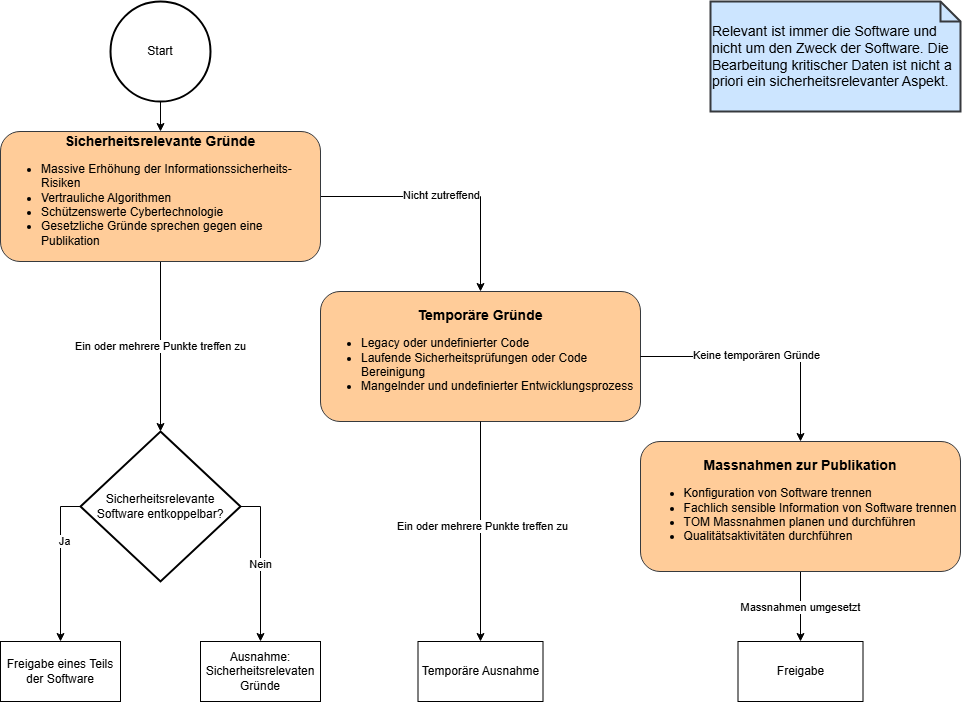

### ⚠️ **Disclaimer** 

Diese Informationen stellen eine **Arbeitsversion** dar und dienen lediglich der Transparenz und Zusammenarbeit auf GitHub.  
Die **offizielle und verbindliche Version** der Inhalte ist auf der Website der Schweizer Bundeskanzlei verfügbar: [Hilfsmittel zu Open Source Software (OSS) – Bundeskanzlei](https://www.bk.admin.ch/bk/de/home/digitale-transformation-ikt-lenkung/bundesarchitektur/open_source_software/hilfsmittel_oss.html).  

---

Em002-2 Anleitung zur Veröffentlichung von Open Source Software

Empfehlung zur Bundesinformatik\[1\]

Dieses Dokument ist eine eigenständige Beilage zum Hauptdokument Em002.

<table>
<tbody>
<tr class="odd">
<td>Klassifizierung:[2]</td>
<td>Nicht klassifiziert</td>
</tr>
<tr class="even">
<td>Verbindlichkeit:[3]</td>
<td>Empfehlung</td>
</tr>
<tr class="odd">
<td>Planungsfeld:[4]</td>
<td>IKT der Bundesverwaltung</td>
</tr>
<tr class="even">
<td>Diese Version:</td>
<td>1.0</td>
</tr>
<tr class="odd">
<td>Ersetzt Version:</td>
<td>Neues Dokument</td>
</tr>
<tr class="even">
<td>Status:</td>
<td>Freigegeben</td>
</tr>
<tr class="odd">
<td>Freigabedatum 
(diese Version):</td>
<td>09.09.2024</td>
</tr>
<tr class="even">
<td>Freigegeben durch, Rechtsgrundlage:</td>
<td>Freigegeben durch den Delegierten für digitale Transformation und IKT-Lenkung (D-DTI), gestützt auf Artikel 17 Absatz 1 der Verordnung vom 25. November 2020 über die Koordination der digitalen Transformation und die IKT-Lenkung in der Bundesverwaltung (VDTI), SR 172.010.58</td>
</tr>
<tr class="odd">
<td>Sprachen:</td>
<td>Deutsch (Original), Französisch, Italienisch und Englisch (Übersetzung)</td>
</tr>
<tr class="even">
<td>Lizenz</td>
<td>
CC0 1.0 Universal

By marking the work with a CC0 public domain dedication, the creator is giving up their copyright and allowing reusers to distribute, remix, adapt, and build upon the material in any medium or format, even for commercial purposes.
</td>
</tr>
</tbody>
</table>

  

Inhaltsverzeichnis

1 Zweck 3

2 Übersicht 4

3 Vorgehen Vorabklärungen 5

3.1 Freigabe unter EMBAG 5

3.2 Ausnahme: Rechte Dritter 7

3.3 Ausnahme: Sicherheitsrelevante Gründe 10

3.4 Klärung der Publikation 12

3.5 Minimierung des Aufwands 13

3.6 Sprachwahl der Publikation 13

4 Vorgehen Analyse und Aufbereitung 14

4.1 Analyse Quellcode 14

4.2 Lizenzwahl 15

4.3 Open Source spezifische Dokumentation 15

5 Vorgehen Publikation und Bekanntmachung 17

5.1 Wahl der Plattform 17

5.2 Publikation der Software 18

5.3 Kommunikation 18

5.4 Aufbau und Pflege Community 19

Anhang 20

A. Änderungen gegenüber Vorversion 20

B. Referenzen 20

C. Abkürzungen 20

D. Begleitende Dokumentation zur «Checkliste Analyse und Aufbereitung» -
Dokumentation 21

E. Begleitende Dokumentation zur «Checkliste Analyse und Aufbereitung» -
Quellcode 24

F. Weitere Quellen und Lizenz 27

# Zweck

Die Anleitung beschreibt das Vorgehen beim Offenlegen von Quellcode von
Software, welche Bundesbehörden gemäss Art. 9 EMBAG\[5\] zur Erfüllung
ihrer Aufgaben entwickeln oder entwickeln lassen. Ausnahmen sind, wenn
die Rechte Dritter oder sicherheitsrelevante Gründe dies ausschliessen
oder einschränken. Durch die Veröffentlichung kann jede Person die
Software nutzen, weiterentwickeln und weitergeben. Dabei werden keine
Lizenzgebühren erhoben.

Diese Anleitung richtet sich an Personen, welche die Veröffentlichung
des Quellcodes verantworten und durchführen.

Die Thematik ist in drei Haupt-Teile gegliedert:

  - Im ersten Teil (Kapitel 3) werden die **Vorabklärungen** getroffen
    und die Ausnahmen gemäss EMBAG behandelt.

  - Im zweiten Teil (Kapitel 4) **Analyse und Aufbereitung** wird
    bereits bestehender Quellcode analysiert und bei Bedarf
    aufbereitet.  
    Weiter findet die Wahl der Lizenz statt.

  - Der dritte Teil (Kapitel 5) **Publikation und Bekanntmachung**
    beschreibt die eigentliche Veröffentlichung und weitere Massnahmen
    wie Kommunikation und Aufbau einer geeigneten Community.

Zu dieser Anleitung sind **drei Checklisten** vorhanden, um das Vorgehen
zu begleiten und zu dokumentieren.

Im Anhang sind technische Ergänzungen aufgeführt.

# Übersicht

Bei der Freigabe von Open Source Software muss zwischen dem **Beitragen
von Quellcode und Dokumentation an bestehende Open Source Software** und
der **Veröffentlichung als eigenständiges Open-Source-Projekt**
unterschieden werden.

Bei Ersterem handelt es sich typischerweise um Fehlerkorrekturen (Bug
Fixes) und Erweiterungen von Funktionalitäten (neue Features). Der
entsprechende Quellcode muss, bzw. kann, abhängig von Lizenztyp und
Software-Einsatz, unter der bestehenden Lizenz des Open-Source-Projekts
freigegeben werden. Allenfalls muss ein Agreement zur Freigabe
eingehalten werden.

Im zweiten Fall, dem Start eines neuen Open-Source-Projekts, kann die
Governance und Lizenz grundsätzlich frei gewählt werden. Einzig muss
beachtet werden, unter welcher Lizenz allfällige Softwareelemente
stehen, welche im neuen Projekt integriert sind. Weitere Details zur
Lizenzwahl sind im Dokument *«Em002-3 Leitfaden OSS-Lizenzen*»
erläutert. Wenn ein Mehrwert für die Bundesverwaltung aus einer
Community generiert werden kann oder die Bundesverwaltung ein Ökosystem
schaffen will, so ist auch die *«Em002-4.1 Checkliste OSS-Community»*
auszufüllen gemäss dem *«Em002-4 Leitfaden OSS-Community»*.

Die nachfolgende Grafik beschreibt die Anleitungen und unterschiedlichen
Ausprägungen.

Abbildung 1 - Entscheidungsbaum über die Freigabe von Software.

# Vorgehen Vorabklärungen 

**Ziel:** Die Vorteile und möglichen Konsequenzen einer Veröffentlichung
sind geklärt. Entscheidung ob die Software publiziert werden kann und
wenn ja, ob sich der Aufbau einer aktiven Community lohnt. Achtung: Die
*«Em002-2.1 Checkliste Vorabklärungen»\[Em002-2.1\]* sollte möglichst
früh im Projekt ausgefüllt werden, da dies die Art der Entwicklung der
Software beeinflussen kann.

## Freigabe unter EMBAG

Gemäss Art. 9 des Bundesgesetzes vom 17. März 2023 *\[EMBAG2023\]* über
den Einsatz elektronischer Mittel zur Erfüllung von Behördenaufgaben
(EMBAG) muss die Bundesverwaltung (insbesondere Art. 2, Abs. 1) den
Quellcode von Software, die sie zur Erfüllung ihrer Aufgaben entwickeln
oder entwickeln lassen offenlegen. Ausnahmen sind, wenn die Rechte
Dritter oder sicherheitsrelevante Gründe dies ausschliessen oder
einschränken.

Handelt es sich bei der Software um im Auftrag des Bundes erstellte
Individualsoftware, dann kommen grundsätzlich die AGB Bund *\[BBL-AGB\]*
zur Anwendung. Diese bestimmen unter der Ziffer 25.1, dass das Eigentum
von Quellcode und Dokumentation an die Leistungsbezügerin (Bund)
übergehen. Wurde die Software von mehreren Organisationen oder anderen
Institutionen gemeinsam beschafft, dann liegt das Eigentum meistens bei
einem zu diesem Zweck gegründeten Verein.

Die reine Verwendung von Standardsoftware ist nicht von Art. 9 EMBAG
erfasst und eine Freigabe wäre in aller Regel auch gar nicht möglich,
weil die Rechte an Standardsoftware oftmals beim Hersteller liegen (AGB
Bund Beschaffung von Standard Software)\[6\]. Individuelle Erweiterungen
zu Standardsoftware sind aber durchaus auch zur Veröffentlichung
geeignet. Im Normalfall befinden sie sich im Eigentum des Bundes.
Weniger zur Veröffentlichung geeignet sind blosse
Konfigurationsanpassungen.

### Software in Bezug auf das EMBAG

Die aktuelle ISO/IEC-Norm 24765 enthält für Software folgende drei
Definitionen:

1.  Software ist ein Programm oder eine Menge von Programmen, die dazu
    dienen, einen Computer zu betreiben.

2.  Software sind Programme sowie die zugehörige Dokumentation.

3.  Software sind Programme und ggf. die zugehörige Dokumentation und
    weitere Daten, die zum Betrieb eines Computers notwendig sind.

Anhand dieser Definition sind auch kleinere Skripts, Markos oder
Infrastructure as Code (IaC) als Software einzuordnen. Das EMBAG bezieht
sich im Artikel 9 Abs. 1 auf Quellcode. Nach dieser Auslegung würde eine
Veröffentlichung nach der Definition 1 ausreichen.  
Eine Veröffentlichung ohne zugehörige Dokumentation ist aber wenig
sinnvoll, da die Software nicht nach Definition 2 genutzt werden kann.

Damit Synergien mit Dritten erreicht werden können, muss auf die dritte
Definition abgestützt werden. Bei den Daten sind namentlich Stammdaten
und Grundkonfigurationen gemeint (beispielsweise Werte von Aufzählungen
und Grunddaten, die auch als Open Source zur Verfügung gestellt werden
sollten).

Kleinere Projekte, Skripts oder Codebeispiele können auch, wenn von der
Bundesbehörde als sinnvoll erachtet, gemeinsam in einem Repository
veröffentlicht werden. In diesem Fall kann diese Anleitung und
entsprechenden Checklisten einmalig ausgefüllt werden.

Es ist auf die Verhältnismässigkeit und den Aufwand zu achten, was wie
publiziert werden soll.

### Art der Software

Gemäss Abbildung 1 wird zwischen Eigenentwicklung, gemeinsamer
Entwicklung und Projekt Dritter unterschieden. Je nach Konstellation hat
dies unterschiedliche Auswirkungen.  
Unabhängig von der Art wie die Software entwickelt wird, fällt sie unter
Art. 9 EMBAG.

Bei der Eigenentwicklung erstellt der Bund die Software selber oder
beauftragt dies entsprechend. Er wählt die Governance und hält dabei die
Rechte an dem Quellcode.

Bei gemeinsamer Entwicklung erstellt der Bund mit anderen Organisationen
die Software. Dabei sind mittels gewählter Organisationform die
Governance und Rechte an der Software zu regeln.

Trägt der Bund direkt zu Software von Dritten bei, fällt dieser
Quellcode auch unter Art. 9 EMBAG. Dabei ist zu beachten, dass dies im
Sinne der Bundesbehörden erfolgt, die Mitwirkung den Anforderungen des
Projektes genügt und sich die Bundesverwaltung an die Governance hält.

Dies geschieht mit *«Em002-2.1 Checkliste Vorabklärung»* und *«Em002-4.1
Checkliste OSS-Community».*

### Legacy Code

Für alte Software (**Legacy Software**) ist der nachträgliche Aufwand
für eine Veröffentlichung höher, als wenn bereits zu Beginn eine
Freigabe geplant ist. Für Legacy Software macht es Sinn, den Aufwand
erst zu leisten, wenn ein potentieller Nutzer die Software verwenden
will. Unabhängig davon sollte die *«Em002-2.1 Checkliste Vorabklärung»*
ausgefüllt werden, um entsprechende Entscheide zu dokumentieren.

Applikationen, mit deren Entwicklung die Bundesbehörden ab dem 1.1.2024
begonnen haben oder Applikationen, die im Auftrag des Bundes gestützt
auf einen nach dem 1.1.2024 abgeschlossenen Vertrag entwickelt werden,
gelten nicht als Legacy und fallen in jedem Fall unter die
Publikationspflicht gemäss Art. 9 Ziffer 1 EMBAG.

Die Pflicht zur Publikation gemäss EMBAG ist nicht abhängig vom Nutzen
für Dritte.

### Libraries, Plug-Ins und Add-Ons

Unter Umständen handelt es sich bei der Software nicht um eine
eigenständige Applikation, sondern nur um Teile davon. Das EMBAG und
die Verordnung definieren Quellcode nicht weiter. Die Anleitung gilt
auch für abgekoppelte Libraries, Plug-ins und Add-Ons und fallen unter
das EMBAG.

**Tätigkeiten:**

  - Informationen aus dem *«Em002-5 Faktenblatt EMBAG und OSS»*
    sammeln.  
    Dies beschreibt sowohl allgemeine Informationen zum Thema Open
    Source als auch spezifische Informationen zum Umgang mit dem EMBAG.

  - Prüfen, ob die Voraussetzung durch das EMBAG gegeben sind.

  - Ausfüllen der *«Em002-2.1 Checkliste Vorabklärung»*. In der Regel
    macht es Sinn, dazu auch die Ansprechpersonen seitens
    Software-Lieferant/Entwickler direkt beizuziehen.

  - Bei Bedarf die *«Em002-4.1 Checkliste OSS-Community»* ausfüllen.

**Entscheid:** Muss die Software publiziert werden und wie soll dies in
den Grundzügen geschehen?

## Ausnahme: Rechte Dritter

Werden durch die Veröffentlichung Rechte Dritter verletzt, muss von
einer Veröffentlichung abgesehen werden. Wurde die Software von
Mitarbeitenden des Bundes entwickelt, gehören die Rechte der
Arbeitgeberin\[7\]. In den Verträgen über Personalverleih und
IT-Dienstleistungen werden die Rechte üblicherweise an den Bund
abgetreten und sollten eingefordert werden.

Wurde oder wird die Software auf der Grundlage der Allgemeinen
Geschäftsbedingungen des Bundes (Stand 2024)\[8\] entwickelt, gehören
die Schutzrechte der Bestellerin, sofern vertraglich nichts anderes
vereinbar wurde.

Eine Applikation besteht typischerweise aus zahlreichen einzelnen
Bauteilen und Komponenten. Bei manchen Arten davon ist es ein Problem,
wenn sie selber nicht Open Source sind oder als Teil der Applikation
ebenfalls unter einer Open-Source-Lizenz veröffentlicht werden.

**Bibliotheken/Libraries**

Bibliotheken (engl. Libraries) werden – je nach Programmiersprache –
entweder direkt mit der Applikation mitkompiliert, gelinkt oder als
Pakete mitgeliefert. Sie bilden einen integralen Bestandteil der
Applikation.

Falls die Applikation proprietäre oder lizenzpflichtige Bibliotheken
enthält, dann ist ein Open Sourcing schwieriger. Grundsätzlich kann der
Quellcode der restlichen Applikation zwar veröffentlicht werden,
potentielle Verwenderinnen oder Verwender, Entwicklerinnen oder
Entwickler müssten dann aber die betreffende Bibliothek ebenfalls
erwerben, bevor die Applikation nutz- oder erweiterbar ist.

Falls das Eigentum an der problematischen Bibliothek beim Lieferanten
der Applikation liegt, dann lohnt es sich, eine rechtliche Abklärung zu
treffen, ob dem Bund nicht ein auf Dritte übertragbares Recht an diesen
Bibliotheken zusteht.

Wenn möglich, sind proprietäre und lizenzpflichtige Bibliotheken bei
Eigenentwicklungen zu vermeiden oder nach Möglichkeit vor der Freigabe
zu ersetzen. Wenn wir vom Ziel vom Art. 9 EMBAG ausgehen, dann sollte
möglichst viel Funktionalität, die öffentliche Verwaltungen verwenden,
veröffentlicht werden. Daher stellen einzelne Bibliotheken, die eine
Offenlegung des Codes verhindern, eine Architekturschuld dar, die zu
dokumentieren ist und u.U. bei geeigneter Gelegenheit zu beseitigen.

**Datenbanken und andere Datenspeicher**

Wenn die Applikation proprietäre, lizenzpflichtige Datenspeicher wie zum
Beispiel Microsoft SQL-Server einsetzt, dann ist dies kein Hindernis für
die Veröffentlichung als Open Source.

Es sollte aber geprüft werden, ob zusätzliche zum Beispiel auch offene
Datenbanken wie PostgreSQL unterstützt werden können. Damit lassen sich
Betriebskosten sparen und die Einstiegshürden für potenzielle Verwender
werden tiefer.

**Applikationsserver und Betriebssysteme**

Wenn die Applikation lizenzpflichtige Betriebssysteme oder
Applikationsserver (beispielsweise Microsoft Windows Server oder RedHat
JBoss) benötigt, dann ist dies kein Hindernis für eine Veröffentlichung
als Open Source.

Folgende Anfrage an den Software-Hersteller wird empfohlen: «Werden als
Bestandteil der Applikation lizenzpflichtige Libraries von
Drittherstellern verwendet? Falls ja: Welche?»

Wurde die Software von mehreren Organisationen oder anderen
Institutionen gemeinsam beschafft, dann liegt das Eigentum meistens bei
einem zu diesem Zweck gegründeten Verein oder anderen juristischen
Person.

**Anderes Geistiges Eigentum**

Rechte Dritter umfassen nicht nur Urheberrechte, sondern auch anderes
Geistiges Eigentum (Marken, Patente). Patente stehen einer
Veröffentlichung als Open Source zwar nicht grundsätzlich im Wege, aber
sie können einer Verwendung oder Erweiterung der Software im Wege
stehen. Patente sind zumindest in der Schweiz eher unüblich, trotzdem
lohnt sich meist eine kurze Anfrage beim Software-Hersteller, ob eine
Prüfung bereits stattgefunden hat.

**Erwerb der notwendigen Rechte**

Um die gesetzliche Vorgabe von EMBAG zu erfüllen, hat die Bundesbehörde
die Möglichkeit als Auftraggeberin die Rechte an den Arbeitsergebnissen
für sich zu sichern. Diese Voraussetzung für eine Publikation kann
bereits bei der Beschaffung als Zuschlagskriterium definiert werden. Der
Erwerb von notwendigem Recht an der Software im Nachgang kann
aufwändiger werden.

Wenn die Bundesbehörde die Software nicht selber publizieren will, kann
er diese Aufgabe z.B. an den Auftragnehmer delegieren oder die Rechte
entsprechend für eine Veröffentlichung entsprechend abtreten. In dem
Falle wird er die notwendigen Rechte (und Pflichten) an den Lieferanten
und/oder Dritten übertragen und ihn mit der Publikation beauftragen.
Dies bedeutet, dass effektiv das Recht an einen Dritten übertragen wird,
unter der Auflage der Freigabe/Support der entsprechenden Software.

**  
**

**Ablauf**

Abbildung 2 - Ausnahme: Rechte Dritter

**Tätigkeiten:**

  - Prüfen, ob die Organisation die entsprechenden Schutzrechte an der
    Software besitzt.

  - Prüfung, ob die Rechte erworben werden können.

  - Falls nötig, schriftliche Genehmigung der Rechteinhaberinnen
    einholen.

  - Prüfung, dass die Applikation keine proprietären oder geschützten
    Teile enthält.

  - Prüfung, dass keine Hindernisse wegen Patentschutz bestehen (soweit
    möglich und sinnvoll).

  - Prüfen, ob die Freigabe durch Dritte erfolgen soll (als Vorgriff auf
    Abschnitt 0).

  - Prüfen, ob nach Open Source Software Development entwickelt werden
    soll (mit dem *«Em002-4 Leitfaden OSS-Community»*, siehe auch
    Abschnitt 0).

**Entscheid:** Kann die Software ohne Verletzung Rechte Dritter
veröffentlicht werden?

## Ausnahme: Sicherheitsrelevante Gründe

Von einer Veröffentlichung ausgenommen ist Software, welche infolge
sicherheitsrelevanter Gründe nicht veröffentlichen werden kann.

Nicht von einer Veröffentlichung des Quellcodes sind die eigentlichen
Daten einer Software betroffen. Diese Daten sind meistens schützenswert
und werden nicht veröffentlicht. Es kann aber sein, dass neben den
inhaltlichen Daten auch gewisse im Quellcode ersichtliche Algorithmen
und Verfahren nicht öffentlich werden sollen (z.B. offensive
Cybercapabilities, Details zu Betrugsentdeckung). Die Sicherheit kann
sich auf Vertraulichkeit, Integrität, Verfügbarkeit oder
Nachvollziehbarkeit beziehen.

**Empfehlung:**

Software sollte bewusst so entwickelt werden, dass auch bei
Veröffentlichung des Quellcodes kein zusätzliches Risiko entsteht. Die
Annahme, Nichtveröffentlichung schütze vor erfolgreichen Angriffen, ist
trügerisch («Security through Obscurity»).

**Ablauf:**

Abbildung 3 - Ausnahme: Sicherheitsrelevante Gründe

Als sicherheitsrelevant können folgende Gründe jeweils pro Projekt
geltend gemacht werden:

  - Durch eine Publikation der Software wird ein Risiko bezüglich
    Informationssicherheit massiv erhöht.\[9\]

  - Bei Algorithmen zur Betrugsbekämpfung und analogen Algorithmen kann
    u.U. auch auf die Publikation verzichtet werden.

  - Besonders schützenswerte Technologien der Cybersicherheit.

  - Kernsoftware für den Betrieb kritischer Infrastrukturen.

  - Wenn durch eine Veröffentlichung andere gesetzliche Grundlagen
    verletzt werden.

Folgende temporäre Gründe können eine Veröffentlichung noch verhindern.
Durch entsprechende Massnahmen wird aber später eine Veröffentlichung
ermöglicht.

  - Legacy-Code konnte noch nicht bereinigt werden und kann
    sicherheitsrelevante Probleme beinhalten.

  - Sicherheitsprüfungen des Codes sind noch nicht durchgeführt worden.

  - Entwicklungsprozess noch nicht weit genug gereift, als dass sicher
    publiziert werden kann. Wenn der Entwicklungsprozess nicht genügend
    etabliert ist, dann ist es möglich, dass Teile publiziert werden,
    die nicht für Dritte bestimmt sind. Z.B. die
    Kommentierungsrichtlinien für Code und die Generierung von Testdaten
    müssen an die neue Ausgangslage mit Publikation angepasst sein und
    zuverlässig funktionieren.

Durch folgende Massnahmen kann Software trotz sicherheitsrelevanten
Gründen publiziert werden:

  - Konfigurationen (z. B. Art der eingesetzten Verschlüsselung) von der
    Software trennen.

  - Fachlich sensible Informationen (z. B. Prozesse, Berechnungen),
    welche nicht öffentlich sind, in Konfigurationen oder Einstellungen
    auslagern.

  - Geeignete organisatorische, personelle und technische Massnahmen
    planen, implementieren und regelmässig üben.

  - Bei der Veröffentlichung entsprechende Qualitätsaktivitäten
    einplanen und durchführen. Vgl. Nachfolgendes Kapitel "Analyse und
    Aufbereitung".

**Tätigkeiten:**

  - Prüfen der Software auf sicherheitsrelevante Gründe welche eine
    Publikation verhindern würde.

  - Aufwand abschätzen zur Behebung der temporären Gründe.

  - Planen von Massnahmen zur Trennung von sicherheitsrelevanten
    Informationen vom Quellcode der Software.

  - Sicherstellen, dass die Applikation keine Verfahren enthält, die
    nicht öffentlich werden dürfen.

**Entscheid:**

Gibt es zwingende sicherheitsrelevante Gründe, welche eine
Veröffentlichung verunmöglichen?

## Klärung der Publikation

In diesem Schritt wird geklärt, wer die Software veröffentlicht. Wurde
die Software von einem externen Lieferanten erstellt, kann die
Veröffentlichung auch an den Lieferanten beauftragt werden. Dabei gilt
festzulegen, wo der Quellcode publiziert wird; wichtig ist bei diesem
Schritt die Governance entsprechend zu regeln.

Wurde die Software beim Bund intern entwickelt und der Bund kann oder
will nicht selber die Veröffentlichung vornehmen, kann ein
entsprechender Auftrag an einen Lieferanten erteilt oder die Rechte
abgetreten werden (Übertragung der Pflichten an einen Dritten).

**Minimalfreigabe und Support**

Gemäss EMBAG wird keine Vorgabe bezüglich der Veröffentlichung gemacht.
So erfüllt eine Minimalfreigabe des Quellcode die gesetzliche Vorgabe.
Weitere Aktivitäten sind nicht vorausgesetzt. Die Frage ob und in
welchem Umfang Support geboten und wie aktiv das Projekt betreut wird,
kann anhand des *«Em002-4 Leitfaden OSS-Community»* beantwortet werden.

**Open Source Software Development (OSSD)**

Bei Open Source Software Development wird ergänzend zur Veröffentlichung
des Quellcodes der ganze Entwicklungsprozess öffentlich durchgeführt.
Dabei ist von den Anforderungen (Issues) bis hin zum Quellcode alles
transparent. OSSD wird durch öffentliche Kommunikationstools
(Mailinglist, Foren, etc.), ein Version Control System (git), Bug und
Featureliste, Roadmap und Entwicklertools unterstützt. Durch die
transparente Arbeitsweise profitiert die gesamte Community und
ermöglicht eine Zusammenarbeit über Organisationsgrenzen hinweg. Durch
dieses Vorgehen ist mit dem Projektabschluss auch keine weitere
Aktivität bezüglich Veröffentlichung notwendig, da dies bereits zum
Start des Projektes berücksichtigt wurde.

**Tätigkeiten**

  - Erstellen einer groben Aufwandschätzung für die Analysephase. Der
    Aufwand liegt, je nach Grösse und Komplexität der Applikation,
    zwischen 3 Tagen und 2 Wochen.

  - Freigabe der Mittel für die weiteren Schritte, insbesondere für die
    Analyse

  - Grundsätzliches Einverständnis zur Veröffentlichung der Applikation
    als Open Source

**Entscheid:**

Grundsätzliches Einverständnis und Machbarkeit zur Veröffentlichung der
Applikation als  
Open Source ist gegeben.

## Minimierung des Aufwands

Die Checklisten und Anleitungen sind so aufgebaut, dass der Aufwand für
die Freigaben minimiert werden kann. Eine konsequente Vorausplanung der
Freigabe bereits bei Projektbeginn und eine Entwicklung, die bereits auf
die Freigabe ausgelegt ist, minimiert den Aufwand. Ein gewisser
administrativer Aufwand und Kosten entstehen auf jeden Fall \[Le2023\].
Diese können u.U. durch Communities mit kostengeteilter Entwicklung
wieder hereingeholt werden (siehe *«Em002-4 Leitfaden OSS-Community»*).

## Sprachwahl der Publikation

Bei der Sprachwahl muss einerseits auf das potentielle Zielpublikum und
andererseits auf die Arbeitsweise des Teams Rücksicht genommen werden.
Übersetzungen sind zum Glück mit den neuen Werkzeugen sehr viel
leichter machbar. In Frage kommen die Amtssprachen\[10\] des Bundes und
Englisch. Wenn das Projekt international relevant ist, so ist Englisch
als Zielsprache an zuzustreben. Bei nachträglicher Publikation macht es
natürlich wenig Sinn, die Sprache zu ändern.

Minimal sollte das README.md in mehreren Sprachen zur Verfügung stehen,
so dass Interessierte sofort erkennen können, ob das Projekt für sie
interessant ist.

Bei öffentlicher Kommunikation soll primär das Zielpublikum
berücksichtigt werden. Es gilt auch zu berücksichtigen, dass es sich um
öffentliche Kommunikation des Bundes handelt.

**Hinweis**: Mit der Publikation tritt die Bundesverwaltung mit einem
neuen Kanal an die Öffentlichkeit. Wird dies nicht sorgsam und
professionell gemacht, kann das öffentliche Ansehen des Bundes schnell
darunter leiden.

# Vorgehen Analyse und Aufbereitung 

**Ziel:** Die zur Veröffentlichung als Open Source nötigen Arbeiten sind
erledigt.  
Entscheide zur Lizenz und Art der Community sind gefällt. Dies geschieht
mit Hilfe der *«Em002-2.2Checkliste Analyse und Aufbereitung»*.

## Analyse Quellcode

Der zu veröffentlichende Quellcode und weitere dazugehörige Dokumente
werden vor der Veröffentlichung analysiert. Durch diese Analyse wird
sichergestellt, dass keine schützenswerten Informationen veröffentlicht
werden.

Ist geplant, umfangreicher Quellcode zu veröffentlichen, empfiehlt es
sich für die nachfolgenden Tätigkeiten entsprechende automatisierte
Tools einzusetzen. Die Details sind in Abschnitt E definiert.

**Tätigkeiten**

  - Prüfen, wie die bestehenden Code Quality und Richtlinien umgesetzt
    wurde  
    (z.B. ISO/IEC 25010:2023\[11\]).

  - Sicherstellen, dass keine sensitiven (Test-)Daten enthalten sind,
    zum Beispiel solche, die auf realen Personen oder Fällen basieren.

  - Dokumentation der Software aktualisieren (siehe Anhang)

  - Nicht mehr benötigte Dateien oder veraltete Dokumente und Daten
    löschen.

  - Quellcode auf Secrets/Credentials prüfen.\[12\]

  - Durchführen von gezielten Security Tests und anschliessend
    etablieren von einem (öffentlichen) Bug Bounty Programm\[13\].

  - Die Prüfung aller eingesetzten Bibliotheken bezüglich der Lizenzen
    und die entsprechenden Listen (Attributions) erstellt sind.

  - Beschreibung des Deployment (CI/CD Pipline) und ev. Aufbau einer
    Demo-Instanz.

Dies Tätigkeiten sind unabhängig von einer Veröffentlichung, sondern
sind Voraussetzung für eine gute Qualität der Software und
Sicherstellung der Compliance. Beachtung dieser Massnahmen vereinfacht
die Zusammenarbeit, erhöht die Qualität der externen Beiträge und
steigert das Image der Software respektive der Behörde.

## Lizenzwahl 

**Hilfsmittel *«Em002-3 Leitfadens OSS-Lizenzen»* verwenden.**

Soweit möglich und sinnvoll sind international etablierte Lizenztexte zu
verwenden. Haftungsansprüche von Lizenznehmern sind auszuschliessen,
soweit dies rechtlich möglich ist.

**Tätigkeiten**

  - Prüfen allfälliger Abhängigkeiten von bestehenden Lizenzen.

  - Bei Fremdcode Nutzungsbedingungen auf Kompatibilität mit
    vorgesehener Lizenz prüfen und falls nötig Code ersetzen.

  - Passende Lizenz auswählen.

Als Hilfsmittel können die Lizenzkompatibilitäten z.B. bei Black
Duck\[14\], FOSSA\[15\] oder FOSSology\[16\] geprüft werden. Die ToDO
Group\[17\] bietet eine aktuelle Übersicht von Tools.

**Entscheid:**

  - Festlegen und Dokumentieren unter welcher Lizenz die Software
    veröffentlicht wird.

## Open Source spezifische Dokumentation 

Mit der Veröffentlichung wird auch ein minimales Set an Dokumentation
erwartet. Im Open-Source-Ökosystem haben sich einige Dokumente
etabliert. Dies gibt einem Besucher einen schnellen Einblick in die
Software inkl. der Lizenzierung.

Folgende Dokumente werden erwartet:

| Dokument                  | Beschreibung / Inhalt                                                                                                                                                                                                                                                                              |
| ------------------------- | -------------------------------------------------------------------------------------------------------------------------------------------------------------------------------------------------------------------------------------------------------------------------------------------------- |
| README(.md)               | Dient als Einstiegsdokument und bietet einen raschen Überblick über den Zweck, den Umfang, den Zustand, die Lizenz und die Zielgruppen des Projekts.                                                                                                                                               |
| LICENSE                   | Beschreibung der gewählten Lizenz im Projekt                                                                                                                                                                                                                                                       |
| CONTRIBUTING(.md)         | Beschreibt den Prozess wie zu Projekt beigetragen werden kann.                                                                                                                                                                                                                                     |
| CODE\_OF\_CONDUCT(.md)    | Der «Code of Conduct» legt die erwarteten sozialen Normen innerhalb des Projekts fest.                                                                                                                                                                                                             |
| CHANGELOG(.md)            | Führt eine Liste von den Veränderungen der Softwareversion.                                                                                                                                                                                                                                        |
| THIRD-PARTY-LICENSES(.md) | Beschreibung von Lizenzen von Dritt Parteien oder verwendeten Komponenten.                                                                                                                                                                                                                         |
| Getting started           | Kurze Anleitung wie das Software installiert und verwendet werden kann.                                                                                                                                                                                                                            |
| Gitignore erstellen       | Beschreibt Dokumente, welche nicht veröffentlicht werden. Dies können beispielsweise Konfigurationen, Testdaten oder generierte Inhalte sein. Schützenswerte und sensitiven Informationen sollten ausserhalb des Projektes in entsprechenden dafür vorgesehen Tools und Speicher verwaltet werden. |

Tabelle 1 – Open Source spezifische Dokumente

Weitere technische Ausführungen zu diesen Dokumenten sind im Anhang
beschrieben.

**Tätigkeiten**

  - Standarddokumentationen erstellen.

  - Alle Dateien mit Copyright-, Lizenzhinweisen und Haftungsausschluss
    versehen.

  - Je nach Publikationsplattform können weitere Beschreibungen
    vorgenommen werden.

**Entscheid:**

  - Definitiver Entscheid zur Veröffentlichung der Applikation als Open
    Source.

# Vorgehen Publikation und Bekanntmachung 

**Ziel:** Die Anwendung ist als Open Source veröffentlicht und für
Dritte gut auffindbar. Alle Bestandteile sind bereit für die Publikation
und die Community ist aufgebaut respektive gegründet. Dies geschieht mit
Hilfe der *«Em002-2.3 Checkliste Freigabe und Publikation»*.  
Zum Teil handelt es sich auch um eine Rekapitulation bereits getroffener
Entscheide.

## Wahl der Plattform

Es existieren verschiedene Wege den Quellcode zu veröffentlichen. Die
nachfolgende Tabelle gibt einen Überblick über mögliche Source Code
Management (SCM) und Plattformen.

Vor der eigentlichen Publikation muss die geeignete Plattform ausgewählt
werden. Einige Bundesbehörde sind bereits auf Github\[18\] vertreten. In
diesem Fall ist es sinnvoll, bereits etablierte Plattformen zu
verwenden.

**Empfehlung:**

Wir empfehlen aktuell für eine Veröffentlichung vom Quellcode pro
Bundesbehörde eine Organisation auf Github einzurichten. In dieser
Organisation können entsprechende Projekte (Repositories) erstellt
werden und Benutzer mit entsprechender Berechtigung verwaltet werden.
Zukünftig sollte eine zentrale Bundesplattform aufgebaut werden. Um ein
optimales User Management zur Bewahrung der Reputation der
Schweizerischen Eidgenossenschaft zu wahren ist es wichtig, eher weniger
und besser verwaltete Repositories zu verwenden.

<table>
<thead>
<tr class="header">
<th>Plattform</th>
<th>Eigenschaft</th>
</tr>
</thead>
<tbody>
<tr class="odd">
<td>Github[19]</td>
<td>
Online-Plattform von Microsoft mit grosser Verbreitung. Eine Vielzahl von Open Source Software wird auf Github gehostet. Bietet neben SCM auch noch eine Vielzahl weiteren Tools.

Sowohl als Free, wie auch als Enterprise Variante (Abo) erhältlich.
</td>
</tr>
<tr class="even">
<td>Gitlab[20]</td>
<td>
Online-Plattform der gleichnamigen Firma Gitlab, welche selber unter einer Open-Source-Lizenz veröffentlicht ist. Bietet neben SCM auch noch eine Vielzahl weiterer Tools. Kann auch lokal betrieben werden und bietet dadurch gewisse Souveränität.

Sowohl als Free, wie auch als Enterprise Variante (Abo) erhältlich.
</td>
</tr>
<tr class="odd">
<td>Bitbucket[21]</td>
<td>
Online-Plattform von Atlassian, welche insbesondere in dessen Ökosystem integriert ist.

Sowohl als Free, wie auch als Enterprise Variante (Abo) erhältlich.
</td>
</tr>
<tr class="even">
<td>Internes SCM-System</td>
<td>Wird eine eigene SCM-Plattform bereitgestellt, kann diese auch gewisse Repo/Projekte veröffentlichen und zu zugänglich gemacht werden. Dabei muss der Betrieb sichergestellt werden.</td>
</tr>
<tr class="odd">
<td>Bundesplattform</td>
<td>Stand heute gibt es noch keine zentrale Bundesplattform für die Veröffentlichung von Software. Im <em>«Em002 Strategischer Leitfaden Open Source Software in der Bundesverwaltung» [Em002]</em> ist eine entsprechende Massnahme vorgeschlagen.</td>
</tr>
<tr class="even">
<td>Webseite, öffentlicher FTP-Server, etc.</td>
<td>Gemäss EMBAG wird nicht definiert, wie die Software veröffentlicht werden muss. Eine «Minimale Freigabe» nach Kapitel 0 kann auch auf einer Website oder sonstigen öffentlich zugänglichen Ressourcen erfolgen. Für eine nachhaltige Zusammenarbeit im Sinne von Open Source ist dies jedoch nicht geeignet.</td>
</tr>
</tbody>
</table>

Tabelle 2 - Plattformen für die Veröffentlichung von Open Source
Software

Wird die Software gemeinsam mit einem externen Partner oder Organisation
publiziert, ist darauf zu achten, dass entsprechende Berechtigungen und
Zugriffe auf den Quellcode vorhanden sind.

**Tätigkeiten**

  - Evaluation der geeigneten Plattform inkl. entsprechende
    Organisation/Projekt.

  - Falls noch nicht geklärt, festlegen der Benennung des
    Projektes/Repositories.

  - Berechtigung auf dem Repo festlegen und prüfen.

  - Sicherstellen der geeigneten Governance und allfälliger Replikation
    des Quellcode.

**Entscheid:**

  - Plattform für die Publikation wurde entsprechend gewählt.

## Publikation der Software

Wenn die Voraussetzungen geklärt sind, kann die Software publiziert
werden.

**Tätigkeiten**

  - Prüfen der Voraussetzung gemäss Checkliste «Freigabe und
    Publikation».

  - Zugang zur Plattform ist vorhanden und die Governance geklärt.

  - Publikation des Quellcodes und Dokumentation durch die Entwicklerin
    oder den Entwickler.

## Kommunikation

Nach der effektiven Publikation können weitere kommunikative Tätigkeiten
aus und innerhalb der betroffenen Bundesbehörde angestossen werden.
Diese helfen der Verbreitung und bringen den gewünschten Mehrwert aus
der Publikation.

**Tätigkeiten**

  - Beschreibung im Repo Hosting, Security Settings, …

  - Interne und ggfs. externe Kommunikation.

  - Verfassen einer Mitteilung an die Community.

  - Die Applikation innerhalb der Organisation und in Fachgremien
    bekannt machen, bewerben den Einsatz und Beiträge.

## Aufbau und Pflege Community

Beim Veröffentlichen von Software kann sich eine Community entwickeln,
die durch Beiträge (Pull Requests), Fragen, Dokumentationsvorschläge
usw. zu Software beitragen kann. Um eine aktive Community zu haben, ist
ein entsprechender Effort für den Aufbau wie auch für die
kontinuierliche Pflege erforderlich. Eine gut funktionierende Community
minimiert ungewünschte Absprünge (Forks) der Software. Ziel ist hier
durch gezielte Aktivitäten den Mehrwert der Community zu aktivieren.
Auch bei einer minimalen Veröffentlichung sollte der Umgang mit
Rückmeldungen und Anfragen zur Software definiert sein.

**Tätigkeiten**

  - Klären, wer potentielle Nutzer oder Interessenten sind.

  - Bestimmen anhand des *«Leitfadens OSS-Community»* die für die
    konkrete Applikation geeignete Form.

  - Aufbau der Community.

  - Community-Building Aktivitäten.

# Anhang

## Änderungen gegenüber Vorversion

Neues Dokument.

## Referenzen

Siehe *«Em002 Strategischer Leitfaden Open Source Software in der
Bundesverwaltung»*.

## Abkürzungen

Siehe *«Em002 Strategischer Leitfaden Open Source Software in der
Bundesverwaltung»* und *«Em002-6 FAQ OSS und Art. 9 EMBAG».*

## Begleitende Dokumentation zur «Checkliste Analyse und Aufbereitung» - Dokumentation

1.  Dokumentation beim Quellcode

Die Dokumentation soll Teil des Quellcodes des Projekts sein, damit auch
Änderungen an der Dokumentation revisionssicher aufbewahrt werden und
die Dokumentation analog dem Projekt versioniert ist. Damit ist
automatisch sichergestellt, dass die Dokumentation, sofern sie
entsprechend gewartet wird, nicht vom Entwicklungsstand des Projekts
divergiert und Dokumentation zu älteren Versionen des Projekts jederzeit
abgerufen werden kann.

Ausserdem gibt das Projekt dadurch Dritten die Möglichkeit, einfach
Änderungen an der Dokumentation als Beitrag zurückzugeben.

Als Textformat soll Markdown als Auszeichnungssprache (Markup-Language)
verwendet werden, da sie einfach zu schreiben, weit verbreitet und
maschinenlesbar ist. Zusätzlich werden Dokumente in Markdown von allen
gängigen Plattformen in einem gut lesbaren Zielformat dargestellt.
Markdown-Dokumente können unabhängig von der verwendeten Plattform mit
statischen Site-Generatoren wie Jekyll, MkDocs, Gatsby oder Sphinx in
ein beliebiges Zielformat dargestellt werden, zum Beispiel mit den
Corporate-Identity-Vorgaben einer Verwaltung.

2.  Adressaten der Dokumentation und Struktur

Die Dokumentation des Projekts soll sowohl die Enduser als auch die
technischen Fachpersonen ansprechen, sich also nicht nur auf die Technik
fokussieren. Für die Sprachwahl wird auf Abschnitt 3.6 verwiesen. Dies
unterstützt die Verbreitung der Software.

Als Einstiegsdokument dient dabei eine Datei README.md. Dateien mit
diesem Namen werden von allen gängigen Plattformen als Einstiegspunkt
für die Dokumentation erkannt und dargestellt.\[22\]

README.md soll einen raschen Überblick über den Zweck, den Umfang, den
Zustand, die Lizenz und die Zielgruppen des Projekts geben. Konkret soll
README.md die folgenden Punkte umfassen:

  - Name der Software

  - Kurz Beschreibung über Sinn und Zweck der Software. Funktionsumfang
    und mögliche Abgrenzungen

  - Installationsanleitung

  - Verwendung der Software

  - Verweis auf eine allfällige Demo-Instanz

  - Support und Kontaktangaben

  - Wie zur Open Source Software beigetragen werden kann (Contributing)

  - Verwendete Lizenz (License)

<!-- end list -->

  - Projektstatus/ Stand der Entwicklung
    
    1.  Akzentuieren von Open Source und Ablage der Lizenz

Direkt nach dem Mission Statement soll klar und unmissverständlich
beschrieben sein, dass das Projekt Open Source Software ist. Die vom
Projekt verwendete Lizenz sollte mit dem entsprechenden
SPDX-Identifier\[23\] angegeben und auf den konkreten Lizenztext in der
Datei LICENSE verlinkt werden. Die Lizenz-Vorlagen beinhalten in der
Regel einen variablen Teil (zum Beispiel Name des Projekts,
Copyright-Jahr, Name des Urhebers), der im LICENSE-File angepasst werden
muss.

Die meisten Plattformen erkennen Lizenzen in einer Datei LICENSE und
bieten übersichtlich Informationen zur Lizenz an, zum Beispiel eine
kurze Zusammenfassung der Lizenzbedingungen.

Es ist zu empfehlen, jeder Quelldatei, die erstellt wird, einen
minimalen Lizenz- und Copyright-Header hinzuzufügen. Bestehende Header
in bestehenden Dateien sollten nicht geändert werden. Falls zu einem
Projekt beigetragen wird, welches klare Standards für Kopfzeilen hat,
sind diese einzuhalten.

Weitere Ausführungen siehe: Producing Open Source Software, State That
the Project is Free.\[24\]

2.  Aktueller Entwicklungsstand

Damit schnell ersichtlich ist, in welchem Zustand das Projekt ist, soll
der aktuelle Entwicklungsstand in README.md dokumentiert werden. Für die
Leserin oder den Leser ist dabei wichtig zu erfahren, ob das Projekt in
einem ausgereiften Zustand oder am Beginn der Entwicklung ist, ob es
aktiv gewartet wird und mit welcher Frequenz neue Versionen
veröffentlich werden.

In diesem Abschnitt kann beschrieben werden, welche Unterstützung von
Dritten für das Projekt aktuell am wichtigsten ist. Das kann zum
Beispiel eine Entwicklerin oder ein Entwickler mit bestimmten
technologischen Kenntnissen sein oder eine Person, die die Dokumentation
des Projekts überarbeitet.

Weitere Ausführungen siehe Producing Open Source Software, Development
Status.\[25\]

3.  Demo-Instanz

Bei Applikationen wird empfohlen, eine Demo-Instanz zur Verfügung zu
stellen, damit die Applikation ohne Installationsaufwand ausprobiert
werden kann. Je nach Art der Applikation kann die Demo-Instanz dabei die
produktive Installation oder eine Teststufe sein. Wichtig ist, dass die
Leserin oder der Leser möglichst selbständig und unmittelbar Zugriff auf
die entsprechende Instanz erhalten kann.

Als Alternative werden in vielen Open-Source-Projekten Hilfsmittel zu
Verfügung gestellt, wie die Applikation einfach gestartet werden kann.
Dies kann Beispielsweise mittels Container, portable Applikation oder
Install-Scripts erfolgen.

4.  Fachliche Ansprechperson und Projekt-Eigentümer

Die Datei README.md soll die primäre fachliche Ansprechperson benennen,
damit andere interessierte Verwaltungen und Organisationen möglichst
direkt Kontakt aufnehmen können.

Es sollen keine persönlichen E-Mail-Adressen verwendet werden.

Ebenfalls sollte in der Datei README.md kurz beschrieben werden, welche
Organisation die Projekt-Eigentümerin oder der Projekt-Eigentümer ist,
insbesondere wenn für das Projekt ein Verein gegründet wurde.

5.  Installationsdokumentation

Für Applikationen sollte im README.md auf eine
Installationsdokumentation verwiesen werden, die beschreibt, welche
Anforderungen an Hard- und Software gestellt werden, welche
Infrastrukturkomponenten (zum Beispiel Datenbanken) genutzt werden und
wie die Applikation installiert und betrieben werden kann.

6.  «Developer Guidelines»

Der Einstiegspunkt der «Developer Guidelines» soll in einer
Markdown-Datei CONTRIBUTING.md abgelegt werden, wobei das
CONTRIBUTING.md im README.md verlinkt wird. Die «Developer Guidelines»
sind Teil der weiterführenden Dokumentation für Entwicklerinnen und
Entwickler, die zum Projekt beitragen möchten und fokussiert sich primär
auf die Zusammenarbeit und Kommunikation innerhalb des Projekts und
nicht auf die Technik.

Die «Developer Guidelines» sollen dabei die folgenden Punkte beinhalten
und gegebenenfalls auf die entsprechenden Dokumente verweisen:

  - Ein Verweis auf den «Code of Conduct» des Projekts. Der «Code of
    Conduct» legt die erwarteten sozialen Normen innerhalb des Projekts
    fest.

  - Es wird empfohlen, den Contributor Covenant Code of Conduct
    lizensiert unter CC-BY-4.0\[26\], als «Code of Conduct» zu wählen
    oder darauf aufzubauen.\[27\]

  - Ein Hinweis, dass das Projekt Code-Reviews in Form von GitHub
    Pull-Requests durchführt, mit einem Verweis auf die
    Pull-Request-Dokumentation von GitHub.

Abschliessend soll auf die «Developer Documentation» verwiesen werden.

1.  Developer Documentation

Während die «Developer Guidelines» die Zusammenarbeit und sozialen
Normen des Projekts beschreiben, fokussiert sich die «Developer
Documentation» auf die technischen Aspekte, um an der Entwicklung des
Projekts teilzunehmen. Sie soll mindestens die folgenden Punkte
beschreiben:

  - Welche technischen Abhängigkeiten hat das Projekt und welche
    Werkzeuge sind für die Entwicklung des Projekts notwendig.

  - Welche formellen Regeln gelten für den Quellcode des Projekts, zum
    Beispiel bezüglich der Formatierung des Quellcodes.

  - Wie ist der Quellcode des Projekts organisiert und wie können
    Funktionen technisch getestet werden.

  - Eine Architekturskizze mit Grobbeschreibung der Architektur,
    möglichst inklusive einer Kontextabgrenzung und grobe
    Bausteinsicht.\[28\]

  - Für Applikationen: Wie kann die Applikation zu Entwicklungs- oder
    Debugging-Zwecken gestartet werden und welche
    Infrastruktur-Komponenten sind dafür notwendig.

## Begleitende Dokumentation zur «Checkliste Analyse und Aufbereitung» - Quellcode

1.  Quellcode History

Der Quellcode eines Projekts ist in der Regel in einem
Source-Code-Management-System (SCM) wie zum Beispiel GitHub abgelegt.
Diese Systeme speichern nicht nur den aktuellen Zustand des Quellcodes,
sondern auch Änderungen, die im Laufe der Zeit am Quellcode durchgeführt
wurden. Dazu zählen insbesondere auch Löschungen aus dem Quellcode,
inklusive Löschungen von Dateien.

Zusätzlich enthält das SCM Meta-Informationen zu Änderungen am
Quellcode, wie zum Beispiel den Namen und die E-Mail-Adresse der Autorin
bzw. des Autors oder PGP-Signaturen bei signierten Commits und Tags.

2.  Sensitive, schützenswerte oder vertrauliche Daten

Der Quellcode und die Quellcode History des Projekts dürfen öffentlich
verfügbare Daten, wie zum Beispiel ein Postleitzahlenverzeichnis,
zufällig generierte Daten oder synthetische Daten enthalten.

Der Quellcode und die Quellcode History dürfen keine sensitiven,
schützenswerten oder vertraulichen (Personen-)Daten bzw. Informationen
gemäss Datenschutzgesetz (DSG) und Informationssicherheitsgesetz (ISG)
beinhalten. Dazu zählen insbesondere:

  - Benutzernamen und Passwörter oder andere Geheimnisse wie private
    Keys, Access-Token oder Zertifikate.

  - Interne DNS-Namen, URLs, Hostnamen, IP-Adressen, Netzwerkstrukturen
    oder Laufwerksbezeichnungen.

  - Namen, Adressen, Bilder oder ähnliche personenbezogene Daten ohne
    Zustimmung der betroffenen Person

  - Anonymisierte oder pseudonymisierte Daten (da bei der Anonymisierung
    oder Pseudonymisierung von Daten eine Möglichkeit bestehen bleibt,
    die Anonymisierung oder Pseudonymisierung rückgängig zu machen)

Auch wenn der aktuelle Zustand des Quellcodes frei von sensitiven,
schützenswerten oder vertraulichen Daten bzw. Informationen ist, können
solche Daten bzw. Informationen über die History des SCM-Systems
abgefragt werden, wenn sie in der Vergangenheit Teil des Quellcodes oder
der SCM-Meta-Informationen waren. Eine Bereinigung des aktuellen
Quellcode-Zustands entfernt diese Informationen also nicht
vollumfänglich.

Im Zweifelsfall wird daher empfohlen, die Quellcode History nach einer
Bereinigung des Quellcodes vollständig zu entfernen, bevor der Quellcode
veröffentlich wird.

Die Namen und E-Mail-Adressen der Autorinnen und Autoren des Quellcodes
sind in der Regel direkt im Quellcode oder in den SCM-Meta-Informationen
vorhanden, zum Beispiel in GitHub Commits oder annotierten GitHub Tags.
Aus rechtlicher Sicht stellt dies kein Problem dar, da die
Entwicklerfirma die Verantwortung trägt, die Veröffentlichung solcher
Informationen zu regeln. Es wird jedoch empfohlen, die Entwicklerfirma,
respektive auch bundesinterne Mitarbeitenden, darauf aufmerksam zu
machen, dass mit einer Veröffentlichung der Software potentiell auch die
Namen und E-Mail-Adressen der Autorinnen und Autoren des Quellcodes
veröffentlicht werden.

1.  Entfernen von Autor-Informationen

Die History von GitHub kann so verändert werden, dass Informationen zu
Autorinnen und Autoren unkenntlich gemacht werden. Entsprechende
Hilfsmittel\[29\] können diesen Schritt weitgehend automatisieren.

Durch das Entfernen von Autoreninformationen geht die Attribution, eine
Nachvollziehbarkeit und Kontaktinformationen verloren. Je nach Umfang
des Quellcodes ist der Aufwand nicht zu unterschätzen. Aus diesen
Gründen wird das Entfernen von Autoren nicht empfohlen.

2.  Berücksichtigung der Lizenzen von Libraries

Praktisch jedes Projekt verwendet Libraries (Software-Bibliotheken,
Abhängigkeiten, Dependencies) von Dritten, um auf allgemein verwendbare
Funktionen zurückgreifen zu können – ohne diese Funktionen selbst zu
programmieren. Meist sind diese Libraries wieder von anderen Libraries
abhängig, was zu mehrstufigen Abhängigkeiten führt (transitive
Dependencies). Je nach Programmiersprache sind selbst bei kleineren
Projekten hunderte Dependencies die Regel.

Das Resultat dieser Abklärung muss bei der Lizenzwahl gemäss *«Leitfaden
OSS-Lizenzen»\[4\]* und in der *«Checkliste Freigabe und
Publikation»\[8\]* berücksichtigt werden.

Für jede dieser Dependencies muss sichergestellt sein, dass ihre Lizenz
mit der Projektlizenz kompatibel ist. Besonders problematisch sind dabei
Dependencies, die nicht unter einer Open-Source-Lizenz stehen, die keine
Lizenz deklariert haben, oder die eine virale Lizenz verwenden, die
nicht mit der Projektlizenz übereinstimmt. Einige Libraries stehen unter
mehr als einer Lizenz und erlauben der Verwenderin oder dem Verwender
eine Lizenz zu wählen.

  - In allen gängigen Programmiersprachen können die Dependencies des
    Projekts (inklusive transitive Dependencies) sowie die Lizenzen der
    Dependencies automatisch aufgelistet werden. Dazu zählen:

  - Das Project Info Reports Plugin des Package-Managers Apache Maven
    für Java-Projekte, das über den Dependencies-Report alle
    verwendeten Libraries inklusive der deklarierten Lizenz in HTML-Form
    erstellt.\[30\]

  - Der NPM License Checker für den NPM Package-Manager von
    JavaScript-Projekten, der alle verwendeten Libraries inklusive der
    deklarierten Lizenz in verschiedenen Formaten, zum Beispiel CSV,
    ausgeben kann.\[31\]

  - Der License Finder von Pivotal, der unterschiedliche Package-Manager
    und Programmiersprachen unterstützt, beispielsweise auch Ruby Gems,
    Python Eggs oder Godeps.\[32\]

**Verwenden von Libraries mit proprietären Lizenzen**

Libraries, die unter einer proprietären Lizenz stehen, sind in
Open-Source-Projekten grundsätzlich problematisch und können in der
Regel nicht verwendet werden, insbesondere wenn das Quellcode unter
einer viralen Lizenz wie der AGPL veröffentlicht wurde.

Bitte nehmen Sie zusammen mit dem Rechtsdienst des entsprechenden Amts
Kontakt zum Hersteller auf, um zu klären, ob und unter welchen
Bedingungen die proprietäre Library in Ihrem Projekt eingesetzt werden
kann.

1.  Verwenden von Package-Managern

Praktisch alle gängigen Programmiersprachen bieten Package-Manager an,
um ihre Dependencies zu verwalten, zum Beispiel Apache Maven für
Java-Projekte, NPM für JavaScript-Projekte oder NuGet für .NET-Projekte.

Bei der Verwendung eines Package-Managers sind die vom Projekt
verwendeten Dependencies nicht mehr direkt Teil des
Projekt-Source-Codes, zum Beispiel indem Quellcode der Dependency in das
Projekt kopiert wird oder die Dependencies in Binärform in das Projekt
kopiert werden. Stattdessen bezieht das Projekt alle Dependencies über
entsprechende Deklarationen des Package-Managers.

Dies ermöglicht alle Dependencies aufzulisten und korrekt zu
referenzieren. Weiter wird eine unbewusste Modifikation an dem Code von
Dependencies verhindert. Sind Änderungen notwendig müssen diese direkt
an der entsprechenden Quelle der Dependency vorgenommen werden.

2.  Deklaration der Projekt-Lizenz im Package-Manager Deskriptor

Das Projekt sollte seine Lizenz im entsprechenden Deskriptor des
Package-Managers mit dem SPDX-Identifier\[33\] deklarieren, damit die
Projekt-Lizenz über den Package-Manager ausgegeben werden kann. Dies ist
insbesondere für Libraries wichtig, damit Verwenderinnen und Verwender
der Library automatisch deren Lizenz über den Package-Manager abfragen
können.

3.  Attributions und Hinweise zum Urheberrecht

Viele Libraries stehen unter einer Lizenz, die von der Verwenderin oder
vom Verwender der Library fordert, einen Hinweis zum Urheberrecht
(Original Copyright Notice) aufzuführen, oder eine Anerkennung
(Attribution) der Nutzung der Library zu geben.

Dazu zählen die folgenden Lizenzen (Auszug):

Apache 2.0, ASL 1.1 (Apache 1.1), BSD, BSD 3-Clause, Creative Commons
“Attribution” (CC BY), MIT, ISC

Für weitere Lizenzen siehe Liste von OSI akkreditierten Lizenzen.\[34\]

Damit sind in der Praxis fast alle verwendeten Libraries betroffen. Da
bereits in Projekten mit geringem Umfang die Anzahl der verwendeten
Libraries sehr hoch ist, ist ein juristisch einwandfreier Hinweis zum
Urheberrecht bzw. die entsprechend notwendige Attribution nur mit sehr
grossem Aufwand möglich.

Es wird daher empfohlen, wie folgt vorzugehen:

  - Eine Liste der verwendeten Libraries über die entsprechenden
    Mechanismen des Package-Managers oder Tools wie den NPM License
    Checker bzw. den License Finder von Pivotal erstellen.

  - Die Liste manuell aufbereiten, damit sie die folgenden Informationen
    beinhaltet: Offizieller Name des Projekts der Library, Homepage des
    Projekts der Library, Verwendete Lizenz der Library als
    SPDX-Identifier mit einem Link auf den Lizenztext.

  - Die Liste im Quellcode des Projekts ablegen, zum Beispiel in einer
    Datei THIRD-PARTY-LICENSES.md.

  - Bei Applikationen: Einen Link in einem «About» bzw. im Dialog «Über
    diese Applikation» einfügen, der auf das THIRD-PARTY-LICENSES.md
    verweist.

  - Die Nutzung des About-Dialogs für diesen Zweck ist weit verbreitet,
    zum Beispiel bei Google Chrome (Im Dialog «About Chrome»).

  - Bei Libraries: Im README.md auf das THIRD-PARTY-LICENSES.md
    verweisen.

  - Als Teil des Code-Review-Prozesses forcieren, dass Änderungen an den
    Libraries im THIRD-PARTY-LICENSES.md nachgetragen werden.

**Beispiel Codeblock THIRD-PARTY-LICENSES.md**

<table>
<tbody>
<tr class="odd">
<td><blockquote>

Dieses Projekt verwendet Open Source Software: 
 
* Spring Boot, <a href="http://projects.spring.io/spring-boot/">http://projects.spring.io/spring-boot/</a>, lizensiert unter [Apache-2.0](http://www.apache.org/licenses/LICENSE-2.0) 
* caniuse-db, <a href="https://github.com/Fyrd/caniuse">https://github.com/Fyrd/caniuse</a>, lizensiert unter [CC-BY-4.0](https://creativecommons.org/licenses/by/4.0/)

</blockquote></td>
</tr>
</tbody>
</table>

## Weitere Quellen und Lizenz

Die Checkliste, die begleitende Dokumentation und die entsprechenden
Vorlagen basieren in Teilen auf den folgenden Quellen:

  - Google Open Source Docs von Google LLC, lizenziert unter
    CC-BY-4.0\[35\]

  - Producing Open Source Software, How to run a Successful Free
    Software Project von [Karl Fogel](http://www.red-bean.com/kfogel),
    lizenziert unter CC-BY-SA-4.0\[36\]

  - GitHub Healthy Contributions\[37\]

  - Standard for Pubilc Code\[38\]

<!-- end list -->

1.  «Empfehlung zur Bundesinformatik» gemäss \[P035\], *Abschnitt 4.6*

2.  Zu der Klassifizierung INTERN und VERTRAULICH vgl. *Verordnung vom
    8. November 2023 über die Informationssicherheit in der
    Bundesverwaltung und der Armee (ISV, SR 128.1)*

3.  Vgl. Fussnote 1

4.  Planungsfelder gemäss *IKT-Strategie des Bundes 2020-2023 vom 3.
    April 2020 (SB000)*

5.  Bundesgesetz *\[EMBAG2023\]*

6.  
7.  Art. 332 OR i.V.m. Art. 6 Abs. 2 BPG

8.  Allgemeine Geschäftsbedingungen des Bundes insb. Ziffer 25.1 -
    <https://www.bkb.admin.ch/bkb/de/home/themen/agb.html#accordion_21321111141713247349255>

9.  Informationssicherheitsgesetz, ISG. Informationssicherheit Art 6.
    <https://www.fedlex.admin.ch/eli/cc/2022/232/de#art_6>

10. <https://www.fedlex.admin.ch/eli/cc/1999/404/de#art_70>

11. ISO/IEC 25010:2023 - Systems and software Quality Requirements and
    Evaluation (SQuaRE) <https://www.iso.org/standard/78176.html>

12. <https://www.ncsc.admin.ch/ncsc/de/home/aktuell/im-fokus/2022/git.html>

13. <https://www.ncsc.admin.ch/ncsc/de/home/infos-fuer/infos-it-spezialisten/themen/bug-bounty-programme.html>

14. <https://www.blackducksoftware.com>

15. <https://www.fossa.com>

16. [https://www.fossology.org](https://www.fossology.org/)

17. <https://landscape.todogroup.org/>

18. Die Webseite <https://ossbenchmark.com> gibt einen Überblick von
    Organisationen und Behörden welche auf Github aktiv sind.

19. https://github.com/about/

20. https://about.gitlab.com/

21. https://bitbucket.org/product/de

22. Weitere Informationen zur Erstellung von einem Readme:
    <https://www.makeareadme.com/>

23. SPDX-Identifier - https://spdx.org/about

24. https://producingoss.com/en/getting-started.html\#state-freedom

25. https://producingoss.com/en/getting-started.html\#development-status

26. https://creativecommons.org/licenses/by/4.0/

27. https://www.contributor-covenant.org/version/1/4/code-of-conduct.html

28. Architekturframework MMB (Modellierungsmethode Bund) oder arc42.
    http://arc42.org/

29. https://www.adamdehaven.com/blog/update-commit-history-author-information-for-git-repository/

30. Plugin Info
    <https://maven.apache.org/plugins/maven-project-info-reports-plugin/plugin-info.html>

31. NPM License Checker https://github.com/davglass/license-checker

32. License Finder von Pivotal
    <https://github.com/pivotal/LicenseFinder>

33. SPDX-Identifier - https://spdx.org/

34. Open source licenses are licenses that comply with the Open Source
    Definition – in brief, they allow software to be freely used,
    modified, and shared. https://opensource.org/licenses

35. Google Open Source Docs - <https://opensource.google.com/docs/>

36. Producing Open Source Software, How to run a Successful Free
    Software Project - <https://producingoss.com/>

37. [GitHub Healthy
    Contributions](https://docs.github.com/en/communities/setting-up-your-project-for-healthy-contributions)

38. Standard for Public Code - <https://standard.publiccode.net/>
