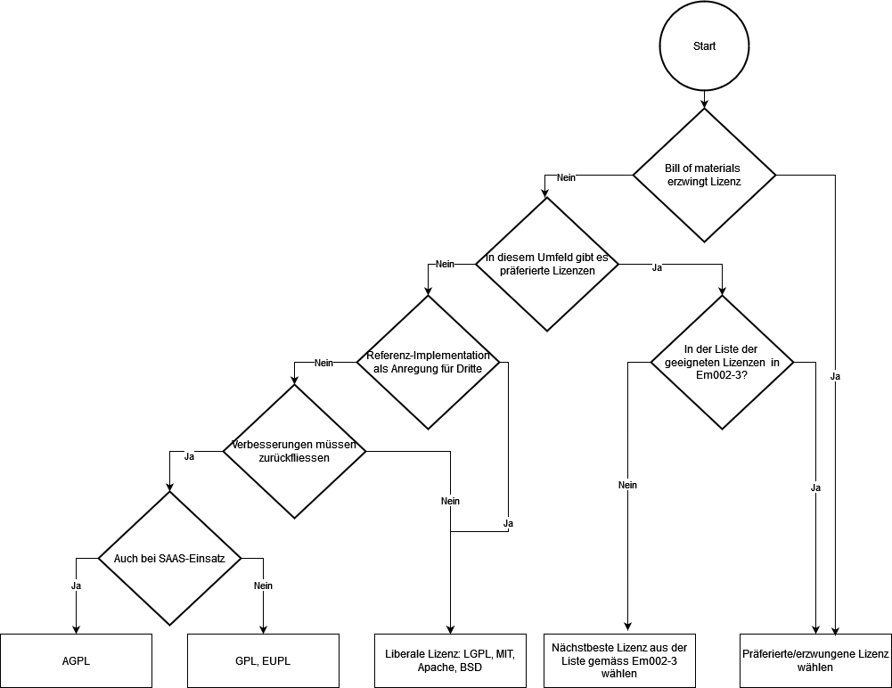

### ⚠️ **Disclaimer** 

Diese Informationen stellen eine **Arbeitsversion** dar und dienen lediglich der Transparenz und Zusammenarbeit auf GitHub.  
Die **offizielle und verbindliche Version** der Inhalte ist auf der Website der Schweizer Bundeskanzlei verfügbar: [Hilfsmittel zu Open Source Software (OSS) – Bundeskanzlei](https://www.bk.admin.ch/bk/de/home/digitale-transformation-ikt-lenkung/bundesarchitektur/open_source_software/hilfsmittel_oss.html).  

---

Empfehlung zur Bundesinformatik\[1\]

<table>
<tbody>
<tr class="odd">
<td>Klassifizierung:[2]</td>
<td>Nicht klassifiziert</td>
</tr>
<tr class="even">
<td>Verbindlichkeit:[3]</td>
<td>Empfehlung</td>
</tr>
<tr class="odd">
<td>Planungsfeld:[4]</td>
<td>IKT der Bundesverwaltung</td>
</tr>
<tr class="even">
<td>Diese Version:</td>
<td>1.0</td>
</tr>
<tr class="odd">
<td>Ersetzt Version:</td>
<td>Neues Dokument</td>
</tr>
<tr class="even">
<td>Status:</td>
<td>Freigegeben</td>
</tr>
<tr class="odd">
<td>Freigabedatum 
(diese Version):</td>
<td>09.09.2024</td>
</tr>
<tr class="even">
<td>Freigegeben durch, Rechtsgrundlage:</td>
<td>Freigegeben durch den Delegierten für digitale Transformation und IKT-Lenkung (D-DTI), gestützt auf Artikel 17 Absatz 1 der Verordnung vom 25. November 2020 über die Koordination der digitalen Transformation und die IKT-Lenkung in der Bundesverwaltung (VDTI), SR 172.010.58</td>
</tr>
<tr class="odd">
<td>Sprachen:</td>
<td>Deutsch (Original), Französisch, Italienisch, Englisch (Übersetzung)</td>
</tr>
<tr class="even">
<td>Lizenz</td>
<td>
CC0 1.0 Universal

By marking the work with a CC0 public domain dedication, the creator is giving up their copyright and allowing reusers to distribute, remix, adapt, and build upon the material in any medium or format, even for commercial purposes.
</td>
</tr>
</tbody>
</table>

  

Inhaltsverzeichnis

1 Einleitung 3

2 Urheberrecht und Lizenzen: Grundlagen 3

3 OSS-Lizenzen 5

3.1 Grundlagen 5

3.2 Open-Source-Lizenzen 5

3.3 Das Copyleft 5

3.3.1 Allgemeines 5

3.3.2 Open-Source-Lizenzen mit starkem Copyleft 6

3.3.3 Open-Source-Lizenzen mit schwachem Copyleft 7

3.3.4 Permissive Open-Source-Lizenzen 7

3.4 Kompatibilität von Open-Source-Lizenzen 7

4 Lizenzen für die reine Nutzung 9

5 Lizenz für eigene Projekte/Kreation und bei Kontributionen 10

6 Use Cases und jeweils geeignete Lizenzen 11

7 Besondere rechtliche Themen 14

7.1 Internationale Aspekte 14

7.2 Haftungs- und Gewährleistungsausschluss 14

7.3 Copyleft und Lizenzierung zwischen Stellen der Bundesverwaltung 14

7.4 Lizenzierung von Patenten 15

7.5 Dual Licensing 15

7.6 Nachträgliche Änderung von Lizenzen 16

7.7 Nennung von Beitragenden (Mitarbeitende und Dritte) 16

7.8 Contributor License Agreements (CLA) 17

7.9 Problematik (L) GPL-3.0 und IoT 7.4.4 18

7.10 Rechtliche Stellung von Dokumentationen 18

8 Weiterführende Informationen zu rechtlichen Fragestellungen 19

Anhang 21

A. Änderungen gegenüber Vorversion 21

B. Referenzen 21

C. Abkürzungen 21

D. Beispiele erfolgter Freigaben und ihre Lizenz 22

# Einleitung

Artikel 9 des Bundesgesetzes vom 17. März 2023\[5\] über den Einsatz
elektronischer Mittel zur Erfüllung von Behördenaufgaben (EMBAG) legt
fest, dass die Bundesbehörden Software, die er selber entwickelt oder
entwickeln lässt, als Open-Source-Software lizenzieren muss.

Dieses Dokument hat die folgenden Zielsetzungen:

  - Einführung in die Themen Urheberrecht an Software und OSS-Lizenzen.

  - Eine Darstellung, welche OSS-Lizenzen für die Benutzung in der
    Bundesverwaltung unproblematisch sind. Lizenzen, die in diesem
    Dokument nicht erwähnt werden, und Software, die unter solchen
    Lizenzen steht, dürfen nicht verwendet werden ohne eine zusätzliche
    Prüfung der Vertragsbestimmungen durch den zuständigen Rechtsdienst.

  - Hilfe bei der Auswahl einer Lizenz für die Entwicklung oder
    Beschaffung eines Projekts unter Art. 9 EMBAG.

# Urheberrecht und Lizenzen: Grundlagen

Das Urheberrecht statuiert einerseits Urheberpersönlichkeitsrechte und
andererseits wirtschaftliche Rechte (Verwertungsrechte). Zu den
Urheberpersönlichkeitsrechten gehören beispielsweise das Recht auf
Anerkennung der Urheberschaft oder das Recht zu bestimmen, ob und wann
ein Werk veröffentlicht wird. Zu den Verwertungsrechten gehört
beispielsweise das Recht, Kopien (Werkexemplare) von einem Werk zu
erstellen oder diese zu verbreiten.

Das Bundesgesetz vom 9. Oktober 1992\[6\] über das Urheberrecht und
verwandte Schutzrechte (URG) kennt eine Reihe weiterer
Urheberpersönlichkeits- und Verwertungsrechte (vgl. Art. 8 ff. URG).
Diese Rechte entstehen gleichzeitig mit der Erschaffung des Werks
unmittelbar beim Urheber/bei der Urheberin.

Art. 2 URG legt die Voraussetzungen fest, unter denen
Urheberrechtsschutz gewährt wird. Nur wenn diese Voraussetzungen erfüllt
sind, liegt ein geschütztes Werk im Sinne des Gesetzes vor.

Vorausgesetzt sind:

  - Das Werk muss geschaffen worden sein («Schöpfung»); ein blosses
    Finden reicht nicht. Forschungsdaten beispielsweise, also die
    Ergebnisse von Experimenten, können keine Werke sein.

  - Die Schöpfung muss «geistig» sein, d.h. von einem Menschen stammen.

  - Das Werk muss in einer wahrnehmbaren Weise umgesetzt worden sein.
    Die blosse Idee hinter einem Werk ist nicht geschützt, sondern nur
    die äussere Form. Beispiele sind ein Ausdruck eines Textes auf
    Papier oder eine Aufführung eines Musikstücks.

  - Individualität: Schliesslich muss das Werk eine gewisse minimale
    Individualität aufweisen. Ein Werk, das jeder oder jede gleich
    gestalten würde, ist nicht geschützt.

Schützbar sind verschiedenste Arten von Werken, wie beispielsweise
literarische oder wissenschaftliche Texte, Werke der Musik,
fotografische, filmische und andere visuelle oder audiovisuelle Werke.

Nach Art. 2 Abs. 3 URG kann insbesondere auch Software ein Werk sein,
wenn die genannten Voraussetzungen erfüllt sind.

Die Urheberrechte stehen mit ihrer Entstehung allein dem Urheber/der
Urheberin zu. Er/sie allein kann verbieten, dass jemand anders die
entsprechenden Handlungen ausübt. Der Urheber/die Urheberin kann aber
seine/ihre Rechte nicht nur selber ausüben:

  - Er/sie kann die Rechte an Dritte übertragen (beispielsweise durch
    Verkauf). Der neue Rechteinhaber/die neue Rechteinhaberin kann
    danach die Rechte geltend machen, genauso wie wenn er/sie selber
    Urheber wäre.

  - Alternativ kann der Urheber/die Urheberin seine/ihre Rechte auch an
    Dritte lizenzieren. Eine Lizenz ist – vereinfacht gesagt – ein
    Vertrag, gemäss dem der/die Rechteinhaber/in einem Dritten erlaubt,
    das Werk zu nutzen. Der Urheber/die Urheberin behält dabei die
    Rechte, verzichtet aber gegenüber dem/der Lizenznehmerin auf deren
    Durchsetzung.

Wird ein Computerprogramm im Arbeitsverhältnis geschaffen, so erhält der
eine exklusive Lizenz für dessen Nutzung (Art. 17 URG). Den
Mitarbeitenden verbleibt damit im Wesentlichen noch das
Urheberpersönlichkeitsrecht an der Software (oder je nach Lehrmeinung
gar nur noch ein Kernbereich davon). Im Bundespersonalrecht ist die
Rechtslage gleich.

# OSS-Lizenzen

## Grundlagen

Im Wesentlichen zeichnet sich OSS durch folgende Merkmale aus (basierend
auf einer Definition der Open Source Initiative (OSI\[7\]):

  - Eine unbeschränkte und kostenlose Weiterverbreitung der Software ist
    zulässig;

  - Die Software liegt im Quellcode vor;

  - Veränderungen der Software und deren Weiterverbreitung unter
    derselben Lizenz sind grundsätzlich zulässig;

  - Es dürfen keine Personen oder Personengruppen von der Nutzung
    ausgeschlossen werden, keine Einsatzbereiche dürfen ausgeschlossen
    werden (insbesondere nicht die kommerzielle Nutzung),

  - und die Verbreitung der Software zusammen mit anderer Software (etwa
    Closed-Source-Software) darf nicht eingeschränkt werden.

Die häufigsten Motive für die Nutzung von OSS liegen zunächst bei den
Kosteneinsparungen durch die Nutzung des bereits bestehenden
beträchtlichen Pools an frei nutzbarer Software. Unternehmen, die
häufig OSS einsetzen, sind oft in der Lage, erhebliche Teile ihres
IT-Budgets durch OSS einzusparen. Frei zur Verfügung stehender Code kann
zudem einfach an die eigenen Bedürfnisse angepasst werden. Die Wahl von
OSS vermeidet zudem einen Vendor-Lock-in.\[8\]

## Open-Source-Lizenzen

Open-Source-Lizenzen sind zunächst einmal normale Lizenzverträge für
Computerprogramme.

Im Gegensatz zu normalen Lizenzverträgen kommen OSS-Lizenzverträge aber
ohne Weiteres zustande, wenn nur eine in der Lizenz beschriebenen freien
Nutzungsformen ausgeübt wird (beispielsweise indem Software kopiert,
weiterverbreitet oder verändert wird).

## Das Copyleft

### Allgemeines

Eine Open-Source-Lizenz gemäss der OSI kann eine sogenannte
«Copyleft»-Bestimmung enthalten. Änderungen an entsprechend
lizenzierter Software müssen wieder unter denselben Bedingungen
angeboten werden, wie sie für die ursprüngliche Software bestanden. Wer
solche Änderungen vornimmt, muss, wenn er/sie die Open Source Software
in Form von maschinenlesbarem Object-Code verbreitet, den Empfängern
auch den Quellcode anbieten.

Im Sinne der Free Software Foundation ausgedrückt, schützt der
Copyleft-Effekt die Freiheit der Entwickler und gewährleistet damit,
dass einmal freie Software immer frei bleibt.

Bei Copyleft-Lizenzen findet so eine Art Tauschgeschäft statt zwischen
der Community auf der einen und den nutzenden Unternehmen auf der
anderen Seite. Die Nutzer, die ihre eigenen Entwicklungen im Gegenzug zu
den Bezügen aus dem bestehenden Software-Pool wieder unter die jeweilige
Lizenz zu stellen verpflichtet sind, tragen damit an die
Weiterentwicklung des Software-Pools bei. Beide Seiten profitieren.

Die Copyleft-Bestimmung hat in gewisser Weise einen »Ansteckungseffekt»
zur Folge: Wird Copyleft-lizenzierte Software in eine bisher proprietäre
Software integriert, so ist die ursprünglich proprietäre Software unter
einer kompatiblen Open-Source-Lizenz offenzulegen.

Entsprechend ist bei der Verwendung von Copyleft-lizenziertem Quellcode
darauf zu achten, dass dieser nur dort integriert wird, wo die
resultierende Software unter einer Open-Source-Lizenz veröffentlicht
werden kann und soll.

Wenn eine Open-Source-Lizenz keine Copyleft-Bestimmung enthält
(permissive Open-Source-Lizenz), kann die Lizenz für überarbeitete
Versionen des Codes frei gewählt werden. So ist es insbesondere auch
möglich, Bearbeitungen wieder unter eine proprietäre Softwarelizenz zu
stellen und den entsprechenden Quellcode in proprietäre Software zu
integrieren.

Im Wesentlichen können Open-Source-Lizenzen in **folgende Kategorien**
eingeteilt werden:

> 1\. Open-Source-Lizenzen mit **starkem Copyleft;**
> 
> 2\. Open-Source-Lizenzen mit **schwachem Copyleft** sowie;
> 
> 3\. **Permissive** bzw. **Non-Copyleft** Open-Source-Lizenzen.

### Open-Source-Lizenzen mit starkem Copyleft 

Bei der Verwendung einer Open-Source-Lizenz mit starkem Copyleft müssen
von der ursprünglichen Software abgeleitete neue Versionen, wenn sie
Dritten weitergegeben werden, unter die Bedingungen der Ursprungslizenz
gestellt und diesen Dritten auch als Quellcode zur Verfügung gestellt
werden.

Die folgenden zwei Lizenzen gelten im Markt als die relevanten
Open-Source-Lizenzen mit starkem Copyleft:

• GNU General Public License (GPL); ein Grossteil der OSS ist heute
unter dieser Lizenz

• GNU Affero General Public License (AGPL)

Der wesentliche Unterschied von GPL- und AGPL bezieht sich auf die
Nutzungsart, welche das Copyleft auslöst: Bei GPL-Software muss der
veränderte Quellcode nur dann angeboten werden, wenn die neue
Softwareversion Dritten als ausführbares Programm angeboten wird
(beispielsweise als Mobil-App). Wird die Software nur über das Internet
(aus der eigenenCloud von eigenen Servern) zur Verfügung gestellt,
beispielsweise in Form von «Software as a Service» oder
Programmier-Schnittstelle («Application Programming Interface»), so löst
dies das Copyleft nicht aus.

Wenn die Software unter der AGPL steht, muss der veränderte Quellcode
auch dann mitgeliefert werden, wenn die Funktionalität der Software über
eine Website oder Programmierschnittstelle angeboten wird. Die AGPL ist
damit noch strenger als die GPL.

Bei starken Copyleft-Lizenzen betrifft das Copyleft nicht nur das
jeweilige Softwaremodul (Library), sondern das gesamte Softwareprogramm,
in welches ein unter Copyleft lizenziertes Softwaremodul unter Umständen
eingebettet wird. Es greift der besagte «Ansteckungseffekt».

### Open-Source-Lizenzen mit schwachem Copyleft 

Auch Lizenzen mit schwachem Copyleft verlangen, dass Veränderungen an
deren Quellcode dritten Empfängern wiederum unter der ursprünglichen
Open-Source-Lizenz freigegeben werden.

Im Gegensatz zu Lizenzen mit starkem Copyleft haben sie jedoch nicht den
Effekt, dass sie auch weitere abgrenzbare Software-Bestandteile (andere
Bibliotheken oder das Hauptprogramm selber) mit ihrer Lizenz
‘anstecken’. Damit wird die Integration von Open-Source-Software mit
schwachem Copyleft in proprietäre Software oder in Software mit anderen
OSS-Lizenzen ermöglicht, ohne dass diese unter der ursprünglichen Lizenz
freigegeben werden muss.

Dies sind die meist verwendeten Open-Source-Lizenzen mit schwachem
Copyleft:

• GNU Lesser General Public License (LGPL)

• Mozilla Public License 2.0 (MPL)

• Common Development and Distribution License (CDDL)

• Eclipse Public License (EPL)

• Microsoft Reciprocal License (Ms-RL)

• European Union Public License (EUPL)\[9\]

### Permissive Open-Source-Lizenzen

Lizenzen ohne Copyleft-Effekt zeichnen sich dadurch aus, dass sie dem
Lizenznehmer keine Vorgaben hinsichtlich der Lizenzierung seiner
abgeleiteten Software machen und dadurch sowohl dessen neuer Quellcode
wie auch Veränderungen an der Open Source Software dritten Empfängern
gegenüber nicht offengelegt werden muss. So wird die Entwicklung von
proprietären Softwareprodukten durch Integration von Software unter
permissiven Open-Source-Lizenzen ermöglicht.

Beispiele für permissive Lizenzen sind:

  - MIT License

  - Apache License 2.0

  - Berkley Software Distribution (BSD) License (BSD-2-Clause und
    BSD-3-Clause)

  - Microsoft Public License (Ms-PL)

## Kompatibilität von Open-Source-Lizenzen 

Programme bestehen meist aus einer Vielzahl von Softwarekomponenten und
Modulen, welche auf unterschiedliche Weise miteinander verbunden werden
können. In der Softwareentwicklung werden bestehende
Open-Source-Komponenten häufig in eigene, interne Applikationen und
Lösungen integriert. Sobald diese über eine Website, über
Programmier-Schnittstellen, über Software-Verteilung oder in einer
anderen Form von aussen zugänglich wird, muss auf die «Kompatibilität»
der jeweiligen Open-Source-Lizenzen geachtet werden, weil dann das
Copyleft greifen kann.

Wenn abgeleitete Werke, die unter einer bestimmten Lizenz stehen, nur
unter denselben Lizenzbedingungen verbreitet werden dürfen, hat dies die
Folge, dass andere Open-Source-Lizenzen mit anderen oder
widersprechenden Lizenzpflichten für abgeleitete Werke nicht genutzt
werden können.

Manche Open-Source-Lizenzen enthalten sogenannte Öffnungsklauseln,
welche die Verwendung des unter ihnen lizenzierten Codes in Projekten
erlaubt, die unter anderen Lizenzen stehen. So gestattet etwa die LGPL,
Version 2.1, auch die Nutzung des Codes unter der GPL. Die GPLv3 enthält
u.a. eine Kompatibilitätsklausel für die AGPL und die Apache License
2.0. Die EUPL ist sehr offen gestaltet und enthält in der Anlage eine
lange Liste kompatibler Lizenzen, insbesondere auch solche mit schwachem
Copyleft, wie die LGPL. Dies hat zur Folge, dass der in der Lizenz
eigentlich festgelegte starke Copyleft-Schutz indirekt geschwächt wird.

Die nachfolgende Grafik stellt die Abhängigkeiten der wichtigsten
Open-Source-Lizenzen (Goldstein 2018) dar. Die Darstellung basiert auf
der Visualisierung von David A. Wheeler, der die Kompatibilitäten der
verschiedenen Lizenzen und ihrer Versionsnummern analysiert hat (Wheeler
2007) und wurde zusammen mit Angaben aus
<https://www.gnu.org/licenses/license-list.en.html> weiterentwickelt.

Die Grafik ist wie folgt zu lesen: Code gemäss einer früher in der Kette
aufgeführten Lizenz kann in Software eingebracht werden, die unter einer
später in der Kette aufgeführten Lizenz veröffentlicht wird. Unter der
modified BSD lizenzierter Code kann also beispielsweise unter eine LGPL-
oder eine GPL-Lizenzvariante gestellt werden, aber nicht umgekehrt.
Public Domain heisst, dass das Werk Allgemeingut ist.

# Lizenzen für die reine Nutzung

Dieses Kapitel behandelt die Situation, in der Software genutzt werden
soll, die unter einer OSS-Lizenz steht, wobei diese Software nicht
bearbeitet werden soll, bzw. Bearbeitungen nur intern verwendet werden.

Die folgenden Lizenzen sind bei der Nutzung von Software durch die
Bundesbehörden grundsätzlich unproblematisch. Es müssen jedoch die
entsprechenden Bedingungen, namentlich ggf. das Copyleft, eingehalten
werden.

Unter Umständen bestimmt die Lizenz eines vorbestehenden Softwaremoduls
die möglichen Lizenzen des Gesamtprodukts (siehe Abschnitt 3.4 und
Kapitel 0).

Einige Lizenzen sind in Kombination inkompatibel (siehe Abbildung 1).

| **Lizenz**                                | **Copyleft** | **Besonderheiten**                                                                                                                                                                                                                                                                           |
| ----------------------------------------- | ------------ | -------------------------------------------------------------------------------------------------------------------------------------------------------------------------------------------------------------------------------------------------------------------------------------------- |
| **MIT**                                   | Nein         | \-                                                                                                                                                                                                                                                                                           |
| **Apache 2.0**                            | Nein         | Verwendung der Marken der Lizenzgeber ausgeschlossen, ausser zur Beschreibung des Werks.                                                                                                                                                                                                     |
| **GPL v3**                                | Ja           | Copyleft gilt auch, wenn GPL-lizenzierte Teile in ein ganzes Programm eingebaut werden. Verbot von Digital Rights Management. Besondere Kompatibilitätsregeln                                                                                                                                |
| **LGPLv3**                                | Schwach      | Im Gegensatz zur GPL darf bei der LGPL unter Bedingungen auch geschlossener (d. h. proprietärer) Code mit dem LGPL-Code kombiniert werden. Beispiele: Standard-Bibliotheken wie glibc. LGPL erlaubt, das Programm, als dessen Teil die Bibliothek vertrieben wird, unter die GPL zu stellen. |
| **Affero GPLv3**                          | Ja           | Auch SaaS-Einsatz löst das Copyleft aus. Ansonsten analog GPLv3                                                                                                                                                                                                                              |
| **BSD-3**                                 | Nein         | Namen der Urheber dürfen nicht verwendet werden, um derivative Werke zu bewerben (Werbeklausel)                                                                                                                                                                                              |
| **European Union Publice License (EUPL)** | Schwach      | Lizenz unter Berücksichtigung des europäischen Rechts. Freigabe unter bestimmten kompatiblen Lizenzen explizit erlaubt.                                                                                                                                                                      |

Tabelle 1: Für die Bundesbehörden unproblematische Lizenzen (gemäss
\[Sc2024\],  
fett=unproblematisch)

Andere Lizenzen sind in der Verwendung möglich. Es braucht in diesen
Fällen u.U. eine Rücksprache mit dem Rechtsdienst des jeweiligen Amtes.

# Lizenz für eigene Projekte/Kreation und bei Kontributionen

Dieser Abschnitt betrifft die folgenden Fälle,

  - Weiterentwicklung / Kontribution
    
      - in denen die Bundesbehörden bestehende Software
        weiterentwickelt; oder
    
      - Software neu entwickelt, sich dabei aber auf bestehende
        OSS-Softwarebibliotheken stützt; und
    
      - die entsprechende Software Dritten zur Verfügung stellt. Zu den
        Dritten zählen auch Organisationen der dezentralen
        Bundesverwaltung, sofern diese eine eigene Rechtspersönlichkeit
        aufweisen. Wenn die Weiterentwicklungen nur intern genutzt
        werden und nicht Dritten zur Verfügung gestellt werden, gilt nur
        Ziff. 4.

  - Eigene Projekte / Kreation / Publikation  
    Dieser Abschnitt betrifft Fälle, in denen die Bundesbehörden neue
    Software entwickelt. Dies dürfte eher selten der Fall sein, weil die
    meisten Entwicklungen sich auf bestehende
    Open-Source-Softwarebibliotheken stützen.  
    Bei vollständigen Neuentwicklungen sollte ein Lizenztyp gewählt
    werden, welcher eine breite und nachhaltige Basis für
    Weiterentwicklungen ermöglicht. Dafür ist eine hohe Akzeptanz der
    betreffenden Lizenz in der entsprechenden Entwickler-Community
    wichtig.

Die Kompatibilitätsprüfung erfolgt gemäss *«Em002-2 Anleitung zur
Veröffentlichung von OSS»,* Abschnitt 7.4. Die Kompatibilität der
Lizenzen ergibt sich aus Abbildung 1

Die folgenden Dimensionen sollen berücksichtigt werden:

  - Use Case

  - Gewünschte Kontrolle (*«Em002-2.1 Checkliste Vorabklärung»)*

  - Einfachheit eine Community aufzubauen *(«Em002-4 Leitfaden
    OSS-Community»*)

  - Einfachheit der Anwendung

  - Rechtssicherheit

  - Verbreitung

Bevorzugt werden Lizenzen gemäss Kapitel 4.

Die folgenden **Copyleft Lizenzen** sollen bei den Bundesbehörden
prioritär verwendet werden, insbesondere, wenn eine nachhaltig offene
Entwicklung angestrebt wird und der Copyleft Effekt der Vererbung
greifen soll. Damit ist sichergestellt, dass die von der Öffentlichkeit
bezahlte Software und alle Ableitungen davon auch offen bleiben.  
Empfohlene Lizenzen in absteigender Reihenfolge:

  - **AGPL v3**

  - GPL v3

  - LGPL 3.0

  - European Public License (EUPL)

Die folgenden Lizenzen sollen bei den Bundesbehörden verwendet werden,
wenn **kein Copyleft gewünscht** oder gefordert ist (in absteigender
Reihenfolge):

  - **Apache License 2.0**

  - BSD v3

  - MIT

Bei der Mitarbeit bei bestehenden Projekten können auch die folgenden
Lizenzen problemlos verwendet werden:

  - Mozilla Public License

  - Microsoft Public License

Soll eine andere Lizenz verwendet werden, so empfiehlt es sich dies bei
der Freigabe in der *«Em002-2.3 Checkliste Freigabe und Publikation»*
kurz zu begründen.

Gemäss Art 9 Ziffer 4 sollen auf alle Fälle international etablierte
Lizenzen verwenden werden.

Weitere Hilfsmittel zur Prüfung der Lizenzkompatibilitäten sind z.B.:

  - Black Duck (www.blackducksoftware.com),

  - FOSSA ([www.fossa.com](http://www.fossa.com)),

  - der Open Source License Comparison Grid
    (<https://www.cmu.edu/cttec/forms/opensourcelicensegridv1.pdf>)

  - FOSSology (<https://www.fossology.org>).

# Use Cases und jeweils geeignete Lizenzen

Die folgende Tabelle zeigt verschiedene Use-Cases für
Open-Source-Software und die jeweils geeigneten Lizenzen.

<table>
<thead>
<tr class="header">
<th><strong>Use Case</strong></th>
<th><strong>Lizenz(en)</strong></th>
<th><strong>Begründung</strong></th>
</tr>
</thead>
<tbody>
<tr class="odd">
<td>Bestehendes Projekt nutzen und beitragen</td>
<td><strong>Lizenz, wie vom Projekt vorgegeben</strong></td>
<td>Aus rechtlichen Gründen notwendig.</td>
</tr>
<tr class="even">
<td>Lizenz wird durch die Verwendung von bestehenden Teilen erzwungen (Lizenzen mit Copyleft)</td>
<td><strong>Lizenz verwenden, die mit den Teilen kompatibel ist.</strong></td>
<td>Aus rechtlichen Gründen notwendig.</td>
</tr>
<tr class="odd">
<td>Bestehendes Ökosystem mit bevorzugter Lizenz (z.B. es handelt sich um ein Plugin zu einer unter MIT-Lizenz freigegebener Software. Dann würde die Verwendung einer MIT-Lizenz am zielführendsten sein, da alle anderen Benutzer dies erwarten und sich die Software in das Ökosystem integriert)</td>
<td><strong>Lizenz verwenden, sofern sie auf der Liste ist, ansonsten möglichst gleiche 
Lizenz</strong></td>
<td>Die Akzeptanz in der Community ist zentral.</td>
</tr>
<tr class="even">
<td>Ziel ist eine möglichst weite Verbreitung, z.B. bei einer Referenzimplementation[10] (z.B. für, die auch in kommerzielle Lösungen einfliessen soll)</td>
<td>
BSD v3

MIT

Apache License 2.0

LGPL v3
</td>
<td>In diesem Fall soll kein Copyleft verwendet werden.</td>
</tr>
<tr class="odd">
<td>Anpassungen am Code sollen zu den Bundesbehörden zurückfliessen</td>
<td>
<strong>AGPL v.3</strong>

GPL v.3

EUPL
</td>
<td>AGPL erzwingt auch bei Verwendung in der Cloud eine Freigabe durch die Dritten, GPL und EUPL nicht.</td>
</tr>
<tr class="even">
<td>SaaS-Lösungen sollen vom Rückfluss von Änderungen am Code nicht ausgenommen werden</td>
<td><strong>AGPL v.3</strong></td>
<td>AGPL erzwingt auch bei Verwendung in der Cloud eine Freigabe durch die Dritten.</td>
</tr>
<tr class="odd">
<td>Einfache Zusammenarbeit mit der Community ist mir wichtig</td>
<td>
<strong>GNU GPL v3</strong>

Apache License 2.0
</td>
<td>
GPL bevorzugt, damit die Software frei bleibt.

Apache enthält Regeln für die Governance der Community, zusätzlich Regeln zu Contributions (man darf keine andere Lizenz festlegen als Apache; die Contribution als solche ist jedoch nicht näher geregelt, wenn also ein CLA besteht, dürfte das vorgehen), eine Patentlizenz, Regeln zur Patentlizenzierung. Vor allem auch, dass, wer gegen einen anderen Contributor Patente geltend macht, verliert seinerseits die Patentlizenz unter der Apache-Lizenz. Wesentlich sind die Regeln, die die Apache Foundation sich für Contributions gibt. Apache macht daher dann Sinn, wenn primär die Projektgovernance nach Apache aufgebaut werden soll.
</td>
</tr>
<tr class="even">
<td>Kleiner, universell einsetzbarer Baustein (Library) oder kleines Stück Software, bei dem es nicht auf Nachhaltigkeit bzw. Pflege durch eine Community ankommt</td>
<td>
<strong>Apache License 2.0</strong>

<strong>BSD v3</strong>

<strong>MIT</strong>

LGPL v3
</td>
<td>
LGPL statuiert ein Copyleft nur für den Baustein selber, aber nicht für das ganze Projekt, in das der Baustein eingefügt wird.

Die anderen Lizenzen sind permissiv.
</td>
</tr>
<tr class="odd">
<td>Es muss einfach sein, permissiv und Kontrolle ist mir nicht wichtig</td>
<td>
<strong>Apache License 2.0</strong>

<strong>BSD v3</strong>

<strong>MIT</strong>
</td>
<td>Maximal permissiv</td>
</tr>
<tr class="even">
<td>Für die Bundesbehörden ist es wichtig, was mit dem Code passiert und will möglichst viel Verbesserungen zurückerhalten</td>
<td><strong>GNU GPLv3</strong></td>
<td>Copyleft</td>
</tr>
<tr class="odd">
<td>Es soll verhindert werden, dass die Software proprietär wird und als Konkurrenzprodukt am Markt positioniert wird.</td>
<td><strong>GNU GPLv3</strong></td>
<td>Copyleft</td>
</tr>
<tr class="even">
<td>Es soll verhindert werden, dass die Bundesbehörden von einzelnen Anbietern abhängig wird (Vendor Lock-in)</td>
<td><strong>GNU GPLv3</strong></td>
<td>Das Copyleft verhindert insbesondere, dass ein Anbieter sich im Lauf der Zeit eine Alleinstellung verschaffen kann durch Verwendung der Software des Bundes in einem proprietären Produkt, was wieder zu einer Abhängigkeit des Bundes von diesem Anbieter führen könnte.</td>
</tr>
</tbody>
</table>

Tabelle 2: Zu verwendende Lizenz je nach Use Case für die Freigabe neuer
Software gemäss Art. 9 EMBAG (fett=bevorzugt zu verwenden)

Abbildung 2: Entscheidbaum Lizenzauswahl Bundesverwaltung

Ein letzter Punkt kann auf den Entscheid Einfluss nehmen: Von einer
restriktiveren Lizenz zu einer weniger restriktiven zu wechseln ist
nachträglich einfacher. Im umgekehrten Fall ist ein Fork\[11\] fast
unvermeidlich.

# Besondere rechtliche Themen

## Internationale Aspekte

Die in der Praxis wesentlichen Rechtsfragen von OSS sind hauptsächlich
lizenzvertraglicher Natur.

In Bezug auf die lizenzrechtlichen Fragen gilt dabei zunächst das Recht,
das die Parteien gewählt haben (so enthält die Mozilla Public License
MPL in Ziff. 8 eine Rechtswahl für das Recht des Beklagten).

Sofern keine Rechtswahl vorliegt, was bei allen anderen hier
dargestellten Lizenzen der Fall ist, gilt in aller Regel das Recht des
Staates des Lizenzgebers. Wenn die Bundesbehörden also Software von
ausländischen Lizenzgebern lizenziert, gilt das Recht des jeweiligen
Landes. Wenn mehrere Beitragende involviert sind, kann dies zu komplexen
Situationen führen. Umgekehrt gilt bei allfälligen Streitfällen zwischen
ausländischen Lizenznehmern und den Bundesbehörden als Lizenzgeber
Schweizer Recht.

Auch die Frage, welche Aspekte vertragsrechtlicher und welche
urheberrechtlicher Natur sind, ist nicht allgemein zu beantworten und
kann im Einzelfall komplex sein. Die Übertragbarkeit des Urheberrechts
oder von Teilen des Urheberrechts bzw. der Umfang der zulässigen
Rechtseinräumung beispielsweise gehört zum Urheberrecht. Hier ist auf
das Recht des jeweiligen Schutzlandes abzustellen. Eine abweichende
Rechtswahl ist nicht möglich (zum Ganzen Jaeger/Metzger, 449 ff.).

## Haftungs- und Gewährleistungsausschluss

Open-Source-Lizenzen schliessen regelmässig jede Gewährleistung und
Haftung aus, soweit dies gesetzlich zulässig ist. In der Praxis stellen
denn auch kaum Haftungs- oder Gewährleistungsfragen; die entsprechenden
Risiken sind gering.

Es ist davon auszugehen, dass bei einer korrekten Lizenzierung die in
allen vorliegend behandelten Lizenzen vorhandenen
Haftungsausschlussklauseln greifen, sodass nur eine Haftung für grobe
Fahrlässigkeit und Vorsatz, evtl. Personenschäden, verbleibt.

Vorbehalten können AGB-Regeln sein, so beispielsweise in Deutschland;
soweit jedoch die Bundesbehörden als Lizenzgeber Haftungssubjekt ist,
gilt Schweizer Recht (vorstehend 7.1), das im B2B-Verkehr die genannten
Haftungs- und Gewährleistungsausschlüsse zulässt.

Umgekehrt bedeutet dies jedoch auch, dass im Fall von Programmfehlern
eine Inanspruchnahme der Autoren von mit einbezogenem OSS-Code meist
schwierig ist.

Das übliche Vorgehen bei der Verwendung von OSS liegt daher regelmässig
darin, sich gegen Fehler durch die üblichen Massnahmen der IT-Sicherheit
abzusichern und die Behebung von Fehlern durch Wartungsverträge
sicherzustellen. Ein Rückgriff auf Beitragende zu OSS erfolgt nicht.

## Copyleft und Lizenzierung zwischen Stellen der Bundesverwaltung

Das Copyleft greift bei einer Weitergabe zwischen verschiedenen
juristischen Personen (beispielsweise im Konzern oder zwischen Stellen
der dezentralen Bundesverwaltung mit eigener Rechtspersönlichkeit).

Das Copyleft greift nicht bei einer Weitergabe zwischen Stellen ein- und
derselben juristischen Person (beispielsweise innerhalb der zentralen
Bundesverwaltung).

## Lizenzierung von Patenten

Softwarepatente sind nach europäischer Rechtsauffassung nur in engen
Grenzen möglich. Entscheidend ist, dass die Software einen technischen
Beitrag leistet, d. h. ein konkretes technisches Problem ausserhalb des
Computers löst, auf dem sie läuft. Beispiele wären eine Motorsteuerung
bei Autos oder die Steuerung eines Roboters. Software als solche, die
nur auf einem Computer läuft, aber keine solche «Aussenwirkung» hat, ist
in Europa gemeinhin nicht patentierbar. Damit fallen die meisten
Softwareprogramme nicht in den Bereich des Patentrechts.

In anderen Weltgegenden, insbesondere den USA, werden Softwarepatente
etwas freigiebiger zugelassen. Auch in den USA wird jedoch eine
abstrakte Idee oder ein Geschäftsmodelldurch die einfache
Implementierung in Computersoftware nicht zu einer patentierbaren
Erfindung.

Bei einzelnen Lizenzen werden allfällige Patente des Lizenzgebers nicht
mitlizenziert: Dies sind die GPL2, die BSD-Lizenzen sowie die
MIT-Lizenz.

Bei Projekten, die auch ausserhalb Europas Einsatz finden könnten, oder
welche die genannte Form der «Aussenwirkung» aufweisen, empfiehlt sich
eine Einzelfallabklärung der patentrechtlichen Aspekte.

## Dual Licensing

Der Urheber kann eine Software unter verschiedenen Lizenzen zugleich
lizenzieren. Man spricht von Dual Licensing.

Praktisch interessant ist eine Form von Dual Licensing, bei der der
Urheber die Software einerseits als OSS mit einem starken Copyleft
lizenziert (was verhindert, dass sie in proprietäre Software integriert
werden kann), und andererseits interessierten Lizenznehmern eine
*kostenpflichtige* Lizenz angeboten wird, welche ihnen erlaubt, die
Software in ihre proprietäre Software zu integrieren.

Weil die interessierten Lizenznehmer so die Freigabe ihrer proprietären
Software als OSS vermeiden können, sind sie bereit, für die Lizenz zu
bezahlen. Siehe auch Anhang des *«Em002-1 Praxis-Leitfaden Open Source
in der Bundesverwaltung»*.

Für die Bundesbehörden selber dürfte Dual Licensing meist uninteressant
sein. Solange die Urheberrechte bei den Bundesbehörden zu liegen kommen
(was beispielsweise gemäss AGB der Bundesverwaltung so geregelt ist),
können die Bundesbehörden allein über ein allfälliges Dual Licensing
entscheiden.

Falls Wartung und (Weiter-) Entwicklung an Dritte ausgelagert werden,
ist dies möglicherweise anders: Wenn die Rechte ausnahmsweise bei diesen
zu liegen kommen, und wenn sich die Bundesbehörden nur das Recht
vorbehalten hat, eine OSS-Lizenz mit Copyleft zu vergeben, könnte der
Dritte versucht sein, Dual Licensing vorzunehmen. Will man dies
verhindern, sollte es vertraglich ausgeschlossen werden.

## Nachträgliche Änderung von Lizenzen

Zunächst gilt zu beachten, dass OSS-Lizenzen in aller Regel unabänderbar
und unwiderruflich sind. Lizenznehmer, die den Lizenzvertrag *vor* einer
allfälligen Änderung abgeschlossen haben, können den Code basierend auf
der alten Lizenz weiterverwenden, abändern und Dritten weitergeben.

In der Praxis führt die Änderung von Lizenzen daher oft zu einer
Abspaltung einer neuen Version der Software unter der alten Lizenz, die
durch die bisherigen Lizenznehmer in Eigenregie weiterentwickelt wird
(Fork).

Die Einführung einer neuen Lizenz für eine Software ist nur dann
möglich, wenn sich alle Urheber der Software darin einig sind.
Änderungen kamen in der Praxis beispielsweise vor, wenn von einer
permissiven zu einer Copyleft-Lizenz gewechselt werden sollte.

## Nennung von Beitragenden (Mitarbeitende und Dritte)

Wird ein Computerprogramm im Arbeitsverhältnis geschaffen, so erhält der
Arbeitgeber eine exklusive Lizenz für dessen Nutzung (Art. 17 URG). Den
Mitarbeitenden verbleibt damit im Wesentlichen noch das
Urheberpersönlichkeitsrecht an der Software (oder je nach Lehrmeinung
gar nur noch ein Kernbereich davon). Dasselbe gilt bei Dritten, die für
die Bundesbehörden Software entwickeln, sofern die entsprechenden
AGB\[12\] des Bundes zur Anwendung gelangen, welche die entstehenden
Rechte den Bundesbehördenübertragen.

Dennoch stellt sich die Frage, ob Beitragende (Mitarbeitende, Dritte)
das Recht oder die Pflicht haben sollen, sich in Open Source
Repositories als Urheber oder Urheberin von Contributions erkennen zu
geben.

Ein Argument für die Bundesbehörden, OSS einzusetzen, liegt darin,
attraktive Arbeitsplätze anzubieten: OSS bietet Beitragenden
Gelegenheit, ihre Kenntnisse öffentlich unter Beweis zu stellen und so
Reputation aufzubauen. Ihre Fähigkeiten werden verifizierbar, sind durch
Peers bezeugt, und wer in einem OSS-Projekt Einfluss erlangt hat, kann
dies bei der Arbeitssuche in die Waagschale werfen.

Ein weiteres Argument könnte das Urheberpersönlichkeitsrecht sein,
dessen Kern dem ursprünglichen Urheber bzw. der ursprünglichen Urheberin
weder durch Vertrag noch durch Gesetz entzogen werden kann. Indessen ist
dieser Kernbereich bei Computerprogrammen klein; die Forderung, auch der
Entwickler oder die Entwicklerin eines Computerprogramms habe ein Recht
auf Namensnennung, ginge wohl zu weit.

Hinzu kommt, dass ein Austausch zwischen Fachleuten in der Community
voraussetzt, dass diese für andere individuell ansprechbar sind.

Je nach Projekt kann es also nach dem Gesagten sinnvoll sein,
Mitwirkenden die Möglichkeit zu geben, sich in der Community als
Beitragende zu erkennen zu geben.

Ein Zwang hierzu ist aus datenschutzrechtlicher Sicht jedoch zu
vermeiden, obschon der Austausch in der Community eine Preisgabe des
Namens nicht voraussetzt – Pseudonyme sind vielmehr eher die Regel als
die Ausnahme. Wollen Mitwirkende ihren Namen nicht preisgeben, sollten
sie daher die Möglichkeit erhalten, unter Pseudonym aufzutreten.

In jedem Fall sollte aber darauf hingewirkt werden, dass die
Bundesbehörden als Rechteinhaber auftreten.

## Contributor License Agreements (CLA)

Wenn mehrere Urheber am Code eines Open-Source-Projekts arbeiten,
erhalten diese gemeinschaftliche Rechte am entstehenden Code. Die
Lizenzierung des Codes an Dritte geschieht über die OSS-Lizenz, wobei
zwischen jedem Nutzenden und jedem Urheber/jeder Urheberin ein
gesonderter Lizenzvertrag entsteht (Bündel von Lizenzen). Diese
Konstellation kann eine unübersichtliche Rechtslage nach sich ziehen, so
etwa bei internationalen Verhältnissen (dazu vorstehend Ziff. 7.1). Wenn
Unternehmen entscheiden, ihre Software unter eine OSS-Lizenz zu stellen
und von Dritten Beiträge an die Software entgegennehmen, haben sie zudem
oftmals das Bedürfnis, eine gewisse Kontrolle über den Code zu behalten.
So kann es interessant sein, sich die Möglichkeit offenzuhalten, das
Projekt unter eine neue Lizenz zu stellen, oder man möchte unter
Copyleft lizenzierten Code einem Dual-Licensing zuzuführen und benötigt
zu diesem Zweck mehr Rechte, als man selber von seinen Contributors über
eine einfache OSS-Lizenz erhielte (vorstehend Ziff. 7.5).

Sogenannte Contributor License Agreements (teils auch Copyright Transfer
Agreements) sollen derartige Probleme lösen. Hauptinstrument von CLAs
ist entweder die Abtretung der Urheberrechte von den Contributors an den
Hauptentwickler bzw. die Trägerorganisation (im Fall von Copyright
Transfer Agreements), oder dann die Gewährung einer möglichst weit
gehenden, in der Regel unwiderruflichen Lizenz durch die Contributors an
den Hauptentwickler. CLAs sind in der OSS-Welt allgegenwärtig. Die
meisten grösseren OSS-Projekte stehen unter den Regeln eines CLA.

CLAs sind in der OSS-Community teils umstritten, weil sie Lücken im
Copyleft aufreissen können. Mittlerweile gibt es daher auch CLAs, die
den Hauptentwickler/der Hauptentwicklerin in Bezug auf die Vergabe einer
neuen Lizenz für den Code des Projektes einschränken.

Entwickeln die Bundesbehörden neue Software in Eigenregie, sollte sie
mit allen Beitragenden ein solches CLA abschliessen, um möglichst ihre
Flexibilität zu wahren und allfällige Rechtsverletzungen einfach
verfolgen zu können. Die Bedürfnisse an das CLA sind im Einzelfall zu
klären, wobei man sich an Vorlagen, etwa von Apache\[13\], orientieren
kann.

Beteiligen die Bundesbehörden sich durch Contributions an Drittsoftware,
ist im Einzelfall durch den Rechtsdienst zu prüfen, ob die
Bundesbehörden das bestehende CLA akzeptieren kann.

Beim Beitritt zu bestehenden CLA ist insbesondere auf folgende Punkte zu
achten:

  - Die Bundesbehörde ist nach Art. 17 URG Träger der Nutzungsrechte an
    Software, welche von eigenen Mitarbeitenden geschaffen wird. Bei
    Drittentwicklern soll er sich die Rechte sichern (beispielsweise
    durch Verwendung der entsprechenden AGB des Bundes).

  - Für jedes Projekt ist zu klären, ob die einzelnen Mitarbeitenden des
    Bundes (bzw. Drittentwickler) oder der Bundesbehörden selber
    gegenüber dem Hauptentwickler (und im jeweiligen
    Software-Repository) auftreten sollen (dazu vorstehend 7.7).

  - Sofern die individuellen Entwickler gegenüber der Hauptentwicklerin
    auftreten, müssen diese sich als Vertreter des Bundes als
    Rechteinhaber zu erkennen geben.

Falls ein CLA zur Anwendung kommt, so sollte dies in den
Schlussbemerkungen der *«Em002-2.1 Checkliste Vorabklärung»* und
*«Em002-4.1 Checkliste OSS-Community»* erwähnt werden.

## Problematik (L) GPL-3.0 und IoT 7.4.4

In \[BITKOM2023\] wird auf eine Problematik der Verwendung von
(L)GPL-3.0-Lizenzen in Zusammenhang mit gerätenaher Software
hingewiesen: Solche Geräte müssten das aufspielen eigener/neuer
Software-Versionen erlauben. Dies ist unter Umständen aus
Sicherheitsgründen nicht erwünscht.

## Rechtliche Stellung von Dokumentationen

Gemäss Art. 5 URG sind «Entscheidungen, Protokolle und Berichte von
Behörden und öffentlichen Verwaltungen» durch das Urheberrecht nicht
geschützt.

Das geht weiter als CC-0, weil der Rechteinhaber das Werk nicht «durch
Verzicht auf weltweit alle urheberrechtlichen und verwandten
Schutzrechte in die Gemeinfreiheit entlassen» kann. Es ist bereits von
Gesetzes wegen gemeinfrei. Die Botschaft zu URG 5 sagt: «Die Bestimmung
lässt nach wie vor für eine ganze Anzahl von Werken, die aus amtlicher
Tätigkeit oder im Zusammenhang damit entstanden sind, den Schutz durch
das Urheberrecht bestehen.

Dokumente von verwaltungsinternen Studienkommissionen und
Arbeitsgruppen, Expertenberichte oder Zeitschriften von Bundesämtern
etwa fallen nicht unter die Norm. An ihrer freien Verbreitung besteht
kein überwiegendes Interesse, weil sie nicht die Rechtsstellung des
Bürgers beeinflussen.»

Es lässt sich also argumentieren, dass für etliche der relevanten
Dokumente und Dokumentationen im Zusammenhang mit den Open Source
Software, die die Bundesbehörden publizieren, kein Urheberrechtsschutz
besteht. Das Kriterium ist, ob das Dokument die Rechtsstellung des
Bürgers beeinflusst und damit vom Urheberrechtsschutz ausgenommen ist
oder nicht. Wenn nicht, dann sollte eine geeignete Lizenz (CC-0\[14\],
CC-BY, CC-BY-SA oder allenfalls LGPL) für Dokumentationen verwendet
werden.

Nichtsdestotrotz wäre gerade bei internationaler Verwendung der
Dokumentationen vielen Nutzern unklar, wie die Situation ist.

Deshalb halten wir es für zielführend, wenn wie bei diesem Dokument
hier, eine entsprechende Freigabe zur Sicherheit auch noch aufgeführt
wird.

# Weiterführende Informationen zu rechtlichen Fragestellungen

Weiterführende Informationen zu Open-Source-Software, konkreten
Lizenzeigenschaften und vertiefende rechtliche Aspekte können in
zahlreichen Publikationen gefunden werden, die nachfolgend vorgestellt
werden (siehe dazu auch die Referenzen am Schluss des Dokuments).

  - Weitere Anhaltspunkte zur Umsetzung von Art. 9 EMBAG bietet der Text
    *«Open Source Software im EMBAG, Analyse des neuen Art. 9 des
    Bundesgesetzes über den Einsatz elektronischer Mittel zur Erfüllung
    von Behördenaufgaben»* von Rika Koch und Simon Schlauri, im
    Tagungsband der IT-Beschaffungskonferenz 2023 in Bern.

  - Der *«Leitfaden Open-Source-Software 2.0»* des deutschen BITKOM geht
    ausführlich auf Rechtsfragen zu Open Source ein \[*BITKOM2023\]*. Er
    geht allerdings von der Rechtslage in Deutschland aus.

  - Wolfgang Straub in seinem Buch *«Softwareschutz: Urheberrecht,
    Patentrecht, Open Source» die juristischen Details des Copyleft im
    Zusammenhang mit dem Schweizer Urheberrecht und vertieft die
    Kompatibilität von Open Source Lizenzen» \[St2011\]*. Der Teil über
    Open Source Software sowie deutsche Übersetzungen verschiedener Open
    Source Lizenzen unter Berücksichtigung der schweizerischen
    Rechtsterminologie sind frei verfügbar unter *www.it-recht.ch.*

  - Vertiefte Antworten zu zahlreichen Rechtsfragen im Zusammenhang mit
    Open Source Software geben Till Jaeger und Axel Metzger in ihrem
    umfassenden Buch *«Open Source Software – Rechtliche
    Rahmenbedingungen der Freien Software» \[JaAx2016\]*. Sie gehen
    allerdings von der Rechtslage in Deutschland aus.

  - Kropp Jonathan/Bauer Alexander, Open Source Compliance und
    Litigation, CB 2019 S. 285 ff., 285.

  - Reymond Michel José, Questions de responsabilité civile et
    contractuelle soulevées par la distribution de „logiciels libres“
    (open source), SZW 2022 S. 69 ff.

Des Weiteren geben verschiedene Online-Portale detailliert Auskunft zu
den Eigenschaften und Fragestellungen von bestimmten Open Source
Lizenzen.

  - Auf <https://choosealicense.com>, einer Plattform von GitHub, können
    die gewünschten Ziele für ein Open Source Projekt ausgewählt werden,
    worauf die passende Open Source Lizenz vorgeschlagen wird.

  - Auf <https://opensource.guide/de/legal/> hat GitHub ein Online-Guide
    zur Verfügung gestellt, der auf konkrete rechtliche Fragen eingeht.

  - Auf <https://www.gnu.org/licenses/license-list.en.html> finden sich
    Kurzkommentare zu verschiedenen Lizenzen mit Hinweisen zur
    Kompatibilität, insbesondere der GPL.

  - Auf <https://opensource.org/faq> geht die Open Source Initiative auf
    zahlreiche Fragen und Antworten zu rechtlichen Aspekten von Open
    Source Lizenzen ein.

  - Auf <https://copyleft.org/guide> ist ein ausführlicher Leitfaden
    publiziert, der die Details des Copyleft erläutert.

  - Auf <https://tldrlegal.com> sind die wichtigsten Open Source
    Lizenzen zusammengefasst nach Vorgaben, was die jeweilige Lizenz
    erlaubt («can»), was sie verbietet («cannot») und was sie
    vorschreibt («must»).

  - Auf <https://opensource.com/tags/licensing> werden fortlaufend
    Beiträge zu aktuellen Lizenzfragen veröffentlicht.

  - Auf <https://www.ifross.org/faq-haeufig-gestellte-fragen> hat das
    private «Institut für Rechtsfragen der Freien und Open Source
    Software» in Berlin (ifrOSS) zahlreiche Antworten auf häufige
    Rechtsfragen publiziert.

Compliance mit Open-Source-Lizenzen wird heute vorwiegend mit
Software-Tools umgesetzt (siehe zu weiteren Fragen der Open Source
Compliance auch Fröhlich-Bleuler *\[Fr2012\]* und Kuhn, Williamson und
Sandler *\[KuWiSa2008\]* Einerseits gibt es dazu verschiedene Open
Source Tools der Linux Foundation unter dem Begriff «fossology», die
unter <https://www.fossology.org> dokumentiert und veröffentlicht sind.
Andererseits bieten kommerzielle Anbieter wie Black Duck\[15\] oder
FOSSA\[16\] verschiedene proprietäre Lösungen an, mit denen die
Kompatibilität der eingesetzten Open-Source-Lizenzen geprüft werden
kann.

# Anhang

## Änderungen gegenüber Vorversion

Neues Dokument.

## Referenzen

Siehe *«Em002 Strategischer Leitfaden Open Source Software in der
Bundesverwaltung»*.

## Abkürzungen

Siehe *«Em002 Strategischer Leitfaden Open Source Software in der
Bundesverwaltung»* und *«Em002-6 FAQ OSS und EMBAG Art. 9».*

4.  ## Beispiele erfolgter Freigaben und ihre Lizenz
    
    D.1 trustbroker.swiss

<table>
<thead>
<tr class="header">
<th>URL</th>
<th><a href="https://github.com/trustbroker-swiss/trustbroker.swiss">https://github.com/trustbroker-swiss/trustbroker.swiss</a></th>
</tr>
</thead>
<tbody>
<tr class="odd">
<td>Bundesbehörde</td>
<td>BK, BIT</td>
</tr>
<tr class="even">
<td>Beschreibung</td>
<td>
Trust Broker Swiss provides federation services between relying parties (applications, service providers, other IAM Systems or policy enforcement points) and identity Providers (IdP, aslo called claims providers) using trusted attribute stores to enrich authenticated users.

It enables identity/claims providers and relying parties to exchange information via a third party hiding the IdP specifics providing a unified or at least additionally verified identity.
</td>
</tr>
<tr class="odd">
<td>Jahr</td>
<td>2024</td>
</tr>
<tr class="even">
<td>Lizenz</td>
<td>AGPL</td>
</tr>
<tr class="odd">
<td>Begründung</td>
<td>Codeänderungen sollen auf jeden Fall offenbleiben und wieder zurückgegeben werden.</td>
</tr>
</tbody>
</table>

D.2 Geocat.ch

| URL           | <https://github.com/geonetwork/core-geonetwork>                                                                                                                                                                                                                               |
| ------------- | ----------------------------------------------------------------------------------------------------------------------------------------------------------------------------------------------------------------------------------------------------------------------------- |
| Bundesbehörde | Swisstopo                                                                                                                                                                                                                                                                     |
| Beschreibung  | GeoNetwork is a catalog application to manage spatially referenced resources. It provides powerful metadata editing and search functions as well as an interactive web map viewer. It is currently used in numerous Spatial Data Infrastructure initiatives across the world. |
| Jahr          | 2012                                                                                                                                                                                                                                                                          |
| Lizenz        | GPL 2.0                                                                                                                                                                                                                                                                       |
| Begründung    | \-                                                                                                                                                                                                                                                                            |

D.3 GWEN / ampycloud / c4dl-multi / dvas /…

| URL           | <https://meteoswiss.github.io/ampycloud/>                                                                   |
| ------------- | ----------------------------------------------------------------------------------------------------------- |
| Bundesbehörde | MeteoSwiss                                                                                                  |
| Beschreibung  | Python package to determine the sky coverage fraction and base height of cloud layers using ceilometer data |
| Jahr          | 2023                                                                                                        |
| Lizenz        | Verschiedene Lizenzen, BSD                                                                                  |
| Begründung    | \-                                                                                                          |

D.4 EMSG (Erhaltungsmanagement im Siedlungsgebiet)

| URL           | <https://github.com/astra-emsg/ASTRA.EMSG>                                                                                |
| ------------- | ------------------------------------------------------------------------------------------------------------------------- |
| Bundesbehörde | MeteoSwiss                                                                                                                |
| Beschreibung  | EMSG is a C\# GIS Web Application developed by the Swiss government to handle the asset management of urban road systems. |
| Jahr          | 2017                                                                                                                      |
| Lizenz        | BSD                                                                                                                       |
| Begründung    | \-                                                                                                                        |

D.5 Covid Zertifikatsanwendung

| URL           | <https://github.com/admin-ch/CovidCertificate-Documents>   |
| ------------- | ---------------------------------------------------------- |
| Bundesbehörde | BIT                                                        |
| Beschreibung  | Schweizerische Anwendung für COVID-Zertifikate             |
| Jahr          | 2020                                                       |
| Lizenz        | MIT                                                        |
| Begründung    | Möglichst permissiv, damit alle den Code verwenden können. |

D.6 GovCert Website

| URL           | https://github.com/govcert-ch/website                                                                 |
| ------------- | ----------------------------------------------------------------------------------------------------- |
| Bundesbehörde | NCSC                                                                                                  |
| Beschreibung  | Source code of the website for the Computer Emergency Response Team (GovCERT) of the Swiss government |
| Jahr          | 2023                                                                                                  |
| Lizenz        | MIT                                                                                                   |
| Begründung    | \-                                                                                                    |

D.7 Diverse Libraries zu Open Data (z.B. Linked Data)

| URL           | https://github.com/SwissFederalArchives                                                                                                                                                                                                                                       |
| ------------- | ----------------------------------------------------------------------------------------------------------------------------------------------------------------------------------------------------------------------------------------------------------------------------- |
| Bundesbehörde | BAR                                                                                                                                                                                                                                                                           |
| Beschreibung  | Das Repository des Schweizerischen Bundesarchivs auf GitHub bietet Zugang zu den Quellcodes unserer Applikationen. Es ermöglicht es Ihnen, Ihre eigenen Forks zu erstellen und Fehler zu melden oder erweiterte Funktionalitäten an der Schnittstelle «Issues» vorzuschlagen. |
| Jahr          | 2023                                                                                                                                                                                                                                                                          |
| Lizenz        | AGPL, Apache, MIT                                                                                                                                                                                                                                                             |
| Begründung    | Opendata und Open Source Software gehen in die gleiche Richtung. AGPL erlaubt maximale Offenheit.                                                                                                                                                                             |

D.8 Apache FOP angepasst für archivierbare PDF

| URL           | <https://xmlgraphics.apache.org/fop/>                                                                                                                                                                                         |
| ------------- | ----------------------------------------------------------------------------------------------------------------------------------------------------------------------------------------------------------------------------- |
| Bundesbehörde | IGE                                                                                                                                                                                                                           |
| Beschreibung  | Das IGE wollte eine Version von Apache FOP, die archivierbare PDF erzeugen konnte. Dazu wurde eine Erweiterung durch einen der Kernentwickler (Jeremias Märki) beauftragt. Die Anpassungen flossen direkt in das Projekt ein. |
| Jahr          | 2007                                                                                                                                                                                                                          |
| Lizenz        | Apache                                                                                                                                                                                                                        |
| Begründung    | Es wurden Erweiterungen an einem bestehenden Open-Source-Projekt vorgenommen.                                                                                                                                                 |

D.9 Rechtssichere elektronische Eingabe mit eKomm

| URL           | <https://launchpad.net/ekomm>                                                                                                           |
| ------------- | --------------------------------------------------------------------------------------------------------------------------------------- |
| Bundesbehörde | IGE                                                                                                                                     |
| Beschreibung  | Das IGE wollte eine Software für die elektronische Eingabe.                                                                             |
| Jahr          | 2009                                                                                                                                    |
| Lizenz        | Apache                                                                                                                                  |
| Begründung    | Das IGE wollte die Freigabe durch den Lieferanten (Glue) durchführen lassen und dies permissiv erlauben (Einbau in eigene Anwendungen). |

1.  «Empfehlung zur Bundesinformatik» gemäss \[P035\], *Abschnitt 4.6*

2.  Zu der Klassifizierung INTERN und VERTRAULICH vgl. *Verordnung vom
    8. November 2023 über die Informationssicherheit in den
    Bundesbehörden und der Armee (ISV, SR 128.1)*

3.  Vgl. Fussnote 1

4.  Planungsfelder gemäss *IKT-Strategie des Bundes 2020-2023 vom 3.
    April 2020 (SB000)*

5.  SR 172.019

6.  SR 231.1

7.  <https://opensource.org/>

8.  <https://de.wikipedia.org/wiki/Lock-in-Effekt>

9.  Die EUPL selber hat ein starkes Copyleft, aufgrund der
    Öffnungsklausel ist jedoch eine Überführung auf Lizenzen mit
    schwachem Copyleft möglich, sodass der Schutz beschränkt ist.

10. Z.B. um ein Gesetz einfacher umsetzbar zu machen, kann eine
    Referenz-Implementation durch die Bundesbehörden beauftragt werden.
    Siehe z.B. <https://ech.ch/de/ech/ech-0238/1.0>

11. Definition siehe *«Em002-1 Praxisleitfaden Open Source Software»
    \[Em002-1\]*

12. <https://www.bkb.admin.ch/bkb/de/home/themen/agb.html>

13. <https://www.apache.org/licenses/contributor-agreements.html>

14. <https://www.creativecommons.ch/>

15. <https://www.blackducksoftware.com>

16. <https://fossa.com>
