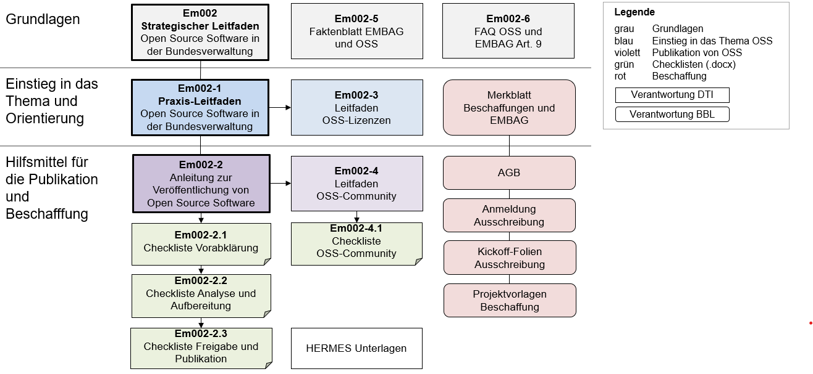

### ⚠️ **Disclaimer** 

Diese Informationen stellen eine **Arbeitsversion** dar und dienen lediglich der Transparenz und Zusammenarbeit auf GitHub.  
Die **offizielle und verbindliche Version** der Inhalte ist auf der Website der Schweizer Bundeskanzlei verfügbar: [Hilfsmittel zu Open Source Software (OSS) – Bundeskanzlei](https://www.bk.admin.ch/bk/de/home/digitale-transformation-ikt-lenkung/bundesarchitektur/open_source_software/hilfsmittel_oss.html).  

---

**Open Source Software veröffentlichen durch die Bundesverwaltung**

**Am 01.01.2024 ist das neue *Bundesgesetz über den Einsatz
elektronischer Mittel zur Erfüllung von Behördenaufgaben* (EMBAG) in
Kraft getreten. Es schreibt vor, dass die Bundesbehörden den Quellcode
von Software offenlegen, die sie entwickeln oder entwickeln lassen.
Ausnahmen sind möglich, wenn die Rechte Dritter oder
sicherheitsrelevante Gründe dies ausschliessen oder einschränken.**

**Open Source bedeutet:**

  - Der Quellcode einer Software wird publiziert und ist für alle
    Interessierten einsehbar.

  - Jede Person kann die Software nutzen, weiterentwickeln und
    weitergeben. Dabei werden nach dem Grundsatz „public money – public
    code“ keine Lizenzgebühren erhoben.

  - Mehrere Organisationen können die Software verwenden und gemeinsam
    weiterentwickeln.

**Open Source bedeutet nicht:**

  - Dass Daten, die mit der Applikation verwaltet werden, öffentlich
    zugänglich werden.

  - Dass Sie die Kontrolle über Ihre Applikation verlieren. Sie
    bestimmen selbst, unter welcher Lizenz eine Software veröffentlicht
    wird, ob Sie Anpassungen Dritter übernehmen und wann Sie neue
    Versionen der Software installieren.

  - Dass automatisch eine Community entsteht und die Applikation von
    anderen genutzt wird.

**Vorgehen in der Bundesverwaltung:**

  - Jede Bundesbehörde, d.h. jedes Amt oder Organisationseinheit ist
    selbst für die Umsetzung von Art. 9 EMBAG und die Veröffentlichung
    der Software verantwortlich.

  - Das Gesetz gilt für jede Software, welche nach dem 1.1.2024
    entwickelt wird.

  - Bei einer externen Beschaffung sind die angepassten Vorgaben des BBL
    zu berücksichtigen.  
    Link: [Werkzeugkasten
    (admin.ch)](https://intranet.bbl.admin.ch/bbl_kp/de/home/informatik/beschaffung-buerotechnik-informatik-des-bbl/werkzeugkasten.html)

<!-- end list -->

  - Auf der Website der Bundeskanzlei stehen zentral Hilfsmittel zur
    Verfügung.

**  
**

**Folgende Hilfsmittel stehen auf der Website der Bundeskanzlei zur
Verfügung:**

**Übersicht über die Hilfsmittel zu Open Source Software OSS (Stand
September 2024)**

Veröffentlicht unter [OSS
Hilfsmittel](https://www.bk.admin.ch/bk/de/home/digitale-transformation-ikt-lenkung/bundesarchitektur/open_source_software/hilfsmittel_oss.html)

**Strategischer und Praxis-Leitfaden**

In diesen Leitfäden ist detailliert dargelegt, was Open Source Software
ist, welche gesetzlichen Grundlagen es zu beachten gilt, welche
Prozessschritte eingehalten werden sollen und wie Art. 9 EMBAG am besten
umgesetzt werden kann.

**Anleitung zur Veröffentlichung, zu OSS-Lizenzen und zu OSS-Community**

In diesen Dokumenten befinden sich detaillierte Informationen über
mögliche Publikationsplattformen, Lizenzen, Kollaborationsmöglichkeiten
in Communities, usw.

**Checklisten**

Die Checklisten dienen dazu, den Prozess zur Veröffentlichung zu
begleiten und zu dokumentieren.

**FAQ**

Eine Sammlung wichtiger Fragen und Antworten rund um Open Source
Software, die auch nicht tief informierten Lesern Auskunft und Anleitung
geben soll.

Link zu
[OSS](https://www.bk.admin.ch/bk/de/home/digitale-transformation-ikt-lenkung/bundesarchitektur/open_source_software.html)
und [OSS
Hilfsmittel](https://www.bk.admin.ch/bk/de/home/digitale-transformation-ikt-lenkung/bundesarchitektur/open_source_software/hilfsmittel_oss.html)
