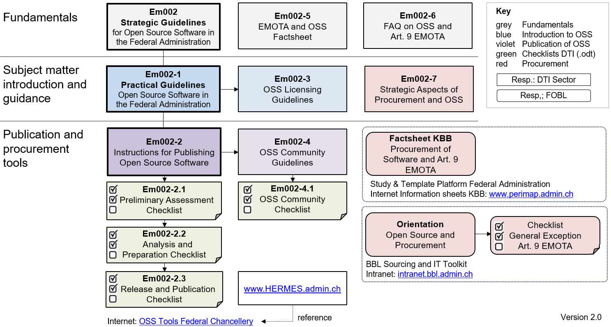

**Disclaimer:** This document is an evolving draft and part of the guidelines and tools designed to support the Federal Administration in publishing open source code. For more information, see the main [README](https://github.com/swiss/opensource-guidelines/tree/main).

---

#    1. Use of these guidelines
Under Article 9 of the Federal Act on the Use of Electronic Means to Carry Out Official Tasks (EMOTA), the Confederation is required to disclose the source code of software that it develops or commissions for the performance of its duties.1 The DTI Sector of the Federal Chancellery has derived overarching objectives from this legal mandate in the Strategic Guidelines for Open Source Software.

This document serves as practical guidelines on the legal and strategic requirements. It is designed to assist federal administrative units in the use, procurement and release of open source software. It provides all interested parties with a comprehensive overview of the subject and refers to additional information in the other resources. 

However, depending on your prior knowledge and needs, you may wish to read the guides selectively before moving on to the other tools. The following outline will help you find the appropriate starting point. If you are unsure, it is recommended that you read through the guidelines first.  

## Intention / Stakeholders

General introduction to open source software

- Section Definitions
- Section Potential and challenges
- Section Findability of OSS solutions
- [Em002-5 OSS Tools information sheet](em002-5.md)
- [Em002-3 OSS Licensing Guidelines](em002-3.md)
- [Em002-6 FAQ about OSS](em002-6.md)

General introduction to EMOTA for decision-makers

- [Em002-5 OSS Tools information sheet](em002-5.md)
- [Em002 Strategic Guidelines for Open Source Software in the Federal Administration](em002.md)

Procurement only of software to be used

- Section Maturity levels for OSS in the Federal Administration
- Section Use of unmodified open source software
- [Em002-7 Strategic Aspects of Procurement and OSS](em002-7.md)
- Software Procurement and Art. 9 EMOTA information sheet
[KBB-MB]
- OSS in Procurement guidelines [BBL-WL]

New IT development and release

- Section Development with open source components and release of source code
- Section Collaboration in open projects (contribution)
- [Em002-2 Instructions for Publishing OSS](em002-2.md)
- [Em002-2.1 OSS Preliminary Assessment Checklist](em002-2.1.md)
- [Em002-2.2 OSS Analysis and Preparation Checklist](em002-2.2.md)
- [Em002-2.3 OSS Release and Publication Checklist](em002-2.3.md)
- [Em002-4 OSS Community Guidelines](em002-4.md)
- [Em002-4.1 OSS Community Checklist](em002-4.1.md)

Procurement of created software (service or work)

- Section Maturity levels for OSS in the Federal Administration
- Section Development with open source components and release of source code
- Section Collaboration in open projects (contribution)
- [Em002-7 Strategic Aspects of Procurement and OSS](em002-7.md)
- FOBL toolbox, including the Open Source in Procurement
guidelines
- CCPP public administration learning and template platform
(www.perimap.admin.ch)including Software Procurement and Art. 9 EMOTA [KBB-
MB]
- OSS in Procurement guidelines [BBL-WL]
- [Em002-2 Instructions for Publishing OSS](em002-2.md)
- [Em002-2.1 OSS Preliminary Assessment Checklist](em002-2.1.md)
- [Em002-2.2 OSS Analysis and Preparation Checklist](em002-2.2.md)
- [Em002-2.3 OSS Release and Publication Checklist](em002-2.3.md)
- [Em002-4 OSS Community Guidelines](em002-4.md)
- [Em002-4.1 OSS Community Checklist](em002-4.1.md)

Legal clarifications for release

- [Em002-6 Frequently Asked Questions about Publishing OSS
(OSS-FAQ)](em002-6.md)
- [Em002-3 OSS Licensing Guidelines](em002-3.md)

Working principles for project managers

- [HERMES documents](https://www.hermes.admin.ch/)
- [Em002-5 OSS Tools information sheet](em002-5.md)

Contributions of software to third parties and collaborations

- [Em002-4 OSS Community Guidelines](em002-4.md)
- [Em002-4.1 OSS Community Checklist](em002-4.1.md)
- [Em002-7 Strategic Aspects of Procurement and OSS](em002-7.md)
- [Em002-3 OSS Licensing Guidelines](em002-3.md)

The following diagram gives an overview of the documents relevant to OSS
in the Federal Administration.

Figure 1: Overview of OSS tools in relation to Art. 9 EMOTA

# Definitions

<table style="border: none; border-collapse: collapse; width: 100%;">
  <tr style="border: none;">
    <td style="vertical-align: top; width: 20%; padding-right: 20px; color: #000; font-weight: bold; border: none;">
      Open source software
    </td>
    <td style="vertical-align: top; border-left: 1px solid #ccc; padding-left: 20px; border-top: none; border-right: none; border-bottom: none;">
      Software is considered open source software (OSS) when it is published underone of approximately 80 licences recognised by the Open Source Initiative OSI [OSI2019]. Specifically, the definition of open source sets out ten criteria that all open source licences must meet <i>[PE1999]</i>. These can essentially be summarised in four points:
        
      <ol>
        <li>The software may be used for any purpose.</li>
        <li>The source code of the software is freely accessible.</li>
        <li>The software may be copied and distributed without restriction.</li>
        <li>The software may be modified and distributed in modified form under certain conditions.</li>
      </ol>
    </td>
  </tr>
  <tr style="border: none;">
    <td style="vertical-align: top; padding-right: 20px; color: #00; font-weight: bold; border: none; padding-top: 20px;">
      Free software
    </td>
    <td style="vertical-align: top; border-left: 1px solid #ccc; padding-left: 20px; border-top: none; border-right: none; border-bottom: none; padding-top: 20px;">
      Before the term 'open source', the Free Software Foundation (FSF) introduced the concept of 'free software' in the 1980s.In essence, free software meets the conditions of open source software, but aims to ensure that the software is always freely accessible and, wherever possible, is not integrated into proprietary software.⁶
    </td>
  </tr>
    <tr style="border: none;">
    <td style="vertical-align: top; padding-right: 20px; color: #00; font-weight: bold; border: none; padding-top: 20px;">
      Proprietary software
    </td>
    <td style="vertical-align: top; border-left: 1px solid #ccc; padding-left: 20px; border-top: none; border-right: none; border-bottom: none; padding-top: 20px;">
      With proprietary software, a supplier develops software and sells a usage licence to the user. Generally, the user does not know the software code and may not redistribute or modify the software. They can only use the software according to the licence terms (e.g. End-User Licence Agreement, EULA) in return for payment of licence fees. For example, the software may be authorised to be used by only a certain number of users or a certain number of processors.⁷ In return for the usually annual maintenance fees, the supplier commits to fixing errors within a reasonable timeframe and to continuously developing the software.
    </td>
  </tr>
    <tr style="border: none;">
    <td style="vertical-align: top; padding-right: 20px; color: #00; font-weight: bold; border: none; padding-top: 20px;">
     Licence
    </td>
    <td style="vertical-align: top; border-left: 1px solid #ccc; padding-left: 20px; border-top: none; border-right: none; border-bottom: none; padding-top: 20px;">
      A licence is a document that contains binding guidelines for the use and distribution of software. In the case of open source, licences that comply with OSI are usually used.⁸
    </td>
  </tr>
 <tr style="border: none;">
    <td style="vertical-align: top; padding-right: 20px; color: #00; font-weight: bold; border: none; padding-top: 20px;">
    Community
    </td>
    <td style="vertical-align: top; border-left: 1px solid #ccc; padding-left: 20px; border-top: none; border-right: none; border-bottom: none; padding-top: 20px;">
        A community in the context of open source software is broadly defined. It can be a loose ecosystem or a structure with governance that develops the software. The document <i>Em002-4 OSS Community Guidelines</i> covers this topic. Community members can jointly manage the product, develop, test, translate, provide feedback or simply use the software.
    </td>
  </tr>  
    <tr style="border: none;">
    <td style="vertical-align: top; padding-right: 20px; color: #00; font-weight: bold; border: none; padding-top: 20px;">
    Third-party rights
    </td>
    <td style="vertical-align: top; border-left: 1px solid #ccc; padding-left: 20px; border-top: none; border-right: none; border-bottom: none; padding-top: 20px;">
      Even with open source software, protective rights may exist (copyright, trademark law, patent law) and can be asserted by third parties, e.g. when using source code created by third parties.
    </td>
  </tr>
    <tr style="border: none;">
    <td style="vertical-align: top; padding-right: 20px; color: #00; font-weight: bold; border: none; padding-top: 20px;">
     Exceptions under EMOTA
    </td>
    <td style="vertical-align: top; border-left: 1px solid #ccc; padding-left: 20px; border-top: none; border-right: none; border-bottom: none; padding-top: 20px;">
        Exceptions according to Art. 9 para. 1 EMOTA include third-party rights and security-related reasons. Both are covered in Section 3 of <i>Em002-2 Instructions for Publishing Open Source Software</i>.
    </td>
  </tr> 
    **Disclaimer:** This document is an evolving draft and part of the guidelines and tools designed to support the Federal Administration in publishing open source code. For more information, see the main [README](https://github.com/swiss/opensource-guidelines/tree/main).

---

#    1. Use of these guidelines
Under Article 9 of the Federal Act on the Use of Electronic Means to Carry Out Official Tasks (EMOTA), the Confederation is required to disclose the source code of software that it develops or commissions for the performance of its duties.1 The DTI Sector of the Federal Chancellery has derived overarching objectives from this legal mandate in the Strategic Guidelines for Open Source Software.

This document serves as practical guidelines on the legal and strategic requirements. It is designed to assist federal administrative units in the use, procurement and release of open source software. It provides all interested parties with a comprehensive overview of the subject and refers to additional information in the other resources. 

However, depending on your prior knowledge and needs, you may wish to read the guides selectively before moving on to the other tools. The following outline will help you find the appropriate starting point. If you are unsure, it is recommended that you read through the guidelines first.  

## Intention / Stakeholders

General introduction to open source software

- Section Definitions
- Section Potential and challenges
- Section Findability of OSS solutions
- [Em002-5 OSS Tools information sheet](em002-5.md)
- [Em002-3 OSS Licensing Guidelines](em002-3.md)
- [Em002-6 FAQ about OSS](em002-6.md)

General introduction to EMOTA for decision-makers

- [Em002-5 OSS Tools information sheet](em002-5.md)
- [Em002 Strategic Guidelines for Open Source Software in the Federal Administration](em002.md)

Procurement only of software to be used

- Section Maturity levels for OSS in the Federal Administration
- Section Use of unmodified open source software
- [Em002-7 Strategic Aspects of Procurement and OSS](em002-7.md)
- Software Procurement and Art. 9 EMOTA information sheet
[KBB-MB]
- OSS in Procurement guidelines [BBL-WL]

New IT development and release

- Section Development with open source components and release of source code
- Section Collaboration in open projects (contribution)
- [Em002-2 Instructions for Publishing OSS](em002-2.md)
- [Em002-2.1 OSS Preliminary Assessment Checklist](em002-2.1.md)
- [Em002-2.2 OSS Analysis and Preparation Checklist](em002-2.2.md)
- [Em002-2.3 OSS Release and Publication Checklist](em002-2.3.md)
- [Em002-4 OSS Community Guidelines](em002-4.md)
- [Em002-4.1 OSS Community Checklist](em002-4.1.md)

Procurement of created software (service or work)

- Section Maturity levels for OSS in the Federal Administration
- Section Development with open source components and release of source code
- Section Collaboration in open projects (contribution)
- [Em002-7 Strategic Aspects of Procurement and OSS](em002-7.md)
- FOBL toolbox, including the Open Source in Procurement
guidelines
- CCPP public administration learning and template platform
(www.perimap.admin.ch)including Software Procurement and Art. 9 EMOTA [KBB-
MB]
- OSS in Procurement guidelines [BBL-WL]
- [Em002-2 Instructions for Publishing OSS](em002-2.md)
- [Em002-2.1 OSS Preliminary Assessment Checklist](em002-2.1.md)
- [Em002-2.2 OSS Analysis and Preparation Checklist](em002-2.2.md)
- [Em002-2.3 OSS Release and Publication Checklist](em002-2.3.md)
- [Em002-4 OSS Community Guidelines](em002-4.md)
- [Em002-4.1 OSS Community Checklist](em002-4.1.md)

Legal clarifications for release

- [Em002-6 Frequently Asked Questions about Publishing OSS
(OSS-FAQ)](em002-6.md)
- [Em002-3 OSS Licensing Guidelines](em002-3.md)

Working principles for project managers

- [HERMES documents](https://www.hermes.admin.ch/)
- [Em002-5 OSS Tools information sheet](em002-5.md)

Contributions of software to third parties and collaborations

- [Em002-4 OSS Community Guidelines](em002-4.md)
- [Em002-4.1 OSS Community Checklist](em002-4.1.md)
- [Em002-7 Strategic Aspects of Procurement and OSS](em002-7.md)
- [Em002-3 OSS Licensing Guidelines](em002-3.md)

The following diagram gives an overview of the documents relevant to OSS
in the Federal Administration.

Figure 1: Overview of OSS tools in relation to Art. 9 EMOTA

# Definitions

<table style="border: none; border-collapse: collapse; width: 100%;">
  <tr style="border: none;">
    <td style="vertical-align: top; width: 20%; padding-right: 20px; color: #000; font-weight: bold; border: none;">
      Open source software
    </td>
    <td style="vertical-align: top; border-left: 1px solid #ccc; padding-left: 20px; border-top: none; border-right: none; border-bottom: none;">
      Software is considered open source software (OSS) when it is published underone of approximately 80 licences recognised by the Open Source Initiative OSI [OSI2019]. Specifically, the definition of open source sets out ten criteria that all open source licences must meet <i>[PE1999]</i>. These can essentially be summarised in four points:
        
      <ol>
        <li>The software may be used for any purpose.</li>
        <li>The source code of the software is freely accessible.</li>
        <li>The software may be copied and distributed without restriction.</li>
        <li>The software may be modified and distributed in modified form under certain conditions.</li>
      </ol>
    </td>
  </tr>
  <tr style="border: none;">
    <td style="vertical-align: top; padding-right: 20px; color: #00; font-weight: bold; border: none; padding-top: 20px;">
      Free software
    </td>
    <td style="vertical-align: top; border-left: 1px solid #ccc; padding-left: 20px; border-top: none; border-right: none; border-bottom: none; padding-top: 20px;">
      Before the term 'open source', the Free Software Foundation (FSF) introduced the concept of 'free software' in the 1980s.In essence, free software meets the conditions of open source software, but aims to ensure that the software is always freely accessible and, wherever possible, is not integrated into proprietary software.⁶
    </td>
  </tr>
    <tr style="border: none;">
    <td style="vertical-align: top; padding-right: 20px; color: #00; font-weight: bold; border: none; padding-top: 20px;">
      Proprietary software
    </td>
    <td style="vertical-align: top; border-left: 1px solid #ccc; padding-left: 20px; border-top: none; border-right: none; border-bottom: none; padding-top: 20px;">
      With proprietary software, a supplier develops software and sells a usage licence to the user. Generally, the user does not know the software code and may not redistribute or modify the software. They can only use the software according to the licence terms (e.g. End-User Licence Agreement, EULA) in return for payment of licence fees. For example, the software may be authorised to be used by only a certain number of users or a certain number of processors.⁷ In return for the usually annual maintenance fees, the supplier commits to fixing errors within a reasonable timeframe and to continuously developing the software.
    </td>
  </tr>
    <tr style="border: none;">
    <td style="vertical-align: top; padding-right: 20px; color: #00; font-weight: bold; border: none; padding-top: 20px;">
     Licence
    </td>
    <td style="vertical-align: top; border-left: 1px solid #ccc; padding-left: 20px; border-top: none; border-right: none; border-bottom: none; padding-top: 20px;">
      A licence is a document that contains binding guidelines for the use and distribution of software. In the case of open source, licences that comply with OSI are usually used.⁸
    </td>
  </tr>
 <tr style="border: none;">
    <td style="vertical-align: top; padding-right: 20px; color: #00; font-weight: bold; border: none; padding-top: 20px;">
    Community
    </td>
    <td style="vertical-align: top; border-left: 1px solid #ccc; padding-left: 20px; border-top: none; border-right: none; border-bottom: none; padding-top: 20px;">
        A community in the context of open source software is broadly defined. It can be a loose ecosystem or a structure with governance that develops the software. The document <i>Em002-4 OSS Community Guidelines</i> covers this topic. Community members can jointly manage the product, develop, test, translate, provide feedback or simply use the software.
    </td>
  </tr>  
    <tr style="border: none;">
    <td style="vertical-align: top; padding-right: 20px; color: #00; font-weight: bold; border: none; padding-top: 20px;">
    Third-party rights
    </td>
    <td style="vertical-align: top; border-left: 1px solid #ccc; padding-left: 20px; border-top: none; border-right: none; border-bottom: none; padding-top: 20px;">
      Even with open source software, protective rights may exist (copyright, trademark law, patent law) and can be asserted by third parties, e.g. when using source code created by third parties.
    </td>
  </tr>
    <tr style="border: none;">
    <td style="vertical-align: top; padding-right: 20px; color: #00; font-weight: bold; border: none; padding-top: 20px;">
     Exceptions under EMOTA
    </td>
    <td style="vertical-align: top; border-left: 1px solid #ccc; padding-left: 20px; border-top: none; border-right: none; border-bottom: none; padding-top: 20px;">
        Exceptions according to Art. 9 para. 1 EMOTA include third-party rights and security-related reasons. Both are covered in Section 3 of <i>Em002-2 Instructions for Publishing Open Source Software</i>.
    </td>
  </tr> 
    <tr style="border: none;">
    <td style="vertical-align: top; padding-right: 20px; color: #00; font-weight: bold; border: none; padding-top: 20px;">
     Source code
    </td>
    <td style="vertical-align: top; border-left: 1px solid #ccc; padding-left: 20px; border-top: none; border-right: none; border-bottom: none; padding-top: 20px;">
      In computing, source code (or source text) is the human-readable text of a computer program written in a programming language.⁹
    </td>
  </tr>
    <tr style="border: none;">
    <td style="vertical-align: top; padding-right: 20px; color: #00; font-weight: bold; border: none; padding-top: 20px;">
     Publication
    </td>
    <td style="vertical-align: top; border-left: 1px solid #ccc; padding-left: 20px; border-top: none; border-right: none; border-bottom: none; padding-top: 20px;">
       Publication primarily refers to the release of the source code under an open licence according to OSI. For practical reasons, this usually also includes documentation and automated instructions for building the application from the source code. Automated tests and test documents are also typically included. To enable a community to develop, a platform is used that then takes on several functions of a development platform (build, test, support).
    </td>
  </tr> 
    <tr style="border: none;">
    <td style="vertical-align: top; padding-right: 20px; color: #00; font-weight: bold; border: none; padding-top: 20px;">
    Digital 
sovereignty
    </td>
    <td style="vertical-align: top; border-left: 1px solid #ccc; padding-left: 20px; border-top: none; border-right: none; border-bottom: none; padding-top: 20px;">
   We use the definition from the FDFA's Digital Sovereignty Report [St2024]: 'Digital sovereignty of a state or organisation necessarily includes complete control over stored and processed data as well as independent decision-making about who may access it. It further includes the ability to independently develop, modify, control and supplement technological components and systems.'
    </td>
  </tr>
    <tr style="border: none;">
    <td style="vertical-align: top; padding-right: 20px; color: #00; font-weight: bold; border: none; padding-top: 20px;">
    Repository
    </td>
    <td style="vertical-align: top; border-left: 1px solid #ccc; padding-left: 20px; border-top: none; border-right: none; border-bottom: none; padding-top: 20px;">
   A repository is a storage location used by a version control tool for files and metadata about the code base. 
Repositories allow multiple contributors to work on the same files and store different versions. Most also allow issue tracking, release management, automated builds and documentation.
    </td>
  </tr>
    <tr style="border: none;">
    <td style="vertical-align: top; padding-right: 20px; color: #00; font-weight: bold; border: none; padding-top: 20px;">
    Fork
    </td>
    <td style="vertical-align: top; border-left: 1px solid #ccc; padding-left: 20px; border-top: none; border-right: none; border-bottom: none; padding-top: 20px;">
   A fork10 of an open source project is the process of setting up an independent development of the original project. 
    </td>
  </tr>
    <tr style="border: none;">
    <td style="vertical-align: top; padding-right: 20px; color: #00; font-weight: bold; border: none; padding-top: 20px;">
    Contributor Licence Agreement (CLA)
    </td>
    <td style="vertical-align: top; border-left: 1px solid #ccc; padding-left: 20px; border-top: none; border-right: none; border-bottom: none; padding-top: 20px;">
   A Contributor Licence Agreement1 is a document that describes the conditions under which intellectual property can be contributed to a project or venture. 
    </td>
  </tr>
    <tr style="border: none;">
    <td style="vertical-align: top; padding-right: 20px; color: #00; font-weight: bold; border: none; padding-top: 20px;">
    Source code management (SCM)
    </td>
    <td style="vertical-align: top; border-left: 1px solid #ccc; padding-left: 20px; border-top: none; border-right: none; border-bottom: none; padding-top: 20px;">
   Source code management,1 also known as version control, is a tool that effectively manages changes and version numbers, particularly in software development. The free software Git2 for managing distributed SCM has become established. 
    </td>
  </tr>
     <tr style="border: none;">
    <td style="vertical-align: top; padding-right: 20px; color: #00; font-weight: bold; border: none; padding-top: 20px;">
    Open source software development (OSSD)
    </td>
    <td style="vertical-align: top; border-left: 1px solid #ccc; padding-left: 20px; border-top: none; border-right: none; border-bottom: none; padding-top: 20px;">
   In open source software development (OSSD),1 in addition to publishing the source code, the entire development process is carried out publicly. Everything from requirements (issues) to source code is transparent. OSSD is supported by public communication tools (mailing lists, forums, etc.), a version control system (git), bug and feature lists, roadmap and developer tools.
    </td>
  </tr>
     <tr style="border: none;">
    <td style="vertical-align: top; padding-right: 20px; color: #00; font-weight: bold; border: none; padding-top: 20px;">
    Software Package Data Exchange (SPDX)
    </td>
    <td style="vertical-align: top; border-left: 1px solid #ccc; padding-left: 20px; border-top: none; border-right: none; border-bottom: none; padding-top: 20px;">
   Software Package Data Exchange (SPDX)1 describes a standard format for Software Bill of Materials (SBOM) with the aim of facilitating the correct handling of free software or open source software.
    </td>
  </tr>
     <tr style="border: none;">
    <td style="vertical-align: top; padding-right: 20px; color: #00; font-weight: bold; border: none; padding-top: 20px;">
    Copyleft effect
    </td>
    <td style="vertical-align: top; border-left: 1px solid #ccc; padding-left: 20px; border-top: none; border-right: none; border-bottom: none; padding-top: 20px;">
   If software is under a licence with a copyleft provision, any modification or extension of the source code must be released again under the licence of the modified open source software (see also Em002-3 OSS Licensing Guidelines).
    </td>
  </tr>
</table>

# Potential and challenges

There is enormous potential for open source software in today\'s world of IT. At the same time, the use of open source solutions also brings  challenges. These two sides are explained in more detail in the following section. The information is based on, among other things, the results of the Open Source Study Switzerland 2018, 2021 and 2024 by the University of Bern, in which respondents provided information about the recognised advantages and disadvantages of open source software.

## Potential of open source software 

The following points describe the potential that can be realised when using and releasing open source software.

<table style="border: none; border-collapse: collapse; width: 100%;">
  <tr style="border: none;">
    <td style="vertical-align: top; width: 20%; padding-right: 20px; color: #000; font-weight: bold; border: none;">
      1. Digital sovereignty
    </td>
    <td style="vertical-align: top; border-left: 1px solid #ccc; padding-left: 20px; border-top: none; border-right: none; border-bottom: none;">
      This involves the ability to use and control digital services. Digital sovereignty extends over the entire lifecycle of a digital system. Open  ource software promotes digital sovereignty, as it guarantees interchangeability, design flexibility and influence.16
    </td>
  </tr>
  <tr style="border: none;">
    <td style="vertical-align: top; padding-right: 20px; color: #00; font-weight: bold; border: none; padding-top: 20px;">
    2. No licence fees
    </td>
    <td style="vertical-align: top; border-left: 1px solid #ccc; padding-left: 20px; border-top: none; border-right: none; border-bottom: none; padding-top: 20px;">
      There are no licence costs for using open source software. However, when obtaining complex standard open source software packages, it may make sense to purchase support subscriptions, for which a fee is paid.
    </td>
  </tr>
    <tr style="border: none;">
    <td style="vertical-align: top; padding-right: 20px; color: #00; font-weight: bold; border: none; padding-top: 20px;">
    3. Cost savings through cooperation with other users
    </td>
    <td style="vertical-align: top; border-left: 1px solid #ccc; padding-left: 20px; border-top: none; border-right: none; border-bottom: none; padding-top: 20px;">
     As software under an open source licence can be used and further developed without restriction, costs of further developments can be shared or existing additional developments from other administrative units can be adopted according to the principle of 'develop once – use multiple times'. At the same time, there is the opportunity to benefit from the experience and developments of others.
    </td>
  </tr>
    <tr style="border: none;">
    <td style="vertical-align: top; padding-right: 20px; color: #00; font-weight: bold; border: none; padding-top: 20px;">
    4. Community building & knowledge sharing 
    </td>
    <td style="vertical-align: top; border-left: 1px solid #ccc; padding-left: 20px; border-top: none; border-right: none; border-bottom: none; padding-top: 20px;">
     Open source software facilitates community building and knowledge sharing, for example between the different federal levels in Switzerland. Software can be jointly further developed, errors fixed and individual experiences shared. The increased exchange of knowledge between different administrative units leads to a better understanding of what others are working on, so that duplication is avoided and the best solutions can spread. 
    </td>
  </tr>
 <tr style="border: none;">
    <td style="vertical-align: top; padding-right: 20px; color: #00; font-weight: bold; border: none; padding-top: 20px;">
    5. Lower dependence on manufacturers 
    </td>
    <td style="vertical-align: top; border-left: 1px solid #ccc; padding-left: 20px; border-top: none; border-right: none; border-bottom: none; padding-top: 20px;">
    Vendor lock-in (dependency on software suppliers) is considered very high in computing. Using software under an open source licence reduces vendor lock-in as operation, maintenance, support, further development and other services for open source software can be openly tendered. Instead of completely re-procuring an entire system due to vendor lock-in, extensions or lifecycle services for an OSS solution can also be put out to tender separately. This can save significant migration costs.
    </td>
  </tr>  
    <tr style="border: none;">
    <td style="vertical-align: top; padding-right: 20px; color: #00; font-weight: bold; border: none; padding-top: 20px;">
    6. Open standards and interoperability
    </td>
    <td style="vertical-align: top; border-left: 1px solid #ccc; padding-left: 20px; border-top: none; border-right: none; border-bottom: none; padding-top: 20px;">
     With open source software, compatibility with other software solutions and IT systems (interoperability) is generally higher than with proprietary software. Open source solutions also use almost exclusively open data formats, which is why they can be easily exchanged with other systems.
    </td>
  </tr>
    <tr style="border: none;">
    <td style="vertical-align: top; padding-right: 20px; color: #00; font-weight: bold; border: none; padding-top: 20px;">
    7. Transparency about the structure of the software
    </td>
    <td style="vertical-align: top; border-left: 1px solid #ccc; padding-left: 20px; border-top: none; border-right: none; border-bottom: none; padding-top: 20px;">
        As the software is also available in the form of source code, its quality can be checked, for example, through external reviews. In addition, documentation can be created based on the source code (e.g. with regard to new tenders for further development services or the replacement of open source software at the end of its service life).
    </td>
  </tr> 
    <tr style="border: none;">
    <td style="vertical-align: top; padding-right: 20px; color: #00; font-weight: bold; border: none; padding-top: 20px;">
     8. Security and trust through transparency
    </td>
    <td style="vertical-align: top; border-left: 1px solid #ccc; padding-left: 20px; border-top: none; border-right: none; border-bottom: none; padding-top: 20px;">
      Because of the open nature of the source code, the security of open source software can be higher than that of proprietary software. Moreover, it is much more difficult to build backdoors and other loopholes into open source software, which leads to more trust in the software. 
    </td>
  </tr>
    <tr style="border: none;">
    <td style="vertical-align: top; padding-right: 20px; color: #00; font-weight: bold; border: none; padding-top: 20px;">
     9. Higher quality and modularity of code
    </td>
    <td style="vertical-align: top; border-left: 1px solid #ccc; padding-left: 20px; border-top: none; border-right: none; border-bottom: none; padding-top: 20px;">
      The quality of open source software can be higher than proprietary software because the motivation to write good code may be greater when developers know that their source code will be published. In addition, open source solutions tend to be highly modular, so that individual modules can be easily replaced and the remaining modules can continue to be used.17
    </td>
  </tr>
   <tr style="border: none;">
    <td style="vertical-align: top; padding-right: 20px; color: #00; font-weight: bold; border: none; padding-top: 20px;">
     10. Easy customisation
    </td>
    <td style="vertical-align: top; border-left: 1px solid #ccc; padding-left: 20px; border-top: none; border-right: none; border-bottom: none; padding-top: 20px;">
      Access to the source code allows users to make further developments themselves or through external suppliers. This means the software can be quickly adapted to their own needs.
    </td>
  </tr> 
   <tr style="border: none;">
    <td style="vertical-align: top; padding-right: 20px; color: #00; font-weight: bold; border: none; padding-top: 20px;">
     11. Rapid innovation and integration
    </td>
    <td style="vertical-align: top; border-left: 1px solid #ccc; padding-left: 20px; border-top: none; border-right: none; border-bottom: none; padding-top: 20px;">
       There is rapid, continuous further development of open source software by the community. For example, new technologies and data standards are often published as open source programming libraries. This enables the rapid realisation of innovative software solutions.
    </td>
  </tr> 
    <tr style="border: none;">
    <td style="vertical-align: top; padding-right: 20px; color: #00; font-weight: bold; border: none; padding-top: 20px;">
     12. Employer attractiveness
    </td>
    <td style="vertical-align: top; border-left: 1px solid #ccc; padding-left: 20px; border-top: none; border-right: none; border-bottom: none; padding-top: 20px;">
     The use of modern open source technologies and informal collaboration  with international communities promotes employee motivation and thus increases employer attractiveness, which in turn facilitates the recruitment of young, qualified professionals.
    </td>
  </tr>
</table>

## Challenges in dealing with OSS

The following describes the typical challenges encountered in practice with open source software and outlines some possible solutions. We do not address general challenges that affect all software at this point (e.g. the need to check for cybersecurity and the need to secure appropriate support for critical software).

<table style="border: none; border-collapse: collapse; width: 100%;">
  <tr style="border: none;">
    <td style="vertical-align: top; width: 20%; padding-right: 20px; color: #000; font-weight: bold; border: none;">
      1. High switching costs due to existing dependencies
    </td>
    <td style="vertical-align: top; border-left: 1px solid #ccc; padding-left: 20px; border-top: none; border-right: none; border-bottom: none;">
      Replacing proprietary software with open source solutions can be very costly if the application is closely embedded in the existing IT system through interface integration or other dependencies. These switching costs mean that introducing open source software often only pays off at the end of the proprietary software's lifecycle.
    </td>
  </tr>
  <tr style="border: none;">
    <td style="vertical-align: top; padding-right: 20px; color: #00; font-weight: bold; border: none; padding-top: 20px;">
    2. Missing features or no suitable open source solution
    </td>
    <td style="vertical-align: top; border-left: 1px solid #ccc; padding-left: 20px; border-top: none; border-right: none; border-bottom: none; padding-top: 20px;">
      When procuring standard software, it may happen that there is no open source software alternative to the (previous) proprietary solution, or only one that is functionally inadequate. As a solution approach, there is the possibility of jointly developing the missing features together with other users of the open source software and adding them to the open source project.18
    </td>
  </tr>
    <tr style="border: none;">
    <td style="vertical-align: top; padding-right: 20px; color: #00; font-weight: bold; border: none; padding-top: 20px;">
    3. Higher integration costs 
    </td>
    <td style="vertical-align: top; border-left: 1px solid #ccc; padding-left: 20px; border-top: none; border-right: none; border-bottom: none; padding-top: 20px;">
     Short-term cost savings resulting from licence savings when using open source software are often offset by higher integration costs. Therefore, it is important to recognise that the professional use of open source software is not 'free' but actually generates internal or external costs.
    </td>
  </tr>
    <tr style="border: none;">
    <td style="vertical-align: top; padding-right: 20px; color: #00; font-weight: bold; border: none; padding-top: 20px;">
    4. Unclear responsibilities and support 
    </td>
    <td style="vertical-align: top; border-left: 1px solid #ccc; padding-left: 20px; border-top: none; border-right: none; border-bottom: none; padding-top: 20px;">
     Open source software is often criticised for the lack of support and maintenance by external companies. However, there are now a variety of suppliers offering commercial services (long-term support, ongoing maintenance, further development, liability and warranty, etc.) for open source solutions. The different business models with open source software are explained in Annex D and the different support models in Section 8. An up-to-date overview of open source service providers and their services can be found in the Open Source Directory (https://www.ossdirectory.com) or in the OSS Study 202419 <i>[OSS2024]</i> .
    </td>
  </tr>
 <tr style="border: none;">
    <td style="vertical-align: top; padding-right: 20px; color: #00; font-weight: bold; border: none; padding-top: 20px;">
    5. Small market with few suppliers 
    </td>
    <td style="vertical-align: top; border-left: 1px solid #ccc; padding-left: 20px; border-top: none; border-right: none; border-bottom: none; padding-top: 20px;">
    As certain open source applications, such as desktop applications, generally require little or no support and maintenance, there may be little market for open source providers of support and maintenance. In this case, a tendering process for open source software services can help to create a market that increases competition between suppliers. The existence of a broad development community for the software in question and the quality of the development documentation are of practical importance when tendering for such services.
    </td>
  </tr>  
    <tr style="border: none;">
    <td style="vertical-align: top; padding-right: 20px; color: #00; font-weight: bold; border: none; padding-top: 20px;">
    6. Low visibility
    </td>
    <td style="vertical-align: top; border-left: 1px solid #ccc; padding-left: 20px; border-top: none; border-right: none; border-bottom: none; padding-top: 20px;">
     Communities of open source projects focus primarily on product development and rarely on marketing. In contrast, manufacturers of proprietary software invest heavily in marketing and selling their products. This lack of advertising for open source software often creates the false impression that there is no alternative to proprietary products. However, there are platforms such as alternativeTo1 that provide an overview of solutions for specific tasks (more on OSS alternatives in Section ).
    </td>
  </tr>
    <tr style="border: none;">
    <td style="vertical-align: top; padding-right: 20px; color: #00; font-weight: bold; border: none; padding-top: 20px;">
    7. Lack of acceptance by end users
    </td>
    <td style="vertical-align: top; border-left: 1px solid #ccc; padding-left: 20px; border-top: none; border-right: none; border-bottom: none; padding-top: 20px;">
       Due to different user interfaces, missing functions, low user-friendliness and little advertising for open source software, there is a lack of acceptance by end users for certain open source products. Appropriate communication, documentation and training offerings can counteract this challenge. The fact that open source software can be further developed according to users' needs can also lead to higher acceptance.
    </td>
  </tr> 
    <tr style="border: none;">
    <td style="vertical-align: top; padding-right: 20px; color: #00; font-weight: bold; border: none; padding-top: 20px;">
     8. Little or no in-house expertise
    </td>
    <td style="vertical-align: top; border-left: 1px solid #ccc; padding-left: 20px; border-top: none; border-right: none; border-bottom: none; padding-top: 20px;">
      Open source solutions evolve rapidly and at the same time require in-depth technical understanding. Thus, it may happen that internal employees have little or no expertise with certain open source software. In-house OSS know-how can be built up through further training and opportunities for self-study via online sources and building in-house wikis, etc.
    </td>
  </tr>
    <tr style="border: none;">
    <td style="vertical-align: top; padding-right: 20px; color: #00; font-weight: bold; border: none; padding-top: 20px;">
     9. Difficult future assessment 
    </td>
    <td style="vertical-align: top; border-left: 1px solid #ccc; padding-left: 20px; border-top: none; border-right: none; border-bottom: none; padding-top: 20px;">
      It is often difficult for outsiders of an open source community to recognise how the project will develop in the future. Therefore, it is important to be able to make a realistic assessment of the future development of an open source solution. In this regard, Section Fehler: Verweis nicht gefunden introduces the Open Hub platform, which allows an assessment of the activity and heterogeneity of the developer community. This makes it possible to better assess the future development of an open source project.
    </td>
  </tr>
   <tr style="border: none;">
    <td style="vertical-align: top; padding-right: 20px; color: #00; font-weight: bold; border: none; padding-top: 20px;">
     10. Legal uncertainties 
    </td>
    <td style="vertical-align: top; border-left: 1px solid #ccc; padding-left: 20px; border-top: none; border-right: none; border-bottom: none; padding-top: 20px;">
      The multitudes of different open source licences and small number of court rulings on interpretation issues to date can sometimes lead to legal uncertainties with open source software. These practical guidelines are intended to provide an overview of the most important open source licences and their characteristics and compatibilities. Sources for in-depth answers to legal questions can be found in the documents <i>Em002-3 OSS Licensing Guidelines</i> and in <i>Em002-6 FAQ on OSS and Art. 9 EMOTA</i> .
    </td>
  </tr> 
   <tr style="border: none;">
    <td style="vertical-align: top; padding-right: 20px; color: #00; font-weight: bold; border: none; padding-top: 20px;">
     11. Too extensive offering of open source software
    <td style="vertical-align: top; border-left: 1px solid #ccc; padding-left: 20px; border-top: none; border-right: none; border-bottom: none; padding-top: 20px;">
       The number of open source software products has increased dramatically in recent years. Potential users of open source software therefore complain about the multitude of existing open source solutions on the market. For this reason, the section ‘Findability of…’ introduces two platforms, alternativeTo and Open Hub, which enable a comparison of Open Source solutions.
    </td>
  </tr> 
    <tr style="border: none;">
    <td style="vertical-align: top; padding-right: 20px; color: #00; font-weight: bold; border: none; padding-top: 20px;">
     12. Coordination effort involved in collaborative development
    </td>
    <td style="vertical-align: top; border-left: 1px solid #ccc; padding-left: 20px; border-top: none; border-right: none; border-bottom: none; padding-top: 20px;">
     When the Federal Administration participates in and contributes to collaborative projects, this results in a coordination effort within those collaborations, but also when a community needs to be brought on board. Ideally, this additional effort should still be worthwhile thanks to an improved solution, greater acceptance or increased participation from third parties.
    </td>
  </tr>
</table>

# Constellations for using/working with OSS

## Maturity levels for OSS in the Federal Administration

When using and developing OSS in the Federal Administration, there are various constellations regarding the obligations related to open source licences: A typical maturity model[^21] for introducing open source into organisations can look like this:

1.  Denial -- No or unconscious use of open source software

2.  Consumption -- Passive use of open source software

3.  Participation -- Engagement with open source communities

4.  Contribution -- Pragmatic contributions to open source projects

5.  Leadership -- Strategic involvement with open source to drive
    business value[^22]
    
| ***Constellation***  | ***Impact***   |
| :--- | :--- |
| The mere **use** of existing open source software (without modifying the code). | There is no obligation to share the source code. |
| The **completely new development** of software that is be published under an open source licence. | **In this case, there is complete freedom regarding the licence under which the software is published.** The document Em002-3 OSS Licensing Guidelines should be used for the Confederation. The document Em002-2 Instructions for Publishing OSS and Em002-4 OSS Community Guidelines must be observed. |
| **Further development** (internal or external) with existing open source components (with or without copyleft effect1), as long as the software is used **exclusively within the same organisation** and not redistributed. | The OSS components can be combined with third-party components as required. There is generally no publication obligation from the licence, as long as the software is used exclusively within the same organisation and not distributed (exception: AGPL). Since it is not legally conclusive how far the concept of 'distribution within the same organisation' extends, this scenario only applies in exceptional cases for OSS components with copyleft effects. In these cases, consult your organisation's legal department. See Em002-3 OSS Licensing Guidelines and Em002-6 FAQ about OSS and Art.9 EMOTA. The document Em002-2 Instructions for Publishing OSS and Em002-4 OSS Community Guidelines must be observed. **As there is a publication obligation under Art. 9 EMOTA, the changes must be re-released. The easiest way is as change
</table>

# Potential and challenges

There is enormous potential for open source software in today\'s world of IT. At the same time, the use of open source solutions also brings challenges. These two sides are explained in more detail in the following section. The information is based on, among other things, the results of the Open Source Study Switzerland 2018, 2021 and 2024 by the University of Bern, in which respondents provided information about the recognised advantages and disadvantages of open source software.

## Potential of open source software 

The following points describe the potential that can be realised when using and releasing open source software.

<table style="border: none; border-collapse: collapse; width: 100%;">
  <tr style="border: none;">
    <td style="vertical-align: top; width: 20%; padding-right: 20px; color: #000; font-weight: bold; border: none;">
      1. Digital sovereignty
    </td>
    <td style="vertical-align: top; border-left: 1px solid #ccc; padding-left: 20px; border-top: none; border-right: none; border-bottom: none;">
      This involves the ability to use and control digital services. Digital sovereignty extends over the entire lifecycle of a digital system. Open  source software promotes digital sovereignty, as it guarantees interchangeability, design flexibility and influence.16
    </td>
  </tr>
  <tr style="border: none;">
    <td style="vertical-align: top; padding-right: 20px; color: #00; font-weight: bold; border: none; padding-top: 20px;">
    2. No licence fees
    </td>
    <td style="vertical-align: top; border-left: 1px solid #ccc; padding-left: 20px; border-top: none; border-right: none; border-bottom: none; padding-top: 20px;">
      There are no licence costs for using open source software. However, when obtaining complex standard open source software packages, it may make sense to purchase support subscriptions, for which a fee is paid.
    </td>
  </tr>
    <tr style="border: none;">
    <td style="vertical-align: top; padding-right: 20px; color: #00; font-weight: bold; border: none; padding-top: 20px;">
    3. Cost savings through cooperation with other users
    </td>
    <td style="vertical-align: top; border-left: 1px solid #ccc; padding-left: 20px; border-top: none; border-right: none; border-bottom: none; padding-top: 20px;">
     As software under an open source licence can be used and further developed without restriction, costs of further developments can be shared or existing additional developments from other administrative units can be adopted according to the principle of 'develop once – use multiple times'. At the same time, there is the opportunity to benefit from the experience and developments of others.
    </td>
  </tr>
    <tr style="border: none;">
    <td style="vertical-align: top; padding-right: 20px; color: #00; font-weight: bold; border: none; padding-top: 20px;">
    4. Community building & knowledge sharing 
    </td>
    <td style="vertical-align: top; border-left: 1px solid #ccc; padding-left: 20px; border-top: none; border-right: none; border-bottom: none; padding-top: 20px;">
     Open source software facilitates community building and knowledge sharing, for example between the different federal levels in Switzerland. Software can be jointly further developed, errors fixed and individual experiences shared. The increased exchange of knowledge between different administrative units leads to a better understanding of what others are working on, so that duplication is avoided and the best solutions can spread. 
    </td>
  </tr>
 <tr style="border: none;">
    <td style="vertical-align: top; padding-right: 20px; color: #00; font-weight: bold; border: none; padding-top: 20px;">
    5. Lower dependence on manufacturers 
    </td>
    <td style="vertical-align: top; border-left: 1px solid #ccc; padding-left: 20px; border-top: none; border-right: none; border-bottom: none; padding-top: 20px;">
    Vendor lock-in (dependency on software suppliers) is considered very high in computing. Using software under an open source licence reduces vendor lock-in as operation, maintenance, support, further development and other services for open source software can be openly tendered. Instead of completely re-procuring an entire system due to vendor lock-in, extensions or lifecycle services for an OSS solution can also be put out to tender separately. This can save significant migration costs.
    </td>
  </tr>  
    <tr style="border: none;">
    <td style="vertical-align: top; padding-right: 20px; color: #00; font-weight: bold; border: none; padding-top: 20px;">
    6. Open standards and interoperability
    </td>
    <td style="vertical-align: top; border-left: 1px solid #ccc; padding-left: 20px; border-top: none; border-right: none; border-bottom: none; padding-top: 20px;">
     With open source software, compatibility with other software solutions and IT systems (interoperability) is generally higher than with proprietary software. Open source solutions also use almost exclusively open data formats, which is why they can be easily exchanged with other systems.
    </td>
  </tr>
    <tr style="border: none;">
    <td style="vertical-align: top; padding-right: 20px; color: #00; font-weight: bold; border: none; padding-top: 20px;">
    7. Transparency about the structure of the software
    </td>
    <td style="vertical-align: top; border-left: 1px solid #ccc; padding-left: 20px; border-top: none; border-right: none; border-bottom: none; padding-top: 20px;">
        As the software is also available in the form of source code, its quality can be checked, for example, through external reviews. In addition, documentation can be created based on the source code (e.g. with regard to new tenders for further development services or the replacement of open source software at the end of its service life).
    </td>
  </tr> 
    <tr style="border: none;">
    <td style="vertical-align: top; padding-right: 20px; color: #00; font-weight: bold; border: none; padding-top: 20px;">
     8. Security and trust through transparency
    </td>
    <td style="vertical-align: top; border-left: 1px solid #ccc; padding-left: 20px; border-top: none; border-right: none; border-bottom: none; padding-top: 20px;">
      Because of the open nature of the source code, the security of open source software can be higher than that of proprietary software. Moreover, it is much more difficult to build backdoors and other loopholes into open source software, which leads to more trust in the software. 
    </td>
  </tr>
    <tr style="border: none;">
    <td style="vertical-align: top; padding-right: 20px; color: #00; font-weight: bold; border: none; padding-top: 20px;">
     9. Higher quality and modularity of code
    </td>
    <td style="vertical-align: top; border-left: 1px solid #ccc; padding-left: 20px; border-top: none; border-right: none; border-bottom: none; padding-top: 20px;">
      The quality of open source software can be higher than proprietary software because the motivation to write good code may be greater when developers know that their source code will be published. In addition, open source solutions tend to be highly modular, so that individual modules can be easily replaced and the remaining modules can continue to be used.17
    </td>
  </tr>
   <tr style="border: none;">
    <td style="vertical-align: top; padding-right: 20px; color: #00; font-weight: bold; border: none; padding-top: 20px;">
     10. Easy customisation
    </td>
    <td style="vertical-align: top; border-left: 1px solid #ccc; padding-left: 20px; border-top: none; border-right: none; border-bottom: none; padding-top: 20px;">
      Access to the source code allows users to make further developments themselves or through external suppliers. This means the software can be quickly adapted to their own needs.
    </td>
  </tr> 
   <tr style="border: none;">
    <td style="vertical-align: top; padding-right: 20px; color: #00; font-weight: bold; border: none; padding-top: 20px;">
     11. Rapid innovation and integration
    </td>
    <td style="vertical-align: top; border-left: 1px solid #ccc; padding-left: 20px; border-top: none; border-right: none; border-bottom: none; padding-top: 20px;">
       There is rapid, continuous further development of open source software by the community. For example, new technologies and data standards are often published as open source programming libraries. This enables the rapid realisation of innovative software solutions.
    </td>
  </tr> 
    <tr style="border: none;">
    <td style="vertical-align: top; padding-right: 20px; color: #00; font-weight: bold; border: none; padding-top: 20px;">
     12. Employer attractiveness
    </td>
    <td style="vertical-align: top; border-left: 1px solid #ccc; padding-left: 20px; border-top: none; border-right: none; border-bottom: none; padding-top: 20px;">
     The use of modern open source technologies and informal collaboration with international communities promotes employee motivation and thus increases employer attractiveness, which in turn facilitates the recruitment of young, qualified professionals.
    </td>
  </tr>
</table>

## Challenges in dealing with OSS

The following describes the typical challenges encountered in practice with open source software and outlines some possible solutions. We do not address general challenges that affect all software at this point (e.g. the need to check for cybersecurity and the need to secure appropriate support for critical software).

<table style="border: none; border-collapse: collapse; width: 100%;">
  <tr style="border: none;">
    <td style="vertical-align: top; width: 20%; padding-right: 20px; color: #000; font-weight: bold; border: none;">
      1. High switching costs due to existing dependencies
    </td>
    <td style="vertical-align: top; border-left: 1px solid #ccc; padding-left: 20px; border-top: none; border-right: none; border-bottom: none;">
      Replacing proprietary software with open source solutions can be very costly if the application is closely embedded in the existing IT system through interface integration or other dependencies. These switching costs mean that introducing open source software often only pays off at the end of the proprietary software's lifecycle.
    </td>
  </tr>
  <tr style="border: none;">
    <td style="vertical-align: top; padding-right: 20px; color: #00; font-weight: bold; border: none; padding-top: 20px;">
    2. Missing features or no suitable open source solution
    </td>
    <td style="vertical-align: top; border-left: 1px solid #ccc; padding-left: 20px; border-top: none; border-right: none; border-bottom: none; padding-top: 20px;">
      When procuring standard software, it may happen that there is no open source software alternative to the (previous) proprietary solution, or only one that is functionally inadequate. As a solution approach, there is the possibility of jointly developing the missing features together with other users of the open source software and adding them to the open source project.18
    </td>
  </tr>
    <tr style="border: none;">
    <td style="vertical-align: top; padding-right: 20px; color: #00; font-weight: bold; border: none; padding-top: 20px;">
    3. Higher integration costs 
    </td>
    <td style="vertical-align: top; border-left: 1px solid #ccc; padding-left: 20px; border-top: none; border-right: none; border-bottom: none; padding-top: 20px;">
     Short-term cost savings resulting from licence savings when using open source software are often offset by higher integration costs. Therefore, it is important to recognise that the professional use of open source software is not 'free' but actually generates internal or external costs.
    </td>
  </tr>
    <tr style="border: none;">
    <td style="vertical-align: top; padding-right: 20px; color: #00; font-weight: bold; border: none; padding-top: 20px;">
    4. Unclear responsibilities and support 
    </td>
    <td style="vertical-align: top; border-left: 1px solid #ccc; padding-left: 20px; border-top: none; border-right: none; border-bottom: none; padding-top: 20px;">
     Open source software is often criticised for the lack of support and maintenance by external companies. However, there are now a variety of suppliers offering commercial services (long-term support, ongoing maintenance, further development, liability and warranty, etc.) for open source solutions. The different business models with open source software are explained in Annex D and the different support models in Section 8. An up-to-date overview of open source service providers and their services can be found in the Open Source Directory (https://www.ossdirectory.com) or in the OSS Study 202419 <i>[OSS2024]</i> .
    </td>
  </tr>
 <tr style="border: none;">
    <td style="vertical-align: top; padding-right: 20px; color: #00; font-weight: bold; border: none; padding-top: 20px;">
    5. Small market with few suppliers 
    </td>
    <td style="vertical-align: top; border-left: 1px solid #ccc; padding-left: 20px; border-top: none; border-right: none; border-bottom: none; padding-top: 20px;">
    As certain open source applications, such as desktop applications, generally require little or no support and maintenance, there may be little market for open source providers of support and maintenance. In this case, a tendering process for open source software services can help to create a market that increases competition between suppliers. The existence of a broad development community for the software in question and the quality of the development documentation are of practical importance when tendering for such services.
    </td>
  </tr>  
    <tr style="border: none;">
    <td style="vertical-align: top; padding-right: 20px; color: #00; font-weight: bold; border: none; padding-top: 20px;">
    6. Low visibility
    </td>
    <td style="vertical-align: top; border-left: 1px solid #ccc; padding-left: 20px; border-top: none; border-right: none; border-bottom: none; padding-top: 20px;">
     Communities of open source projects focus primarily on product development and rarely on marketing. In contrast, manufacturers of proprietary software invest heavily in marketing and selling their products. This lack of advertising for open source software often creates the false impression that there is no alternative to proprietary products. However, there are platforms such as alternativeTo1 that provide an overview of solutions for specific tasks (more on OSS alternatives in Section ).
    </td>
  </tr>
    <tr style="border: none;">
    <td style="vertical-align: top; padding-right: 20px; color: #00; font-weight: bold; border: none; padding-top: 20px;">
    7. Lack of acceptance by end users
    </td>
    <td style="vertical-align: top; border-left: 1px solid #ccc; padding-left: 20px; border-top: none; border-right: none; border-bottom: none; padding-top: 20px;">
       Due to different user interfaces, missing functions, low user-friendliness and little advertising for open source software, there is a lack of acceptance by end users for certain open source products. Appropriate communication, documentation and training offerings can counteract this challenge. The fact that open source software can be further developed according to users' needs can also lead to higher acceptance.
    </td>
  </tr> 
    <tr style="border: none;">
    <td style="vertical-align: top; padding-right: 20px; color: #00; font-weight: bold; border: none; padding-top: 20px;">
     8. Little or no in-house expertise
    </td>
    <td style="vertical-align: top; border-left: 1px solid #ccc; padding-left: 20px; border-top: none; border-right: none; border-bottom: none; padding-top: 20px;">
      Open source solutions evolve rapidly and at the same time require in-depth technical understanding. Thus, it may happen that internal employees have little or no expertise with certain open source software. In-house OSS know-how can be built up through further training and opportunities for self-study via online sources and building in-house wikis, etc.
    </td>
  </tr>
    <tr style="border: none;">
    <td style="vertical-align: top; padding-right: 20px; color: #00; font-weight: bold; border: none; padding-top: 20px;">
     9. Difficult future assessment 
    </td>
    <td style="vertical-align: top; border-left: 1px solid #ccc; padding-left: 20px; border-top: none; border-right: none; border-bottom: none; padding-top: 20px;">
      It is often difficult for outsiders of an open source community to recognise how the project will develop in the future. Therefore, it is important to be able to make a realistic assessment of the future development of an open source solution. In this regard, Section Fehler: Verweis nicht gefunden introduces the Open Hub platform, which allows an assessment of the activity and heterogeneity of the developer community. This makes it possible to better assess the future development of an open source project.
    </td>
  </tr>
   <tr style="border: none;">
    <td style="vertical-align: top; padding-right: 20px; color: #00; font-weight: bold; border: none; padding-top: 20px;">
     10. Legal uncertainties 
    </td>
    <td style="vertical-align: top; border-left: 1px solid #ccc; padding-left: 20px; border-top: none; border-right: none; border-bottom: none; padding-top: 20px;">
      The multitudes of different open source licences and small number of court rulings on interpretation issues to date can sometimes lead to legal uncertainties with open source software. These practical guidelines are intended to provide an overview of the most important open source licences and their characteristics and compatibilities. Sources for in-depth answers to legal questions can be found in the documents <i>Em002-3 OSS Licensing Guidelines</i> and in <i>Em002-6 FAQ on OSS and Art. 9 EMOTA</i> .
    </td>
  </tr> 
   <tr style="border: none;">
    <td style="vertical-align: top; padding-right: 20px; color: #00; font-weight: bold; border: none; padding-top: 20px;">
     11. Too extensive offering of open source software
    <td style="vertical-align: top; border-left: 1px solid #ccc; padding-left: 20px; border-top: none; border-right: none; border-bottom: none; padding-top: 20px;">
       The number of open source software products has increased dramatically in recent years. Potential users of open source software therefore complain about the multitude of existing open source solutions on the market. For this reason, the section ‘Findability of…’ introduces two platforms, alternativeTo and Open Hub, which enable a comparison of Open Source solutions.
    </td>
  </tr> 
    <tr style="border: none;">
    <td style="vertical-align: top; padding-right: 20px; color: #00; font-weight: bold; border: none; padding-top: 20px;">
     12. Coordination effort involved in collaborative development
    </td>
    <td style="vertical-align: top; border-left: 1px solid #ccc; padding-left: 20px; border-top: none; border-right: none; border-bottom: none; padding-top: 20px;">
     When the Federal Administration participates in and contributes to collaborative projects, this results in a coordination effort within those collaborations, but also when a community needs to be brought on board. Ideally, this additional effort should still be worthwhile thanks to an improved solution, greater acceptance or increased participation from third parties.
    </td>
  </tr>
</table>

# Constellations for using/working with OSS

## Maturity levels for OSS in the Federal Administration

When using and developing OSS in the Federal Administration, there are  various constellations regarding the obligations related to open source licences: A typical maturity model[^21] for introducing open source into organisations can look like this:

1.  Denial -- No or unconscious use of open source software

2.  Consumption -- Passive use of open source software

3.  Participation -- Engagement with open source communities

4.  Contribution -- Pragmatic contributions to open source projects

5.  Leadership -- Strategic involvement with open source to drive
    business value[^22]
    
| ***Constellation***  | ***Impact***   |
| :--- | :--- |
| The mere **use** of existing open source software (without modifying the code). | There is **no obligation** to share the source code. |
| The **completely new development** of software that is be published under an open source licence. | **In this case, there is complete freedom regarding the licence under which the software is published.** The document *Em002-3 OSS Licensing Guidelines* should be used for the Confederation. The document *Em002-2 Instructions for Publishing OSS* and *Em002-4 OSS Community Guidelines* must be observed. |
| **Further development** (internal or external) with existing open source components (with or without copyleft effect1), as long as the software is used **exclusively within the same organisation** and not redistributed. | The OSS components can be combined with third-party components as required. There is generally no publication obligation from the licence, as long as the software is used exclusively within the same organisation and not distributed (exception: AGPL). Since it is not legally conclusive how far the concept of 'distribution within the same organisation' extends, this scenario only applies in exceptional cases for OSS components with copyleft effects. In these cases, consult your organisation's legal department. See *Em002-3 OSS Licensing Guidelines* and *Em002-6 FAQ about OSS and Art.9 EMOTA*. The document *Em002-2 Instructions for Publishing OSS* and *Em002-4 OSS Community Guidelines* must be observed. **As there is a publication obligation under Art. 9 EMOTA, the changes must be re-released. The easiest way is as changes to the existing open source project.** |
| **Further development** (internal or external) **exclusively with** existing open source **components without copyleft effect**, if the software is to be distributed externally (e.g. to cantons).| The OSS components can be combined with third-party components at will, and there is no publication obligation from the licences (see also Em002-3 OSS Licensing Guidelines). **However, release is mandatory within the framework of Art. 9 EMOTA. Ideally, the release should made be via the existing project (no fork).** The document *Em002-2 Instructions for Publishing OS*S and *Em002-4 OSS Community Guidelines* must be observed. |
| **Further development** (internally or externally) with existing open source components **with copyleft effect**, if the software is to be distributed externally (e.g. to cantons). | **There is an obligation to publish** due to the copyleft licence (see also *Em002-3 OSS Licensing Guidelines* regarding the copyleft effect). The document *Em002-2 Instructions for Publishing OSS* and *Em002-4 OSS Community Guidelines* must be observed. |
| **Contributing** to an existing open source project. | **There is generally a publication obligation according to EMOTA. The governance and licence of the project are used.** The document *Em002-2 Instructions for Publishing OSS* and *Em002-4 OSS Community Guidelines* must be observed. |
| **Joint development** of a new or existing project with a community and cost sharing. | **There is generally a publication obligation according to EMOTA.** The documents <i>Em002-2 Instructions for Publishing OSS</i>, <i>Em002-3 OSS Licensing Guidelines</i> and <i>Em002-4 OSS Community Guidelines</i> are used **to set up the project and its governance.** |
| **All variants of development or further development** are carried out **via a supplier or commissioned third party.** | **There is generally a publication obligation according to EMOTA.**  Based on <i>Em002-2 Instructions for Publishing OSS</i> , <i>Em002-3 OSS Licensing Guidelines</i> and <i>Em002-4 OSS Community Guidelines</i>. If possible, the prerequisites for publication should be established during the procurement process and, if necessary, the requirements for software approval should be communicated to the supplier/third party. |

## Use of unmodified open source software

When using open source software, it is generally not relevant under which open source licence it is published, as all open source licences (see Section 2 \'Definitions\') allow the unrestricted use of open source software, regardless of how many workstations, simultaneously logged-in users, number of servers and processors, etc. the software is used on.

When using unmodified open source software, **no publication obligations** arise even for programs that are under a licence with a strict copyleft effect (exception: AGPL licence, Affero General Public Licence).

As long as open source software is introduced and operated by internal federal service providers, this can be done **without a public procurement procedure**, because \"the OSS licence alone generally costs the procuring entity nothing and is therefore not relevant to procurement in itself.\"

If an external service provider is commissioned for maintenance, support and other services for the open source software, the requirements of public procurement law must be observed. Different support variants are described in Section 9. It is also important to use appropriate suitability and award criteria when procuring open source software. The basis for this is explained in Section 8.

## Development with open source components and release of source code

With the publication obligation according to Art. 9 EMOTA, the procedure described in *Em002-2 Instructions for Publishing Open Source Software* should be followed here.
The documents *Em002-3 OSS Licensing Guidelines* and *Em002-4 OSS Community Guidelines* must also be consulted if necessary. The goal is to release the project in a controlled manner using the three checklists *\[Em002-2.1\], \[Em002-2.2\], \[Em002-2.3\]*.

## Collaboration in open projects (contribution)

Possible considerations for the Federal Administration\'s contribution to open, already existing projects are listed in the BITKOM guide *\[BITCOM2024\]* Section 4.2.[^24] Depending on the importance of the project for the Federal Administration, it should be examined how much 
responsibility the respective office wants to and can assume.

Collaboration in open projects and direct development in open projects can also take place using the documents for release. The focus is on *Em002-4 OSS Community Guidelines* and the associated checklist *\[Em002-4.1\].*

# Properties and selection of open source licences

The properties and selection of open source licences are described in the document *Em002-3 OSS Licensing Guidelines.*

# OSS procurement

Strategic issues relating to procurement and OSS are dealt with in *Em002-7 Strategic aspects of procurement and open source software*.

The Competence Centre for Federal Public Procurement (CCPP) has published a new information sheet entitled *Software Procurement and Art. 9 EMOTA <a href="https://perimap.admin.ch/ goto_perimap_file_46835_download.html">[KBB-MB]</a>* as well as two documents \'Sample criteria -- EMOTA procurement and open source\' and \'Sample contract texts -- software development\'.

Further assistance is available on the [FOBL intranet](https://intranet.bbl.admin.ch/bbl_kp/de/home/informatik/beschaffung-buerotechnik-informatik-des-bbl/werkzeugkasten.html) (accessible only on the federal network) with the [*Open Source in Procurement Guidelines*](https://intranet.bbl.admin.ch/dam/bbl_kp/de/dokumente/informatik/Werkzeugkiste/Wegleitung%20Open%20Source%20in%20der%20Beschaffung.pdf.download.pdf/Wegleitung%20Open%20Source%20in%20der%20Beschaffung.pdf) *\[[BBL-WL](https://intranet.bbl.admin.ch/dam/bbl_kp/de/dokumente/informatik/Werkzeugkiste/Wegleitung%20Open%20Source%20in%20der%20Beschaffung.pdf.download.pdf/Wegleitung%20Open%20Source%20in%20der%20Beschaffung.pdf)\]* and the [*Checklist for Art. 9 EMOTA Blanket Exception*](https://intranet.bbl.admin.ch/dam/bbl_kp/de/dokumente/informatik/Werkzeugkiste/Checkliste%20Integral-Ausnahme%20Art.%209%20EMBAG.docx.download.docx/Checkliste%20Integral-Ausnahme%20Art.%209%20EMBAG.docx) *\[[BBL-CL](https://intranet.bbl.admin.ch/dam/bbl_kp/de/dokumente/informatik/Werkzeugkiste/Checkliste%20Integral-Ausnahme%20Art.%209%20EMBAG.docx.download.docx/Checkliste%20Integral-Ausnahme%20Art.%209%20EMBAG.docx)\]*.

The enterprise readiness of open source can be found in the document *Selection Criteria for Enterprise-Ready Open Source Software \[Gu2024\]*^[25] or in the Bitkom guide.^[26]

# Findability of OSS solutions

Various platforms allow interested organisations to find and analyse open source software before use or procurement. The resulting data provide a basis for deciding on the use or procurement of open source software.

A compilation of minimum requirements and possibly a market analysis should serve in any case.

## OSS Catalogue

The federal authorities are required to publish the source code of software they develop or commission for the performance of their duties. The OSS Catalogue[^27] lists all software developed by federal authorities since 1 January 2024 and released as open source. It provides an overview of available software and makes it easier to find and reuse open source solutions.

If a new repository or organisation is created, it should be reported for inclusion in the OSS Catalogue by email to <opensource@bk.admin.ch>.

OSS Catalogue: <https://www.opensource.admin.ch>

## OSS Directory

The OSS Directory operated by CH Open^[28] makes it easy to find qualified providers offering professional support for open source software.

Open source providers use success stories to show which users (customers) they have helped implement specific open source products. 
The Directory also features current open source news from existing platforms, curated top news, events, communities, job listings and knowledge-sharing articles. The OSS Directory is available in German, English, French and Italian. All entries can be added and updated directly by registered users.

OSS Directory: <https://www.ossdirectory.com>

## alternativeTo

A practical tool for finding alternatives to software is \'alternativeTo - Crowdsourced software recommendations\'.[^29] As the name suggests, the alternatives and their ratings have been created through crowdsourcing, i.e. the input of many individual users. alternativeTo distinguishes four types of software solutions, of which only the first is considered open source software in the sense of Art. 9 EMOTA:
<table style="border: none; border-collapse: collapse; width: 100%;">
  <tr style="border: none;">
    <td style="vertical-align: top; width: 20%; padding-right: 20px; color: #000; font-weight: bold; border: none;">
      Free open source
    </td>
    <td style="vertical-align: top; border-left: 1px solid #ccc; padding-left: 20px; border-top: none; border-right: none; border-bottom: none;">
     Software that is published under an open source licence.
    </td>
  </tr>
  <tr style="border: none;">
    <td style="vertical-align: top; padding-right: 20px; color: #00; font-weight: bold; border: none; padding-top: 20px;">
      Free
    </td>
    <td style="vertical-align: top; border-left: 1px solid #ccc; padding-left: 20px; border-top: none; border-right: none; border-bottom: none; padding-top: 20px;">
      Free software (freeware) but whose source code is not freely available and
may not be modified.
    </td>
  </tr>
    <tr style="border: none;">
    <td style="vertical-align: top; padding-right: 20px; color: #00; font-weight: bold; border: none; padding-top: 20px;">
    Freemium  
    </td>
    <td style="vertical-align: top; border-left: 1px solid #ccc; padding-left: 20px; border-top: none; border-right: none; border-bottom: none; padding-top: 20px;">
     Such software offers a free and a premium version, with all important functionalities already available in the free version. This category does not include software that can be tested free of charge for a certain period of time (e.g. a 30-day trial version), which falls into the 'Commercial' category. 
    </td>
  </tr>
    <tr style="border: none;">
    <td style="vertical-align: top; padding-right: 20px; color: #00; font-weight: bold; border: none; padding-top: 20px;">
     Commercial
    </td>
    <td style="vertical-align: top; border-left: 1px solid #ccc; padding-left: 20px; border-top: none; border-right: none; border-bottom: none; padding-top: 20px;">
      This is proprietary software for which licence fees are charged when used.
    </td>
  </tr>
 
</table>

## Open source repositories

Currently, the world\'s most popular open source development platform with over 30 million users and over 100 million source code repositories is GitHub.^[30] Today, practically all IT companies, especially manufacturers of proprietary software, as well as many other types of company and organisation, have a GitHub presence. More and more public authorities -- about a dozen from Switzerland^[31] -- also publish their own open source software on \'GitHub and Government\' at <https://government.github.com>. This process can also be carried out with other repositories.

Examples of other repositories are:

-   GitLab

-   Bitbucket

-   SourceForge

-   LaunchPad

On GitHub Insights, numerous relevant statistics of an Open Source project on GitHub can be read:

<table style="border: none; border-collapse: collapse; width: 100%;">
  <tr style="border: none;">
    <td style="vertical-align: top; width: 20%; padding-right: 20px; color: #000; font-weight: bold; border: none;">
      Pulse
    </td>
    <td style="vertical-align: top; border-left: 1px solid #ccc; padding-left: 20px; border-top: none; border-right: none; border-bottom: none;">
     Overview of the recent activities of an open source project on GitHub: Summary of the most important information about development intensity, community heterogeneity, open reports, improvements (pull requests), etc.
    </td>
  </tr>
  <tr style="border: none;">
    <td style="vertical-align: top; padding-right: 20px; color: #00; font-weight: bold; border: none; padding-top: 20px;">
      Contributors
    </td>
    <td style="vertical-align: top; border-left: 1px solid #ccc; padding-left: 20px; border-top: none; border-right: none; border-bottom: none; padding-top: 20px;">
      Display of which developers have been active and when. This is an important indicator of whether everything depends on one person or whether there is a larger community behind it.
    </td>
  </tr>
    <tr style="border: none;">
    <td style="vertical-align: top; padding-right: 20px; color: #00; font-weight: bold; border: none; padding-top: 20px;">
   Commits
    </td>
    <td style="vertical-align: top; border-left: 1px solid #ccc; padding-left: 20px; border-top: none; border-right: none; border-bottom: none; padding-top: 20px;">
     Display of which contributions were made to this open source project in which time period.
    </td>
  </tr>
    <tr style="border: none;">
    <td style="vertical-align: top; padding-right: 20px; color: #00; font-weight: bold; border: none; padding-top: 20px;">
    Code frequency
    </td>
    <td style="vertical-align: top; border-left: 1px solid #ccc; padding-left: 20px; border-top: none; border-right: none; border-bottom: none; padding-top: 20px;">
      Visualisation of how much source code was added or removed and when.
    </td>
  </tr>
  <tr style="border: none;">
    <td style="vertical-align: top; padding-right: 20px; color: #00; font-weight: bold; border: none; padding-top: 20px;">
    Dependency graph
    </td>
    <td style="vertical-align: top; border-left: 1px solid #ccc; padding-left: 20px; border-top: none; border-right: none; border-bottom: none; padding-top: 20px;">
      Dependencies of the open source project on other open source software (e.g. relevant for identifying security vulnerabilities and updates).
    </td>
  </tr>
  <tr style="border: none;">
    <td style="vertical-align: top; padding-right: 20px; color: #00; font-weight: bold; border: none; padding-top: 20px;">
    Network
    </td>
    <td style="vertical-align: top; border-left: 1px solid #ccc; padding-left: 20px; border-top: none; border-right: none; border-bottom: none; padding-top: 20px;">
      Display of when which developer contributed to which development branch.
    </td>
  </tr>
  <tr style="border: none;">
    <td style="vertical-align: top; padding-right: 20px; color: #00; font-weight: bold; border: none; padding-top: 20px;">
    Forks
    </td>
    <td style="vertical-align: top; border-left: 1px solid #ccc; padding-left: 20px; border-top: none; border-right: none; border-bottom: none; padding-top: 20px;">
      List of all copies of the open source project on GitHub. Indicator of the popularity and distribution of the open source software.
    </td>
  </tr>
 
</table>

## Open Hub

If information is to be collected on an open source solution that is not
necessarily developed on GitHub, Open Hub by Black Duck is a good
option.^[32] A wealth of important information is clearly summarised for
around half a million open source projects:

<table style="border: none; border-collapse: collapse; width: 100%;">
  <tr style="border: none;">
    <td style="vertical-align: top; width: 20%; padding-right: 20px; color: #000; font-weight: bold; border: none;">
      Project Summary 
    </td>
    <td style="vertical-align: top; border-left: 1px solid #ccc; padding-left: 20px; border-top: none; border-right: none; border-bottom: none;">
     A brief description of the open source project.
    </td>
  </tr>
  <tr style="border: none;">
    <td style="vertical-align: top; padding-right: 20px; color: #00; font-weight: bold; border: none; padding-top: 20px;">
      In a Nutshell 
    </td>
    <td style="vertical-align: top; border-left: 1px solid #ccc; padding-left: 20px; border-top: none; border-right: none; border-bottom: none; padding-top: 20px;">
     The most important facts about an open source project, such as the number of commits, contributors and lines of code, as well as the most used programming language, the time of the first commit and last change. In addition, an assessment of the code base and the size of the development team is listed (e.g. 'Mozilla Firefox has a well-established, mature codebase maintained by a very large development team with stable Y-O-Y commits').
    </td>
  </tr>
    <tr style="border: none;">
    <td style="vertical-align: top; padding-right: 20px; color: #00; font-weight: bold; border: none; padding-top: 20px;">
   Quick Reference
    </td>
    <td style="vertical-align: top; border-left: 1px solid #ccc; padding-left: 20px; border-top: none; border-right: none; border-bottom: none; padding-top: 20px;">
     Contains information about the organisation, links to the project and the code, as well as references to similar projects.
    </td>
  </tr>
    <tr style="border: none;">
    <td style="vertical-align: top; padding-right: 20px; color: #00; font-weight: bold; border: none; padding-top: 20px;">
    Licences 
    </td>
    <td style="vertical-align: top; border-left: 1px solid #ccc; padding-left: 20px; border-top: none; border-right: none; border-bottom: none; padding-top: 20px;">
     Indicates the licence(s) under which the open source project is licensed and what consequences are associated with it. 
    </td>
  </tr>
  <tr style="border: none;">
    <td style="vertical-align: top; padding-right: 20px; color: #00; font-weight: bold; border: none; padding-top: 20px;">
    Project Security 
    </td>
    <td style="vertical-align: top; border-left: 1px solid #ccc; padding-left: 20px; border-top: none; border-right: none; border-bottom: none; padding-top: 20px;">
      Provides information on the security and vulnerabilities of the open source project. 
    </td>
  </tr>
  <tr style="border: none;">
    <td style="vertical-align: top; padding-right: 20px; color: #00; font-weight: bold; border: none; padding-top: 20px;">
    Code
    </td>
    <td style="vertical-align: top; border-left: 1px solid #ccc; padding-left: 20px; border-top: none; border-right: none; border-bottom: none; padding-top: 20px;">
     A graph showing the number of lines of code over time, broken down by programming language. 
    </td>
  </tr>
  <tr style="border: none;">
    <td style="vertical-align: top; padding-right: 20px; color: #00; font-weight: bold; border: none; padding-top: 20px;">
   Activity
    </td>
    <td style="vertical-align: top; border-left: 1px solid #ccc; padding-left: 20px; border-top: none; border-right: none; border-bottom: none; padding-top: 20px;">
     A graph showing the number of commits per month. A summary of the last 30 days and 12 months is also provided.
    </td>
  </tr>
 <tr style="border: none;">
    <td style="vertical-align: top; padding-right: 20px; color: #00; font-weight: bold; border: none; padding-top: 20px;">
   Community
    </td>
    <td style="vertical-align: top; border-left: 1px solid #ccc; padding-left: 20px; border-top: none; border-right: none; border-bottom: none; padding-top: 20px;">
     A graph showing the number of active contributors per month is displayed. A rating of the project is also displayed on a five-star scale. 
    </td>
  </tr>
</table>

Open Hub also allows you to compare different open source projects.^[33] This quickly provides an overview of which project has the most active community, the longest development time or the most suitable licence.

## Special code repositories

Larger organisations have their own code repositories. Particularly noteworthy is, for example, the German repository for authorities opencode.de.^[34] Repositories from other public administrations are of particular interest here.

# Support models for OSS use

Open source software already available on the market can basically be used in three ways:

1.  Use without professional support

2.  Use with internal support

3.  Use with support from an external supplier.

These three types of use and their advantages and disadvantages are briefly explained below. Which of these scenarios makes the most sense in a particular case must be decided on a case-by-case basis. Which support model is suitable depends on the strategic relevance of the open source software, the technical integration and the available personnel resources.

For critical software, support must be provided professionally in any case, whether internally or externally. The planned lifecycle should also play a role in support planning. It may also be that support is obtained from multiple providers.

## Use without professional support

Open source software is available on the internet to download, install and use free of charge.

<table style="border: none; border-collapse: collapse; width: 100%;">
  <tr style="border: none;">
    <td style="vertical-align: top; width: 20%; padding-right: 20px; color: #000; font-weight: bold; border: none;">
      Advantages
    </td>
    <td style="vertical-align: top; border-left: 1px solid #ccc; padding-left: 20px; border-top: none; border-right: none; border-bottom: none;">
        <ol>
           - Low cost
        </ol>
        <ol>
            - Rapid implementation
        </ol>
    </td>
  </tr>
  <tr style="border: none;">
    <td style="vertical-align: top; padding-right: 20px; color: #00; font-weight: bold; border: none; padding-top: 20px;">
      Disadvantages 
    </td>
    <td style="vertical-align: top; border-left: 1px solid #ccc; padding-left: 20px; border-top: none; border-right: none; border-bottom: none; padding-top: 20px;">
         <ol>
           - No guaranteed support
        </ol>
        <ol>
            - No liability claims
        </ol>
    </td>
  </tr>
    <tr style="border: none;">
    <td style="vertical-align: top; padding-right: 20px; color: #00; font-weight: bold; border: none; padding-top: 20px;">
  Risk and safeguarding
    </td>
    <td style="vertical-align: top; border-left: 1px solid #ccc; padding-left: 20px; border-top: none; border-right: none; border-bottom: none; padding-top: 20px;">
    High risk: There are no support contracts or guarantees and there is little or no developer expertise in the organisation.
    </td>
  </tr>
    <tr style="border: none;">
    <td style="vertical-align: top; padding-right: 20px; color: #00; font-weight: bold; border: none; padding-top: 20px;">
  Typical area of application
    </td>
    <td style="vertical-align: top; border-left: 1px solid #ccc; padding-left: 20px; border-top: none; border-right: none; border-bottom: none; padding-top: 20px;">
     Standard open source software that can be updated independently of other systems.
    </td>
  </tr>
  
</table>

## Use with internal support

A company or public sector organisation builds up expertise and resources in specific open source solutions for long-term use. This approach is particularly common in business-critical areas.
<table style="border: none; border-collapse: collapse; width: 100%;">
  <tr style="border: none;">
    <td style="vertical-align: top; width: 20%; padding-right: 20px; color: #000; font-weight: bold; border: none;">
      Advantages
    </td>
    <td style="vertical-align: top; border-left: 1px solid #ccc; padding-left: 20px; border-top: none; border-right: none; border-bottom: none;">
     <ol>
           - High flexibility thanks to internal know-how
        </ol>
        <ol>
            - No supplier lock-in
        </ol>
    </td>
  </tr>
  <tr style="border: none;">
    <td style="vertical-align: top; padding-right: 20px; color: #00; font-weight: bold; border: none; padding-top: 20px;">
      Disadvantages 
    </td>
    <td style="vertical-align: top; border-left: 1px solid #ccc; padding-left: 20px; border-top: none; border-right: none; border-bottom: none; padding-top: 20px;">
    <ol>
           -   High investment and time required to build up expertise
        </ol>
        <ol>
            - Higher internal fixed costs for staff
        </ol>
    </td>
  </tr>
    <tr style="border: none;">
    <td style="vertical-align: top; padding-right: 20px; color: #00; font-weight: bold; border: none; padding-top: 20px;">
  Risk and safeguarding
    </td>
    <td style="vertical-align: top; border-left: 1px solid #ccc; padding-left: 20px; border-top: none; border-right: none; border-bottom: none; padding-top: 20px;">
    Medium risk: Support depends on know-how and availability of internal IT.
    </td>
  </tr>
    <tr style="border: none;">
    <td style="vertical-align: top; padding-right: 20px; color: #00; font-weight: bold; border: none; padding-top: 20px;">
  Typical area of application
    </td>
    <td style="vertical-align: top; border-left: 1px solid #ccc; padding-left: 20px; border-top: none; border-right: none; border-bottom: none; padding-top: 20px;">
     In-house development, strategically used open source software for which in-depth know-how is available.
    </td>
  </tr>
  
</table>

## Use with support from external supplier

An external open source provider is brought in to professionally accompany the rollout and maintenance of the open source software. This approach is particularly used in business-critical areas where in-depth know-how of the software must be immediately available. This can also include parts of or the entire release.

<table style="border: none; border-collapse: collapse; width: 100%;">
  <tr style="border: none;">
    <td style="vertical-align: top; width: 20%; padding-right: 20px; color: #000; font-weight: bold; border: none;">
      Advantages
    </td>
    <td style="vertical-align: top; border-left: 1px solid #ccc; padding-left: 20px; border-top: none; border-right: none; border-bottom: none;">
         <ol>
           - Direct access to the know-how of open source developers 
        </ol>
        <ol>
            - Fixes and enhancements on a contract basis
        </ol>
        <ol>
           - Selection of different open source suppliers 
        </ol>
        <ol>
            - Commitment, safeguarding against compliance risks
        </ol>
    </td>
  </tr>
  <tr style="border: none;">
    <td style="vertical-align: top; padding-right: 20px; color: #00; font-weight: bold; border: none; padding-top: 20px;">
      Disadvantages 
    </td>
    <td style="vertical-align: top; border-left: 1px solid #ccc; padding-left: 20px; border-top: none; border-right: none; border-bottom: none; padding-top: 20px;">
    <ol>
           -  External costs through open source suppliers 
        </ol>
        <ol>
            - Know-how dependency on open source supplier
        </ol>
    </td>
  </tr>
    <tr style="border: none;">
    <td style="vertical-align: top; padding-right: 20px; color: #00; font-weight: bold; border: none; padding-top: 20px;">
  Risk and safeguarding
    </td>
    <td style="vertical-align: top; border-left: 1px solid #ccc; padding-left: 20px; border-top: none; border-right: none; border-bottom: none; padding-top: 20px;">
   Low risk: Warranty is provided according to terms of reference or service level agreement
    </td>
  </tr>
    <tr style="border: none;">
    <td style="vertical-align: top; padding-right: 20px; color: #00; font-weight: bold; border: none; padding-top: 20px;">
  Typical area of application
    </td>
    <td style="vertical-align: top; border-left: 1px solid #ccc; padding-left: 20px; border-top: none; border-right: none; border-bottom: none; padding-top: 20px;">
    Business-critical open source software where little or no in-house development expertise is available
    </td>
  </tr>
  
</table>

# Contact point

There is no single point of contact in the Federal Administration that acts as an Open Source Programme Office. In principle, federal offices are responsible for implementation themselves.

General enquiries about the OSS tools in the Em002 document set can be directed to the DTI Sector of the Federal Chancellery: <opensource@bk.admin.ch>.

# Annexes

## Changes from previous version 

-   Section 4.1: Maturity levels added

-   Section 6: Procurement of OSS supplemented and adapted with the new     FOBL documents

-   Section 7.1: New federal OSS Catalogue (opensource.admin.ch)

-   More minor editorial changes and improvements

## References 

The references to the Em002 document set can be found in the *Em002 Strategic Guidelines*.

## Abbreviations
A list of abbreviations can be found in the main document Em002.
A glossary can be found in the document \'Em002-6 Frequently Asked Questions about Publishing OSS (FAQ-OSS)\'.

## Business models with OSS 
Open source software is not a business model per se because, unlike with proprietary software, it is not possible to sell software under an open source licence. Nevertheless, there are different possibilities for companies to operate business models based on open source software. For example, if professional external support is to be obtained for an open source solution, then the procurement of corresponding commercial services is necessary. The four most common business models for open source software are explained below. Additional aspects of these and other business models are explained in the BITKOM guidelines *\[BIT-KOM2023\]*.

### Services and products based on OSS 

Companies can offer commercial services such as web hosting or cloud computing based on open source software, which would be much more expensive with proprietary software. As a result, most start-ups, online portals and e-commerce providers today build their platforms on open source software. Other technology companies such as telecommunications companies, streaming providers or even manufacturers of proprietary software integrate open source software into their software and hardware products as well as online services. This allows companies to continue to offer innovative solutions that would be difficult to achieve with proprietary software.

### Services for OSS 

Open source providers provide services for selected open source software. They have experienced open source developers and can therefore offer support, maintenance, operation, development, consulting, training and other services for open source software. These can be obtained from the open source supplier as a mandate or under a contract for work and services. Such services for open source software can be publicly tendered as there is no vendor lock-in. What is important for such tenders is the consideration of appropriate criteria so that the service providers that are actually competent are selected (see Sections 0 and 8, *\[BITKOM2023\]* Section 3.3 and *\[Gu2024\]*).

### Subscriptions 

If services for open source software are provided in a standardised, recurring form as a kind of service level agreement (SLA), these are called subscriptions. As part of such subscriptions, companies guarantee, for example, continuous security updates, support by email or telephone, compatibility with other software and hardware products through certifications, long-term maintenance services and safeguards against legal claims (copyright, patents). In return, customers pay subscriptions per workstation or CPU, similar to licence fees or usage fees for proprietary software. Unlike proprietary software, however, subscriptions for open source software are not a prerequisite for using the software, but merely a way of paying for the added value of the services provided by the open source supplier.

### Dual licensing 

If a company owns the intellectual property of a software solution and all integrated open source components are under a permissive licence, then dual or multiple licensing can be applied. This allows the developer company to publish the software under a copyleft open source licence and also sell it under a proprietary licence. This commercial version is often called the Enterprise version and typically includes certain additional features, such as exclusive interface integrations or permission for buyers to integrate the software into their own proprietary products. Depending on the extent of the restrictions of the open source version, caution is advised when using dual-licensed software, as obtaining the Enterprise version may be unavoidable, making the vendor lock-in as high as with typical proprietary software.
