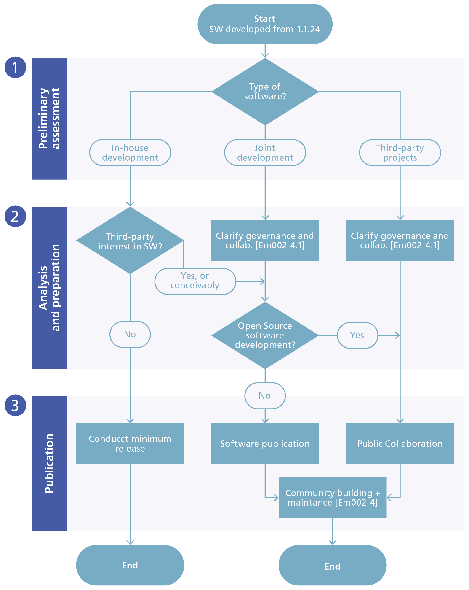
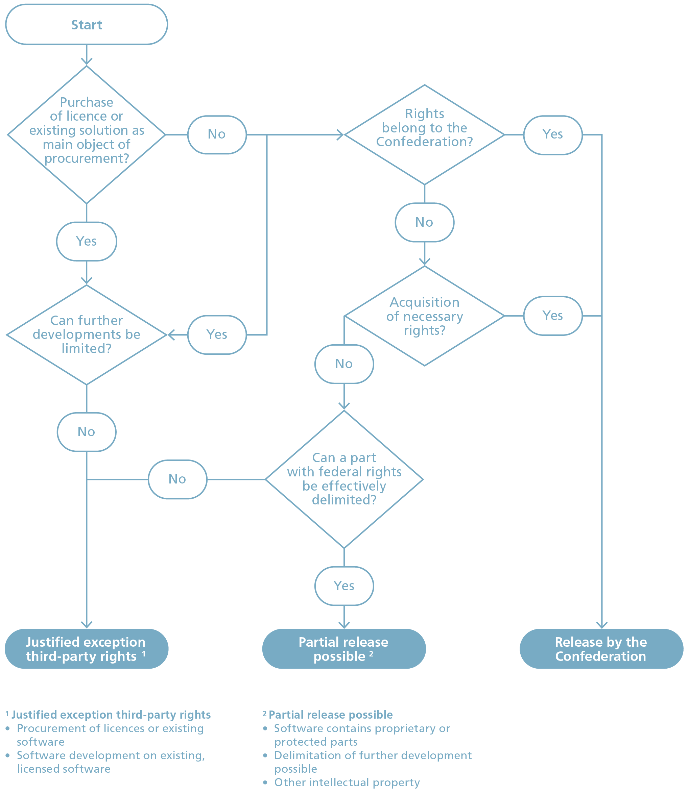
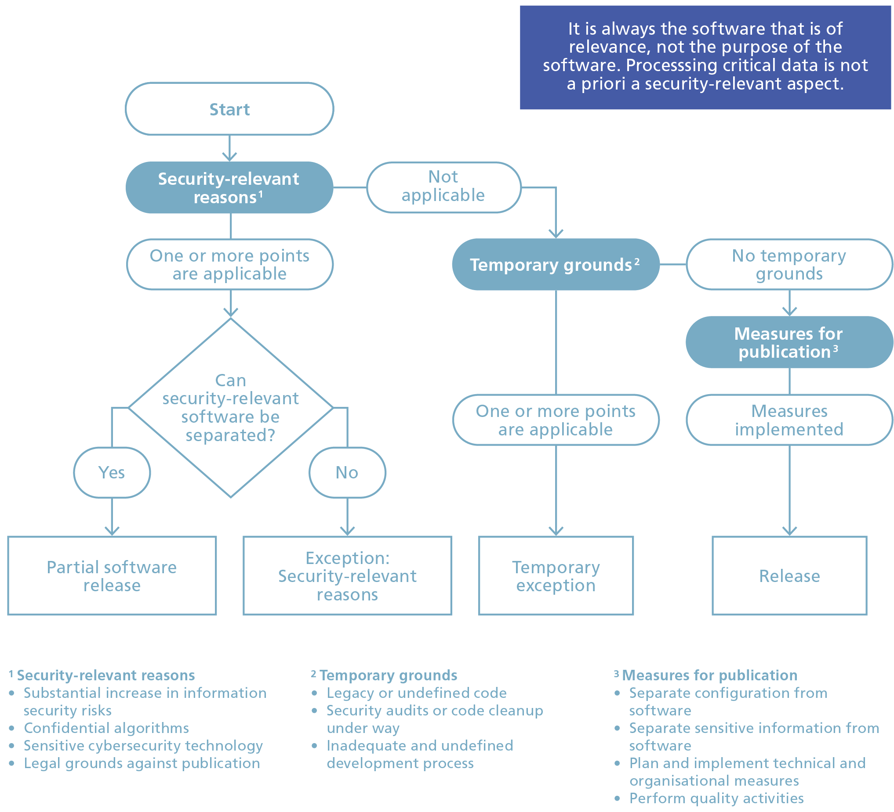

### ⚠️ **Disclaimer** 

This information is a **working version** and is provided solely for transparency and collaboration on GitHub.  
The **official and binding version** of the content is available on the website of the Swiss Federal Chancellery: [Guidelines for Open Source Software (OSS) – Federal Chancellery](https://www.bk.admin.ch/bk/de/home/digitale-transformation-ikt-lenkung/bundesarchitektur/open_source_software/hilfsmittel_oss.html).  

---

Recommendation for Federal Administration IT\[1\]

This document is a supplement to the main document Em002.

<table>
<tbody>
<tr class="odd">
<td>Classification:[2]</td>
<td>Not classified</td>
</tr>
<tr class="even">
<td>Binding nature:[3]</td>
<td>Recommendation</td>
</tr>
<tr class="odd">
<td>Planning area:[4]</td>
<td>ICT of the Federal Administration</td>
</tr>
<tr class="even">
<td>Current version:</td>
<td>1.0</td>
</tr>
<tr class="odd">
<td>Replaces version:</td>
<td>New document</td>
</tr>
<tr class="even">
<td>Status:</td>
<td>Draft</td>
</tr>
<tr class="odd">
<td>Release date 
(this version):</td>
<td>&lt;date&gt;</td>
</tr>
<tr class="even">
<td>Released by / 
Legal basis:</td>
<td>Released by the Delegate for Digital Transformation and ICT Steering (DTI Delegate), based on Article 17 paragraph 1 of the Ordinance of 25 November 2020 on the Coordination of the Digital Transformation and ICT Steering in the Federal Administration (DTIO; SR 172.010.58)</td>
</tr>
<tr class="odd">
<td>Languages:</td>
<td>English (original), German, French (translation)</td>
</tr>
<tr class="even">
<td>Licence</td>
<td>
CC0 1.0 Universal

By marking the work with a CC0 public domain dedication, the creator is giving up their copyright and allowing reusers to distribute, remix, adapt, and build upon the material in any medium or format, even for commercial purposes.
</td>
</tr>
</tbody>
</table>

Table of contents

1 Purpose 3

2 Overview 4

3 Preliminary clarification process 5

3.1 Release under EMOTA 5

3.2 Exception: Third-party rights 6

3.3 Exception: Security-relevant reasons 10

3.4 Clarification of publication 12

3.5 Minimising effort 13

3.6 Choice of publication language 13

4 Analysis and preparation 14

4.1 Source code analysis 14

4.2 Licence selection 15

4.3 Open source documentation 15

5 Publication and announcement 17

5.1 Choice of platform 17

5.2 Software publication 18

5.3 Communication 18

5.4 Community building and maintenance 19

Annex 20

A. Changes from previous version 20

B. References 20

C. Abbreviations 20

D. Accompanying documentation for the *Analysis and Preparation
Checklist* - Documentation 21

E. Accompanying documentation for the *Analysis and Preparation
Checklist* - Source code 23

F. Further sources and licence 26

# Purpose

These instructions describe the procedure for disclosing source code of
software that federal authorities develop or commission for the
fulfilment of their duties in accordance with Art. 9 EMOTA.\[5\]
Exceptions are made if third-party rights or security-relevant grounds
preclude or restrict such disclosure. Publication means that anyone may
use, further develop and distribute the software. No licence fees are
charged.

These instructions are intended for individuals responsible for and
implementing the publication of source code.

The subject matter is divided into three main parts:

  - The first part (Section 3) covers **preliminary clarifications** and
    exceptions according to EMOTA.

  - The second part (Section 4), **Analysis and preparation**, examines
    existing source code and prepares it as needed.  
    Furthermore, the choice of licence is made.

  - The third part (Section 5), **Publication and announcement**,
    describes the actual publication and further measures such as
    communication and building a suitable community.

**Three checklists** accompany and document the process.

Technical additions are listed in the annex.

# Overview

When releasing open source software, a distinction must be made between
**contributing source code and documentation to existing open source
software** and **publishing it as an independent open source project**.

The former typically involves bug fixes and feature enhancements.
Depending on the licence type and software deployment, the source code
must or can be released under the existing licence of the open source
project. A release agreement may have to be followed.

In the second case, starting a new open source project, governance and
licence can generally be freely chosen. The only consideration is the
licence under which any software elements integrated into the new
project are published. Further details on licence selection can be found
in the document *Em002-3 OSS Licensing Guidelines*. If value can be
generated for the Federal Administration from a community or if the
Federal Administration wants to create an ecosystem, *Em002-4.1 OSS
Community Checklist* should also be completed according to *Em002-4 OSS
Community Guidelines*.

The following diagram describes the instructions and different
characteristics.

Figure 1 - Decision tree for software release.

# Preliminary clarification process 

**Objective:** Understand the advantages and possible consequences of
publishing the software. Decide whether the software can be published
and if so, whether building an active community is worthwhile. NB:
*Em002-2.1 Preliminary Assessment Checklist \[Em002-2.1\]* should be
completed as early as possible in the project, as this can influence the
way the software is developed.

## Release under EMOTA

According to Art. 9 of the Federal Act of 17 March 2023 *\[EMOTA2023\]*
on the Use of Electronic Means to Carry Out Official Tasks (EMOTA), the
Federal Administration (specifically Art. 2 para. 1) must disclose the
source code of software that it develops or commissions for the
fulfilment of its duties. Exceptions apply when third-party rights or
security-relevant grounds preclude or restrict this.

For custom software created on behalf of the Confederation, the General
Terms and Conditions of the Confederation *\[FOBL-GTC\]* generally
apply. Under clause 25.1, these stipulate that ownership of source code
and documentation transfers to the service recipient (the
Confederation). If the software was jointly procured by multiple
organisations or other institutions, ownership usually lies with an
association established for this purpose.

The mere use of standard software is not covered by Art. 9 EMOTA, and
release would generally not be possible anyway, as the rights to
standard software often remain with the vendor (GTC Confederation for
Standard Software Procurement).\[6\] However, custom extensions to
standard software are certainly suitable for publication. Normally,
these are owned by the Confederation. Mere configuration adjustments are
less suitable for publication.

### Software in relation to EMOTA

The current ISO/IEC Standard 24765 contains three definitions for
software:

1.  a program or set of programs used to operate computers

2.  programs and their associated documentation

3.  programs and, where applicable, associated documentation and other
    data necessary for computer operation.

Based on this definition, smaller scripts, macros or Infrastructure as
Code (IaC) are also classified as software. EMOTA refers to source code
in Article 9 paragraph 1. Under this interpretation, publication
according to definition 1 would suffice.  
However, publishing without associated documentation is of little value,
as the software cannot be used according to definition 2.

To achieve synergies with third parties, definition 3 must be taken as a
basis. Regarding data, this specifically means master data and basic
configurations (for example, enumeration values and basic data that
should also be made available as open source).

Smaller projects, scripts or code examples may also be published
together in one repository if deemed appropriate by the federal
authority. In this case, these instructions and the corresponding
checklists can be completed once.

Proportionality and effort should be considered when deciding what to
publish and how.

### Type of software

As shown in Figure 1, a distinction is made between in-house
development, joint development and third-party projects. Each
constellation has different implications. Regardless of how the software
is developed, it falls under Art. 9 EMOTA.

With in-house development, the Confederation creates the software itself
or commissions it accordingly. It chooses the governance and retains the
rights to the source code.

In joint development, the Confederation creates the software with other
organisations. The governance and rights to the software must be
regulated through the chosen form of organisation.

If the Confederation contributes directly to third-party software, this
source code also falls under Art. 9 EMOTA. It must be ensured that this
is done in accordance with federal authorities' interests, that
participation meets the project requirements, and that the Federal
Administration adheres to the governance.

This is done using *Em002-2.1 Preliminary Assessment Checklist* and
*Em002-4.1 OSS Community Checklist.*

### Legacy code

For old software (**legacy software**), the retrospective effort for
publication is higher than if release was planned from the beginning.
For legacy software, it only makes sense to make this effort if a
potential user wants to use the software. Regardless, *Em002-2.1
Preliminary Assessment Checklist* should be completed to document
relevant decisions.

Applications which federal authorities began to develop on or after 1
January 2024 or which are being developed on behalf of the Confederation
based on a contract concluded after 1 January 2024 are not considered
legacy and in, any case, fall under the publication requirement
according to Art. 9 para. 1 EMOTA.

The publication requirement under EMOTA is not dependent on the benefit
to third parties.

### Libraries, plug-ins and add-ons

In some cases, the software may not be a standalone application but only
parts thereof. EMOTA and the ordinance do not further define source
code. The instructions also apply to decoupled libraries, plug-ins and
add-ons, and these fall under EMOTA.

**Tasks:**

  - Gather information from *Em002-5 EMOTA and OSS Factsheet*. This
    describes both general information about open source software and
    specific information about applying EMOTA.

  - Check whether the requirements under EMOTA are met.

  - Complete *Em002-2.1 Preliminary Assessment Checklist.* As a rule, it
    makes sense to directly involve the contact persons from the
    software supplier/developer.

  - If needed, complete *Em002-4.1 OSS Community Checklist*.

**Decision:** Does the software have to be published and how should this
be done?

## Exception: Third-party rights

Publication must be avoided if doing so would violate third-party
rights. If the software was developed by federal employees, the rights
belong to the employer.\[7\] In contracts for staff leasing and IT
services, the rights are usually transferred to the Confederation and
should be claimed.

If the software was or is being developed on the basis of the General
Terms and Conditions of the Swiss Confederation (as of 2024),\[8\] the
intellectual property rights belong to the client, unless contractually
agreed otherwise.

An application typically consists of numerous individual components and
parts. With some types, it becomes problematic if they themselves are
not open source or cannot be published under an open source licence as
part of the application.

**Libraries**

Depending on the programming language, libraries are either directly
compiled with the application, linked, or delivered as packages. They
form an integral part of the application.

If the application contains proprietary or licence-requiring libraries,
then open sourcing becomes more difficult. In principle, the source code
of the rest of the application can be published, but potential users or
developers would need to purchase the relevant library before the
application becomes usable or extensible.

If ownership of the problematic library lies with the application
supplier, it is worth seeking legal clarification as to whether the
Confederation has transferable rights to these libraries.

Where possible, proprietary and licence-requiring libraries should be
avoided with in-house developments or replaced if possible before
release. Considering the objective of Article 9 EMOTA, as much
functionality as possible used by public administrations should be
published. Therefore, individual libraries that prevent code publication
represent a technical debt that should be documented and, where
appropriate, eliminated when the opportunity arises.

**Databases and other data storage**

If the application uses proprietary, licence-requiring data storage such
as Microsoft SQL Server, this is not an obstacle to open source
publication.

However, it should be examined whether additional open databases such as
PostgreSQL can be supported. This can save operating costs and lower the
entry barriers for potential users.

**Application servers and operating systems**

If the application requires licensed operating systems or application
servers (e.g. Microsoft Windows Server or RedHat JBoss), this is not an
obstacle to open source publication.

We recommend asking the software vendor whether licensed third-party
libraries are used as components of the application and, if so, which
ones.

If the software was jointly procured by multiple organisations or other
institutions, ownership usually lies with an association or other legal
entity established for this purpose.

**Other intellectual property**

Third-party rights include not only copyrights but also other
intellectual property (trademarks, patents). Patents do not
fundamentally prevent software from being published as open source, but
they may prevent it from being used or enhanced. While patents are
rather uncommon in Switzerland, it is usually worth making a brief
enquiry to the software vendor about whether an examination has already
taken place.

**Acquisition of necessary rights**

To fulfil the legal requirements of EMOTA, the federal authority has the
option as the contracting authority to secure the rights to the work
results. This prerequisite for publication can be defined as an award
criterion during procurement. Acquiring necessary rights to the software
afterwards can become more complex.

If the federal authority does not want to publish the software itself,
it can delegate this task to the contractor, for example, or transfer
the publication rights accordingly. In this case, it will transfer the
necessary rights (and obligations) to the supplier and/or third parties
and commission them with publication. This means that the right is
effectively transferred to a third party under the condition of
release/support of the corresponding software.

**Procedure**

Figure 2 - Exception: Third-party rights

**Tasks:**

  - Check whether the organisation owns the relevant protective rights
    to the software.

  - Check whether the rights can be acquired.

  - If necessary, obtain written permission from the rights holders.

  - Verify that the application contains no proprietary or protected
    parts.

  - Check that there are no obstacles due to patent protection (as far
    as possible and reasonable).

  - Check whether release should be done by third parties (in
    anticipation of Section 0).

  - Check whether development should follow open source software
    development (using *Em002-4 OSS Community Guidelines*, see also
    Section 0 ).

**Decision:** Can the software be published without violating
third-party rights?

## Exception: Security-relevant reasons

Software that cannot be published on security-relevant grounds is exempt
from publication.

The actual data of software is not affected by source code publication.
This data is usually sensitive and is not published. However, it may be
that besides the content data, certain algorithms and procedures visible
in the source code should not become public (e.g. offensive cyber
capabilities, details of fraud detection). Security can relate to
confidentiality, integrity, availability or traceability.

**Recommendation:**

Software should be deliberately developed so that no additional risk
arises even when the source code is published. The assumption that
non-publication protects against successful attacks is deceptive
('security through obscurity').

**Procedure:**

Figure 3 - Exception: Security-relevant reasons

The following grounds can be considered security-relevant for each
project:

  - Publication of the software would substantially increase an
    information security risk.\[9\]

  - For fraud prevention algorithms and similar algorithms, publication
    may be waived where appropriate.

  - Particularly sensitive cybersecurity technologies.

  - Core software for operating critical infrastructure.

  - When publication would violate other legal foundations.

The following temporary grounds may still prevent publication. However,
publication will be enabled later through appropriate measures.

  - Legacy code could not yet be cleaned up and may contain
    security-relevant issues.

  - Security audits of the code have not yet been conducted.

  - The development process is not mature enough to enable secure
    publication. If the development process is not sufficiently
    established, it is possible that parts intended not for third
    parties might be published. For example, code commenting guidelines
    and test data generation must be adapted to the new publication
    scenario and function reliably.

Through the following measures, software can be published despite
security-relevant grounds:

  - Separate configurations (e.g. type of encryption used) from the
    software.

  - Outsource technically sensitive information (e.g. processes,
    calculations) that is not public into configurations or settings.

  - Plan, implement and regularly practise suitable organisational,
    personnel and technical measures.

  - Plan and carry out appropriate quality activities during
    publication. See the following section 'Analysis and preparation'.

**Tasks:**

  - Check the software for security-relevant grounds that would prevent
    publication.

  - Estimate effort required to resolve temporary grounds.

  - Plan measures to separate security-relevant information from the
    software's source code.

  - Ensure that the application contains no procedures that must not
    become public.

**Decision:**

Are there compelling security-relevant grounds that make publication
impossible?

## Clarification of publication

This step clarifies who will publish the software. If the software was
created by an external vendor, the publication can also be commissioned
to that vendor. In this step, it is important to determine where the
source code will be published and to establish appropriate governance
accordingly.

If the software was developed internally at the Confederation and the
Confederation cannot or does not wish to publish it itself, a
publication order can be placed with a supplier or the rights can be
assigned (transfer of obligations to a third party).

**Minimum release and support**

EMOTA does not specify any requirements regarding publication. A minimum
release of the source code fulfils the legal requirement. No further
activities are required. The question of whether and to what extent
support is offered and how actively the project is maintained can be
answered using *Em002-4 OSS Community Guidelines.*

**Open source software development (OSSD)**

With open source software development (OSSD), in addition to publishing
the source code, the entire development process is conducted publicly.
Everything from requirements (issues) to source code is transparent.
OSSD is supported by public communication tools (mailing lists, forums,
etc.), a version control system (git), bug and feature lists, roadmap
and developer tools. Through this transparent working method, the entire
community benefits and enables collaboration across organisational
boundaries. With this approach, no further publication activity is
necessary upon project completion, as this was already considered at the
project's start.

**Tasks**

  - Create a rough effort estimation for the analysis phase. Depending
    on the size and complexity of the application, the effort ranges
    between three days and two weeks.

  - Release resources for further steps, particularly for analysis.

  - Agree in principle to publish the application as open source.

**Decision:**

Basic agreement and feasibility for publishing the application as open
source is given.

## Minimising effort

The checklists and instructions are structured to minimise the effort
required for releases. Consistent advance planning of the release at
project start and development designed for release minimises effort.
Some administrative effort and costs will inevitably arise \[Le2023\].
These can potentially be recovered through communities with shared
development costs (see *Em002-4 OSS Community Guidelines)*.

## Choice of publication language

The choice of language must consider both the potential target audience
and the team's working methods. Fortunately, translations are much
easier with new tools. The official languages of the Confederation\[10\]
and English are possible options. If the project is internationally
relevant, English should be the target language. For subsequent
publication, it naturally makes little sense to change the language.

At minimum, the README.md should be available in multiple languages so
that interested parties can immediately see if the project is relevant
to them.

Public communication should primarily consider the target audience. It
should also be considered that this is public communication from the
Confederation.

**Note**: With publication, the Federal Administration enters a new
channel of public communication. If this is not done carefully and
professionally, the public image of the Confederation can quickly
suffer.

# Analysis and preparation 

**Objective:** The work required for open source publication is
completed.  
Decisions regarding licence and type of community have been made. This
is done using *Em002-2.2 Analysis and Preparation Checklist*.

## Source code analysis

The source code to be published and other related documents are analysed
prior to publication. This analysis ensures that no confidential
information is published.

If extensive source code is planned for publication, it is recommended
to use appropriate automated tools for the following activities. The
details are defined in Section E.

**Tasks**

  - Check how existing code quality and guidelines have been
    implemented  
    (e.g. ISO/IEC 25010:2023\[11\]).

  - Ensure that no sensitive (test) data is included, e.g. data based on
    real people or cases.

  - Update software documentation (see annex).

  - Delete unnecessary files or outdated documents and data.

  - Check source code for secrets/credentials.\[12\]

  - Conduct targeted security testing and subsequently establish a
    (public) bug bounty programme.\[13\]

  - Check all used libraries regarding licences and create corresponding
    lists (attributions).

  - Describe deployment (CI/CD pipeline) and possibly set up a demo
    instance.

These activities are independent of publication but are prerequisites
for good software quality and ensuring compliance. Observing these
measures simplifies collaboration, increases the quality of external
contributions, and enhances the image of the software or the authority.

## Licence selection 

**Refer to *Em002-3 OSS Licensing Guidelines*.**

Internationally established licence texts should be used where possible
and appropriate. Liability claims by licensees should be excluded to the
extent legally possible.

**Tasks**

  - Check any dependencies on existing licences.

  - For third-party code, check terms of use for compatibility with
    intended licence and replace code if necessary.

  - Select appropriate licence.

Tools such as Black Duck\[14\], FOSSA\[15\] or FOSSology\[16\] can be
used to check licence compatibilities. The ToDO Group\[17\] provides an
up-to-date overview of tools.

**Decision:**

  - Determine and document under which the licence the software will be
    published.

## Open source documentation 

A minimum set of documentation is expected with publication. Several
documents have become established in the open-source ecosystem. This
gives visitors a quick insight into the software including licensing.

The following documents are expected:

| Document                  | Description / Content:                                                                                                                                                                                                      |
| ------------------------- | --------------------------------------------------------------------------------------------------------------------------------------------------------------------------------------------------------------------------- |
| README(.md)               | Serves as an entry document and provides a quick overview of the project's purpose, scope, status, licence and target groups.                                                                                               |
| LICENSE                   | Description of the chosen licence in the project                                                                                                                                                                            |
| CONTRIBUTING(.md)         | Describes the process of how to contribute to the project.                                                                                                                                                                  |
| CODE\_OF\_CONDUCT(.md)    | The Code of Conduct establishes expected social norms within the project.                                                                                                                                                   |
| CHANGELOG(.md)            | Maintains a list of changes in software versions.                                                                                                                                                                           |
| THIRD-PARTY-LICENSES(.md) | Description of third-party licences or used components.                                                                                                                                                                     |
| Getting started           | Brief guide on how to install and use the software.                                                                                                                                                                         |
| Create Gitignore          | Describes documents that will not be published, e.g. configurations, test data or generated content. Protected and sensitive information should be managed outside the project in appropriate designated tools and storage. |

Table 1 - Open source documents

Further technical details of these documents are described in the annex.

**Tasks**

  - Create standard documentation.

  - Include copyright, licence notices, and disclaimer in all files.

  - Depending on the publication platform, additional descriptions can
    be made.

**Decision:**

  - Final decision to publish the application as open source.

# Publication and announcement 

**Objective:** The application is published as open source and easily
findable by third parties. All components are ready for publication and
the community is built or established. This is done using *Em002-2.3
Release and Publication Checklist*.  
To a certain extent, it involves recapitulating decisions already made.

## Choice of platform

There are several ways to publish source code. The following table
provides an overview of possible source code management (SCM) systems
and platforms.

The suitable platform must be selected prior to actual publication. Some
federal authorities are already represented on GitHub.\[18\] In this
case, it makes sense to use platforms already established.

**Recommendation:**

We currently recommend setting up an organisation on GitHub per federal
authority for publishing source code. Within this organisation,
corresponding projects (repositories) can be created and users with
appropriate permissions managed. In the future, a central federal
platform should be established. To maintain optimal user management and
preserve the reputation of the Swiss Confederation, it is important to
use fewer, but better-managed repositories.

<table>
<thead>
<tr class="header">
<th>Platform</th>
<th>Properties</th>
</tr>
</thead>
<tbody>
<tr class="odd">
<td>GitHub[19]</td>
<td>
Microsoft's online platform with wide distribution. A large amount of open source software is hosted on GitHub. Offers many additional tools besides SCM.

Available in both Free and Enterprise versions (subscription).
</td>
</tr>
<tr class="even">
<td>GitLab[20]</td>
<td>
Online platform from the company of the same name GitLab, which is itself published under an open source licence. Offers many additional tools besides SCM. Can also be operated locally, thus providing a degree of sovereignty.

Available in both Free and Enterprise versions (subscription).
</td>
</tr>
<tr class="odd">
<td>Bitbucket[21]</td>
<td>
Atlassian's online platform, specifically integrated into its ecosystem.

Available in both Free and Enterprise versions (subscription).
</td>
</tr>
<tr class="even">
<td>Internal SCM system</td>
<td>If own SCM platform is provided, it can also publish and make certain repo/projects available. Operation must be ensured.</td>
</tr>
<tr class="odd">
<td>Federal platform</td>
<td>There is currently no central federal platform for publishing software. A measure to this effect is proposed in <em>Em002 Strategic Guidelines for Open Source Software in the Federal Administration [Em002]</em>.</td>
</tr>
<tr class="even">
<td>Website, public FTP server, etc.</td>
<td>EMOTA does not define how software should be published. A minimum release according to Section 0 can also be done on a website or other publicly accessible resources. However, this is not suitable for sustainable collaboration in the sense of open source.</td>
</tr>
</tbody>
</table>

Table 2 - Platforms for publishing open source software

If the software is published jointly with an external partner or
organisation, care must be taken to ensure that appropriate permissions
and access to the source code are available.

**Tasks**

  - Evaluate suitable platform, including corresponding
    organisation/project.

  - If not yet clarified, determine project/repository naming.

  - Define and check permissions on the repo.

  - Ensure appropriate governance and any replication of source code.

**Decision:**

  - Platform for publication has been appropriately chosen.

## Software publication

When the prerequisites are clarified, the software can be published.

**Tasks**

  - Check prerequisites against the *Release and Publication Checklist*.

  - Access to platform is available and governance clarified.

  - Publication of source code and documentation by the developer.

## Communication

After actual publication, further communication activities can be
initiated by and within the federal authority concerned. These help with
distribution and bring the desired added value from publication.

**Tasks**

  - Description in repo hosting, security settings, etc.

  - Internal and, if applicable, external communication

  - Write a message to the community.

  - Make the application known within the organisation and in specialist
    committees, promote its use and contributions.

## Community building and maintenance

When publishing software, a community can develop that can contribute to
the software through contributions (pull requests), questions,
documentation suggestions, etc. To have an active community,
considerable effort is required for both building and continuous
maintenance. A well-functioning community minimises unwanted forks of
the software. The goal here is to activate the added value of the
community through targeted activities. Even with minimum publication,
handling feedback and questions about the software should be defined.

**Tasks**

  - Clarify who potential users or interested parties are.

  - Determine the appropriate form for the specific application using
    the *OSS Community Guidelines*.

  - Build the community.

  - Community building activities.

# Annex

## Changes from previous version

New document

## References

See *Em002 Strategic Guidelines for Open Source Software in the Federal
Administration*.

## Abbreviations

See *Em002 Strategic Guidelines for Open Source Software in the Federal
Administration* and *Em002-6 FAQ on OSS and Art. 9 EMOTA.*

## Accompanying documentation for the *Analysis and Preparation Checklist* - Documentation

1.  Source code documentation

The documentation should be part of the project's source code to ensure
that changes to the documentation are stored in a revision-secure manner
and the documentation is versioned alongside the project. This
automatically ensures that the documentation, if properly maintained,
does not diverge from the project's development status, and
documentation for older versions of the project can be retrieved at any
time.

Furthermore, this gives third parties the opportunity to easily
contribute changes to the documentation.

Markdown should be used as the markup language for the text formatting
as it is easy to write, widely used, and machine-readable. Additionally,
markdown documents are displayed in a well-readable target format by all
common platforms. Markdown documents can be rendered into any target
format independent of the platform used, using static site generators
such as Jekyll, MkDocs, Gatsby, or Sphinx, for example, with the
corporate identity specifications of an administration.

2.  Documentation recipients and structure

The project documentation should address both end users and technical
professionals, thus not focusing solely on technology. For language
selection, see Section 3.6. This supports the software's distribution.

A README.md file serves as the entry document. Files with this name are
recognised and displayed as the entry point to the documentation by all
common platforms.\[22\]

README.md should provide a quick overview of the project's purpose,
scope, status, licence and target groups. Specifically, README.md should
include the following points:

  - Software name

  - Brief description of the software's purpose and function. Scope and
    possible limitations

  - Installation guidelines

  - How to use the software

  - Reference to any demo instance

  - Support and contact details

  - How to contribute to open source software (Contributing)

  - Licence used (Licence)

<!-- end list -->

  - Project status / development status
    
    1.  Emphasising open source and licence storage

Directly after the mission statement, it should be clearly and
unambiguously stated that the project is open source software. The
licence used by the project should be specified with the corresponding
SPDX identifier\[23\] and linked to the specific licence text in the
LICENSE file. Licence templates typically include a variable part (e.g.
project name, copyright year, author's name) that must be adapted in the
LICENSE file.

Most platforms recognise licences in a LICENSE file and offer clear
information about the licence, e.g. a brief summary of the licence
terms.

It is recommended to add a minimum licence and copyright header to each
source file that is created. Existing headers in existing files should
not be changed. If contributing to a project that has clear standards
for headers, these should be followed.

For more details see: Producing Open Source Software: State That the
Project is Free.\[24\]

2.  Current development status

To quickly show the project's state, the current development status
should be documented in README.md. It is important for readers to know
whether the project is in a mature state or at the beginning of
development, whether it is actively maintained, and how frequently new
versions are published.

This section can describe what type of third-party support is currently
most important for the project. This could be, for example, a developer
with specific technological knowledge or someone to revise the project's
documentation.

For further details, see Producing Open Source Software: Development
Status.\[25\]

3.  Demo instance

For applications, it is recommended to provide a demo instance so that
the application can be tried without installation effort. Depending on
the type of application, the demo instance can be the productive
installation or a test stage. It is important that readers can access
the corresponding instance as independently and directly as possible.

As an alternative, many open source projects provide tools for easily
starting the application. This can be done using containers, portable
applications or install scripts, for example.

4.  Subject matter expert and project owner

The README.md file should name the primary subject matter expert so that
other interested administrations and organisations can make contact as
directly as possible.

Personal email addresses should not be used.

The README.md file should also briefly describe which organisation is
the project owner, especially if an association has been formed for the
project.

5.  Installation documentation

For applications, README.md should reference installation documentation
that describes hardware and software requirements, which infrastructure
components (for example, databases) are used, and how the application
can be installed and operated.

6.  Developer Guidelines

The entry point for the Developer Guidelines should be stored in a
markdown file CONTRIBUTING.md, which is linked in README.md. The
Developer Guidelines are part of the extended documentation for
developers who want to contribute to the project and primarily focus on
collaboration and communication within the project rather than on
technology.

The Developer Guidelines should include the following points and
reference the corresponding documents where appropriate:

  - A reference to the project's Code of Conduct. The Code of Conduct
    establishes expected social norms within the project.

  - It is recommended to choose or build upon the Contributor Covenant
    Code of Conduct licensed under CC-BY-4.0\[26\] as the Code of
    Conduct.\[27\]

  - A note that the project conducts code reviews in the form of GitHub
    pull requests, with a reference to the GitHub pull request
    documentation.

Finally, reference should be made to the Developer Documentation.

1.  Developer Documentation

While the Developer Guidelines describe the collaboration and social
norms of the project, the Developer Documentation focuses on the
technical aspects of participating in the development of the project. It
should describe at least the following points:

  - What technical dependencies the project has and which tools are
    necessary for project development.

  - What formal rules apply to the project's source code, for example
    regarding source code formatting.

  - How the project's source code is organised and how functions can be
    technically tested.

  - An architecture sketch with a rough description of the architecture,
    preferably including context demarcation and rough component
    view.\[28\]

  - For applications: How the application can be started for development
    or debugging purposes and what infrastructure components are
    necessary for this.

## Accompanying documentation for the *Analysis and Preparation Checklist* - Source code

1.  Source code history

A project's source code is usually stored in a source code management
(SCM) system such as GitHub. These systems store not only the current
state of the source code but also changes that have been made to the
source code over time. In particular, this includes deletions from the
source code, including deleted files.

In addition, the SCM contains meta-information about changes to the
source code, such as the author's name and email, or PGP signatures for
signed commits and tags.

2.  Sensitive, proprietary or confidential data

The source code and source code history of the project may contain
publicly available data, such as a postcode directory, randomly
generated data or synthetic data.

The source code and source code history must not contain any sensitive
or confidential (personal) data or information as defined by the Federal
Act on Data Protection (FADP) and the Information Security Act (ISA).
This includes, in particular:

  - User names and passwords or other secrets such as private keys,
    access tokens or certificates.

  - Internal DNS names, URLs, host names, IP addresses, network
    structures or drive names.

  - Names, addresses, pictures or similar personal data without the
    consent of the person concerned

  - Anonymised or pseudonymised data (because it is possible to undo
    anonymisation or pseudonymisation)

Even if the current state of the source code is free of sensitive,
proprietary or confidential data or information, such data or
information may still be retrieved from the SCM system history if it was
ever part of the source code or SCM meta-information in the past.
Cleaning up the current source code state will not completely remove
this information.

Therefore, if in doubt, it is recommended to completely remove the
source history after cleaning up the source code, before publishing the
source code.

The names and email addresses of the authors of the source code are
usually available directly in the source code or in the SCM metadata,
for example in GitHub commits or annotated GitHub tags. From a legal
point of view, this is not a problem, as the developer company is
responsible for regulating the publication of such information. However,
it is recommended that the developer company or internal federal
employees are made aware that the names and email addresses of the
source code authors may be disclosed when the software is published.

1.  Removing author information

The history on GitHub can be changed to hide author information.
Tools\[29\] can automate this step to a large extent.

Removing author information removes attribution, traceability, and
contact information. The effort involved should not be underestimated,
depending on the volume of source code. For these reasons, author
removal is not recommended.

2.  Consideration of library licences

Virtually every project uses third-party libraries (software libraries,
dependencies) to access commonly used functions without having to code
them. These libraries usually depend on other libraries, resulting in
multi-level dependencies (transitive dependencies). Depending on the
programming language, even small projects can have hundreds of
dependencies.

The results of this clarification must be considered when choosing a
licence in accordance with the *OSS Licensing Guidelines \[4\]* and in
the *Release and Publication Checklist \[8\]*.

For each of these dependencies, ensure that its licence is compatible
with the project licence. Dependencies that are not under an open source
licence or which have not declared a licence or use a viral licence that
does not match the project licence are particularly problematic. Some
libraries are licensed under more than one licence and allow the user to
choose one.

  - In all major programming languages, the dependencies of the project
    (including transitive dependencies) and the licences of the
    dependencies can be automatically listed. These include:

  - The Project Info Reports plugin for the Apache Maven package manager
    for Java projects, which uses the dependency report to generate an
    HTML output of all used libraries, including the declared
    licence.\[30\]

  - The NPM Licence Checker for the NPM Package Manager for JavaScript
    projects, which can output all libraries used, including the
    declared licence, in various formats, e.g. CSV.\[31\]

  - Pivotal's Licence Finder, which supports various package managers
    and programming languages, including Ruby Gems, Python Eggs and
    Godeps.\[32\]

**Use of libraries with proprietary licences**

Libraries under a proprietary licence are generally problematic in open
source projects and usually cannot be used, especially if the source
code has been published under a viral licence such as the AGPL.

Please contact the vendor and the legal department of the relevant
office to check whether and under what conditions the proprietary
library can be used in your project.

1.  Using package managers

Virtually all popular programming languages provide package managers for
managing their dependencies, such as Apache Maven for Java projects, NPM
for JavaScript projects or NuGet for .NET projects.

When using a package manager, the dependencies used by the project are
no longer directly part of the project's source code, for example by
copying the dependency's source code into the project or by copying the
dependencies into the project in binary form. Instead, the project
obtains all its dependencies via the package manager's declarations.

This allows all dependencies to be listed and referenced correctly. It
also prevents unintentional modification of dependency code. If changes
are necessary, they must be made directly at the source of the
dependency.

2.  Project licence declaration in the package manager descriptor

The project should declare its licence in the appropriate package
manager descriptor, using the SPDX identifier\[33\] so that the project
licence can be issued by the package manager. This is particularly
important for libraries so that users of the library can automatically
query their licence via the package manager.

3.  Attribution and copyright notices

Many libraries are subject to a licence that requires the library user
to give an original copyright notice or attribution.

These include the following licences (excerpt):

Apache 2.0, ASL 1.1 (Apache 1.1), BSD, BSD 3-Clause, Creative Commons
'Attribution' (CC BY), MIT, ISC

For others, see the list of OSI-accredited licences.\[34\]

In practice, this concerns almost all libraries used. As the number of
libraries used in small projects is already very high, a legally correct
copyright notice or the necessary attribution is only possible with a
great deal of effort.

It is therefore recommended to proceed as follows:

  - Make a list of the libraries used, using the Package Manager's
    mechanisms or tools such as the NPM Licence Checker or Pivotal's
    Licence Finder.

  - Prepare the list manually so that it contains the following
    information: official name of the library project, website of the
    library project, licence used for the library as SPDX identifier
    with a link to the licence text.

  - Place the list in the project's source code, e.g. in a
    THIRD-PARTY-LICENSES.md file.

  - For applications: Include a link pointing to THIRD-PARTY-LICENSES.md
    in an 'About' or 'About this application' dialogue.

  - The 'About' dialogue is widely used for this purpose, for example in
    Google Chrome (in the 'About Chrome' dialogue).

  - For Libraries: Refer to the THIRD-PARTY-LICENSES.md in the README.md
    .

  - As part of the code review process, ensure that changes to the
    libraries are added to THIRD-PARTY-LICENSES.md.

**Example Codeblock THIRD-PARTY-LICENSES.md**

<table>
<tbody>
<tr class="odd">
<td><blockquote>

This project uses open source software: 
 
* Spring Boot, <a href="http://projects.spring.io/spring-boot/">http://projects.spring.io/spring-boot/</a>licensed under [Apache-2.0](http://www.apache.org/licenses/LICENSE-2.0) 
* caniuse-db, <a href="https://github.com/Fyrd/caniuse">https://github.com/Fyrd/caniuse</a>licensed under [CC-BY-4.0](https://creativecommons.org/licenses/by/4.0/)

</blockquote></td>
</tr>
</tbody>
</table>

## Further sources and licence

The checklist, the accompanying documentation and related templates are
based in part on the following sources:

  - Google Open Source Docs by Google LLC, licensed under
    CC-BY-4.0\[35\]

  - Producing Open Source Software, How to run a Successful Free
    Software Project by [Karl Fogel](http://www.red-bean.com/kfogel)
    licensed under CC-BY-SA-4.0\[36\]

  - GitHub Healthy Contributions\[37\]

  - Standard for Public Code\[38\]

<!-- end list -->

1.  Recommendation for Federal Administration IT in accordance with
    \[P035\] *Section 4.6*

2.  For definitions of the INTERNAL and CONFIDENTIAL classifications,
    see the *Ordinance of 8 November 2023 on Information Security in the
    Federal Administration and Armed Forces (InfoSecO; SR 128.1)*

3.  See footnote 1

4.  Planning areas in accordance with the *Federal Administration IT
    Strategy 2020–2023 of 3 April 2020 (SB000)*

5.  Federal Act *\[EMOTA2023\]*

6.  
7.  Art. 332 CO in conjunction with. Art. 6 para. 2 FPA

8.  General Terms and Conditions of the Swiss Confederation, in
    particular Section 25.1 -
    <https://www.bkb.admin.ch/bkb/de/home/themen/agb.html#accordion_21321111141713247349255>

9.  Information Security Act, ISA. Art 6 Information security.
    [https://www.fedlex.admin.ch/eli/cc/2022/232/de\#art\_6](https://www.fedlex.admin.ch/eli/cc/2022/232/en#art_6)

10. [https://www.fedlex.admin.ch/eli/cc/1999/404/en](https://www.fedlex.admin.ch/eli/cc/1999/404/en#art_70)

11. ISO/IEC 25010:2023 - Systems and software Quality Requirements and
    Evaluation (SQuaRE) <https://www.iso.org/standard/78176.html>

12. <https://www.ncsc.admin.ch/ncsc/en/home/aktuell/im-fokus/2022/git.html>

13. <https://www.ncsc.admin.ch/ncsc/en/home/infos-fuer/infos-it-spezialisten/themen/bug-bounty-programme.html>

14. <https://www.blackducksoftware.com>

15. <https://www.fossa.com>

16. [https://www.fossology.org](https://www.fossology.org/)

17. <https://landscape.todogroup.org/>

18. The website <https://ossbenchmark.com> gives an overview of
    organisations and authorities that are active on GitHub.

19. https://github.com/about/

20. https://about.gitlab.com/

21. https://bitbucket.org/product/en

22. For more information on creating a readme file:
    <https://www.makeareadme.com/>

23. SPDX-Identifier - https://spdx.org/about

24. https://producingoss.com/en/getting-started.html\#state-freedom

25. https://producingoss.com/en/getting-started.html\#development-status

26. https://creativecommons.org/licenses/by/4.0/

27. https://www.contributor-covenant.org/version/1/4/code-of-conduct.html

28. Architecture framework MMB (Bund Modelling Method) or arc42.
    http://arc42.org/

29. https://www.adamdehaven.com/blog/update-commit-history-author-information-for-git-repository/

30. Plugin info
    <https://maven.apache.org/plugins/maven-project-info-reports-plugin/plugin-info.html>

31. NPM Licence Checker https://github.com/davglass/license-checker

32. Licence Finder from Pivotal
    <https://github.com/pivotal/LicenseFinder>

33. SPDX identifier - https://spdx.org/

34. Open source licences are licences that comply with the Open Source
    Definition – in brief, they allow software to be freely used,
    modified, and shared. https://opensource.org/licenses

35. Google Open Source Docs - <https://opensource.google.com/docs/>

36. Producing Open Source Software, How to run a Successful Free
    Software Project - <https://producingoss.com/>

37. [GitHub Healthy
    Contributions](https://docs.github.com/en/communities/setting-up-your-project-for-healthy-contributions)

38. Standard for Public Code - <https://standard.publiccode.net/>
