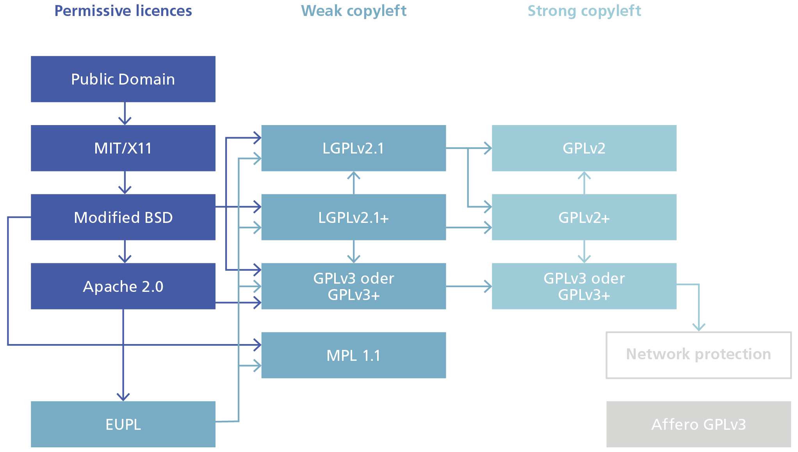

### ⚠️ **Disclaimer** 

This information is a **working version** and is provided solely for transparency and collaboration on GitHub.  
The **official and binding version** of the content is available on the website of the Swiss Federal Chancellery: [Guidelines for Open Source Software (OSS) – Federal Chancellery](https://www.bk.admin.ch/bk/de/home/digitale-transformation-ikt-lenkung/bundesarchitektur/open_source_software/hilfsmittel_oss.html).  

---

Recommendation for Federal Administration IT\[1\]

<table>
<tbody>
<tr class="odd">
<td>Classification:[2]</td>
<td>Not classified</td>
</tr>
<tr class="even">
<td>Binding nature:[3]</td>
<td>Recommendation</td>
</tr>
<tr class="odd">
<td>Planning area:[4]</td>
<td>ICT of the Federal Administration</td>
</tr>
<tr class="even">
<td>Current version:</td>
<td>1.0</td>
</tr>
<tr class="odd">
<td>Replaces version:</td>
<td>New document</td>
</tr>
<tr class="even">
<td>Status:</td>
<td>Draft</td>
</tr>
<tr class="odd">
<td>Release date 
(this version):</td>
<td>&lt;date&gt;</td>
</tr>
<tr class="even">
<td>Released by / 
Legal basis:</td>
<td>Released by the Delegate for Digital Transformation and ICT Steering (DTI Delegate), based on Article 17 paragraph 1 of the Ordinance of 25 November 2020 on the Coordination of the Digital Transformation and ICT Steering in the Federal Administration (DTIO; SR 172.010.58)</td>
</tr>
<tr class="odd">
<td>Languages:</td>
<td>German (original), French, Italian, English (translation)</td>
</tr>
<tr class="even">
<td>Licence</td>
<td>
CC0 1.0 Universal

By marking the work with a CC0 public domain dedication, the creator is giving up their copyright and allowing reusers to distribute, remix, adapt, and build upon the material in any medium or format, even for commercial purposes.
</td>
</tr>
</tbody>
</table>

Table of contents

1 Introduction 3

2 Copyright and licences: Fundamentals 3

3 OSS licences 5

3.1 Fundamentals 5

3.2 Open source licences 5

3.3 Copyleft 5

3.3.1 General 5

3.3.2 Open source licences with strong copyleft 6

3.3.3 Open source licences with weak copyleft 6

3.3.4 Permissive open source licences 7

3.4 Compatibility of open source licences 7

4 Licences for pure usage 9

5 Licence for own projects or creation and for contributions 10

6 Use cases and suitable licences 11

7 Special legal topics 14

7.1 International aspects 14

7.2 Exclusion of liability and warranty 14

7.3 Copyleft and licensing between Federal Administration bodies 14

7.4 Licensing of patents 15

7.5 Dual licensing 15

7.6 Subsequent change of licences 15

7.7 Naming of contributors (employees and third parties) 16

7.8 Contributor Licence Agreements (CLA) 16

7.9 Problems with (L) GPL-3.0 and IoT 7.4.4 17

7.10 Legal status of documentation 17

8 Further information on legal issues 19

Annex 21

A. Changes from previous version 21

B. References 21

C. Abbreviations 21

D. Examples of releases and their licence 22

# Introduction

Article 9 of the Federal Act of 17 March 2023\[5\] on the Use of
Electronic Means to Carry Out Official Tasks (EMOTA) stipulates that the
federal authorities must license software that they develop or
commission as open source software.

This document has the following objectives:

  - Introduction to the topics of software copyright and OSS licences.

  - A presentation of which OSS licences are unproblematic for use in
    the Federal Administration. Licences not mentioned in this document
    and software under such licences may not be used without an
    additional review of the contractual provisions by the responsible
    legal service.

  - Assistance in selecting a licence for the development or procurement
    of a project under Art. 9 EMOTA.

# Copyright and licences: Fundamentals

Copyright law establishes both moral rights and economic rights
(exploitation rights). The moral rights include, for example, the right
to recognise authorship or the right to determine whether and when the
work is published. Exploitation rights include, for example, the right
to make or distribute copies of the work.

The Federal Act of 9 October 1992\[6\] on Copyright and Neighbouring
Rights (CopA) provides for a number of other moral rights and
exploitation rights (see Art. 8 ff. CopA). These rights accrue directly
to the author at the same time as the work is created.

Art. 2 CopA sets out the conditions under which copyright protection is
granted. A protected work within the meaning of the law only exists if
these requirements are met.

The prerequisites are:

  - The work must have been created; simply finding the work is not
    sufficient. Research data, for example, i.e. the results of
    experiments, cannot be classified as works.

  - The creation must be 'intellectual', i.e. originate from a human
    being.

  - The work must have been realised in a perceptible manner. The mere
    idea behind a work is not protected, only its external form, e.g. a
    printout of a text on paper or a performance of a piece of music.

  - Individuality: Finally, the work must have a certain minimum degree
    of individuality. A work that everyone would design in the same way
    is not protected.

A wide variety of works can be protected, such as literary or scientific
texts, musical works, photographic, cinematographic and other visual or
audiovisual works.

According to Art. 2 para. 3 CopA, computer programs are also works if
the aforementioned requirements are met.

The author alone is entitled to the copyrights upon their creation. Only
the author can prohibit someone else from carrying out the corresponding
actions. However, the author can exercise their rights not only
themselves:

  - They may transfer their rights to third parties (e.g. by selling
    them). The new rights holder can then assert these rights in the
    same way as if they were the author.

  - Alternatively, the author may also license their rights to third
    parties. Simply put, a licence is a contract under which the rights
    holder allows a third party to use the work. The author retains the
    rights, but waives their enforcement vis-à-vis the licensee.

If a computer program is created as part of an employment relationship,
the employer alone is entitled to exercise the exclusive rights of use
(Art. 17 CopA). Employees are thus essentially left with only the moral
rights to the software (or, depending on the legal opinion, only a core
part thereof). This is the same legal situation as under the Federal
Personnel Act.

# OSS licences

## Fundamentals

OSS is essentially characterised by the following features (based on a
definition of the Open Source Initiative (OSI\[7\]):

  - Unlimited and free redistribution of the software is permitted;

  - The software is available in source code form;

  - Modifications to the software and their redistribution under the
    same licence are generally permitted;

  - No individuals or groups of people may be excluded from using the
    software, and no areas of application may be excluded (especially
    not commercial use); and

  - the distribution of the software together with other software (such
    as closed source software) must not be restricted.

The most common motives for using OSS are initially the cost savings
through the use of the already substantial pool of freely usable
software. Companies that frequently use OSS are often able to save
considerable portions of their IT budget through OSS. Freely available
code can also be easily adapted to one's own needs. Choosing OSS also
avoids vendor lock-in.\[8\]

## Open source licences

Open source licences are, first and foremost, normal licence agreements
for computer programs.

In contrast to normal licence agreements, however, OSS licence
agreements come into effect without further ado when only one of the
free forms of use described in the licence is exercised (for example, by
copying, redistributing or modifying software).

## Copyleft

### General

An open source licence according to the OSI may contain a 'copyleft'
provision. Changes to software licensed accordingly must be offered
again under the same conditions as those that existed for the original
software. Anyone who makes such changes must, when distributing the open
source software in the form of machine-readable object code, also offer
the source code to recipients.

Expressed as defined by the Free Software Foundation, the copyleft
effect protects developers' freedom and thus ensures that once free
software always remains free.

With copyleft licences, a kind of exchange takes place between the
community and the companies using it. The users, who are obliged to put
their own developments back under the respective licence in return for
the benefits from the existing software pool, thus contribute to the
further development of the software pool. As a result, both sides stand
to benefit.

The copyleft provision has a certain 'contagion effect': if
copyleft-licensed software is integrated into previously proprietary
software, the originally proprietary software must be disclosed under a
compatible open source licence.

Accordingly, when using copyleft-licensed source code, care must be
taken to integrate it only where the resulting software can and should
be published under an open source licence.

If an open source licence does not contain a copyleft provision
(permissive open source licence), the licence for revised versions of
the code can be freely chosen. In particular, it is also possible to put
modifications back under a proprietary software licence and integrate
the corresponding source code into proprietary software.

Essentially, open source licences can be divided into **the following
categories**:

> 1\. open source licences with **strong copyleft**;
> 
> 2\. open source licences with **weak copyleft**; and
> 
> 3\. **permissive** or **non-copyleft** open source licences.

### Open source licences with strong copyleft 

When using an open source licence with strong copyleft, new versions
derived from the original software, if passed on to third parties, must
be placed under the conditions of the original licence and made
available to these third parties as source code.

The following two licences are considered the relevant open source
licences with strong copyleft in the market:

• GNU General Public Licence (GPL); a large proportion of OSS is
licensed under this today

• GNU Affero General Public Licence (AGPL)

The main difference between GPL and AGPL relates to the type of use that
triggers copyleft. With GPL software, the modified source code only
needs to be offered if the new software version is offered to third
parties as an executable program (e.g. as a mobile app). If the software
is only made available via the internet (from one's own cloud from one's
own servers), for example in the form of Software as a Service' (SaaS)
or an application programming interface (API), this does not trigger
copyleft.

If the software is under the AGPL, the modified source code must also be
supplied when the functionality of the software is offered via a website
or programming interface. The AGPL is thus even stricter than the GPL.

With strong copyleft licences, copyleft affects not only the respective
software module (library) but the entire software program into which a
copyleft-licensed software module may be embedded. The aforementioned
'contagion effect' thus takes hold.

### Open source licences with weak copyleft 

Licences with weak copyleft also require that changes to their source
code be released to third-party recipients under the original open
source licence.

In contrast to licences with strong copyleft, however, they do not have
the effect of 'infecting' other delimitable software components (other
libraries or the main program itself) with their licence. This allows
the integration of open source software with weak copyleft into
proprietary software or into software with other OSS licences without
having to be released under the original licence.

These are the most commonly used open source licences with weak
copyleft:

• GNU Lesser General Public Licence (LGPL)

• Mozilla Public Licence 2.0 (MPL)

• Common Development and Distribution Licence (CDDL)

• Eclipse Public Licence (EPL)

• Microsoft Reciprocal Licence (Ms-RL)

• European Union Public Licence (EUPL)\[9\]

### Permissive open source licences

Licences without copyleft effect are characterised by the fact that they
do not impose any requirements on the licensee regarding the licensing
of their derived software, and therefore neither their new source code
nor changes to the open source software need to be disclosed to
third-party recipients. This enables the development of proprietary
software products through the integration of software under permissive
open source licences.

Examples of permissive licences are:

  - MIT Licence

  - Apache Licence 2.0

  - Berkeley Software Distribution (BSD) Licence (BSD 2-Clause and BSD
    3-Clause)

  - Microsoft Public Licence (Ms-PL)

## Compatibility of open source licences 

Programs usually consist of a variety of software components and modules
that can be connected to each other in different ways. In software
development, existing open source components are often integrated into
proprietary, internal applications and solutions. As soon as these
become accessible from outside via a website, APIs, software
distribution or by another means, attention must be paid to the
compatibility of the respective open source licences, because then
copyleft can take effect.

If derivative works that are under a certain licence may only be
distributed under the same licence conditions, this has the consequence
that other open source licences with other or contradictory licence
obligations for derivative works cannot be used.

Some open source licences contain so-called opening clauses, which allow
the use of code licensed under them in projects that are under other
licences. For example, the LGPL, Version 2.1, also allows the use of the
code under the GPL. The GPLv3 contains, among other things, a
compatibility clause for the AGPL and the Apache License 2.0. The EUPL
is designed very openly and contains a long list of compatible licences
in the annex, especially those with weak copyleft, such as the LGPL.
This has the consequence that the strong copyleft protection actually
specified in the licence is indirectly weakened.

The following diagram depicts the dependencies of the most important
open source licences (Goldstein 2018). The representation is based on
the visualisation by David A. Wheeler, who analysed the compatibilities
of the various licences and their version numbers (Wheeler 2007) and has
been further developed together with information from
<https://www.gnu.org/licenses/license-list.en.html>.

The diagram should be read as follows: code according to a licence
listed earlier in the chain can be incorporated into software that is
published under a licence listed later in the chain. For example, code
licensed under the modified BSD can be placed under an LGPL or GPL
licence variant, but not vice versa. Public domain means that the work
is not subject to any copyright restrictions.

# Licences for pure usage

This section deals with the situation where software under an OSS
licence is to be used, but this software should not be modified, or
modifications are only to be used internally.

The following licences are generally unproblematic when software is used
by federal authorities. However, the corresponding conditions, notably
copyleft where applicable, must be adhered to.

Under certain circumstances, the licence of a pre-existing software
module determines the possible licences for the overall product (see
Section 2.4 and Section 5).

Some licences are incompatible in combination (see Figure 1).

| **Licence**                              | **Copyleft** | **Special features**                                                                                                                                                                                                                                                        |
| ---------------------------------------- | ------------ | --------------------------------------------------------------------------------------------------------------------------------------------------------------------------------------------------------------------------------------------------------------------------- |
| **MIT**                                  | No           | \-                                                                                                                                                                                                                                                                          |
| **Apache 2.0**                           | No           | Use of licensors' trademarks excluded, except for describing the work.                                                                                                                                                                                                      |
| **GPL v3**                               | Yes          | Copyleft also applies when GPL-licensed parts are incorporated into an entire program. Prohibition of digital rights management. Special compatibility rules                                                                                                                |
| **LGPLv3**                               | Weak         | In contrast to GPL, LGPL allows closed (i.e. proprietary) code to be combined with LGPL code under certain conditions. Examples include standard libraries such as glibc. LGPL allows the program, as part of which the library is distributed, to be placed under the GPL. |
| **Affero GPLv3**                         | Yes          | SaaS use also triggers copyleft. Otherwise analogous to GPLv3                                                                                                                                                                                                               |
| **BSD-3**                                | No           | Names of authors may not be used to promote derivative works (advertising clause)                                                                                                                                                                                           |
| **European Union Public License (EUPL)** | Weak         | Licence considering European law. Release under certain compatible licences explicitly allowed.                                                                                                                                                                             |

Table : Unproblematic licences for federal authorities (according to
\[Sc2024\], bold=unproblematic)

Other licences may be used. In these cases, it may be necessary to
consult the legal department of the respective office.

# Licence for own projects or creation and for contributions

This section concerns the following cases:

  - Further development / contribution
    
      - where federal authorities further develop existing software; or
    
      - develop new software, but rely on existing OSS software
        libraries; and
    
      - make the corresponding software available to third parties.
        Third parties also include organisations of the decentralised
        Federal Administration, provided they have their own legal
        personality. If the further developments are only used
        internally and not made available to third parties, only No 4
        applies.

  - Own projects / creation / publication  
    This section concerns cases in which the federal authorities develop
    new software. This is likely to be rare, as most developments rely
    on existing open source software libraries.  
    For completely new developments, a licence type should be chosen
    that enables a broad and sustainable basis for further developments.
    For this, it is important that the licence in question should be
    widely accepted in the relevant developer community.

The compatibility check is carried out according to *Em002-2
Instructions for Publishing OSS,* Section 7.4. The compatibility of the
licences is shown in Figure 1

The following dimensions should be considered:

  - Use case

  - Desired checking (*Em002-2.1 Preliminary Assessment Checklist)*

  - Ease of building a community *(Em002-4 OSS Community Guidelines)*

  - Ease of application

  - Legal certainty

  - Distribution

Licences according to Section 4 are preferred.

The following **copyleft licences** should be used as a priority by
federal authorities, especially if sustainable open development is
sought and the copyleft effect of inheritance should apply. This ensures
that software paid for by the public and all derivatives thereof remain
open.  
Recommended licences in descending order:

  - **AGPL v3**

  - GPL v3

  - LGPL 3.0

  - European Public Licence (EUPL)

The following licences should be used by federal authorities when **no
copyleft is desired** or required (in descending order):

  - **Apache Licence 2.0**

  - BSD v3

  - MIT

When collaborating on existing projects, the following licences can also
be used without problems:

  - Mozilla Public Licence

  - Microsoft Public Licence

If another licence is to be used, it is recommended to briefly justify
this in *Em002-2.3 Release and Publication Checklist*.

According to Art. 9 para. 4, internationally established licences should
be used in all cases.

Additional tools for checking licence compatibilities include:

  - Black Duck (www.blackducksoftware.com),

  - FOSSA ([www.fossa.com](http://www.fossa.com)),

  - the Open Source Licence Comparison Grid
    (<https://www.cmu.edu/cttec/forms/opensourcelicensegridv1.pdf>)

  - FOSSology (<https://www.fossology.org>).

# Use cases and suitable licences

The following table shows various use cases for open source software and
the suitable licences for each.

<table>
<thead>
<tr class="header">
<th><strong>Use case</strong></th>
<th><strong>Licence(s)</strong></th>
<th><strong>Justification</strong></th>
</tr>
</thead>
<tbody>
<tr class="odd">
<td>Use and contribute to existing project</td>
<td><strong>Licence as specified by the project</strong></td>
<td>Necessary for legal reasons.</td>
</tr>
<tr class="even">
<td>Licence is forced by the use of existing parts (licences with copyleft)</td>
<td><strong>Use licence compatible with the parts.</strong></td>
<td>Necessary for legal reasons.</td>
</tr>
<tr class="odd">
<td>Existing ecosystem with preferred licence (e.g. it is a plugin for software released under MIT licence. Then using an MIT licence would be most purposeful, as all other users expect this and the software integrates into the ecosystem)</td>
<td><strong>Use licence if it is on the list, otherwise use the same licence as much as possible</strong></td>
<td>Acceptance in the community is central.</td>
</tr>
<tr class="even">
<td>Goal is the widest possible distribution, e.g. for a reference implementation[10] (e.g. for, which should also flow into commercial solutions).</td>
<td>
BSD v3

MIT

Apache Licence 2.0

LGPL v3
</td>
<td>In this case, no copyleft should be used.</td>
</tr>
<tr class="odd">
<td>Modifications to the code should flow back to the federal authorities</td>
<td>
<strong>AGPL v.3</strong>

GPL v.3

EUPL
</td>
<td>AGPL also enforces release by third parties when used in the cloud, GPL and EUPL do not.</td>
</tr>
<tr class="even">
<td>SaaS solutions should not be exempt from the backflow of code changes</td>
<td><strong>AGPL v.3</strong></td>
<td>AGPL also enforces release by third parties when used in the cloud.</td>
</tr>
<tr class="odd">
<td>Easy collaboration with the community is important.</td>
<td>
<strong>GNU GPL v3</strong>

Apache Licence 2.0
</td>
<td>
GPL preferred to keep the software free.

Apache contains rules for community governance, additional rules for contributions (you may not specify a licence other than Apache; the contribution as such is not regulated in more detail, so if a CLA exists, that should take precedence), a patent licence, rules for patent licensing. Especially also that anyone who asserts patents against another contributor loses their patent licence under the Apache licence. The rules that the Apache Foundation sets for contributions are decisive. Apache therefore makes sense if the project governance is to be built primarily according to Apache.
</td>
</tr>
<tr class="even">
<td>Small, universally usable component (library) or small piece of software where sustainability or maintenance by a community is not important</td>
<td>
<strong>Apache Licence 2.0</strong>

<strong>BSD v3</strong>

<strong>MIT</strong>

LGPL v3
</td>
<td>
LGPL stipulates a copyleft only for the component itself, but not for the entire project into which the component is inserted.

The other licences are permissive.
</td>
</tr>
<tr class="odd">
<td>It must be simply and permissive; control is not important</td>
<td>
<strong>Apache Licence 2.0</strong>

<strong>BSD v3</strong>

<strong>MIT</strong>
</td>
<td>Maximally permissive</td>
</tr>
<tr class="even">
<td>It is important for the federal authorities what happens to the code and they want to receive as many improvements as possible</td>
<td><strong>GNU GPLv3</strong></td>
<td>Copyleft</td>
</tr>
<tr class="odd">
<td>It should be prevented that the software becomes proprietary and is positioned as a competitive product on the market</td>
<td><strong>GNU GPLv3</strong></td>
<td>Copyleft</td>
</tr>
<tr class="even">
<td>It should be prevented that the federal authorities become dependent on individual suppliers ('supplier lock-in')</td>
<td><strong>GNU GPLv3</strong></td>
<td>The copyleft prevents a supplier from gaining a unique position over time by using the Confederation's software in a proprietary product, which could again lead to a dependency for the Confederation on this supplier.</td>
</tr>
</tbody>
</table>

Table : Licence to be used depending on use case for the release of new
software according to Art. 9 EMOTA (bold=preferred for use)

Figure 2: Decision tree for licence selection within the Federal
Administration

One last point can also influence the decision: changing from a more
restrictive licence to a less restrictive one is easier afterwards. In
the opposite case, a fork\[11\] is almost unavoidable.

# Special legal topics

## International aspects

The essential legal issues of OSS in practice are mainly of a licence
contract nature.

Regarding licence law issues, the law chosen by the parties applies
first (for example, the Mozilla Public License MPL contains a choice of
law for the defendant's law in Section 8).

If there is no choice of law, which is the case with all other licences
presented here, the law of the licensor's state generally applies. So
when federal authorities license software from foreign licensors, the
law of the respective country applies. If multiple contributors are
involved, this can lead to complex situations. Conversely, Swiss law
applies in the event of any disputes between foreign licence holders and
the federal authorities as licensor.

The question of which aspects are contractual in nature and which are
copyright in nature cannot be answered generally and may be quite
complex in individual cases. The transferability of copyright or parts
of copyright, or the scope of permissible rights granted, for example,
belongs to copyright law. Here, the law of the respective country of
protection must be applied. A deviating choice of law is not possible
(for the entirety, see Jaeger/Metzger, 449 ff.).

## Exclusion of liability and warranty

Open source licences regularly exclude any warranty and liability to the
extent legally permissible. In practice, there are rarely any liability
or warranty issues; the risks involved are therefore low.

It can be assumed that with correct licensing, the liability exclusion
clauses present in all licences discussed here will take effect, so that
only liability for gross negligence and intent, possibly personal
injury, remains.

Rules of general terms and conditions may be reserved, e.g. as in
Germany; however, insofar as the federal authorities are the subject of
liability as a licensor, Swiss law applies (see 7.1 above), which
permits the aforementioned exclusions of liability and warranty in B2B
transactions.

Conversely, however, this also means that in the event of program
errors, claiming against the authors of included OSS code is usually
difficult.

The usual procedure when using OSS is therefore regularly to protect
against errors through the usual IT security measures and to ensure the
correction of errors through maintenance contracts. There is no recourse
to OSS contributors.

## Copyleft and licensing between Federal Administration bodies

Copyleft applies when passing between different legal entities (for
example, within a group or between agencies of the decentralised Federal
Administration with their own legal personality).

Copyleft does not apply when passing between agencies of the same legal
entity (for example, within the central Federal Administration).

## Licensing of patents

Software patents are only possible within narrow limits according to
European legal opinion. The decisive factor is that the software makes a
technical contribution, i.e. solves a concrete technical problem outside
the computer on which it runs. Examples would be engine control in cars
or the control of a robot. Software as such that only runs on a computer
but has no such external effect is generally not patentable in Europe.
Thus most software programs do not fall within the scope of patent law.

In other parts of the world, particularly the USA, software patents are
granted somewhat more liberally. However, even in the USA, an abstract
idea or business model does not become a patentable invention simply by
being implemented in computer software.

With some licences, any patents of the licensor are not co-licensed.
These are the GPL2, the BSD licences, and the MIT licence.

For projects that could also be used outside Europe, or which exhibit
the aforementioned form of external impact, it is advisable to clarify
the patent law aspects on a case-by-case basis.

## Dual licensing

The author can licence software under different licences simultaneously.
This is called dual licensing.

An interesting form of dual licensing is where the copyright holder
licenses the software as OSS with a strong copyleft (which prevents it
from being integrated into proprietary software) and also offers
interested licensees a *paid* licence that allows them to integrate the
software into their proprietary software.

Because interested licensees can thus avoid releasing their proprietary
software as OSS, they are willing to pay for the licence. See also the
annex to *Em002-1 Practical Guidelines for Open Source Software in the
Federal Administration.*

For the federal authorities themselves, dual licensing is likely to be
uninteresting in most cases. As long as the copyrights lie with the
federal authorities (which is regulated, for example, according to the
Federal Administration's general terms and conditions), the federal
authorities alone can decide on any dual licensing.

If maintenance and (further) development are outsourced to third
parties, this may be different. If the rights exceptionally lie with
them, and if the federal authorities have only reserved the right to
grant an OSS licence with copyleft, the third party might be tempted to
perform dual licensing. If this is to be prevented, it should be
contractually excluded.

## Subsequent change of licences

First, it should be noted that OSS licences are generally unchangeable
and irrevocable. Licensees who concluded the licence agreement *before*
any change can continue to use, modify, and pass on the code to third
parties based on the old licence.

In practice, changing licences often leads to a fork of a new version of
the software under the old licence, which is further developed
independently by the previous licensees.

The introduction of a new licence for software is only possible if all
copyright holders of the software agree. Changes have occurred in
practice, for example, when switching from a permissive to a copyleft
licence.

## Naming of contributors (employees and third parties)

If a computer program is created in an employment relationship, the
employer receives an exclusive licence for its use (Art. 17 CopA).
Employees are thus essentially left with only the moral rights to the
software (or, depending on the legal opinion, only a core part thereof).
The same applies to third parties who develop software for the federal
authorities, provided that the corresponding GTC\[12\] of the
Confederation apply, which transfer the resulting rights to the federal
authorities.

Nevertheless, the question arises as to whether contributors (employees,
third parties) should have the right or obligation to identify
themselves as authors of contributions in open source repositories.

One argument for the federal authorities to use OSS is to offer
attractive employment: OSS offers contributors the opportunity to
publicly demonstrate their knowledge and thus build a reputation. Their
abilities become verifiable, are attested by peers, and those who have
gained influence in an OSS project can use this as leverage in job
searching.

Another argument could be the moral rights, the core of which cannot be
taken away from the original author either by contract or by law.
However, this core area is small for computer programs; demanding that
the developer of a computer program should also have a right to be named
would probably be going too far.

In addition, an exchange between experts in the community presupposes
that they can be approached individually by others.

Depending on the project, it may therefore make sense to give
contributors the opportunity to identify themselves as contributors in
the community.

From a data protection point of view, compulsion to do so should be
avoided, although exchange in the community does not presuppose
disclosure of names – pseudonyms are the rule rather than the exception.
If contributors do not wish to disclose their names, they should
therefore be given the opportunity to appear under a pseudonym.

In any case, efforts should be made to ensure that the federal
authorities appear as the rights holder.

## Contributor Licence Agreements (CLA)

When multiple authors work on the code of an open source project, they
receive joint rights to the resulting code. The licensing of the code to
third parties is done via the OSS licence, whereby a separate licence
agreement is created between each user and each author (bundle of
licences). This constellation can lead to a confusing legal situation,
for example in international relations (see 7.1 above). When companies
decide to put their software under an OSS licence and accept
contributions from third parties, they also often have the need to
retain some control over the code. For example, it may be interesting to
keep open the possibility of putting the project under a new licence, or
one might want to subject code licensed under copyleft to dual licensing
and for this purpose needs more rights than one would get from one's
contributors via a simple OSS licence (see 7.5 above).

Contributor Licence Agreements (sometimes also Copyright Transfer
Agreements) are intended to solve such problems. The main instrument of
CLAs is either the assignment of copyrights from the contributors to the
main developer or the supporting organisation (in the case of Copyright
Transfer Agreements), or the granting of the most extensive, usually
irrevocable licence possible by the contributors to the main developer.
CLAs are ubiquitous in the OSS world. Most larger OSS projects are made
under the rules of a CLA.

CLAs are partly controversial in the OSS community because they can open
gaps in copyleft. Therefore, there are now also CLAs that restrict the
main developer in terms of granting a new licence for the project's
code.

If the federal authorities develop new software on their own, they
should conclude such a CLA with all contributors to maintain their
flexibility as much as possible and to be able to easily pursue any
legal violations. The requirements of the CLA are to be clarified on a
case-by-case basis; templates are available, for example from
Apache.\[13\]

If the federal authorities participate through contributions to
third-party software, the legal department must examine on a
case-by-case basis whether the federal authorities can accept the
existing CLA.

When entering into existing CLAs, particular attention should be paid to
the following points:

  - According to Art. 17 CopA, the federal authority is the holder of
    the usage rights to software created by its own employees. For
    third-party developers, it should secure the rights (for example, by
    using the corresponding GTCs of the Confederation).

  - For each project, it must be clarified whether the individual
    federal employees (or third-party developers) or the federal
    authorities themselves should appear vis-à-vis the main developer
    (and in the respective software repository) (see above 7.7).

  - If individual developers appear vis-à-vis the main developer, they
    must identify themselves as representatives of the Confederation as
    the rights holder.

If a CLA is applied, this should be mentioned in the final remarks of
*Em002-2.1 Preliminary Assessment Checklist* and *Em002-4.1 OSS
Community Checklist*.

## Problems with (L) GPL-3.0 and IoT 7.4.4

\[BITKOM2023\] points out a problem with the use of (L)GPL-3.0 licences
in connection with device-related software: such devices would have to
allow the installation of own/new software versions. This may not be
desirable for security reasons.

## Legal status of documentation

According to Art. 5 CopA, "decisions, minutes and reports issued by
authorities and public administrations" are not protected by copyright.

This goes further than CC-0 because the rights holder cannot dedicate
the work to the public domain by waiving all copyright and neighbouring
rights worldwide. It is already in the public domain by law. The
dispatch on Art. 5 CopA says: "The provision still allows copyright
protection for a whole number of works that have arisen from official
activity or in connection with it.

Documents from internal administrative study committees and working
groups, expert reports or journals of federal offices, for example, do
not fall under the norm. There is no overriding interest in their free
distribution because they do not influence the legal position of the
citizen."

It can thus be argued that for many of the relevant documents and the
documentation published by federal authorities in connection with open
source software, no copyright protection exists. The criterion is
whether or not the document affects the legal status of the citizen and
is thus exempt from copyright protection. If not, then a suitable
licence (CC-0\[14\], CC-BY, CC-BY-SA or possibly LGPL) should be used
for documentation.

Nevertheless, especially with international use of the documentation,
many users would be unclear about the situation.

We therefore consider it expedient if, as with this document here, a
corresponding release is also listed for safety's sake.

# Further information on legal issues

Further information on open source software, specific licence
characteristics and in-depth legal aspects can be found in numerous
publications, which are presented below (see also the references at the
end of the document).

  - The text *'Open Source Software im EMOTA, Analyse des neuen Art. 9
    des Bundesgesetzes über den Einsatz elektronischer Mittel zur
    Erfüllung von Behördenaufgaben'* by Rika Koch and Simon Schlauri,
    in the proceedings of the IT Procurement Conference 2023 in Bern,
    offers additional guidance on the implementation of Art. 9 EMOTA.

  - The German BITKOM's *Open Source Software 2.0 Guidelines* addresses
    legal issues related to open source in detail *\[BITKOM2023\]*.
    However, it is based on the legal situation in Germany.

  - Wolfgang Straub, in his book *Softwareschutz: Copyright Law, Patent
    Law, Open Source*, examines the legal details of copyleft in
    relation to Swiss copyright law and explores the compatibility of
    open source licences \[St2011\]. The section on open source software
    (as well as German translations of various open source licences
    considering Swiss legal terminology) are freely available at
    *www.it-recht.ch.*

  - Till Jaeger and Axel Metzger provide in-depth answers to numerous
    legal questions related to open source software in their
    comprehensive book *Open Source Software - Rechtliche
    Rahmenbedingungen der Freien Software \[JaAx2016\]*. However, they
    base their analysis on the legal situation in Germany.

  - Kropp Jonathan/Bauer Alexander, Open Source Compliance and
    Litigation, CB 2019 pp. 285 ff., 285.

  - Reymond Michel José, Questions de responsabilité civile et
    contractuelle soulevées par la distribution de 'logiciels libres'
    (open source), SZW 2022 p. 69 ff.

In addition, various online portals provide detailed information on the
characteristics and issues of specific open source licences.

  - On the GitHub platform <https://choosealicense.com>, the desired
    goals for an open source project can be selected and the appropriate
    open source licence is suggested.

  - At <https://opensource.guide/legal/> GitHub provides an online guide
    that addresses specific legal issues.

  - At <https://www.gnu.org/licenses/license-list.en.html> you will find
    brief comments on various licences with information on
    compatibility, in particular the GPL.

  - At <https://opensource.org/faq> the Open Source Initiative addresses
    numerous questions and answers on the legal aspects of open source
    licences.

  - At <https://copyleft.org/guide> you will find a detailed guide
    explaining the details of copyleft.

  - At <https://tldrlegal.com> the most important open source licences
    are summarised according to what the respective licence permits
    ('can'), what it prohibits ('cannot') and what it prescribes
    ('must').

  - At <https://opensource.com/tags/licensing> articles on current
    licence issues are published on an ongoing basis.

  - At <https://www.ifross.org/faq-haeufig-gestellte-fragen> the private
    Institute for Legal Issues of Free and Open Source Software' in
    Berlin (ifrOSS) has published numerous answers to frequently asked
    legal questions.

Today, compliance with open source licences is primarily implemented
using software tools (for further information on open source compliance,
see also Fröhlich-Bleuler *\[Fr2012\]* and Kuhn, Williamson and Sandler
*\[KuWiSa2008\]* ). For example, various open source tools from the
Linux Foundation are documented and published under the term 'fossology'
at <https://www.fossology.org>. Also, commercial supplier such as Black
Duck\[15\] or FOSSA\[16\] offer various proprietary solutions that can
be used to check the compatibility of the open source licences used.

# Annex

## Changes from previous version

New document

## References

See *Em002 Strategic Guidelines for Open Source Software in the Federal
Administration*.

## Abbreviations

See *Em002 Strategic Guidelines for Open Source Software in the Federal
Administration* and *Em002-6 FAQ on OSS and Art. 9 EMOTA.*

4.  ## Examples of releases and their licence
    
    D.1 trustbroker.swiss

<table>
<thead>
<tr class="header">
<th>URL</th>
<th><a href="https://github.com/trustbroker-swiss/trustbroker.swiss">https://github.com/trustbroker-swiss/trustbroker.swiss</a></th>
</tr>
</thead>
<tbody>
<tr class="odd">
<td>Federal authority</td>
<td>FCh, FOITT</td>
</tr>
<tr class="even">
<td>Description</td>
<td>
Trust Broker Swiss provides federation services between relying parties (applications, service providers, other IAM Systems or policy enforcement points) and identity Providers (IdP, aslo called claims providers) using trusted attribute stores to enrich authenticated users.

It enables identity/claims providers and relying parties to exchange information via a third party hiding the IdP specifics providing a unified or at least additionally verified identity.
</td>
</tr>
<tr class="odd">
<td>Year</td>
<td>2024</td>
</tr>
<tr class="even">
<td>Licence</td>
<td>AGPL</td>
</tr>
<tr class="odd">
<td>Justification</td>
<td>Code changes should always remain open and be returned.</td>
</tr>
</tbody>
</table>

D.2 Geocat.ch

| URL               | <https://github.com/geonetwork/core-geonetwork>                                                                                                                                                                                                                               |
| ----------------- | ----------------------------------------------------------------------------------------------------------------------------------------------------------------------------------------------------------------------------------------------------------------------------- |
| Federal authority | Swisstopo                                                                                                                                                                                                                                                                     |
| Description       | GeoNetwork is a catalog application to manage spatially referenced resources. It provides powerful metadata editing and search functions as well as an interactive web map viewer. It is currently used in numerous Spatial Data Infrastructure initiatives across the world. |
| Year              | 2012                                                                                                                                                                                                                                                                          |
| Licence           | GPL 2.0                                                                                                                                                                                                                                                                       |
| Justification     | \-                                                                                                                                                                                                                                                                            |

D.3 GWEN / ampycloud / c4dl-multi / dvas /…

| URL               | <https://meteoswiss.github.io/ampycloud/>                                                                   |
| ----------------- | ----------------------------------------------------------------------------------------------------------- |
| Federal authority | MeteoSwiss                                                                                                  |
| Description       | Python package to determine the sky coverage fraction and base height of cloud layers using ceilometer data |
| Year              | 2023                                                                                                        |
| Licence           | Various licences, FSS                                                                                       |
| Justification     | \-                                                                                                          |

D.4 EMSG application (asset management in settlement areas)

| URL               | <https://github.com/astra-emsg/ASTRA.EMSG>                                                                                |
| ----------------- | ------------------------------------------------------------------------------------------------------------------------- |
| Federal authority | MeteoSwiss                                                                                                                |
| Description       | EMSG is a C\# GIS Web Application developed by the Swiss government to handle the asset management of urban road systems. |
| Year              | 2017                                                                                                                      |
| Licence           | BSD                                                                                                                       |
| Justification     | \-                                                                                                                        |

D.5 Covid certificate application

| URL               | <https://github.com/admin-ch/CovidCertificate-Documents>   |
| ----------------- | ---------------------------------------------------------- |
| Federal authority | FOITT                                                      |
| Description       | Swiss application for COVID certificates                   |
| Year              | 2020                                                       |
| Licence           | MIT                                                        |
| Justification     | As permissive as possible so that anyone can use the code. |

D.6 GovCert website

| URL               | https://github.com/govcert-ch/website                                                                 |
| ----------------- | ----------------------------------------------------------------------------------------------------- |
| Federal authority | NCSC                                                                                                  |
| Description       | Source code of the website for the Computer Emergency Response Team (GovCERT) of the Swiss government |
| Year              | 2023                                                                                                  |
| Licence           | MIT                                                                                                   |
| Justification     | \-                                                                                                    |

D.7 Various libraries on open data (e.g. linked data)

| URL               | https://github.com/SwissFederalArchives                                                                                                                                                                                          |
| ----------------- | -------------------------------------------------------------------------------------------------------------------------------------------------------------------------------------------------------------------------------- |
| Federal authority | SFA                                                                                                                                                                                                                              |
| Description       | The Swiss Federal Archives repository on GitHub provides access to the source codes of our applications. It allows you to create your own forks and report errors or suggest extended functionalities at the 'Issues' interface. |
| Year              | 2023                                                                                                                                                                                                                             |
| Licence           | AGPL, Apache, MIT                                                                                                                                                                                                                |
| Justification     | Opendata and open source software are heading in the same direction. AGPL allows maximum openness.                                                                                                                               |

D.8 Apache FOP customised for archivable PDF

| URL               | <https://xmlgraphics.apache.org/fop/>                                                                                                                                                                                               |
| ----------------- | ----------------------------------------------------------------------------------------------------------------------------------------------------------------------------------------------------------------------------------- |
| Federal authority | IPI                                                                                                                                                                                                                                 |
| Description       | The IPI wanted a version of Apache FOP that could generate archivable PDFs. To this end, an extension was commissioned by one of the core developers (Jeremias Märki). The adjustments were incorporated directly into the project. |
| Year              | 2007                                                                                                                                                                                                                                |
| Licence           | Apache                                                                                                                                                                                                                              |
| Justification     | Extensions were made to an existing open source project.                                                                                                                                                                            |

D.9 Legally compliant electronic input with eKomm

| URL               | <https://launchpad.net/ekomm>                                                                                                        |
| ----------------- | ------------------------------------------------------------------------------------------------------------------------------------ |
| Federal authority | IPI                                                                                                                                  |
| Description       | The IPI wanted software for electronic input.                                                                                        |
| Year              | 2009                                                                                                                                 |
| Licence           | Apache                                                                                                                               |
| Justification     | The IPI wanted to have the vendor (Glue) perform the release and authorise this as permissive (integration in its own applications). |

1.  Recommendation for Federal Administration IT in accordance with
    \[P035\] *Section 4.6*

2.  For definitions of the INTERNAL and CONFIDENTIAL classifications,
    see the *Ordinance of 8 November 2023 on Information Security in the
    Federal Administration and Armed Forces (InfoSecO; SR 128.1)*

3.  See footnote 1

4.  Planning areas in accordance with the *Federal Administration IT
    Strategy 2020-2023 of 3 April 2020 (SB000)*

5.  SR 172.019

6.  SR 231.1

7.  <https://opensource.org/>

8.  <https://en.wikipedia.org/wiki/Vendor_lock-in>

9.  The EUPL itself has a strong copyleft, but due to the opening
    clause, a transfer to licences with a weak copyleft is possible, so
    that the protection is limited.

10. For example, to make a law easier to implement, a reference
    implementation can be commissioned by the federal authorities. See
    e.g.
    [https://ech.ch/de/ech/ech-0238/1.0](ech.ch/de/ech/ech-0238/1.0)

11. For definition see *Em002-1 Practical Guidelines for Open Source
    Software \[Em002-1\]*

12. <https://www.bkb.admin.ch/bkb/de/home/themen/agb.html>

13. <https://www.apache.org/licenses/contributor-agreements.html>

14. <https://www.creativecommons.ch/>

15. <https://www.blackducksoftware.com>

16. <https://fossa.com>
