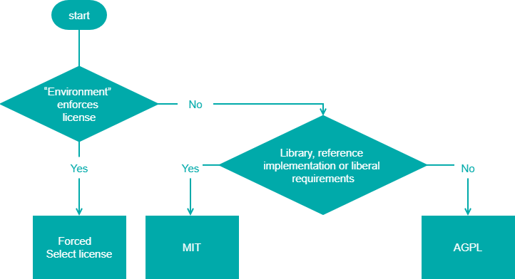
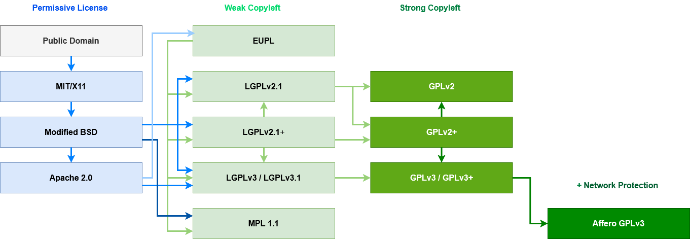
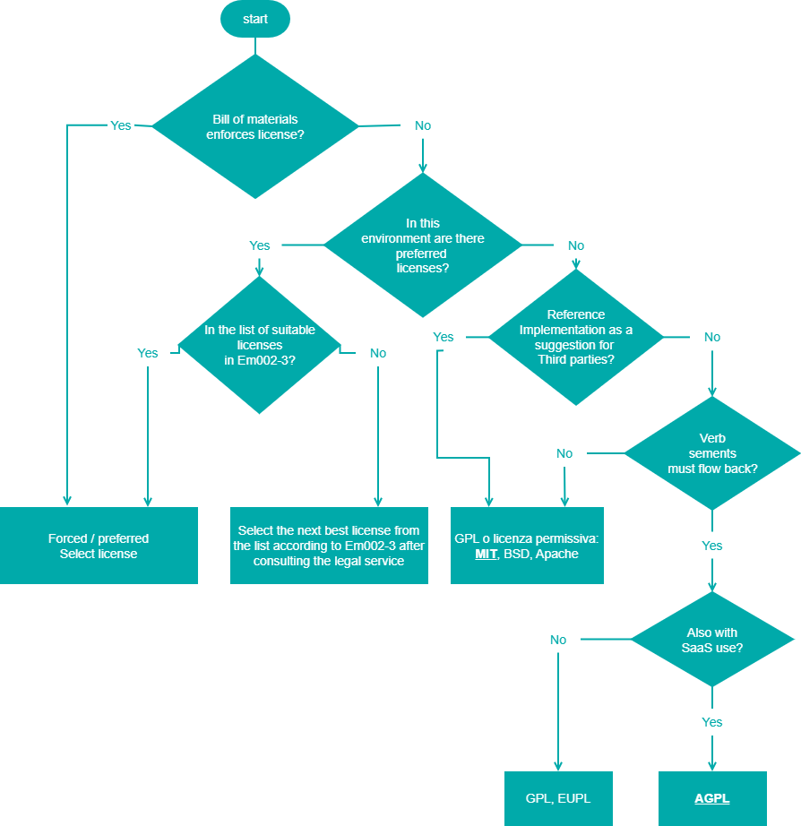
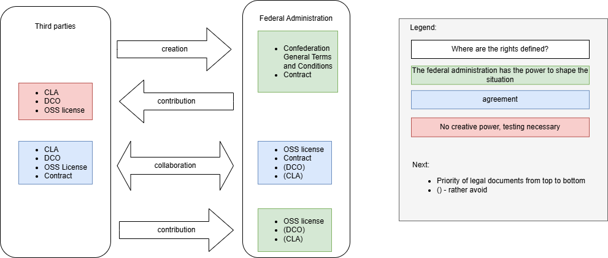

**Disclaimer:** This document is an evolving draft and part of the guidelines and tools designed to support the Federal Administration in publishing open source code. For more information, see the main [README](https://github.com/swiss/opensource-guidelines/tree/main).

---
# Management summary

It is recommended that one of the following two licences be strategically defined in the Federal Administration when a new project is started:

-   **AGPL licence**: Copyleft effect desired. Changed code should in any case flow back into the general public and can then also be reintegrated by the Federal Administration. It is recommended to use the latest version of the licence.
    This is the best way to fulfil the principle of \'public money --  public code\'. The rights of third parties, especially in the case of further developments, can weaken this to LGPL.

-   **MIT licence**: It should be possible for third parties to develop proprietary applications based on the Federal Administration\'s code. If a non-endorsement is specifically required, BSD-3-Clause is to be preferred.

The following decision aid can be used to select the licence:

Figure 1: Simplified licence selection guide

To a certain extent, these two licences form the two extremes in the spectrum of OSS licences. It can be very useful to select a more suitable licence for a specific project. This guide is intended to
provide concrete assistance.

If the analysis of the software libraries reveals that a different licence must be used, the developers will draw the project management\'s attention to this. The analysis is set out in [Em002-2 Instructions for Publishing Open Source Software.](./em002-2.md)

When working on existing projects, all OSI-compatible licences are generally acceptable.

# Introduction

Article 9 of the Federal Act of 17 March 2023[^5] on the Use of Electronic Means to Carry Out Official Tasks (EMOTA) stipulates that the federal authorities must publish and license software that they develop or commission as open source software.

This document has the following objectives:

-   Introduction to the topics of software copyright and OSS licences.

-   A presentation of which OSS licences are unproblematic for use in the Federal Administration.
    Licences not mentioned in this document and software under such licences may not be used without an additional review of the contractual provisions by the responsible legal service.

-   Assistance in selecting a licence for the development or procurement of a project under Art. 9 EMOTA.

# Copyright and licences: Fundamentals

Copyright law establishes both moral rights and economic rights (exploitation rights). The moral rights include, for example, the right to recognise authorship or the right to determine whether and when the work is published. Exploitation rights include, for example, the right to make or distribute copies of the work.

The Federal Act of 9 October 1992[^6] on Copyright and Neighbouring Rights (CopA) provides for a number of other moral rights and exploitation rights (see Art. 8 ff. CopA). These rights accrue directly to the author at the same time as the work is created.

Art. 2 CopA sets out the conditions under which copyright protection is granted. A protected work within the meaning of the law only exists if these requirements are met.

The prerequisites are:

-   The work must have been created; simply finding the work is not sufficient. Research data, for example, i.e. the results of experiments, cannot be classified as works.

-   The creation must be \'intellectual\', i.e. originate from a human being.

-   The work must have been realised in a perceptible manner. The mere idea behind a work is not protected, only its external form, e.g. a printout of a text on paper or a performance of a piece of music.

-   Individuality: Finally, the work must have a certain minimum degree of individuality. A work that everyone would design in the same way is not protected.

A wide variety of works can be protected, such as literary or scientific texts, musical works, photographic, cinematographic and other visual or audiovisual works.

According to Art. 2 para. 3 CopA, computer programs are also works if the aforementioned requirements are met.

The author alone is entitled to the copyrights upon their creation. Only the author can prohibit someone else from carrying out the corresponding actions. However, the author can exercise their rights not only themselves:

-   They may transfer their rights to third parties (e.g. by selling them). The new rights holder can then assert these rights in the same way as if they were the author.

-   Alternatively, the author may also license their rights to third parties. Simply put, a licence is a contract under which the rights holder allows a third party to use the work. The author retains the rights, but waives their enforcement vis-à-vis the licensee.

If a computer program is created in an employment relationship, the employer receives an exclusive licence for its use (Art. 17 CopA). Employees are thus essentially left with only the moral rights to the software (or, depending on the legal opinion, only a core part thereof).
This is the same legal situation as under the Federal Personnel Act.

# OSS licences

## Fundamentals

OSS is essentially characterised by the following features (based on a definition of the Open Source Initiative *\[OSI\]*[^7]):

-   Unlimited and free redistribution of the software is permitted;

-   The software is available in source code form;

-   Modifications to the software and their redistribution under the same licence are generally permitted;

-   No individuals or groups of people may be excluded from using the software, and no areas of application may be excluded (especially not commercial use); and

-   The distribution of the software together with other software (such as closed source software) must not be restricted.

The most common motives for using OSS are initially the cost savings through the use of the already substantial pool of freely usable software. Companies that frequently use OSS are often able to save considerable portions of their IT budget through the use of OSS.

Freely available code can also be easily adapted to one\'s own needs. Moreover, choosing OSS avoids vendor lock-in.[^8]

## Open source licences

Open source licences are, first and foremost, normal licence agreements for computer programs.
 
In contrast to normal licence agreements, however, OSS licence agreements come into effect without further ado when only one of the free forms of use described in the licence is exercised (for example, by copying, redistributing or modifying software).

## Copyleft versus permissive

### General

An open source licence according to the OSI may contain a \'copyleft\' provision. Changes to software licensed accordingly must be offered again under the same conditions as those that existed for the original software. Anyone who makes such changes must, when distributing the open source software in the form of machine-readable object code, also offer the source code to recipients.

Expressed as defined by the Free Software Foundation, the copyleft effect protects developers\' freedom and thus ensures that once free software always remains free.

With copyleft licences, a kind of exchange takes place between the community and the companies using it. The users, who are obliged to put their own developments back under the respective licence in return for the benefits from the existing software pool, thus contribute to the further development of the software pool. As a result, both sides stand to benefit.

The copyleft provision has a certain \'contagion effect\': if copyleft-licensed software is integrated into previously proprietary software, the originally proprietary software must be disclosed under a
compatible open source licence.

Accordingly, when using copyleft-licensed source code, care must be taken to integrate it only where the resulting software can and should be published under an open source licence.

If an open source licence does not contain a copyleft provision (permissive open source licence), the licence for revised versions of the code can be freely chosen. In particular, it is also possible to put modifications back under a proprietary software licence and integrate the corresponding source code into proprietary software.

Essentially, open source licences can be divided into **the following categories**:

1. open source licences with **strong copyleft**;
2. open source licences with **weak copyleft**; and
3. **permissive** or **non-copyleft** open source licences.

### Open source licences with strong copyleft 

When using an open source licence with strong copyleft, new versions derived from the original software, if passed on to third parties, must be placed under the conditions of the original licence and made available to these third parties as source code.

The following two licences are considered the relevant open source licences with strong copyleft in the market:

• GNU General Public Licence (GPL); a large proportion of OSS is licensed under this today

• GNU Affero General Public Licence (AGPL)

The main difference between GPL and AGPL relates to the type of use that triggers copyleft. With GPL software, the modified source code only needs to be offered if the new software version is offered to third parties as an executable program (e.g. as a mobile app). If the software is only made available via the internet (from one\'s own cloud from one\'s own servers), for example in the form of Software as a Service\' (SaaS) or an application programming interface (API), this does not trigger copyleft.

If the software is under the AGPL, the modified source code must also be supplied when the functionality of the software is offered via a website or programming interface. The AGPL is thus even stricter than the GPL.

With strong copyleft licences, copyleft affects not only the respective software module (library) but the entire software program into which a copyleft-licensed software module may be embedded. The aforementioned \'contagion effect\' thus takes hold.

### Open source licences with weak copyleft 

Licences with weak copyleft also require that changes to their source code be released to third-party recipients under the original open source licence.

In contrast to licences with strong copyleft, however, they do not have the effect of \'infecting\' other delimitable software components (other libraries or the main program itself) with their licence. This allows the integration of open source software with weak copyleft into proprietary software or into software with other OSS licences without having to be released under the original licence.

These are the most commonly used open source licences with weak copyleft:

• GNU Lesser General Public Licence (LGPL)

• Mozilla Public Licence 2.0 (MPL)

• Common Development and Distribution Licence (CDDL)

• Eclipse Public Licence (EPL)[^9]

• Microsoft Reciprocal Licence (Ms-RL)

• European Union Public Licence (EUPL)[^10]

### Permissive open source licences

Licences without copyleft effect are characterised by the fact that they do not impose any requirements on the licensee regarding the licensing of their derived software, and therefore neither their new source code nor changes to the open source software need to be disclosed to third-party recipients.
This enables the development of proprietary software products through the integration of software under permissive open source licences.

Examples of permissive licences are:

-   MIT Licence

-   Apache Licence 2.0

-   Berkeley Software Distribution (BSD) Licence (BSD 2-Clause and BSD 3-Clause)

-   Microsoft Public Licence (Ms-PL)

## Compatibility of open source licences 

Programs usually consist of a variety of software components and modules that can be connected to each other in different ways. In software development, existing open source components are often integrated into proprietary, internal applications and solutions. As soon as these become accessible from outside via a website, APIs, software distribution or by another means, attention must be paid to the compatibility of the respective open source licences, because then copyleft can take effect.

If derivative works that are under a certain licence may only be distributed under the same licence conditions, this has the consequence that other open source licences with other or contradictory licence obligations for derivative works cannot be used.

Some open source licences contain so-called opening clauses, which allow the use of code licensed under them in projects that are under other licences. For example, the LGPL, Version 2.1, also allows the use of the code under the GPL. The GPLv3 contains, among other things, a compatibility clause for the AGPL and the Apache License 2.0. The EUPL is designed very openly and contains a long list of compatible licences in the annex, especially those with weak copyleft, such as the LGPL. This has the consequence that the strong copyleft protection actually specified in the licence is indirectly weakened.

The following diagram depicts the dependencies of the most important open source licences (Goldstein 2018). The representation is based on the visualisation by David A. Wheeler, who analysed the compatibilities of the various licences and their version numbers (Wheeler 2007) and has been further developed together with information from <https://www.gnu.org/licenses/license-list.en.html>[^11].
 
The diagram should be read as follows: code according to a licence listed earlier in the chain can be incorporated into software that is published under a licence listed later in the chain. For example, code licensed under the modified BSD can be placed under an LGPL or GPL licence variant, but not vice versa. Public domain means that the work is not subject to any copyright restrictions.

Figure 2: Compatibility of open source licences (based on diagram by David A. Wheeler, 2007 and https://www.gnu.org/licenses/license-list.en.html)

Important: As licence compatibilities are always relevant, the development teams/service providers should check the development stacks with libraries for possible compatibility problems in advance. This means that before the use of a library is waved through, it should be checked whether the library\'s licence is compatible with the relevant licences preferred by the Federal Administration, in addition to considering security and homogeneity in the development stack.

# Licences for pure usage

This section deals with the situation where software under an OSS licence is to be used, but this software should not be modified, or modifications are only to be used internally.

The following licences are generally unproblematic when software is used by federal authorities. However, the corresponding conditions, notably copyleft where applicable, must be adhered to.

Under certain circumstances, the licence of a pre-existing software module determines the possible licences for the overall product (see Section 4.4).

Some licences are incompatible in combination (see Figure 2).

| Licence| Copyleft | Special features|
|:--- | :--- | :--- | 
|**MIT** | No| Preferred licence of the Federal Administration if further distribution is sought and third parties are to be allowed to develop proprietary software from it again. |
| **Apache 2.0**| No |Apache is a very widely used licence known for the projects that are under the Apache Foundation. Use of licensors' trademarks excluded, except for describing the work.|
| **GPL v3**|Yes |This is THE classic copyleft licence.  Copyleft also applies when GPL-licensed parts are incorporated into an entire program. Prohibition of digital rights management. Special compatibility rules.|
| **LGPLv3** | Weak| Reduced copyleft licence developed specifically for software libraries.  In contrast to GPL, LGPL allows closed (i.e. proprietary) code to be combined with LGPL code under certain conditions.  Examples include standard libraries such as glibc. LGPL allows the program, as part of which the library is distributed, to be placed under the GPL.|
| **Affero GPLv3 (AGPL)**| Yes | SaaS use also triggers copyleft. Otherwise analogous to GPLv3.  This licence closes the loophole in the GPL, which meant that no release was required when used for SaaS offerings.  With this licence, the Federal Administration can guarantee that enhancements to the code also benefit the general public in the case of SaaS, and best supports the principle of **public money – public code'.**|
|**BSD-3** |No |General, liberal licence.  Names of authors may not be used to promote derivative works (advertising clause) |
|**European Union Public Licence (EUPL)** |Weak |Special licence used for the EU.  Particularly useful as a basis for European projects.    Licence considering European law.Release under certain compatible licences explicitly allowed. |

Table 1: Licences unproblematic for the federal authorities (according to *\[Sc2024*\])

Other licences may be used. In these cases, it may be necessary to consult the legal department of the respective office.

# Licence for own projects or creation and for contributions

This section concerns the following cases:

-   Further development / contribution

    -   where federal authorities further develop existing software; or 

    -   develop new software, but rely on existing OSS software libraries; and

    -   make the corresponding software available to third parties. Third parties also include organisations of the decentralised Federal Administration, provided they have their own legal        personality. If the further developments are only used internally and not made available to third parties, only [Licences for pure usage](em002-3.md#licences-for-pure-usage) applies.

-   Own projects / creation / publication 
    This section concerns cases in which the federal authorities develop  new software. This is likely to be rare, as most developments rely on existing open source software libraries.
    
    For completely new developments, a licence type should be chosen that enables a broad and sustainable basis for further developments. For this, it is important that the licence in question should be widely accepted in the relevant developer community.

The compatibility check is carried out according to [Em002-2 Instructions for Publishing OSS](./em002-2.md), Section 7.4. The compatibility of the licences is shown in Figure 2.

The following dimensions should be considered:

-   Use case

-   Desired checking [Em002-2.1 OSS Preliminary Assessment Checklist](./Em002-2.1%20Checklist%20OSS%20Preliminary%20Assessment.odt)

-   Ease of building a community [Em002-4 OSS Community Guidelines](./em002-4.md)

-   Ease of application

-   Legal certainty

-   Distribution

Licences according to Section [Licences for pure usage](em002-3.md#licences-for-pure-usage) are preferred.

The following **copyleft licences** should be used as a priority by federal authorities, especially if sustainable open development is sought and the copyleft effect of inheritance should apply. This ensures that software paid for by the public and all derivatives thereof remain open. This best fulfils the principle of \'**public money -- public code**\' and is **the preferred recommendation for the Federal Administration.** 

Recommended licences in descending order:

-   **AGPL v3**

-   GPL v3

-   LGPL 3.0

-   European Union Public Licence (EUPL)

The following licences should be used by federal authorities when **no copyleft is desired** or required (in descending order):

-   **MIT**

-   Apache Licence 2.0

-   BSD v3

When collaborating on existing projects, the following licences can also be used without problems:

-   Mozilla Public Licence

-   Microsoft Public Licence

If another licence is to be used, it is recommended to briefly justify this in [Em002-2.3 OSS Release and Publication Checklist](./Em002-2.3%20Checklist%20OSS%20Release%20and%20Publication%20.odt).

**According to Art. 9 para. 4 EMOTA, internationally established licences should be used in all cases.**

Additional tools for checking licence compatibilities include:

-   ORT Toolkit (https://oss-review-toolkit.org/)

-   Black Duck (www.blackducksoftware.com),

-   FOSSA ([www.fossa.com](http://www.fossa.com)),

-   the Open Source Licence Comparison Grid (<https://www.cmu.edu/cttec/forms/opensourcelicensegridv1.pdf>)

-   FOSSology (<https://www.fossology.org>).

-   OpenCode process:  [https://opencode.de/en/knowledge/general-conditions/standardised-open-source-licenses](https://opencode.de/en/knowledge/general-conditions/standardised-open-source-licenses#4.-Lizenzierungsleitfragen)

# Use cases and suitable licences

The following table and diagram show how appropriate licences can be selected for open source software based on different use cases.

| **Use case** | **Licence(s)**| **Justification** |
| :---  | :---|:--- |
| Use and contribute to existing project| **Licence as specified by the project** |Necessary for legal reasons.|
| Licence is forced by the use of existing parts (licences with copyleft)| **Use licence compatible with the parts.** |Necessary for legal reasons.   NB: A number of libraries are available under several licences.  Only one of the licences has to correspond One of the purposes of multiple licensing is to ensure that libraries can be used both with and without copyleft.|
| Existing ecosystem with preferred licence (e.g. it is a plugin for software released under MIT licence.  Then using an MIT licence would be most purposeful, as all other users expect this and the software integrates into the ecosystem)|**Use licence if it is on the list, otherwise use the same licence as much as possible** |Acceptance in the community is central. |
|The goal is the widest possible distribution, e.g. for a reference implementation[^12] (e.g. for software also to be used in commercial solutions).| **MIT**  BSD v3  Apache Licence 2.0  LGPL v3| In this case, no copyleft should be used.|
|Modifications to the code should flow back to the federal authorities|**AGPL v.3**  GNU GPL v.3  EUPL |AGPL also enforces release by third parties when used in the cloud, GPL and EUPL do not. |
| SaaS solutions should not be exempt from the backflow of code changes| **AGPL v.3** | AGPL also enforces release by third parties when used in the cloud.|
| Easy collaboration with the community is important.|**AGPL v.3**  GNU GPL v3  Apache Licence 2.0 |GPL preferred to keep the software free.   Apache contains rules for community governance, additional rules for contributions (you may not specify a licence other than Apache; the contribution as such is not regulated in more detail, so if a CLA exists, that should take precedence), a patent licence, rules for patent licensing. Especially also that anyone who asserts patents against another contributor loses their patent licence under the Apache licence.  The rules that the Apache Foundation sets for contributions are decisive. Apache therefore makes sense if the project governance is to be built primarily according to Apache. |
| Small, universally usable component (library) or small piece of software where sustainability or maintenance by a community is not important | **MIT**  Apache Licence 2.0  BSD v3  LGPL v3 |LGPL stipulates a copyleft only for the component itself, but not for the entire project into which the component is inserted.   The other licences are permissive.|
| It must be simply and permissive; control is not important| **MIT** Apache Licence 2.0  BSD v3|Maximally permissive |
| It is important for the federal authorities what happens to the code and they want to receive as many improvements as possible.|**AGPL v.3**  GNU GPLv3 |Copyleft |
| It should be prevented that the software becomes proprietary and is positioned as a competitive product on the market|**AGPL v.3**  GNU GPLv3 |Copyleft |
|It should be prevented that the federal authorities become dependent on individual suppliers ('vendor lock-in') |**AGPL v.3**  GNU GPLv3 |The copyleft prevents a supplier from gaining a unique position over time by using the Confederation's software in a proprietary product, which could again lead to a dependency for the Confederation on this supplier.|

Table 2: Licence to be used depending on the use case for the release of new software in accordance with Art. 9 EMOTA **(bold = recommended where no grounds exist to the contrary**)

Figure 3: Extended decision tree for licence selection in the Federal Administration (if not AGPL or MIT)

The bill of materials in Figure 3 is the software bill of materials (SBOM) of all pre-existing software libraries and sub-programs that have been incorporated into the overall solution. Each library has its own licence. Depending on how this is compatible with others (see Section 4.4), the possible selection of licences for the publication is limited.

One last point can also influence the decision: **changing from a more restrictive licence to a less restrictive one is easier afterwards**. In the opposite case, a fork[^13] is almost unavoidable.

# Special legal topics

## International aspects

The essential legal issues of OSS in practice are mainly of a licence contract nature.

Regarding licence law issues, the law chosen by the parties applies first (for example, the Mozilla Public License MPL contains a choice of law for the defendant\'s law in Section 8).

If there is no choice of law, which is the case with all other licences presented here, the law of the licensor\'s state generally applies. So when federal authorities license software from foreign licensors, the law of the respective country applies. If multiple contributors are involved, this can lead to complex situations. Conversely, Swiss law applies in the event of any disputes between foreign licence holders and the federal authorities as licensor.

The question of which aspects are contractual in nature and which are copyright in nature cannot be answered generally and may be quite complex in individual cases.
The transferability of copyright or parts of copyright, or the scope of permissible rights granted, for example, belongs to copyright law. Here, the law of the respective country of protection must be applied. A deviating choice of law is not possible (for the entirety, see Jaeger/Metzger, 449 ff.).

## Exclusion of liability and warranty

Open source licences regularly exclude any warranty and liability to the extent legally permissible. In practice, there are rarely any liability or warranty issues; the risks involved are therefore low.

It can be assumed that with correct licensing, the liability exclusion clauses present in all licences discussed here will take effect, so that only liability for gross negligence and intent, possibly personal injury, remains.

Rules of general terms and conditions may be reserved, e.g. as in Germany; however, insofar as the federal authorities are the subject of liability as a licensor, Swiss law applies (see 8.1 above), which permits the aforementioned exclusions of liability and warranty in B2B transactions.

Conversely, however, this also means that in the event of program errors, claiming against the authors of included OSS code is usually difficult.

The usual procedure when using OSS is therefore regularly to protect against errors through the usual IT security measures and to ensure the correction of errors through maintenance contracts. There is no recourse to OSS contributors.

## Copyleft and licensing between Federal Administration bodies

Copyleft applies when passing between different legal entities (for example, within a group or between agencies of the decentralised Federal Administration with their own legal personality).

Copyleft does not apply when passing between agencies of the same legal entity (for example, within the central Federal Administration).

## Licensing of patents

Software patents are only possible within narrow limits according to European legal opinion. The decisive factor is that the software makes a technical contribution, i.e. solves a concrete technical problem outside the computer on which it runs. Examples would be engine control in cars or the control of a robot. Software as such that only runs on a computer but has no such external effect is generally not patentable in Europe. Thus most software programs do not fall within the scope of patent law.

In other parts of the world, particularly the USA, software patents are granted somewhat more liberally. However, even in the USA, an abstract idea or business model does not become a patentable invention simply by being implemented in computer software.

With some licences, any patents of the licensor are not co-licensed. These are the GPL2, the BSD licences, and the MIT licence.

For projects that could also be used outside Europe, or which exhibit the aforementioned form of external impact, it is advisable to clarify the patent law aspects on a case-by-case basis.

## Dual licensing

The author can license software under different licences simultaneously. This is called dual licensing.

An interesting form of dual licensing is where the copyright holder licenses the software as OSS with a strong copyleft (which prevents it from being integrated into proprietary software) and also offers interested licensees a *paid* licence that allows them to integrate the software into their proprietary software.

Because interested licensees can thus avoid releasing their proprietary software as OSS, they are willing to pay for the licence. See also the annex to [Em002-1 Practical Guidelines for Open Source Software in the Federal Administration.](./em002-1.md)

For the federal authorities themselves, dual licensing is likely to be uninteresting in most cases. As long as the copyrights lie with the federal authorities (which is regulated, for example, according to the Federal Administration\'s general terms and conditions), the federal authorities alone can decide on any dual licensing.

If maintenance and (further) development are outsourced to third parties, this may be different. If the rights exceptionally lie with them, and if the federal authorities have only reserved the right to
grant an OSS licence with copyleft, the third party might be tempted to perform dual licensing. If this is to be prevented, it should be contractually excluded.

## Subsequent change of licences

First, it should be noted that OSS licences are generally unchangeable and irrevocable. Licensees who concluded the licence agreement *before* any change can continue to use, modify, and pass on the code to third parties based on the old licence.

In practice, changing licences often leads to a fork of a new version of the software under the old licence, which is further developed independently by the previous licensees.

The introduction of a new licence for software is only possible if all copyright holders of the software agree. Changes have occurred in practice, for example, when switching from a permissive to a copyleft licence.

## Naming of contributors (employees and third parties)

If a computer program is created in an employment relationship, the employer receives an exclusive licence for its use (Art. 17 CopA). Employees are thus essentially left with only the moral rights to the software (or, depending on the legal opinion, only a core part thereof). The same applies to third parties who develop software for the federal authorities, provided that the corresponding GTC[^14] of the Confederation apply, which transfer the resulting rights to the federal authorities.

Nevertheless, the question arises as to whether contributors (employees, third parties) should have the right or obligation to identify themselves as authors of contributions in open source repositories.

One argument for the federal authorities to use OSS is to offer attractive employment: OSS offers contributors the opportunity to publicly demonstrate their knowledge and thus build a reputation. Their abilities become verifiable, are attested by peers, and those who have gained influence in an OSS project can use this as leverage in job searching.

Another argument could be the moral rights, the core of which cannot be taken away from the original author either by contract or by law. However, this core area is small for computer programs; demanding that the developer of a computer program should also have a right to be named would probably be going too far.

In addition, an exchange between experts in the community presupposes that they can be approached individually by others.

Depending on the project, it may therefore make sense to give contributors the opportunity to identify themselves as contributors in the community.

From a data protection point of view, compulsion to do so should be avoided, although exchange in the community does not presuppose disclosure of names -- pseudonyms are the rule rather than the exception. If contributors do not wish to disclose their names, they should therefore be given the opportunity to appear under a pseudonym.

**It is recommended that the names of the developers be mentioned in the commits if the project does not object to this.**

**In any case, the federal authorities should act as rights holders.**

## Copyright, licences for generative AI for code creation
 
Here, we are referring only to code that has been created using generative AI. Further information on this topic can be found in [Em002-6 FAQ about OSS* in Section 2.2](./em002-6.md). Code created by an LLM is not itself protected by copyright. However, the training data used by the LLM may be protected by copyright. If the code corresponds 1:1, then the licence should also be adopted. If the code was created piecemeal and then modified by the developers, there is little risk that this will be considered derived software. It should be noted that certain LLMs require the code to be labelled accordingly; any contractual agreements in this regard must be observed.

## Contributor Licence Agreements (CLA) and Developer Certificate of Origin (DCO)

When multiple authors work on the code of an open source project, they receive joint rights to the resulting code.

The licensing of the code to third parties is done via the OSS licence, whereby a separate licence agreement is created between each user and each author (bundle of licences). This constellation can lead to a confusing legal situation, for example in international relations (see 8.1 above). When companies decide to put their software under an OSS licence and accept contributions from third parties, they sometimes have the need to retain some control over the code.

For example, it may be interesting to keep open the possibility of putting the project <u>under a new licence</u> , or one might want to subject code licensed under copyleft to dual licensing and for this purpose needs more rights than one would get from one\'s contributors via a simple OSS licence (see 8.5 above). Contributor Licence Agreements (sometimes also Copyright Transfer Agreements) are intended to solve such problems.

A **Contributor Licence Agreement (CLA)** is a **legally binding agreement** that defines the **conditions for project contributions**.

Contributors are obliged to agree to this agreement before content can be contributed to the project. Essentially, the contributors grant the project and its users the right to **use, modify and redistribute** the contributions made. Furthermore, it is confirmed that the contributions **were written independently or legitimised by third parties**.

The **Developer Certificate of Origin (DCO)** is a **verification system introduced** by the Linux Foundation in 2004, which is similar in purpose to the Contributor Licence Agreement (CLA) and represents a suitable alternative instrument. The contributors confirm for each project contribution that **(a) they are authorised to make the contribution, (b) the contribution is covered by a licence compatible with the project and (c) they agree to the distribution and use of the contribution as open source**.

The main instrument of CLAs is either the assignment of copyrights from the contributors to the main developer or the supporting organisation (in the case of Copyright Transfer Agreements), or the granting of the most extensive, usually irrevocable licence possible by the contributors to the main developer (e.g. Apache has defined a CLA). Contributions to closed projects are also often subject to a CLA.

CLAs are controversial in the OSS community[^15] because, among other reasons, they can open gaps in copyleft. Therefore, there are now also CLAs that restrict the main developer in terms of granting a new licence for the project\'s code.

Figure 4: Transfer source code and rights in different constellations

There are no problems for **own developments** (creation): According to Art. 17 CopA, the federal authority is the holder of the usage rights to software created by its own employees. For **third-party developers**, the federal authorities should secure the rights (for example, by using the corresponding GTCs of the Confederation). This means that no CLA or DCO is necessary here.

Where federal authorities are the main developers and accept contributions and collaborations, the use of a CLA should be avoided.Digital Certificates of Origin (explained with an example in [Em002-4 OSS Community Guidelines](./em002-4.md), Section 3.3) may be used instead. In principle, contributions to federal authority projects should build on the OSS licence so as not to raise the barrier to contribution any further.

Should a need for a CLA nonetheless be identified in a specific case following appropriate review, the federal authority should use the Apache CLA.[^16] In that event, this decision and the CLA should be noted in the concluding remarks of both [Em002-2.1 Preliminary Assessment Checklist](./Em002-2.1%20Checklist%20OSS%20Preliminary%20Assessment.odt) and [Em002-4.1 OSS Community Checklist](./Em002-4.1%20Checklist%20OSS%20Community.odt).

Where federal authorities contribute to third-party software that requires a CLA, the legal service must examine on a case-by-case basis whether the federal authority can accept the existing CLA.[^17] The following points must be determined:

-   Has another federal authority already signed the CLA?

-   Who reviews the CLA?

-   Who signs it? (The signatory must be authorised to sign on behalf of the Confederation vis-à-vis third parties)

-   Where is it filed?

-   How is the CLA or DCO documented in the project?

-   How is it ensured that the code that has been released remains published? (This remains the responsibility of the federal authority under Art. 9 EMOTA, see \[KKB-MB\].)

Possible criteria for the review are:

-   Compatibility with Art. 9 EMOTA: does the code remain open?

-   Does the federal authority see any risks for itself?

-   Does the federal authority see a benefit for itself (e.g. the code does not have to be maintained or developed further alone) or for others (within Switzerland\'s federal system or across Europe, broader impact can be achieved without additional effort)?

-   Are the rights assigned reasonable?

-   Are no (unnecessary) obligations imposed on the federal authority?

-   Is the CLA substantially equivalent to the Apache CLA?

## Problems with (L) GPL-3.0 and IoT 7.4.4

*\[BITKOM2023\]* points out a problem with the use of (L)GPL-3.0 licences in connection with device-related software: such devices would have to allow the installation of own/new software versions. This may not be desirable for security reasons.

## Legal status of documentation

According to Art. 5 CopA, \"decisions, minutes and reports issued by authorities and public administrations\" are not protected by copyright.

This goes further than CC-0 because the rights holder cannot dedicate  the work to the public domain by waiving all copyright and neighbouring rights worldwide. It is already in the public domain by law. The dispatch on Art. 5 CopA says: \"The provision still allows copyright protection for a whole number of works that have arisen from official activity or in connection with it.

Documents from internal administrative study committees and working groups, expert reports or journals of federal offices, for example, do not fall under the norm. There is no overriding interest in their free distribution because they do not influence the legal position of the citizen.\"

It can thus be argued that for many of the relevant documents and the documentation published by federal authorities in connection with open source software, no copyright protection exists. The criterion is whether or not the document affects the legal status of the citizen and is thus exempt from copyright protection. If not, then a suitable licence (CC-0[^18], CC-BY, CC-BY-SA or possibly LGPL) should be used for documentation.

Nevertheless, especially with international use of the documentation, many users would be unclear about the situation.

We therefore consider it expedient if, as with this document here, a corresponding release is also listed for safety\'s sake.

# Further information on legal issues

Further information on open source software, specific licence characteristics and in-depth legal aspects can be found in numerous publications, which are presented below (see also the references at the end of the document).

-   The text *\'Open Source Software im EMOTA, Analyse des neuen Art. 9 des Bundesgesetzes über den Einsatz elektronischer Mittel zur Erfüllung von Behördenaufgaben\'* by Rika Koch and Simon Schlauri,    in the proceedings of the IT Procurement Conference 2023 in Bern,  offers additional guidance on the implementation of Art. 9 EMOTA.

-   The German BITKOM\'s *Open Source Software 2.0 Guidelines* addresses legal issues related to open source in detail *\[BITKOM2023\].* However, it is based on the legal situation in Germany.

-   Wolfgang Straub, in his book *Softwareschutz: Copyright Law, Patent Law, Open Source*, examines the legal details of copyleft in relation to Swiss copyright law and explores the compatibility of open source licences \[St2011\]. The section on open source software (as well as German translations of various open source licences considering Swiss legal terminology) are freely available at *www.it-recht.ch.*

-   Till Jaeger and Axel Metzger provide in-depth answers to numerous legal questions related to open source software in their comprehensive book *Open Source Software - Rechtliche Rahmenbedingungen der Freien Software \[JaAx2016\]*. However, they base their analysis on the legal situation in Germany.

-   Kropp Jonathan/Bauer Alexander, Open Source Compliance and Litigation, CB 2019 pp. 285 ff., 285.

-   Reymond Michel José, Questions de responsabilité civile et contractuelle soulevées par la distribution de \'logiciels libres\' (open source), SZW 2022 p. 69 ff.

In addition, various online portals provide detailed information on the characteristics and issues of specific open source licences.

-   On the GitHub platform <https://choosealicense.com>, the desired goals for an open source project can be selected and the appropriate open source licence is suggested.

-   At <https://opensource.guide/legal/> GitHub provides an online guide that addresses specific legal issues.

-   At <https://www.gnu.org/licenses/license-list.en.html> you will find brief comments on various licences with information on compatibility, in particular the GPL.

-   At <https://opensource.org/faq> the Open Source Initiative addresses numerous questions and answers on the legal aspects of open source licences.

-   At <https://copyleft.org/guide> you will find a detailed guide explaining the details of copyleft.

-   At <https://tldrlegal.com> the most important open source licences are summarised according to what the respective licence permits (\'can\'), what it prohibits (\'cannot\') and what it prescribes (\'must\').

-   At <https://opensource.com/tags/licensing> articles on current licence issues are published on an ongoing basis.

-   At <https://www.ifross.org/faq-haeufig-gestellte-fragen> the private Institute for Legal Issues of Free and Open Source Software\' in Berlin (ifrOSS) has published numerous answers to frequently asked legal questions.

Today, compliance with open source licences is primarily implemented using software tools (for further information on open source compliance, see also Fröhlich-Bleuler *\[Fr2012\]* and Kuhn, Williamson and Sandler *\[KuWiSa2008\]* ). For example, various open source tools from the Linux Foundation are documented and published under the term \'fossology\' at <https://www.fossology.org>. Also, commercial supplier such as Black Duck[^19] or FOSSA[^20] offer various proprietary solutions that can be used to check the compatibility of the open source licences used.

# Annex

## Changes from previous version 

-   Management Summary added.

-   AGPL and MIT licences are now recommended as preferable.

-   New in Section 8.8: Copyright for code generated with AI.

-   Section 8.9 CLA and CDO greatly expanded.

-   Various editorial improvements and clarifications.

-   More examples given.

## References 

See [Em002 Strategic Guidelines for Open Source Software in the Federal Administration](./em002.md).

## Abbreviations 

See [Em002 Strategic Guidelines for Open Source Software in the Federal Administration](em002.md) and [Em002-6 FAQ about OSS.](./em002-6.md)

## Examples of releases and their licence

In future, this list will be replaced by a collection of metadata via publiccode.yml.

## D.1 Loom
<table style="border: none; border-collapse: collapse; width: 100%;">
  <tr style="border: none;">
    <td style="vertical-align: top; width: 20%; padding-right: 20px; color: #000; font-weight: bold; border: none;">
      URL
    </td>
    <td style="vertical-align: top; border-left: 1px solid #ccc; padding-left: 20px; border-top: none; border-right: none; border-bottom: none;">
        <a href="https://gitlab.com/swiss-armed-forces/cyber-command/cea/loom">https://gitlab.com/swiss-armed-forces/cyber-command/cea/loom</a>
    </td>
  </tr>
  <tr style="border: none;">
    <td style="vertical-align: top; padding-right: 20px; color: #00; font-weight: bold; border: none; padding-top: 20px;">
      Federal authority
    </td>
    <td style="vertical-align: top; border-left: 1px solid #ccc; padding-left: 20px; border-top: none; border-right: none; border-bottom: none; padding-top: 20px;">
      Cyber Command
    </td>
  </tr>
    <tr style="border: none;">
    <td style="vertical-align: top; padding-right: 20px; color: #00; font-weight: bold; border: none; padding-top: 20px;">
    Description
    </td>
    <td style="vertical-align: top; border-left: 1px solid #ccc; padding-left: 20px; border-top: none; border-right: none; border-bottom: none; padding-top: 20px;">
     Loom is a powerful, easy-to-use document search engine. It automates the indexing of configured data sources, performs OCR, extracts content and metadata, enables tagging and offers powerful search and operating options.
    </td>
  </tr>
    <tr style="border: none;">
    <td style="vertical-align: top; padding-right: 20px; color: #00; font-weight: bold; border: none; padding-top: 20px;">
     Year
    </td>
    <td style="vertical-align: top; border-left: 1px solid #ccc; padding-left: 20px; border-top: none; border-right: none; border-bottom: none; padding-top: 20px;">
     2025
    </td>
  </tr>
 <tr style="border: none;">
    <td style="vertical-align: top; padding-right: 20px; color: #00; font-weight: bold; border: none; padding-top: 20px;">
     Licence
    </td>
    <td style="vertical-align: top; border-left: 1px solid #ccc; padding-left: 20px; border-top: none; border-right: none; border-bottom: none; padding-top: 20px;">
     MIT
    </td>
  </tr>
    <tr style="border: none;">
    <td style="vertical-align: top; padding-right: 20px; color: #00; font-weight: bold; border: none; padding-top: 20px;">
     Justification
    </td>
    <td style="vertical-align: top; border-left: 1px solid #ccc; padding-left: 20px; border-top: none; border-right: none; border-bottom: none; padding-top: 20px;">
     -
    </td>
  </tr>
</table>

## D.2 trustbroker.swiss

<table style="border: none; border-collapse: collapse; width: 100%;">
  <tr style="border: none;">
    <td style="vertical-align: top; width: 20%; padding-right: 20px; color: #000; font-weight: bold; border: none;">
      URL
    </td>
    <td style="vertical-align: top; border-left: 1px solid #ccc; padding-left: 20px; border-top: none; border-right: none; border-bottom: none;">
        <a href="https://github.com/trustbroker-swiss/trustbroker.swiss">https://github.com/trustbroker-swiss/trustbroker.swiss</a>
    </td>
  </tr>
  <tr style="border: none;">
    <td style="vertical-align: top; padding-right: 20px; color: #00; font-weight: bold; border: none; padding-top: 20px;">
      Federal authority
    </td>
    <td style="vertical-align: top; border-left: 1px solid #ccc; padding-left: 20px; border-top: none; border-right: none; border-bottom: none; padding-top: 20px;">
     FCh, FOITT
    </td>
  </tr>
    <tr style="border: none;">
    <td style="vertical-align: top; padding-right: 20px; color: #00; font-weight: bold; border: none; padding-top: 20px;">
    Description
    </td>
    <td style="vertical-align: top; border-left: 1px solid #ccc; padding-left: 20px; border-top: none; border-right: none; border-bottom: none; padding-top: 20px;">
   Trust Broker Swiss provides federation services between relying parties (applications, service providers, other IAM systems or policy enforcement points) and identity providers (IdP, also called claims providers) using trusted attribute stores to enrich authenticated users. 
It enables Identity/Claims Providers and Relying Parties to exchange information via a third party that hides the IdP specifics and provides a unified or at least additionally verified identity.
    </td>
  </tr>
    <tr style="border: none;">
    <td style="vertical-align: top; padding-right: 20px; color: #00; font-weight: bold; border: none; padding-top: 20px;">
     Year
    </td>
    <td style="vertical-align: top; border-left: 1px solid #ccc; padding-left: 20px; border-top: none; border-right: none; border-bottom: none; padding-top: 20px;">
     2024
    </td>
  </tr>
 <tr style="border: none;">
    <td style="vertical-align: top; padding-right: 20px; color: #00; font-weight: bold; border: none; padding-top: 20px;">
     Licence
    </td>
    <td style="vertical-align: top; border-left: 1px solid #ccc; padding-left: 20px; border-top: none; border-right: none; border-bottom: none; padding-top: 20px;">
     AGPL
    </td>
  </tr>
    <tr style="border: none;">
    <td style="vertical-align: top; padding-right: 20px; color: #00; font-weight: bold; border: none; padding-top: 20px;">
     Justification
    </td>
    <td style="vertical-align: top; border-left: 1px solid #ccc; padding-left: 20px; border-top: none; border-right: none; border-bottom: none; padding-top: 20px;">
     Code changes should always remain open and be returned.  
A very detailed examination of the licence issue was carried out for the Trust Broker. For very large projects, it can be carried out at this level of detail. All compatible licences that are compatible with the Software Bill of Materials were listed in a licence pool.
    </td>
  </tr>
</table>

## D.3 Geocat.ch

<table style="border: none; border-collapse: collapse; width: 100%;">
  <tr style="border: none;">
    <td style="vertical-align: top; width: 20%; padding-right: 20px; color: #000; font-weight: bold; border: none;">
      URL
    </td>
    <td style="vertical-align: top; border-left: 1px solid #ccc; padding-left: 20px; border-top: none; border-right: none; border-bottom: none;">
        <a href="https://github.com/geonetwork/core-geonetwork">https://github.com/geonetwork/core-geonetwork</a>
    </td>
  </tr>
  <tr style="border: none;">
    <td style="vertical-align: top; padding-right: 20px; color: #00; font-weight: bold; border: none; padding-top: 20px;">
      Federal authority
    </td>
    <td style="vertical-align: top; border-left: 1px solid #ccc; padding-left: 20px; border-top: none; border-right: none; border-bottom: none; padding-top: 20px;">
      Swisstopo
    </td>
  </tr>
    <tr style="border: none;">
    <td style="vertical-align: top; padding-right: 20px; color: #00; font-weight: bold; border: none; padding-top: 20px;">
    Description
    </td>
    <td style="vertical-align: top; border-left: 1px solid #ccc; padding-left: 20px; border-top: none; border-right: none; border-bottom: none; padding-top: 20px;">
   GeoNetwork is a catalogue application for managing spatially referenced resources. It offers powerful metadata editing and search functions as well as an interactive web map viewer. It is currently being used in numerous spatial data infrastructure initiatives around the world.
    </td>
  </tr>
    <tr style="border: none;">
    <td style="vertical-align: top; padding-right: 20px; color: #00; font-weight: bold; border: none; padding-top: 20px;">
     Year
    </td>
    <td style="vertical-align: top; border-left: 1px solid #ccc; padding-left: 20px; border-top: none; border-right: none; border-bottom: none; padding-top: 20px;">
     2012
    </td>
  </tr>
 <tr style="border: none;">
    <td style="vertical-align: top; padding-right: 20px; color: #00; font-weight: bold; border: none; padding-top: 20px;">
     Licence
    </td>
    <td style="vertical-align: top; border-left: 1px solid #ccc; padding-left: 20px; border-top: none; border-right: none; border-bottom: none; padding-top: 20px;">
     GPL 2.0
    </td>
  </tr>
    <tr style="border: none;">
    <td style="vertical-align: top; padding-right: 20px; color: #00; font-weight: bold; border: none; padding-top: 20px;">
     Justification
    </td>
    <td style="vertical-align: top; border-left: 1px solid #ccc; padding-left: 20px; border-top: none; border-right: none; border-bottom: none; padding-top: 20px;">
     -
    </td>
  </tr>
</table>

## D.4 	GWEN / ampycloud / c4dl-multi / dvas /…

<table style="border: none; border-collapse: collapse; width: 100%;">
  <tr style="border: none;">
    <td style="vertical-align: top; width: 20%; padding-right: 20px; color: #000; font-weight: bold; border: none;">
      URL
    </td>
    <td style="vertical-align: top; border-left: 1px solid #ccc; padding-left: 20px; border-top: none; border-right: none; border-bottom: none;">
        <a href="https://meteoswiss.github.io/ampycloud/">https://meteoswiss.github.io/ampycloud/</a>
    </td>
  </tr>
  <tr style="border: none;">
    <td style="vertical-align: top; padding-right: 20px; color: #000; font-weight: bold; border: none; padding-top: 20px;">
      Federal authority
    </td>
    <td style="vertical-align: top; border-left: 1px solid #ccc; padding-left: 20px; border-top: none; border-right: none; border-bottom: none; padding-top: 20px;">
      MeteoSwiss
    </td>
  </tr>
    <tr style="border: none;">
    <td style="vertical-align: top; padding-right: 20px; color: #000; font-weight: bold; border: none; padding-top: 20px;">
    Description
    </td>
    <td style="vertical-align: top; border-left: 1px solid #ccc; padding-left: 20px; border-top: none; border-right: none; border-bottom: none; padding-top: 20px;">
    Python package for determining the proportion of sky coverage and the base height of cloud layers using ceilometer data.
    </td>
  </tr>
    <tr style="border: none;">
    <td style="vertical-align: top; padding-right: 20px; color: #000; font-weight: bold; border: none; padding-top: 20px;">
     Year
    </td>
    <td style="vertical-align: top; border-left: 1px solid #ccc; padding-left: 20px; border-top: none; border-right: none; border-bottom: none; padding-top: 20px;">
     2023
    </td>
  </tr>
 <tr style="border: none;">
    <td style="vertical-align: top; padding-right: 20px; color: #000; font-weight: bold; border: none; padding-top: 20px;">
     Licence
    </td>
    <td style="vertical-align: top; border-left: 1px solid #ccc; padding-left: 20px; border-top: none; border-right: none; border-bottom: none; padding-top: 20px;">
     Various licences, FSS
    </td>
  </tr>
    <tr style="border: none;">
    <td style="vertical-align: top; padding-right: 20px; color: #00; font-weight: bold; border: none; padding-top: 20px;">
     Justification
    </td>
    <td style="vertical-align: top; border-left: 1px solid #ccc; padding-left: 20px; border-top: none; border-right: none; border-bottom: none; padding-top: 20px;">
    -
    </td>
  </tr>
</table>

## D.5 EMSG application (asset management in settlement areas)

<table style="border: none; border-collapse: collapse; width: 100%;">
  <tr style="border: none;">
    <td style="vertical-align: top; width: 20%; padding-right: 20px; color: #000; font-weight: bold; border: none;">
      URL
    </td>
    <td style="vertical-align: top; border-left: 1px solid #ccc; padding-left: 20px; border-top: none; border-right: none; border-bottom: none;">
        <a href="https://github.com/astra-emsg/ASTRA.EMSG">https://github.com/astra-emsg/ASTRA.EMSG  </a>
    </td>
  </tr>
  <tr style="border: none;">
    <td style="vertical-align: top; padding-right: 20px; color: #00; font-weight: bold; border: none; padding-top: 20px;">
      Federal authority
    </td>
    <td style="vertical-align: top; border-left: 1px solid #ccc; padding-left: 20px; border-top: none; border-right: none; border-bottom: none; padding-top: 20px;">
      MeteoSwiss
    </td>
  </tr>
    <tr style="border: none;">
    <td style="vertical-align: top; padding-right: 20px; color: #00; font-weight: bold; border: none; padding-top: 20px;">
    Description
    </td>
    <td style="vertical-align: top; border-left: 1px solid #ccc; padding-left: 20px; border-top: none; border-right: none; border-bottom: none; padding-top: 20px;">
    EMSG is a C# GIS web application developed by the Swiss government to manage the asset management of urban road systems.
    </td>
  </tr>
    <tr style="border: none;">
    <td style="vertical-align: top; padding-right: 20px; color: #00; font-weight: bold; border: none; padding-top: 20px;">
     Year
    </td>
    <td style="vertical-align: top; border-left: 1px solid #ccc; padding-left: 20px; border-top: none; border-right: none; border-bottom: none; padding-top: 20px;">
     2017
    </td>
  </tr>
 <tr style="border: none;">
    <td style="vertical-align: top; padding-right: 20px; color: #00; font-weight: bold; border: none; padding-top: 20px;">
     Licence
    </td>
    <td style="vertical-align: top; border-left: 1px solid #ccc; padding-left: 20px; border-top: none; border-right: none; border-bottom: none; padding-top: 20px;">
     BSD
    </td>
  </tr>
    <tr style="border: none;">
    <td style="vertical-align: top; padding-right: 20px; color: #00; font-weight: bold; border: none; padding-top: 20px;">
     Justification
    </td>
    <td style="vertical-align: top; border-left: 1px solid #ccc; padding-left: 20px; border-top: none; border-right: none; border-bottom: none; padding-top: 20px;">
    -
    </td>
  </tr>
</table>

## D.6 Covid certificate application

 <table style="border: none; border-collapse: collapse; width: 100%;">
  <tr style="border: none;">
    <td style="vertical-align: top; width: 20%; padding-right: 20px; color: #000; font-weight: bold; border: none;">
      URL
    </td>
    <td style="vertical-align: top; border-left: 1px solid #ccc; padding-left: 20px; border-top: none; border-right: none; border-bottom: none;">
        <a href="https://github.com/admin-ch/CovidCertificate-Documents">https://github.com/admin-ch/CovidCertificate-Documents</a>
    </td>
  </tr>
  <tr style="border: none;">
    <td style="vertical-align: top; padding-right: 20px; color: #00; font-weight: bold; border: none; padding-top: 20px;">
      Federal authority
    </td>
    <td style="vertical-align: top; border-left: 1px solid #ccc; padding-left: 20px; border-top: none; border-right: none; border-bottom: none; padding-top: 20px;">
      FOITT
    </td>
  </tr>
    <tr style="border: none;">
    <td style="vertical-align: top; padding-right: 20px; color: #00; font-weight: bold; border: none; padding-top: 20px;">
    Description
    </td>
    <td style="vertical-align: top; border-left: 1px solid #ccc; padding-left: 20px; border-top: none; border-right: none; border-bottom: none; padding-top: 20px;">
    Swiss application for COVID certificates
    </td>
  </tr>
    <tr style="border: none;">
    <td style="vertical-align: top; padding-right: 20px; color: #00; font-weight: bold; border: none; padding-top: 20px;">
     Year
    </td>
    <td style="vertical-align: top; border-left: 1px solid #ccc; padding-left: 20px; border-top: none; border-right: none; border-bottom: none; padding-top: 20px;">
     2020
    </td>
  </tr>
 <tr style="border: none;">
    <td style="vertical-align: top; padding-right: 20px; color: #00; font-weight: bold; border: none; padding-top: 20px;">
     Licence
    </td>
    <td style="vertical-align: top; border-left: 1px solid #ccc; padding-left: 20px; border-top: none; border-right: none; border-bottom: none; padding-top: 20px;">
     MIT
    </td>
  </tr>
    <tr style="border: none;">
    <td style="vertical-align: top; padding-right: 20px; color: #00; font-weight: bold; border: none; padding-top: 20px;">
     Justification
    </td>
    <td style="vertical-align: top; border-left: 1px solid #ccc; padding-left: 20px; border-top: none; border-right: none; border-bottom: none; padding-top: 20px;">
    As permissive as possible so that anyone can use the code.
    </td>
  </tr>
</table>

## D.7 GovCert website

 <table style="border: none; border-collapse: collapse; width: 100%;">
  <tr style="border: none;">
    <td style="vertical-align: top; width: 20%; padding-right: 20px; color: #000; font-weight: bold; border: none;">
      URL
    </td>
    <td style="vertical-align: top; border-left: 1px solid #ccc; padding-left: 20px; border-top: none; border-right: none; border-bottom: none;">
        <a href="https://github.com/govcert-ch/website">https://github.com/govcert-ch/website</a>
    </td>
  </tr>
  <tr style="border: none;">
    <td style="vertical-align: top; padding-right: 20px; color: #00; font-weight: bold; border: none; padding-top: 20px;">
      Federal authority
    </td>
    <td style="vertical-align: top; border-left: 1px solid #ccc; padding-left: 20px; border-top: none; border-right: none; border-bottom: none; padding-top: 20px;">
      NCSC
    </td>
  </tr>
    <tr style="border: none;">
    <td style="vertical-align: top; padding-right: 20px; color: #00; font-weight: bold; border: none; padding-top: 20px;">
    Description
    </td>
    <td style="vertical-align: top; border-left: 1px solid #ccc; padding-left: 20px; border-top: none; border-right: none; border-bottom: none; padding-top: 20px;">
    Source code of the website for the Computer Emergency Response Team (GovCERT) of the Swiss government
    </td>
  </tr>
    <tr style="border: none;">
    <td style="vertical-align: top; padding-right: 20px; color: #00; font-weight: bold; border: none; padding-top: 20px;">
     Year
    </td>
    <td style="vertical-align: top; border-left: 1px solid #ccc; padding-left: 20px; border-top: none; border-right: none; border-bottom: none; padding-top: 20px;">
     2023
    </td>
  </tr>
 <tr style="border: none;">
    <td style="vertical-align: top; padding-right: 20px; color: #00; font-weight: bold; border: none; padding-top: 20px;">
     Licence
    </td>
    <td style="vertical-align: top; border-left: 1px solid #ccc; padding-left: 20px; border-top: none; border-right: none; border-bottom: none; padding-top: 20px;">
     MIT
    </td>
  </tr>
    <tr style="border: none;">
    <td style="vertical-align: top; padding-right: 20px; color: #00; font-weight: bold; border: none; padding-top: 20px;">
     Justification
    </td>
    <td style="vertical-align: top; border-left: 1px solid #ccc; padding-left: 20px; border-top: none; border-right: none; border-bottom: none; padding-top: 20px;">
    -
    </td>
  </tr>
</table>

## D.8 Various libraries on open data (e.g. linked data)
<table style="border: none; border-collapse: collapse; width: 100%;">
  <tr style="border: none;">
    <td style="vertical-align: top; width: 20%; padding-right: 20px; color: #000; font-weight: bold; border: none;">
      URL
    </td>
    <td style="vertical-align: top; border-left: 1px solid #ccc; padding-left: 20px; border-top: none; border-right: none; border-bottom: none;">
        <a href="https://github.com/SwissFederalArchives">https://github.com/SwissFederalArchives</a>
    </td>
  </tr>
  <tr style="border: none;">
    <td style="vertical-align: top; padding-right: 20px; color: #00; font-weight: bold; border: none; padding-top: 20px;">
      Federal authority
    </td>
    <td style="vertical-align: top; border-left: 1px solid #ccc; padding-left: 20px; border-top: none; border-right: none; border-bottom: none; padding-top: 20px;">
      SFA
    </td>
  </tr>
    <tr style="border: none;">
    <td style="vertical-align: top; padding-right: 20px; color: #00; font-weight: bold; border: none; padding-top: 20px;">
    Description
    </td>
    <td style="vertical-align: top; border-left: 1px solid #ccc; padding-left: 20px; border-top: none; border-right: none; border-bottom: none; padding-top: 20px;">
    The Swiss Federal Archives repository on GitHub provides access to the source codes of our applications. It allows you to create your own forks and report errors or suggest extended functionalities at the 'Issues' interface.
    </td>
  </tr>
    <tr style="border: none;">
    <td style="vertical-align: top; padding-right: 20px; color: #00; font-weight: bold; border: none; padding-top: 20px;">
     Year
    </td>
    <td style="vertical-align: top; border-left: 1px solid #ccc; padding-left: 20px; border-top: none; border-right: none; border-bottom: none; padding-top: 20px;">
     2023
    </td>
  </tr>
 <tr style="border: none;">
    <td style="vertical-align: top; padding-right: 20px; color: #00; font-weight: bold; border: none; padding-top: 20px;">
     Licence
    </td>
    <td style="vertical-align: top; border-left: 1px solid #ccc; padding-left: 20px; border-top: none; border-right: none; border-bottom: none; padding-top: 20px;">
     AGPL, Apache, MIT
    </td>
  </tr>
    <tr style="border: none;">
    <td style="vertical-align: top; padding-right: 20px; color: #00; font-weight: bold; border: none; padding-top: 20px;">
     Justification
    </td>
    <td style="vertical-align: top; border-left: 1px solid #ccc; padding-left: 20px; border-top: none; border-right: none; border-bottom: none; padding-top: 20px;">
    Opendata and open source software are heading in the same direction. AGPL allows maximum openness.
    </td>
  </tr>
</table>

## D.9 Apache FOP customised for archivable PDF

 <table style="border: none; border-collapse: collapse; width: 100%;">
  <tr style="border: none;">
    <td style="vertical-align: top; width: 20%; padding-right: 20px; color: #000; font-weight: bold; border: none;">
      URL
    </td>
    <td style="vertical-align: top; border-left: 1px solid #ccc; padding-left: 20px; border-top: none; border-right: none; border-bottom: none;">
        <a href="https://xmlgraphics.apache.org/fop/">https://xmlgraphics.apache.org/fop/</a>
    </td>
  </tr>
  <tr style="border: none;">
    <td style="vertical-align: top; padding-right: 20px; color: #00; font-weight: bold; border: none; padding-top: 20px;">
      Federal authority
    </td>
    <td style="vertical-align: top; border-left: 1px solid #ccc; padding-left: 20px; border-top: none; border-right: none; border-bottom: none; padding-top: 20px;">
      IPI
    </td>
  </tr>
    <tr style="border: none;">
    <td style="vertical-align: top; padding-right: 20px; color: #00; font-weight: bold; border: none; padding-top: 20px;">
    Description
    </td>
    <td style="vertical-align: top; border-left: 1px solid #ccc; padding-left: 20px; border-top: none; border-right: none; border-bottom: none; padding-top: 20px;">
    The IPI wanted a version of Apache FOP that could generate archivable PDFs. To this end, an extension was commissioned by one of the core developers (Jeremias Märki). The adjustments were incorporated directly into the project.
    </td>
  </tr>
    <tr style="border: none;">
    <td style="vertical-align: top; padding-right: 20px; color: #00; font-weight: bold; border: none; padding-top: 20px;">
     Year
    </td>
    <td style="vertical-align: top; border-left: 1px solid #ccc; padding-left: 20px; border-top: none; border-right: none; border-bottom: none; padding-top: 20px;">
     2007
    </td>
  </tr>
 <tr style="border: none;">
    <td style="vertical-align: top; padding-right: 20px; color: #00; font-weight: bold; border: none; padding-top: 20px;">
     Licence
    </td>
    <td style="vertical-align: top; border-left: 1px solid #ccc; padding-left: 20px; border-top: none; border-right: none; border-bottom: none; padding-top: 20px;">
     Apache
    </td>
  </tr>
    <tr style="border: none;">
    <td style="vertical-align: top; padding-right: 20px; color: #00; font-weight: bold; border: none; padding-top: 20px;">
     Justification
    </td>
    <td style="vertical-align: top; border-left: 1px solid #ccc; padding-left: 20px; border-top: none; border-right: none; border-bottom: none; padding-top: 20px;">
    Extensions were made to an existing open source project.
    </td>
  </tr>
</table>

## D.10 Legally compliant electronic input with eKomm

 <table style="border: none; border-collapse: collapse; width: 100%;">
  <tr style="border: none;">
    <td style="vertical-align: top; width: 20%; padding-right: 20px; color: #000; font-weight: bold; border: none;">
      URL
    </td>
    <td style="vertical-align: top; border-left: 1px solid #ccc; padding-left: 20px; border-top: none; border-right: none; border-bottom: none;">
        <a href="https://launchpad.net/ekomm">https://launchpad.net/ekomm</a>
    </td>
  </tr>
  <tr style="border: none;">
    <td style="vertical-align: top; padding-right: 20px; color: #00; font-weight: bold; border: none; padding-top: 20px;">
      Federal authority
    </td>
    <td style="vertical-align: top; border-left: 1px solid #ccc; padding-left: 20px; border-top: none; border-right: none; border-bottom: none; padding-top: 20px;">
      IPI
    </td>
  </tr>
    <tr style="border: none;">
    <td style="vertical-align: top; padding-right: 20px; color: #00; font-weight: bold; border: none; padding-top: 20px;">
    Description
    </td>
    <td style="vertical-align: top; border-left: 1px solid #ccc; padding-left: 20px; border-top: none; border-right: none; border-bottom: none; padding-top: 20px;">
    The IPI wanted software for electronic input.
    </td>
  </tr>
    <tr style="border: none;">
    <td style="vertical-align: top; padding-right: 20px; color: #00; font-weight: bold; border: none; padding-top: 20px;">
     Year
    </td>
    <td style="vertical-align: top; border-left: 1px solid #ccc; padding-left: 20px; border-top: none; border-right: none; border-bottom: none; padding-top: 20px;">
     2009
    </td>
  </tr>
 <tr style="border: none;">
    <td style="vertical-align: top; padding-right: 20px; color: #00; font-weight: bold; border: none; padding-top: 20px;">
     Licence
    </td>
    <td style="vertical-align: top; border-left: 1px solid #ccc; padding-left: 20px; border-top: none; border-right: none; border-bottom: none; padding-top: 20px;">
     Apache
    </td>
  </tr>
    <tr style="border: none;">
    <td style="vertical-align: top; padding-right: 20px; color: #00; font-weight: bold; border: none; padding-top: 20px;">
     Justification
    </td>
    <td style="vertical-align: top; border-left: 1px solid #ccc; padding-left: 20px; border-top: none; border-right: none; border-bottom: none; padding-top: 20px;">
    The IPI wanted to have the vendor (Glue) perform the release and authorise this as permissive (integration in its own applications).
    </td>
  </tr>
</table>

[^1]: Recommendation for Federal Administration IT in accordance with
    \[P035\] *Section 4.6*

[^2]: For definitions of the INTERNAL and CONFIDENTIAL classifications,
    see the *Ordinance of 8 November 2023 on Information Security in the
    Federal Administration and Armed Forces (InfoSecO; SR 128.1)*

[^3]: See footnote 1

[^4]: Planning areas in accordance with the *Federal Administration IT
    Strategy 2020--2023 of 3 April 2020 (SB000)*

[^5]: SR 172.019

[^6]: SR 231.1

[^7]: <https://opensource.org/>

[^8]: <https://en.wikipedia.org/wiki/Vendor_lock-in>

[^9]: In addition to the Eclipse Publice Licence (EPL-1.0), there is
    also the Eclipse Distribution Licence (EDL-1.0).\
    While EDL corresponds to the BSD 3 clause, EPL is a weak copyleft
    licence.

[^10]: The EUPL itself has a strong copyleft, but due to the opening
    clause, a transfer to licences with a weak copyleft is possible, so
    that the protection is limited.

[^11]: Another, extended representation has been used by GEANT in their
    confluence: [Software Licence Selection and Management in GÉANT -
    GEANT Software Development Support - GÉANT federated
    confluence](https://wiki.geant.org/pages/viewpage.action?pageId=1032978710).
    You will find a few additional licences there.

[^12]: For example, to make a law easier to implement, a reference
    implementation can be commissioned by the federal authorities. See
    e.g. <https://ech.ch/de/ech/ech-0238/1.0>

[^13]: For definition see [Em002-1 Practical Guidelines for Open Source Software in the Federal Administration](./em002-1.md).

[^14]: <https://www.bkb.admin.ch/bkb/de/home/themen/agb.html>

[^15]: For example:
    <https://ben.balter.com/2018/01/02/why-you-probably-shouldnt-add-a-cla-to-your-open-source-project/>

[^16]: <https://www.apache.org/licenses/contributor-agreements.html>

[^17]: For any given recipient, the federal administration would only
    need to review the signing of a CLA once. In other organisations,
    this is therefore treated as a high-level matter, with signed CLAs
    kept on file in the contracts repository. CLAs must not undermine
    the federal authority\'s obligations under Art. 9 EMOTA.

[^18]: <https://www.creativecommons.ch/>

[^19]: <https://www.blackducksoftware.com>

[^20]: <https://fossa.com>
