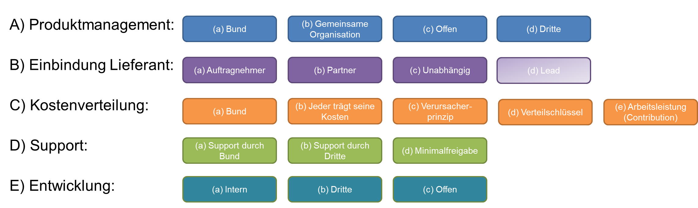

**Disclaimer:** This document is an evolving draft and part of the guidelines and tools designed to support the Federal Administration in publishing open source code. For more information, see the main [README](https://github.com/swiss/opensource-guidelines/tree/main).

---

# Objective and purpose

These guidelines are intended for ICT professionals who are responsible
for an application and want to offer it as open source or contribute to
such an application.  
This must be organised either formally or informally. This document
provides important information for organising and building a
community\[5\] and also for open development directly as an open source
project.

The type of community best suited for an application depends heavily on
the professional environment, potential users, and the strategy of the
publishing institution. There are many different ways to build
communities. Ideally, for a suitable project, it may be possible to join
an existing community. Alternatively, a community can be built with one
or more equal partners.

It is important that a **governance structure** should be established
and the relevant points documented in a **community concept** (see also
\[BITKOM2023\] Section 4.1 and \[IZqCab2023\].

As a second element, to promote standardisation, a directory of existing
community concepts is maintained as part of this document. The idea is
that new communities can be built with minimum effort based on
successful solutions.

This document does not include direct recommendations for organising
communities for software libraries (parts of software that fulfil
partial functions, e.g. PDF generation). Normally, no separate concept
is developed for these; instead, they use the simple template defined in
the GitHub repository template.

The document *Em002-01 Practical Guidelines for Open Source Software in
the Federal Administration* contains in Section 4 fundamental forms of
collaboration, in Section 8 the various support models, and in the Annex
information on market behaviour of open source.

It should be noted that communities for software can also be combined
with those for data, standardisation and business topics. The community
can then encompass processes, standardisation, software and data.
Existing frameworks such as eOperations, DVS and eCH can also be used
where appropriate.

An important aspect of a functioning community is that participants
receive more than they invest.

Key points:

  - In a first step, the community should be briefly reviewed using the
    checklist *\[Em002-4.1*\]. Only if it is needed should it be further
    developed.

  - An initial effort must always be made to build a community.

  - Communities should fulfil a purpose. There need to be interested
    parties and participants.

  - A community can emerge and then be formalised.

  - The goal of the community is to increase the benefit for everyone.

  - The community should be structured as simply as possible.

# Structure of the community concept

The document to be created by the project or application manager (or
commissioned from third parties) should follow this section structure.
Depending on the nature of specific community, not all sub-sections are
necessary. Ideally, many sections will refer to already standardised
documents or use standard processes of the corresponding repositories.
The community concept can also be applied to existing projects led by
others, especially if the effective governance is not already documented
in writing.  
By formalising the community, all participants are brought on board.

Structural draft of the community concept:

1.  Overview table  
    (name, repository, contact address, licence, depth of support,
    existing/new)

2.  Objectives
    
    1.  of the application
    
    2.  of the community

3.  Organisation
    
    1.  Owner of the code
    
    2.  Organisational form / committees
    
    3.  Voting rights
    
    4.  Project management
    
    5.  Procurement issues (if applicable)
    
    6.  Other governance aspects

4.  Roadmap and change process

5.  Development process
    
    1.  Open development
    
    2.  Committer rights
    
    3.  Review process
    
    4.  Task distribution and name citations
    
    5.  Backups

6.  Financing of the community

7.  Marketing

8.  Handling external contributions
    
    1.  Handling reported errors
    
    2.  Handling enquiries
    
    3.  Handling pull requests
    
    4.  Handling forks
    
    5.  CLA and assignment of rights/intellectual property

9.  Operation of the application

In principle, each federal authority is responsible for creating its own
community concepts. DTI can publish existing patterns/examples and
accepts corresponding examples.  
A possible source for parts is also the documentation of the Eclipse
Foundation\[6\], although appropriate tailoring should be carried out
here in the sense of 'only doing what is necessary'.

# Fundamental decisions

The principles of the community, or lack thereof, are determined using
*[Em002-4.1 OSS Community Checklist](em002-4.1.md)*. The relevant fundamental questions
can be found in the morphological box in Figure 1.

Figure 1 Morphological box OSS community

It is advisable to **focus primarily on the near future** when designing
the community; for example, if there are not yet any concrete interested
parties for the application, it usually makes little sense to define a
community with a simple company, its own association and complex
processes for developing the roadmap.\[7\]\[8\]

## Product management

Depending on the type of application, its strategic importance and its
status in the life cycle, there are different variants for mapping
product management.  
For organisations within federal authorities, this always concerns the
application managers. The definition of the technical and technological
roadmap and the release processes are particularly relevant for the
community concept.

Possibilities:

1)  **Organisations within the Confederation**: The Confederation wants
    to retain control, it alone defines the roadmap.

2)  **Joint organisation**: Together with other users or suppliers.

3)  **Open organisation**: Loose connections, no active roadmap.

4)  **Third parties**: Either the product already exists or the work is
    to be outsourced.

### Organisations within the Confederation:

If the application is of high strategic importance or the Confederation
depends on being able to implement its changes quickly, then it can make
sense to retain control. The federal authority alone decides, through
the requirements manager, what is incorporated in the software and when.

For potential other users of the application, this means that they are
practically forced to use their own version (fork) of the application.

Otherwise, they have hardly any opportunity to implement adjustments and
extensions that may be important to them. This does not argue against
publishing as open source: the code management tools\[9\] offer
extensive support for such scenarios, and adjustments and error
corrections can be selectively adopted in both directions.

Sharing the costs is typically difficult with this model.

### Joint (Confederation has the lead or equal partners)

Decisions regarding the roadmap and priorities should be coordinated and
made jointly with the other members of the community. The Confederation
participates as a member of the community but is not the lead
organisation.

For joint decision-making to work, structures and rules must be
determined in advance. This also defines how the costs for implementing
the jointly decided adjustments are divided among each other.

With this model, a single version of the application is created, which
is then used by all members. As a result, the total costs are
significantly lower compared to the other variants. However, the
flexibility of individual users is also lower, and they must coordinate
their adjustment requests in advance with all others. Decision-making is
slower and more time-consuming.

This model is best suited for applications that are to be further
developed jointly with clearly defined other organisations (e.g.
cantons).

### Open organisation

In this model, the processes and structures are only loosely defined.
The Confederation formally retains control but is open to contributions
and adjustments.

No roadmap or only a very rough one is defined; consensus is reached
informally and in discussions directly on the publication platform. The
community itself tends to be dynamic; members can be very active for a
while and then withdraw again.

This model is also suitable for smaller applications that are already in
productive use and are 'finished'.  
This is also usually the best form for technically orientated
applications or components that potentially appeal to a broader target
group which cannot be precisely defined in advance.

### Third party

In this model, the processes and structures are defined by a third party
and the federal authority is a member of the community but does not have
the lead. This may have happened because, for example, the project was
defined by another state or canton. Or it may be that the Confederation
is not interested in continuing the program itself and transfer this
task.

## Integration of suppliers

There are basically the following possibilities for integrating
suppliers:

1)  **Supplier as contractor**: They are generally considered
    replaceable in the medium term. The supplier should develop the
    application cost-effectively and to a high quality based on orders
    from product management (or the community), but has at most advisory
    influence on the roadmap and prioritisation.

2)  **Long-term partners with co-determination**: They should be able to
    actively co-determine the development. This strengthens their role
    and they are potentially willing to invest in the application
    themselves. Typically, in this model, the suppliers then distribute
    the software and actively look for new customers.

3)  **Independent:** The suppliers define for themselves whether and how
    they want to work on the project. This can occur, for example, if
    several suppliers want to generate their own business based on the
    software. Liberal licences can potentially promote this. It can also
    occur if the Confederation's strategy differs from that of the
    supplier.  
    In this scenario, it is likely that the supplier will create a fork.

4)  **Lead**: If the supplier takes over product management, then they
    have the lead. The development is then determined by them . On the
    other hand, this can also mean that the Federal Administration has
    to take very little responsibility. With a minimum release, it is
    possible for the supplier to take on this role on their own.

If the supplier takes on a strong role, this brings advantages for the
Federal Administration: by actively marketing the application, there is
a chance that the community will grow faster and stronger, thus reducing
the costs per member more quickly.

If a model with strong supplier co-determination is chosen, care must be
taken that this does not result in a deviation from procurement law
regulations. It is usually advisable to involve at least two suppliers
to avoid creating too strong a dependency on a single supplier. There
should also be the possibility for other suppliers to join the
community.

## Cost distribution

The following options are available for splitting the costs of
maintenance, further development and new functions:

1)  **Organisations within the Confederation***:* Especially when
    building ecosystems or if the federal authority will retain full
    control, the federal authority must also bear the costs.

2)  **Each their own**: Everyone pays for the changes they want
    themselves.  
    If necessary, it is decided on a case-by-case basis to pay for
    certain extensions jointly.  
    Recurring costs are billed according to a distribution key or on
    demand.

3)  **Originator pays principle**: Those who actually need the services
    or features pay for them. Standardised hourly rates may be applied.

4)  **Distribution key**: The costs are divided within the community
    according to a defined key. This only differs for specific
    expansions. These should be paid for directly by the users
    concerned.  
    The cost divider can be, for example, the size of the canton
    concerned or the number of users. For information on distribution
    keys, see also Section 5.8.

5)  **Contribution**: If the federal authority only contributes
    personnel to an existing project.

Basically, variant b (cost sharing) usually only makes sense if there is
also joint product management as in variant b (joint). Only those who
can have a say will be willing to bear the follow-up costs of the
decisions.

## Support

Within the cost distribution and effort, it is important to clarify who
provides what support. According to Art. 9 EMOTA, a pure minimum release
is possible. This variant may not deliver the desired effect and does
not in itself build a community in which the federal authority has
influence.

1)  **Minimum release***:* No support (i.e. release generally occurs
    without organised support and participation of the federal
    authority).

2)  **Support by the Confederation***:* The federal authority (or its
    service provider) provides defined support.

3)  **Support by third parties***:* The federal authority or the
    community defines a support organisation.

> The effect to be achieved, e.g. on the Swiss ecosystem or initial
> funding of a community, can lead to the Confederation providing
> support. The level of support must of course be defined. In principle,
> a fee may also be charged. Due to the mechanisms of the Confederation,
> service providers or suppliers are then more likely to be able to
> offer commercial support.
> 
> Offices may offer paid support in accordance with EMOTA (possibly also
> via service providers and third parties). To do this, they must
> publish the corresponding fees on their website, as the necessary
> legal basis is in place. The connection to the payment system can be
> discussed with the FDF.
> 
> Examples of support and fees can be found in Annex F.

## Development

The basic methodology of development can also have an influence on the
type of community.

1)  **Internal***:* The use of internal repositories means that third
    parties cannot work directly. The stricter the separation, the more
    integration effort the Confederation has to make if it wants to
    incorporate third-party extensions. The release process is also more
    complex.

2)  **Third parties**: Either a supplier works on their own or the
    product already started/led by a third party is developed according
    to defined rules.

3)  **Open**: Software development takes place directly in a public
    repository. The release according to EMOTA is therefore largely
    guaranteed. The expenses are to be paid during development. In this
    scenario, collaboration with third parties can also take place
    earlier (and more easily).

# Content for the community concept

This section provides guidance on writing the community concept based on
the fundamental decisions made (as per Section 3).

Where different content makes sense depending on the fundamental
decisions made,

<table>
<thead>
<tr class="header">
<th><blockquote>

Product management

</blockquote></th>
<th><blockquote>

Supplier as

</blockquote></th>
<th><blockquote>

Cost distribution

</blockquote></th>
<th>Proposal</th>
</tr>
</thead>
<tbody>
<tr class="odd">
<td><blockquote>

Open

</blockquote></td>
<td><blockquote>

Partner

</blockquote></td>
<td><blockquote>

Confederation

</blockquote></td>
<td>
Contents or suggestions, if the basic decisions are:

Product management c) Open organisation 
Supplier involvement: b) Supplier as partner 
Cost distribution: b) Each their own

<em>The text above can be copied into the template and adapted.</em>
</td>
</tr>
<tr class="even">
<td><blockquote>

Joint

</blockquote></td>
<td><blockquote>

-

</blockquote></td>
<td><blockquote>

Each their own

</blockquote></td>
<td>
Contents or suggestions, if the basic decisions are:

Product management b) Joint development 
Supplier involvement: a) or b) (not relevant) 
Cost distribution: c) Originator pays principle or d) Cost sharing
</td>
</tr>
<tr class="odd">
<td><blockquote>

Joint

</blockquote></td>
<td><blockquote>

-

</blockquote></td>
<td><blockquote>

Originator

</blockquote></td>
<td></td>
</tr>
</tbody>
</table>

The community concept should be a dynamic document that can be adapted
in consultation with the community. The concept should reflect the
current situation and propose future development options. If more
members join the community later, the organisation and processes can be
further elaborated, and more complex mechanisms can be introduced. The
following sub-sections directly follow the proposed structure of the
community concept (see Section 2).

If product management lies with third parties, they will define the
concepts for the community.

## Overview table

The following overview table should be created and published for each
community so that potential interested parties can register for the
software and the community:

| Software name                          |  |
| -------------------------------------- |  |
| Repository                             |  |
| Owner                                  |  |
| Responsible organisational unit/office |  |
| Contact address                        |  |
| Licence used                           |  |
| Support level                          |  |
| Existing project                       |  |

## Objectives

The objective should contain the actual purpose or 'vision' of the
application. This vision should also be included in the **README.md**
file in the repository (see *Em002-2.2 Analysis and Preparation
Checklist)*.

At the same time it should also describe what the community is aiming
for:

  - Who should join? Who are the potential interested parties?

  - Should new members be actively sought?

  - What are the main goals pursued by publishing as open source?

## Organisation and governance

In principle, for new developments, the aim is for the Confederation to
be the owner of the master rights to the source code .

The type of project management depends on which organisation had the
lead (SAFe, HERMES) in the case of the Confederation. The organisational
form should always seek minimum overhead (existing rather than new;
simple partnership rather than an association).

<table>
<thead>
<tr class="header">
<th><blockquote>

Product management

</blockquote></th>
<th><blockquote>

Supplier as

</blockquote></th>
<th><blockquote>

Development

</blockquote></th>
<th>Proposal</th>
</tr>
</thead>
<tbody>
<tr class="odd">
<td><blockquote>

Confederation

</blockquote></td>
<td><blockquote>

-

</blockquote></td>
<td><blockquote>

Internal

</blockquote></td>
<td>As the Confederation retains direct control, no additional organisational structures are necessary. 
The publishing entity (e.g. a federal office) retains ownership and assumes all coordination tasks. In this case, the 'Organisation' section can be kept very brief.</td>
</tr>
<tr class="even">
<td><blockquote>

Joint

</blockquote></td>
<td><blockquote>

-

</blockquote></td>
<td><blockquote>

Internal

</blockquote></td>
<td>
For this scenario, organisation as a <strong>simple partnership</strong> is usually recommended.

To enable joint development and coordination of the roadmap and requirements, it is advisable to create two groups, each with one participant per community member:

<ul>
<li><blockquote>

Management Board: Defines the strategy and prioritisation.

</blockquote></li>
<li><blockquote>

Expert group: Develops requirements and specific content at the expert level. Depending on the scope, a separate expert group can also be established for each topic.

</blockquote></li>
</ul>

The owner of the code is the office that published it.

If the structures become more complex or more than five users or additional members are involved, it may be worth considering whether the community should be better organised as an association. Compare the explanations in the variant directly below.
</td>
</tr>
<tr class="odd">
<td><blockquote>

Joint

</blockquote></td>
<td><blockquote>

-

</blockquote></td>
<td><blockquote>

Third party

</blockquote></td>
<td>
Organisation as an <strong>association</strong> is recommended. Either a separate association is founded specifically for the application, or the application is transferred to an existing association. An association is recommended because otherwise, the distribution of costs becomes complex, and there is likely to be enough work within the coordination tasks to employ a part-time manager for the association.

The rights to the code are then transferred to the association, which takes over community management and ordering from suppliers.
</td>
</tr>
<tr class="even">
<td><blockquote>

Joint

</blockquote></td>
<td><blockquote>

Contractor

</blockquote></td>
<td><blockquote>

Internal

</blockquote></td>
<td>
Organisation as an <strong>association</strong> is recommended. Either a separate association is founded specifically for the application, or the application is transferred to an existing association. An association is recommended because otherwise, the distribution of costs becomes complex, and there is likely to be enough work within the coordination tasks to employ a part-time manager for the association.

The rights to the code are then transferred to the association, which takes over community management and ordering from suppliers.

Here, the suppliers are not members of the association, but only contractors. The manager should not be appointed by a supplier.
</td>
</tr>
<tr class="odd">
<td><blockquote>

Joint

</blockquote></td>
<td><blockquote>

Contractor

</blockquote></td>
<td><blockquote>

Third party

</blockquote></td>
<td>
Organisation as an <strong>association</strong> is recommended. Either a separate association is founded specifically for the application, or the application is transferred to an existing association. An association is recommended because otherwise, the distribution of costs becomes complex, and there is likely to be enough work within the coordination tasks to employ a part-time manager for the association.

The rights to the code are then transferred to the association, which takes over community management and ordering from suppliers.

The suppliers are members of the association; the manager can also be provided by a supplier.
</td>
</tr>
<tr class="even">
<td><blockquote>

Open

</blockquote></td>
<td><blockquote>

-

</blockquote></td>
<td><blockquote>

Internal

</blockquote></td>
<td>
There is no <strong>need for a detailed description of an organisation</strong>, as it is deliberately designed to be open. However, it is important to establish who receives and processes external enquiries (responsibility).

It should also be determined whether and to what extent external persons can be involved:

<ul>
<li>
No direct integration: External parties can only submit suggestions and contributions (as pull requests).
</li>
<li>
Involvement as contributors: External parties who make frequent and good contributions are directly involved.
</li>
<li>
Handover to external parties possible: If, after publication, external parties contribute more to further development than the publishing organisation, the application can also be transferred to them.
</li>
</ul>

The publishing organisation retains ownership.

This variant corresponds to the organisation of 'classic' open source projects; see for example <a href="https://opensource.guide/leadership-and-governance/">https://opensource.guide/leadership-and-governance/</a> for further information.
</td>
</tr>
<tr class="odd">
<td><blockquote>

Open

</blockquote></td>
<td><blockquote>

Contractor

</blockquote></td>
<td><blockquote>

Internal

</blockquote></td>
<td>
There is no <strong>need for a detailed description of an organisation</strong>, as it is deliberately designed to be open. However, it is important to establish who receives and processes external enquiries (responsibility).

It should also be determined whether and to what extent external persons can be involved:

<ul>
<li>
No direct integration: External parties can only submit suggestions and contributions (as pull requests).
</li>
<li>
Involvement as contributors: External parties who make frequent and good contributions are directly involved.
</li>
<li>
Handover to external parties possible: If, after publication, external parties contribute more to further development than the publishing organisation, the application can also be transferred to them.
</li>
</ul>

The publishing organisation retains ownership.

This variant corresponds to the organisation of 'classic' open source projects; see for example <a href="https://opensource.guide/leadership-and-governance/">https://opensource.guide/leadership-and-governance/</a> for further information.

The supplier should only take on purely technical coordination tasks (code review, assessment).
</td>
</tr>
<tr class="even">
<td><blockquote>

Third party

</blockquote></td>
<td><blockquote>

Partner

</blockquote></td>
<td><blockquote>

Internal

</blockquote></td>
<td>
There is no <strong>need for a detailed description of an organisation</strong>, as it is deliberately designed to be open. However, it is important to establish who receives and processes external enquiries (responsibility).

It should also be determined whether and to what extent external persons can be involved:

<ul>
<li>
No direct integration: External parties can only submit suggestions and contributions (as pull requests).
</li>
<li>
Involvement as contributors: External parties who make frequent and good contributions are directly involved.
</li>
<li>
Handover to external parties possible: If, after publication, external parties contribute more to further development than the publishing organisation, the application can also be transferred to them.
</li>
</ul>

The publishing organisation retains ownership.

This variant corresponds to the organisation of 'classic' open source projects; see for example <a href="https://opensource.guide/leadership-and-governance/">https://opensource.guide/leadership-and-governance/</a> for further information.

The supplier can take over the coordination tasks.
</td>
</tr>
</tbody>
</table>

With regard to governance, \[BITKOM2023\] Section 4.1, \[IzCab2023\] or
<https://github.com/todogroup/ospo-career-path/blob/main/OSPO-101/module7/README.md#governance-models>
can also be consulted.

Examples of articles of association can be found in Annex E.

## Roadmap and change process

<table>
<thead>
<tr class="header">
<th><blockquote>

Product management

</blockquote></th>
<th><blockquote>

Supplier as

</blockquote></th>
<th><blockquote>

Development

</blockquote></th>
<th>Proposal</th>
</tr>
</thead>
<tbody>
<tr class="odd">
<td><blockquote>

Confederation

</blockquote></td>
<td><blockquote>

Contractor

</blockquote></td>
<td><blockquote>

-

</blockquote></td>
<td>The federal authority defines the roadmap and decides which changes will be implemented. The standard processes of the office XY are used for this.</td>
</tr>
<tr class="even">
<td><blockquote>

Confederation

</blockquote></td>
<td><blockquote>

Partner

</blockquote></td>
<td><blockquote>

-

</blockquote></td>
<td>The federal authority defines the roadmap in collaboration with company XY. It decides which changes will be implemented. The standard processes of the office XY are used for this.</td>
</tr>
<tr class="odd">
<td><blockquote>

Joint

</blockquote></td>
<td><blockquote>

-

</blockquote></td>
<td><blockquote>

Internal

</blockquote></td>
<td>
The process for developing the roadmap and approving changes must be determined by the members of the company or association. Depending on the member structure (number, size ratio, etc.), other processes may be appropriate.

However, the processes must include measures for conflict resolution and finding a majority.
</td>
</tr>
<tr class="even">
<td><blockquote>

Joint

</blockquote></td>
<td><blockquote>

-

</blockquote></td>
<td><blockquote>

Third party

</blockquote></td>
<td>
The process for developing the roadmap and approving changes must be determined by the members of the company or association. Depending on the member structure (number, size ratio, etc.), other processes may be appropriate.

However, the processes must include measures for conflict resolution and finding a majority.

With the addition that a cost distribution key must also be established. Consideration should also be given as to how to handle cost sharing for adjustments not desired by the relevant members. Especially in associations with members of unequal size, situations may arise where a large member (e.g. the federal authority) bears a significant portion of the costs for an extension without deriving any benefit from it.
</td>
</tr>
<tr class="odd">
<td><blockquote>

Open

</blockquote></td>
<td><blockquote>

-

</blockquote></td>
<td><blockquote>

-

</blockquote></td>
<td>
Example, not suitable for all situations

There is no need to create a roadmap; the application currently meets the needs.

Changes are decided upon in an open discussion and a consensus is sought. The final decision lies with the owner of the code (Swiss Confederation).
</td>
</tr>
</tbody>
</table>

## Development process

If open development comes into play, it should be defined here. Task
distribution and naming of central positions in the community concept
are important. Also, how the security of the repository content is
ensured.

<table>
<thead>
<tr class="header">
<th><blockquote>

Product management

</blockquote></th>
<th><blockquote>

Supplier as

</blockquote></th>
<th><blockquote>

Development

</blockquote></th>
<th>Proposal</th>
</tr>
</thead>
<tbody>
<tr class="odd">
<td><blockquote>

Confederation

</blockquote></td>
<td><blockquote>

-

</blockquote></td>
<td><blockquote>

-

</blockquote></td>
<td>
The committer rights (write access to the code) lie with the persons/entities/suppliers selected by the Confederation. After the contract expires, the respective rights are revoked.

The service providers and suppliers are responsible for conducting the technical code review process for external contributions that have been technically accepted by the Confederation. They are responsible for the technical quality. The suppliers are compensated for this work by the Confederation.
</td>
</tr>
<tr class="even">
<td><blockquote>

Joint

</blockquote></td>
<td><blockquote>

Contractor

</blockquote></td>
<td><blockquote>

Internal

</blockquote></td>
<td>
In principle, all entities commissioned by a community member receive write access to the code (committer rights). After the contract expires, the respective rights are revoked.

Where changed code affects core areas of the application, all changes must be reviewed by an entity specially commissioned by the community for this purpose. This entity is responsible for the technical quality of the application. It is also responsible for reviewing changes that have been technically accepted by the community.
</td>
</tr>
<tr class="odd">
<td><blockquote>

Joint

</blockquote></td>
<td><blockquote>

Partner

</blockquote></td>
<td><blockquote>

Third party

</blockquote></td>
<td>
The committer rights (write access to the code) lie with the members of the community. These persons organise themselves and jointly bear responsibility for the quality of the code.

If a community member commissions an external supplier for an adjustment or extension, the adjustment is reviewed by a member of the community. They are compensated for this by the client.

Changes to the core of the application must be reviewed by a second member of the community.

The suppliers who are community members are also responsible for reviewing external contributions and new technical code that has been technically accepted by the association.
</td>
</tr>
<tr class="even">
<td><blockquote>

Open

</blockquote></td>
<td><blockquote>

-

</blockquote></td>
<td><blockquote>

-

</blockquote></td>
<td>
Initially, the committer rights lie with the developers or their employers. Committer rights are granted to all developers who actively contribute to the project for several months and demonstrate appropriate social competence.

The individual developers generally retain their committer rights, even if they change their employer or the Confederation chooses a different supplier. Committer rights only expire if they are voluntarily relinquished or if the majority of other committers decide to revoke them.

The Confederation has the right to designate individual developers from the companies it commissions as committers. It does not have the right to revoke someone's committer rights without reason.

Code reviews are carried out by at least one person who acts as a committer. Committers organise themselves. The Confederation undertakes to compensate the review work as far as it is financially feasible for them.
</td>
</tr>
</tbody>
</table>

## Cost sharing and suppliers

<table>
<thead>
<tr class="header">
<th><blockquote>

Product management

</blockquote></th>
<th><blockquote>

Supplier as ...

</blockquote></th>
<th><blockquote>

Development

</blockquote></th>
<th>Proposal</th>
</tr>
</thead>
<tbody>
<tr class="odd">
<td><blockquote>

Confederation

</blockquote></td>
<td><blockquote>

Contractor

</blockquote></td>
<td><blockquote>

Internal

</blockquote></td>
<td>Suppliers are periodically selected through WTO tenders or a direct award procedure (depending on the scope of the maintenance services).</td>
</tr>
<tr class="even">
<td><blockquote>

Confederation

</blockquote></td>
<td><blockquote>

Partner

</blockquote></td>
<td><blockquote>

-

</blockquote></td>
<td>
Important: Check beforehand whether this is permissible under procurement law in the specific case.

We will make additions to the documentation on this point.

The Confederation chooses the supplier XXX as a strategic partner and aims for long-term cooperation.
</td>
</tr>
<tr class="odd">
<td><blockquote>

Joint

</blockquote></td>
<td><blockquote>

Contractor

</blockquote></td>
<td><blockquote>

Internal

</blockquote></td>
<td>
Each member of the community independently commissions one or more software suppliers to implement the adjustments and extensions they require.

Cost sharing is agreed on a case-by-case basis for adjustments requested by several members. The member with the largest share of the costs is responsible for selecting and commissioning the supplier.

(Regulations for software maintenance)
</td>
</tr>
<tr class="even">
<td><blockquote>

Joint

</blockquote></td>
<td><blockquote>

Contractor

</blockquote></td>
<td><blockquote>

Third party

</blockquote></td>
<td>
The association centrally selects the software suppliers periodically through WTO tenders or direct award procedures (depending on the scope of maintenance services).

The costs are allocated to the members according to a key: (to be defined: by population, user, etc.)
</td>
</tr>
<tr class="odd">
<td><blockquote>

Joint

</blockquote></td>
<td><blockquote>

Partner

</blockquote></td>
<td><blockquote>

Internal

</blockquote></td>
<td>
Each member of the community independently commissions one or more software suppliers to implement the adjustments and extensions they require.

Cost sharing is agreed on a case-by-case basis for adjustments requested by several members. The member with the largest share of the costs is responsible for selecting and commissioning the supplier.

<em>(Regulations for software maintenance)</em>

If necessary, supplemented by a contribution from the participating suppliers. Example:

<em>Each software development company that is a member of the community commits to investing at least XY working days per year at its own expense in the further development, technological updating, or marketing of the application.</em>
</td>
</tr>
<tr class="even">
<td><blockquote>

Joint

</blockquote></td>
<td><blockquote>

Partner

</blockquote></td>
<td><blockquote>

Third party

</blockquote></td>
<td>
The association centrally selects the software suppliers periodically through WTO tenders or direct award procedures (depending on the scope of maintenance services).

The costs are allocated to the members according to a key: (to be defined: by population, user, etc.)

If necessary, supplemented by the addition:

<em>Each software development company that is a member of the community commits to investing at least XY working days per year at its own expense in the further development, technological updating, or marketing of the application.</em>
</td>
</tr>
<tr class="odd">
<td><blockquote>

Third party

</blockquote></td>
<td><blockquote>

Contractor

</blockquote></td>
<td><blockquote>

-

</blockquote></td>
<td>
Suppliers are periodically selected through WTO tenders or a direct award procedure (depending on the scope of the maintenance services).

With the addition:

<em>The improvements contributed by potential suppliers and activities in the community are considered as a factor in the evaluation.</em>

Changes requested by external parties are not financed by the Confederation, but must be commissioned and paid for by the parties themselves.
</td>
</tr>
<tr class="even">
<td><blockquote>

Third party

</blockquote></td>
<td><blockquote>

Partner

</blockquote></td>
<td><blockquote>

-

</blockquote></td>
<td>
Each member of the community independently commissions one or more software suppliers to implement the adjustments and extensions they require.

Cost sharing is agreed on a case-by-case basis for adjustments requested by several members. The member with the largest share of the costs is responsible for selecting and commissioning the supplier.

(Regulations for software maintenance)

With the addition:

<em>The supplier is expected to actively participate in the community, even if these efforts are not directly compensated.</em>

<em>Changes requested by external parties are not financed by the Confederation, but must be commissioned and paid for by the parties themselves. The supplier agrees to implement these at fair prices at the request of the external party.</em>
</td>
</tr>
</tbody>
</table>

## Marketing

<table>
<thead>
<tr class="header">
<th><blockquote>

Product management

</blockquote></th>
<th><blockquote>

Supplier as

</blockquote></th>
<th><blockquote>

Development

</blockquote></th>
<th>Proposal</th>
</tr>
</thead>
<tbody>
<tr class="odd">
<td><blockquote>

Confederation

</blockquote></td>
<td><blockquote>

Contractor

</blockquote></td>
<td><blockquote>

-

</blockquote></td>
<td>
The Confederation does not actively market the application but publishes it on open-source software platforms. The publication of the application is announced in professional committees.

If interested parties come forward, we will consider whether to establish a joint community or continue working with their version of the software.
</td>
</tr>
<tr class="even">
<td><blockquote>

Joint

</blockquote></td>
<td><blockquote>

Partner

</blockquote></td>
<td><blockquote>

-

</blockquote></td>
<td>
Additionally:

Suppliers may market the application and seek further interested parties. The Confederation may be cited as a reference. We consciously accept that divergent versions of the software may emerge as a result.
</td>
</tr>
<tr class="odd">
<td><blockquote>

Joint

</blockquote></td>
<td><blockquote>

Contractor

</blockquote></td>
<td><blockquote>

Internal

</blockquote></td>
<td>The application is marketed by the members or the association.</td>
</tr>
<tr class="even">
<td><blockquote>

Joint

</blockquote></td>
<td><blockquote>

Partner

</blockquote></td>
<td><blockquote>

Internal

</blockquote></td>
<td>The application is marketed by suppliers.</td>
</tr>
<tr class="odd">
<td><blockquote>

Joint

</blockquote></td>
<td><blockquote>

-

</blockquote></td>
<td><blockquote>

Third party

</blockquote></td>
<td>The application is marketed by the association, the simple partnership and its members.</td>
</tr>
<tr class="even">
<td><blockquote>

Open

</blockquote></td>
<td><blockquote>

-

</blockquote></td>
<td><blockquote>

-

</blockquote></td>
<td>
The application may be marketed by suppliers, or explicit marketing may be foregone.

Alternative without explicit marketing:

The Confederation does not actively market the application but publishes it on open-source software platforms. In professional committees, we indicate that we have published the application and that collaboration is welcome.

We demonstrate the software to interested parties and attempt to integrate them into our processes for shaping the roadmap.
</td>
</tr>
</tbody>
</table>

## Handling external contributions

<table>
<thead>
<tr class="header">
<th><blockquote>

Product management

</blockquote></th>
<th><blockquote>

Supplier as ...

</blockquote></th>
<th><blockquote>

Development

</blockquote></th>
<th>Proposal</th>
</tr>
</thead>
<tbody>
<tr class="odd">
<td><blockquote>

Confederation

</blockquote></td>
<td><blockquote>

-

</blockquote></td>
<td><blockquote>

-

</blockquote></td>
<td>
External contributions and enquiries must also be processed even if the Confederation remains the sole decision-maker regarding the software (except in cases of minimum release, where a fork is inevitable).

We propose the following approach:

<em>Handling reported errors</em>

<em>We attempt to reproduce errors reported by external individuals, requesting clarification if necessary. If reproduction is successful, the Confederation commissions the correction of errors. 
If the error cannot be verified or if the effort to fix it is disproportionately high, we apologise to the person reporting the error and ask if they could submit a pull request to address it.</em>

<em>Handling enquiries</em>

<em>We respond to every incoming enquiry. If an enquiry cannot be resolved with reasonable effort and further time investment seems inefficient, we apologise, citing limited resources, and offer to connect the enquiring person with a supplier for further consultation.</em>

<em>Handling pull requests</em>

<em>We review each pull request carefully. To avoid unnecessary effort on the contributor's part, we immediately indicate if something contradicts our roadmap or if it is questionable whether we will accept the contribution. The Confederation decides independently and based on technical criteria which contributions to accept. Error corrections that have passed the review process are always accepted.</em>

<em>Handling forks</em>

<em>We support forks of our application. Those who implement the application should create their own fork. We review the resulting forks at least once a year and adopt good and suitable extensions.</em>
</td>
</tr>
<tr class="even">
<td><blockquote>

Joint

</blockquote></td>
<td><blockquote>

-

</blockquote></td>
<td><blockquote>

-

</blockquote></td>
<td>
External refers to contributions from outside the defined community (association members). Deviations from above:

<em>Handling forks</em>

<em>We aim to prevent (long-lived) forks of the application. Instead, interested parties should join the community directly. Within the community, we try to ensure all members use the main version.</em>
</td>
</tr>
<tr class="odd">
<td><blockquote>

Open

</blockquote></td>
<td><blockquote>

-

</blockquote></td>
<td><blockquote>

-

</blockquote></td>
<td>
<em>Building a functioning community and an open culture is important to us.</em>

<em>Handling reported errors</em>

<em>We attempt to reproduce and correct reported errors. We require active cooperation from the reporting individuals. If possible, they should create a pull request with an error correction directly.</em>

<em>Handling enquiries</em>

<em>We address each enquiry within a maximum of one week. Enquiries from active contributors are treated with priority and in depth. We try to involve other members in handling enquiries.</em>

<em>Handling pull requests</em>

<em>We aim to receive as many high-quality pull requests as possible. We involve all active contributors in the reviews and technical and professional assessment of pull requests. For controversial contributions, we try to reach a decision through informal voting.</em>

<em>Handling forks</em>

<em>We try to make forks unnecessary through active and open community management. If forks do emerge, we actively review them and attempt to incorporate the extensions and improvements developed there. In such cases, we actively request pull requests.</em>
</td>
</tr>
</tbody>
</table>

In general, it should be noted that contributions can range from
supporting other users to taking responsibility for entire parts of a
project (see \[BITKOM2023\] Section 4.2).

1.  **Operation of the
    application**

<table>
<thead>
<tr class="header">
<th><blockquote>

Product management

</blockquote></th>
<th><blockquote>

Supplier as ...

</blockquote></th>
<th><blockquote>

Development

</blockquote></th>
<th>Proposal</th>
</tr>
</thead>
<tbody>
<tr class="odd">
<td><blockquote>

Joint

</blockquote></td>
<td><blockquote>

-

</blockquote></td>
<td><blockquote>

-

</blockquote></td>
<td>Central operation can optionally be offered additionally by the central association, in the sense of Software as a Service (SaaS). It should be examined whether this is desired.</td>
</tr>
<tr class="even">
<td><blockquote>

-

</blockquote></td>
<td><blockquote>

Partner

</blockquote></td>
<td><blockquote>

-

</blockquote></td>
<td>It should be specified whether the supplier should also operate the software.</td>
</tr>
<tr class="odd">
<td><blockquote>

-

</blockquote></td>
<td><blockquote>

Lead

</blockquote></td>
<td><blockquote>

-

</blockquote></td>
<td>It should be stated that the supplier is responsible for operation.</td>
</tr>
</tbody>
</table>

Support levels and support contacts should also be specified in this
section.

1.  **Important notes**

## Further suggestions for community building

Further suggestions for good community management can be found at
[https://opensource.guide/code-of-conduct/](https://opensource.guide/code-of-conduct/)
and
[https://opensource.guide/best-practices/](https://opensource.guide/best-practices/)

## Communication

Publishing software and documentation opens a new communication channel
for the Federal Administration. If not done carefully and
professionally, it can quickly damage the public image of the
Confederation .

OSS communities in the Federal Administration are faced with conflicting
demands regarding communication: on the one hand, the general
**guidelines for communication** apply; on the other hand, the community
should facilitate **simple formal and informal collaboration** across
organisational boundaries, preferably without formal quality controls
and releases.

The use of public repositories and potentially public issue tracking and
wikis means that individual project staff members' statements are
visible to the public unfiltered. This requires project staff to
maintain a professional demeanour and adhere to quality standards for
publications in such settings.

In other OSS projects, this is regulated through the **Code of
Conduct**.  
The Federal Administration's own Code of Conduct\[10\] is very general,
but the core principle is applicable here:  
Staff carry out their duties with a sense of responsibility, integrity
and loyalty. In their private lives they also take care not to tarnish
the reputation, the credibility and the image of the Confederation

## Open development

If software development is planned in an open repository from the start,
release happens automatically. The relevant checklists according to the
instructions *\[Em002-2\]* must be completed at the beginning, and the
development processes of the service provider/supplier must allow this.
The advantage is that the community can be built from the very
beginning. Multiple organisations can also collaborate on the
development.

## User management

The project (or the support organisation) determines whether developers
and other project staff work on the project under their own name or
anonymously. If people are not working anonymously and already have
logins on the platforms, it is easiest to use these (whether business or
private).

When leaving the project, the corresponding rights on the project must
be deleted. Product management is responsible for this.

## Merging communities

Where possible, the number of communities should be kept small. If a
community already exists where a similar structure is envisioned for
similar problems with the same people, only one community should be
used.

## Security-relevant reports

In addition to normal error reports, if necessary due to the nature of
the project, there must be a way to confidentially report
security-relevant errors, as is available in a bug bounty programme, for
example.

The documents from trustbroker.swiss can serve as an example:

  - <https://github.com/trustbroker-swiss/trustbroker.swiss/blob/main/Security-and-Vulnerability-Disclosure.md>

## Avoiding forks

While forks are natural in the open-source world, reintegrating source
code, features, etc. is not trivial. It may make sense to seek dialogue
with individuals or institutions considering a fork.

## Distribution keys

It makes sense to agree on general distribution keys between the main
partners. These can be adjusted every few years or when the situation
fundamentally changes. For efficient work on the software, the large
partners should tend to take on slightly larger shares. The organisation
should work and not argue about finances. If the collaboration covers
several projects (for example, the industry solutions in the field of
standard gauge railways), a standardised distribution key should be used
for all. From the perspective of federal authorities, it is already good
if the costs do not have to be borne alone.

Possible criteria for distribution keys:

  - Estimation of benefit distribution (e.g. between federal authority
    and a supplier hoping for other customers)

  - Number of inhabitants/users (e.g. between offices, communes, cities)

  - Financial strength (e.g. cantons)

  - Gross national product (e.g. between cantons)

  - Who wants more control

To avoid discussions, the distribution key should not simply be attached
to the annual budget. A clause along the lines of the originator pays
principle may allow faster adjustments for some partners if they are
willing to pay extra.

The distribution key should at least apply to overheads,
maintenance/support, and a minimum of further development.

## Supplementary services according to Art. 9 paras 5 and 6 EMOTA

The federal authorities can (themselves, through service providers or
suppliers) provide supplementary services, particularly for integration,
maintenance, ensuring information security, and support.

The limitation is that they should serve the authorities' tasks and can
be provided with proportionate effort.

It follows that the federal authority cannot be the development company
for third parties. It fixes bugs, can handle security-relevant aspects,
can provide some support and integration assistance (all activities that
help to build a community). New developments and additional features for
third parties should primarily focus on the normal work purpose of the
authority. Of course, it may be that providing the software is part of
the task, in which case developments can be made at any time. It is also
stated that software development is not the core task of the federal
authority.

This means that if features are substantially developed exclusively for
third parties, they are to be integrated in partnership or through the
supplier.

To avoid procurement law problems, care should be taken in procuring
software and services to ensure that features can be provided to third
parties (possibly only governmental third parties) by suppliers.

The setting of fees has already been touched upon in the 'Support'
section. EMOTA is already the legal basis for such fees. These must be
communicated on the website of the respective federal authority.
Examples are listed in Annex F.

Art. 9 para. 6 states that normally the private sector should not be
competed with. This means that the fees should not be set too low and
should at least cover costs. In case of doubt, it is better to set
hourly rates too high rather than too low.

Generally, it is recommended to work with one to three different
standard hourly rates.

If a federal department wishes to define exceptions to para. 6, this
must not compete with the private sector. Under certain circumstances,
it may be easiest to set the fees and increase them if there is
opposition from private sector companies that can actually offer the
service.

## Digital sovereignty

As long as the Confederation does not have its own repository, to ensure
digital sovereignty, it is recommended to regularly make copies from
public repositories.  
It should be noted that not only the source code but also other
information such as issue tracking, wiki, configurations, etc. is
copied.  
Furthermore, user management needs to be resolved to ensure control over
the published source code. The overarching goal is to ensure development
independent of the respective platform and to enable the community to
switch.\[11\]

# Annex

## Changes from previous version

New document

## References

See *Em002 Strategic Guidelines for Open Source Software in the Federal
Administration*.

## Abbreviations

See *Em002 Strategic Guidelines for Open Source Software in the Federal
Administration* and *[Em002-6 FAQ on OSS and Art. 9 EMOTA](em002-6.md).*

## Examples of existing community concepts

In the spirit of collecting best practices, the following are community
concepts and comparable documents that have already been developed.
These are not necessarily just concepts from federal authorities, but
also from other organisations.

  - GERES-Community
    ([http://geres-community.ch](http://geres-community.ch))

> Classification:

  - Product management a) Joint development

  - Supplier rather a) Contractor

  - Cost distribution: b) Cost sharing

> NB: The commune register GERES is not open source, but many aspects of
> the organisation can also be relevant for open source applications.
> Documents: Statutes (public) and Rules of Procedure (on request).

  - [iGov Portal](https://www.igovportal.ch)

This section currently contains concepts from the Canton of Bern and
will be supplemented as soon as federal examples are available.

## Inspiration for association statutes

The following statutes can serve as inspiration for your own. They
should be kept as simple as possible:

  - eCH:
    <https://www.ech.ch/sites/default/files/page/STAT_d_DEF_2014-04-10_ech-Statuten.pdf>

  - Stop Piracy:
    <https://www.stop-piracy.ch/wp-content/uploads/2022/01/Statuten_d_10_09_2021.pdf>

Further association statutes will be added.

## Examples of support and fees

  - Fees for statistical services:
    [https://www.fedlex.admin.ch/eli/cc/2003/326/de](https://www.fedlex.admin.ch/eli/cc/2003/326/en)

  - FDPIC fees:
    <https://www.edoeb.admin.ch/edoeb/en/home/datenschutz/grundlagen/dsfa.html>

  - Free services from IPI for courses in the field of intellectual
    property (not software, but as an example):
    https://www.ige.ch/en/services/ip-academy/general-information/prices

Examples will be added as soon as they are available.

1.  Recommendation for Federal Administration IT in accordance with
    \[P035\] *Section 4.6*

2.  For definitions of the INTERNAL and CONFIDENTIAL classifications,
    see the *Ordinance of 8 November 2023 on Information Security in the
    Federal Administration and Armed Forces (InfoSecO; SR 128.1)*

3.  See footnote 1

4.  Planning areas in accordance with the *Federal Administration IT
    Strategy 2020-2023 of 3 April 2020 (SB000)*

5.  The community of an open source project typically represents a
    pyramid.  
    The foundation of this pyramid is the users of the software,
    especially the committed ones who actively participate in the
    community, for example in the form of bug reports and feature
    requests or through contributions to mailing lists.  
    Directly above in the pyramid are contributors. These are parts of
    the community that propose their own code contributions. They
    typically do not have write access to the repository. Their
    contributions are reviewed by maintainers of the project and
    incorporated into the repository after reaching the project-typical
    quality.  
    At the top of the pyramid are the maintainers or committers of a
    project. In this role, a developer has a higher responsibility. This
    is expressed, for example, in the ability to accept contributions.
    This right is often manifested through write access to the
    repository. At this level, control over the software, its quality,
    and range of functions takes place. In more complex projects, this
    level can be further subdivided. For example, the Linux kernel is
    known to have subsystem maintainers at multiple levels, and
    ultimately only a single developer, Linus Torvalds, incorporates the
    patches into the project repository. Another example is projects of
    the Eclipse Foundation, which typically have a project lead with
    additional rights in the context of the Eclipse Foundation
    development process, such as initiating the release process or
    formal election of committers or project leads \[BITKOM2023\]

6.  See <https://www.eclipse.org/projects/handbook/#starting>

7.  With an association (or foundation), a separate legal entity is
    created to look after the software and the product. This only pays
    off from a certain level of importance, complexity and the existence
    of several (equal) partners. A roadmap is used to show the wider
    public and potential additional users of the software what is
    planned.

8.  It may also be possible, especially for projects that involve
    several state actors from the outset, to approach existing
    foundations and see whether the projects and governance can be
    managed under their umbrella, analogous to https://finos.org or
    <https://osr.finos.org> or https://www.eclipse.org/collaborations/
    or https://iot.eclipse.org or
    https://outreach.eclipse.foundation/open-regulatory-compliance.

9.  e.g. GitHub

10. https://www.epa.admin.ch/dam/epa/fr/dokumente/aktuell/medienservice/120\_verhaltenskodex\_e.pdf.download.pdf/120\_verhaltenskodex\_e.pdf

11. See also
    <https://www.bfh.ch/de/aktuell/news/2024/neue-studie-digitale-souveraenitaet/>
