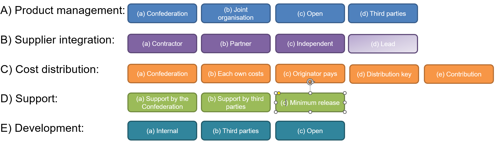
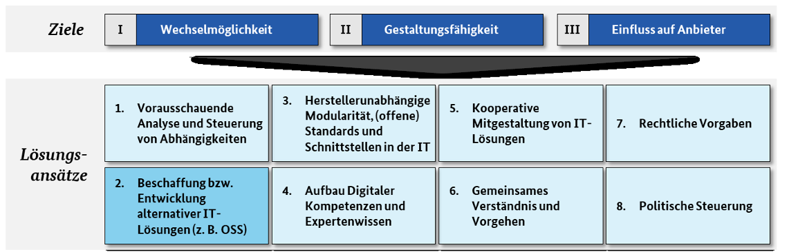

**Disclaimer:** This document is an evolving draft and part of the guidelines and tools designed to support the Federal Administration in publishing open source code. For more information, see the main [README](https://github.com/swiss/opensource-guidelines/tree/main).

---

# Main points at a glance

The most important points of the document are listed below.

-   The establishment or maintenance of an OSS community is **not required** under Art. 9 EMOTA.

-   A community is relevant if a user group makes sense and **synergies** with other users of the software are to be created.

-   A community is not limited to the software itself, but can also include the processes in the environment and the standardisation of data.

-   An **initial effort** must always be made to build a community. This usually continues. In many cases, it makes sense for the lead office to also bear the coordination costs.

-   Communities should fulfil a **purpose**. There need to be interested parties and participants.

-   A community can emerge and then be formalised.

-   The goal of the community is to increase the **benefit for everyone**.
    General principle: \'You get back at least as much as you put in\'.

-   The community should be **structured as simply as possible**.

-   In a first step, the community should be briefly reviewed using the checklist [Em002-4.1](./Em002-4.1%20Checklist%20OSS%20Community.odt). Only if it makes sense should it be further developed.

-   Formalisation takes place via a **community concept**. As much as possible should be taken from existing sources.
    General principle: \'Don\'t reinvent the wheel\'.

-   If collaboration is the aim, this must be taken into account at the very beginning of the project, as potential partners should already be picked up during the requirements analysis. This also needs to be well planned from the outset in terms of legal and procurement law.

-   The options for joining an existing collaboration in regard to legal and procurement law must be examined.

-   No community needs to be set up for contributions. However, if required by the project, the corresponding **Contributor Licence Agreement (CLA)** must be signed or the developers must be uthorised by the project to submit the software under a Developer Certificate of Origin (DCO).

# Introduction

These guidelines are intended for ICT professionals who are responsible for an application and want to offer it as open source or contribute to such an application.

This must be organised either formally or informally.

This document provides important information for organising and building a community[^5] and also for open development directly as an open source project.

As a second element, to promote standardisation, a directory of existing community concepts is maintained as part of this document. The idea is that new communities can be built with minimum effort based on successful solutions.

This document does not include direct recommendations for organising  communities for software libraries (parts of software that fulfil partial functions, e.g. PDF generation). Normally, no separate concept is developed for these; instead, they use the simple template defined in the repository\'s storage template.

The document [Em002-01 Practical Guidelines for Open Source Software in the Federal Administration](./em002-1.md) contains in Section 4 fundamental forms of collaboration, in Section 8 the various support models, and in the Annex information on market behaviour of open source.

# Type, aim and purpose of a community

A community can pursue the following purposes:

-   Survey of additional requirements

-   Dissemination of knowledge about the application

-   Better feedback from users

-   Promoting translations, documentation and training

-   Spreading standardisation

-   Generally improved interaction with users

-   Expansion of cooperation to include other parties

-   Promotion of further software based on the software

The type of community best suited for an application depends heavily on the professional environment, potential users, and the strategy of the publishing institution. There are many different ways to build communities. Ideally, for a suitable project, it may be possible to join an existing community. Alternatively, a community can be built with one or more equal partners.

It is important that a **governance structure** should be established  and the relevant points documented in a **community concept** (see also *\[BITKOM2023\]* Section 4.1 and *\[IZqCab2023\]*.

It should be noted that communities for software can also be combined  with those for data, standardisation and business topics. The community can then encompass processes, standardisation, software and data. Existing frameworks such as eOperations, DVS and eCH can also be used where appropriate.

An important aspect of a functioning community is that participants receive more than they invest.

The following constellations exist:

-   **Community around a federal OSS**: Governance and community concept must be created. In this context, it is also necessary to regulate how third parties can make contributions.

-   **New collaboration to solve a problem**: In addition to governance and the community concept, the entire legal structure of the collaboration must be established.

-   **Joining a collaboration**: The Federal Administration must examine whether and how it can do this.

-   **Contribution to a third-party project**: The point to be checked is the project\'s policy for contribution (Contributor Licence Agreement, Developer Certificate of Origin, etc.).

Procurement law issues are dealt with in [Em002-7 Strategic Aspects of Procurement and Open Source Software](em002-7.md).

## Special case: New collaboration for the development, maintenance and support of open source software

The collective costs of open source software decrease when it is developed and further maintained collaboratively. This can occur without formal cooperation arrangements, or with no more than joint planning.

Where a more formal collaboration is sought, a market assessment should be carried out to ensure that collaboration is the most appropriate form of cooperation. Collaborations are more cost-effective than individual development by each party (see [Em002-4.1](./Em002-4.1%20Checklist%20OSS%20Community.odt)).

It should be noted that, for collaborations, it makes sense to initiate the collaboration at a very early stage in the HERMES[^6] project methodology --- specifically during the situation analysis and
requirements phases.

Collaboration is generally permitted in Switzerland under Article 4 EMOTA.

In addition to all other considerations, collaborations have both a legal and a procurement law dimension. At present, each case is assessed individually. Over time, standardised templates will become established.

### Legal dimension

Association memberships are feasible, though these are generally assessed on a case-by-case basis: who is behind the association, and what obligations are being entered into.
Delegation of memberships to eOperations or similar organisations would be possible.

As long as no money changes hands and no formal obligations need to be entered into, a Memorandum of Understanding at the level of the federal office or the Federal Chancellery is possible.

A situation requiring the conclusion of an international treaty should be avoided.

There are also two special cases[^7] in which a collaboration would already be covered:

-   Contracts awarded under an international agreement concerning the joint implementation of a project by signatory states.

-   Contracts awarded in accordance with the special procedures or conditions of an international organisation.

### Procurement law dimension

In many cases, collaboration will take place between public sector organisations. In such cases, procurement is unproblematic where the arrangement is \'in-state\' (see [Em002-7 Strategic Aspects of Procurement and Open Source Software](em002-7.md)).

Contracts with foreign companies not domiciled in Switzerland are possible, provided procurement law requirements are met.

The procurement of an organisation\'s own resources takes place within the framework of a standard procurement process, or has already been completed.

## Special case: Joining an existing collaboration

This requires both a legal basis and compliance with procurement law.

The simplest approach is to participate on a \'each party bears its own costs\' basis. This can also cover overhead costs, provided that either internal resources or correctly tendered external resources are used.

Direct participation in foreign collaborations is more difficult. A simple association via a Memorandum of Understanding is the easiest option to achieve.

## Special case: Contributing code to third-party OSS projects

Where the Federal Administration makes modifications to the code of an existing OSS project, it makes sense to contribute these changes directly upstream to the original project. This means that ongoing maintenance no longer needs to be carried out by the Federal Administration.

Under Article 9 EMOTA, such contributions are in fact encouraged. From a procurement law perspective, this is unproblematic.

It is important that the rights holder makes the contribution. This means that the Federal Administration assumes responsibility for doing so on behalf of its staff and contractors. Specifically, any Contributor Licence Agreement for the project must be signed, or a Developer Certificate of Origin must be included with the pull request.

A **Developer Certificate of Origin**[^8] **(DCO)** for the Federal Administration could read:

<table>
    <tr>
        <td>
           Developer Certificate of Origin 
Version 1.1

Copyright (C) 2004, 2006 The Linux Foundation and its contributors.

Everyone is permitted to copy and distribute verbatim copies of this licence document, but changing it is not allowed.

Developer's Certificate of Origin 1.1

By making a contribution to this project, we certify that:

(a) The rights to this contribution are owned by the Swiss Confederation and I am authorised to submit it under the open source licence indicated in the file; or

(b) The contribution is based upon previous work that, to the best of my knowledge, is covered under an appropriate open source licence and I have the right under that licence to submit that work with modifications, whether created in whole or in part by me, under the same open source license (unless I am permitted to submit under a different licence), as indicated in the file; or

(c) The contribution was provided directly to me by some other person who certified (a), (b) or (c) and I have not modified it.

(d) I understand and agree that this project and the contribution are public and that a record of the contribution (including all personal information I submit with it, including my sign-off) is maintained indefinitely and may be redistributed consistent with this project or the open source licence(s) involved.
        </td>
    </tr>
</table>

The structure of a Contributor Licence Agreement is described in [Em002-3 OSS Licensing Guidelines](em002-3.md), Section 8.9.

The effective transfer of code takes place in accordance with the guidelines of the respective project.

# Community concept

A community\'s core is ultimately its structure and governance. These are recorded in a community concept.

The community concept to be created by the project or application manager (or commissioned from third parties) should follow this section structure. Depending on the nature of specific community, not all sub-sections are necessary. Ideally, many sections will refer to already standardised documents or use standard processes of the corresponding repositories. The community concept can also be applied to existing projects led by others, especially if the effective governance is not yet documented in writing.

By formalising the community, all participants are brought together and the onboarding of new participants is simplified.

Structural draft of a community concept:

1.  Overview table
    (name, repository, contact address, licence, depth of support, existing/new)

2.  Objectives

    a.  of the application

    b.  of the community

3.  Organisation

    a.  Owner of the code

    b.  Organisational form / committees

    c.  Voting rights

    d.  Project management

    e.  Procurement issues (if applicable)

    f.  Other governance aspects

4.  Roadmap and change process

5.  Development process

    a.  Open development

    b.  Committer rights

    c.  Review process

    d.  Task distribution and name citations

    e.  Backups

6.  Financing of the community

7.  Marketing

8.  Handling external contributions

    a.  Handling reported errors

    b.  Handling enquiries

    c.  Handling pull requests

    d.  Handling forks

    e.  CLA, DCO and assignment of rights/intellectual property

9.  Operation of the application

In principle, each federal authority is responsible for creating the community concepts. DTI can publish existing patterns/examples and accepts corresponding examples for publication.
It also makes sense for community managers to exchange information with each other.

A possible source for parts is also the documentation of the Eclipse Foundation,[^9] although appropriate tailoring should be carried out here in the sense of \'only doing what is necessary\'.

# Fundamental decisions when building a community

The principles of the community, or lack thereof, are determined using [Em002-4.1](./Em002-4.1%20Checklist%20OSS%20Community.odt). The relevant fundamental questions can be found in the morphological box in Figure 1.

Figure 1 Morphological box OSS community

It is advisable to **focus primarily on the near future** when designing the community; for example, if there are not yet any concrete interested parties for the application, it usually makes little sense to define a community with a simple company, its own association and complex processes for developing the roadmap.[^10] [^11]

## Product management

Depending on the type of application, its strategic importance and its status in the life cycle, there are different variants for mapping product management.
For organisations within federal authorities, this always concerns the application managers. The definition of the technical and technological roadmap and the release processes are particularly relevant for the community concept.

Possibilities:

a)  **Organisations within the Confederation**: The Confederation wants to retain control; it alone defines the roadmap.

b)  **Joint organisation**: Together with other users or suppliers.

c)  **Open organisation**: Loose connections, no active roadmap.

d)  **Third parties**: Either the product already exists or the work is to be outsourced.

### Organisations within the Confederation:

If the application is of high strategic importance or the Confederation depends on being able to implement its changes quickly, then it can make sense to retain control.

The federal authority alone decides, through the requirements manager, what is incorporated in the software and when.

For potential other users of the application, this means that they are practically forced to use their own version (fork) of the application.

Otherwise, they have hardly any opportunity to implement adjustments and extensions that may be important to them. This does not argue against publishing as open source: the code management tools[^12] offer extensive support for such scenarios, and adjustments and error corrections can be selectively adopted in both directions.

Sharing the costs is typically difficult with this model.

### Joint (Confederation has the lead or equal partners)

Decisions regarding the roadmap and priorities should be coordinated and made jointly with the other members of the community. The Confederation participates as a member of the community but is not the lead organisation.

For joint decision-making to work, structures and rules must be determined in advance. This also defines how the costs for implementing the jointly decided adjustments are divided among each other.

With this model, a single version of the application is created, which is then used by all members. As a result, the total costs are significantly lower compared to the other variants. However, the flexibility of individual users is also lower, and they must coordinate their adjustment requests in advance with all others. Decision-making is slower and more time-consuming.

This model is best suited for applications that are to be further developed jointly with clearly defined other organisations (e.g. cantons).

### Open organisation

In this model, the processes and structures are only loosely defined. The Confederation formally retains control but is open to contributions and adjustments.

No roadmap or only a very rough one is defined; consensus is reached informally and in discussions directly on the publication platform. The community itself tends to be dynamic; members can be very active for a while and then withdraw again.

This model is also suitable for smaller applications that are already in productive use and are \'finished\'.
This is also usually the best form for technically orientated applications or components that potentially appeal to a broader target group which cannot be precisely defined in advance.

### Third party

In this model, the processes and structures are defined by a third party and the federal authority is a member of the community but does not have the lead. This may have happened because, for example, the project was defined by another state or canton. Or it may be that the Confederation is not interested in continuing the program itself and transfer this task.

## Integration of suppliers

There are basically the following possibilities for integrating suppliers:

a)  **Supplier as contractor**: They are generally considered replaceable in the medium term. The supplier should develop the application cost-effectively and to a high quality based on orders from product management (or the community), but has at most advisory influence on the roadmap and prioritisation.

b)  **Long-term partners with co-determination**: They should be able to actively co-determine the development. This strengthens their role and they are potentially willing to invest in the application themselves. Typically, in this model, the suppliers then distribute the software and actively look for new customers.

c)  **Independent:** The suppliers define for themselves whether and how they want to work on the project. This can occur, for example, if several suppliers want to generate their own business based on the software. Liberal licences can potentially promote this. It can also occur if the Confederation\'s strategy differs from that of the supplier.
In this scenario, it is likely that the supplier will create a fork.

d)  **Lead**: If the supplier takes over product management, then they have the lead. The development is then determined by them. On the other hand, this can also mean that the Federal Administration has to take very little responsibility. With a minimum release, it is possible for the supplier to take on this role on their own.

If the supplier takes on a strong role, this brings advantages for the Federal Administration: by actively marketing the application, there is a chance that the community will grow faster and stronger, thus reducing the costs per member more quickly.

If a model with strong supplier co-determination is chosen, care must be taken that this does not result in a deviation from procurement law regulations. It is usually advisable to involve at least two suppliers to avoid creating too strong a dependency on a single supplier. There should also be the possibility for other suppliers to join the community.

## Cost distribution

The following options are available for splitting the costs of maintenance, further development and new functions: 

a)  **Organisations within the Confederation***:* Especially when building ecosystems or if the federal authority will retain full control, the federal authority must also bear the costs.

b)  **Each their own**: Everyone pays for the changes they want themselves.
    If necessary, it is decided on a case-by-case basis to pay for certain extensions jointly.
    Recurring costs are billed according to a distribution key or on demand.

c)  **Originator pays principle**: Those who actually need the services or features pay for them. Standardised hourly rates may be applied.

d)  **Distribution key**: The costs are divided within the community according to a defined key. This only differs for specific expansions. These should be paid for directly by the users concerned.
    The cost divider can be, for example, the size of the canton concerned or the number of users. Regarding the distribution key, see also Section **Fehler! Verweisquelle konnte nicht gefunden werden.**.

e)  **Contribution**: If the federal authority only contributes personnel to an existing project.

Basically, variant b (cost sharing) usually only makes sense if there is also joint product management as in variant b (joint). Only those who can have a say will be willing to bear the follow-up costs of the decisions.

## Support

Within the cost distribution and effort, it is important to clarify who provides what support. According to Art. 9 EMOTA, a pure minimum release is possible. This variant may not deliver the desired effect and does not in itself build a community in which the federal authority has influence.

a)  **Minimum release**: No support (i.e. release generally occurs without organised support and participation of the federal authority).

b)  **Support by the Confederation**: The federal authority (or its service provider) provides defined support.

c)  **Support by third parties**: The federal authority or the community defines a support organisation.

The effect to be achieved, e.g. on the Swiss ecosystem or initial funding of a community, can lead to the Confederation providing support.The level of support must of course be defined. In principle, a fee may also be charged. Due to the mechanisms of the Confederation, service providers or suppliers are then more likely to be able to offer commercial support.

Offices may offer paid support in accordance with EMOTA (possibly also via service providers and third parties). To do this, they must publish the corresponding fees on their website, as the necessary legal basis is in place. The connection to the payment system can be discussed with the FDF.

Examples of support and fees can be found in Annex G.

## Development

The basic methodology of development can also have an influence on the type of community.

a)  **Internal**: The use of internal repositories means that third parties cannot work directly. The stricter the separation, the more integration effort the Confederation has to make if it wants to incorporate third-party extensions. The release process is also more complex.

b)  **Third parties**: Either a supplier works on their own or the product already started/led by a third party is developed according to defined rules.

c)  **Open**: Software development takes place directly in a public repository.
    The release according to EMOTA is therefore largely guaranteed. The expenses are to be paid during development. In this scenario, collaboration with third parties can also take place earlier (and more easily).

# Detailed content for the community concept

This section provides guidance on writing the community concept based on the fundamental decisions made (as per Section 5).

<table>
    <thead>
    <tr style="background-color:#4da6ff; color:white; height:140px">
        <td  style="transform: rotate(-90deg); width:60px;border:none; padding-right: 20px;  font-weight: bold; ">
        Product management
        </td>
        <td style="transform: rotate(-90deg); padding-right: 20px;  font-weight: bold; border: none;">
        Supplier as
        </td>
        <td  style="transform: rotate(-90deg); padding-right: 20px;  font-weight: bold; border: none;">
        Development
        </td>
       <td style="text-align: center; padding-right: 20px;  font-weight: bold; border: none;">
           Proposal
        </td>
    </tr>
    <tr style="border: none;">
    <td style="transform: rotate(-90deg); border-right: none; border-bottom: none;">
    open
    </td>
    <td style="transform: rotate(-90deg); border-right: none; border-bottom: none;">
        Partner
    </td>
    <td style="transform: rotate(-90deg); border-right: none; border-bottom: none;">
        Federal government
    </td>
    <td style="vertical-align: top; border-left: 1px solid #ccc; padding-left: 20px; border-top: none; border-right: none; border-bottom: none; padding-top: 20px;">
    Contents or suggestions, if the basic decisions are: 
Product management c) Open organisation 
Supplier involvement: b) Supplier as partner 
Cost distribution: b) Each their own 
<i>The text above can be copied into the template and adapted.</i> 
  </tr>
    <tr style="border: none;">
    <td style="transform: rotate(-90deg); border-right: none; border-bottom: none;">
    Joint
    </td>
   <td style="transform: rotate(-90deg); border-right: none; border-bottom: none;">
        -
    </td>
    <td style="transform: rotate(-90deg); border-right: none; border-bottom: none;">
        Each their own
    </td>
    <td style="vertical-align: top; border-left: 1px solid #ccc; padding-left: 20px; border-top: none; border-right: none; border-bottom: none; padding-top: 20px;">
   Contents or suggestions, if the basic decisions are: 
Product management b) Joint development 
Supplier involvement: a) or b) (not relevant) 
Cost distribution: c) Originator pays principle or d) Cost sharing
  </tr>
    <tr style="height:140px">
    <td style="transform: rotate(-90deg); border-right: none; border-bottom: none;">
    Joint
    </td>
    <td style="transform: rotate(-90deg); border-right: none; border-bottom: none;">
        -
    </td>
    <td style="transform: rotate(-90deg); border-right: none; border-bottom: none;">
        Originator
    </td>
    <td style="vertical-align: top; border-left: 1px solid #ccc; padding-left: 20px; border-top: none; border-right: none; border-bottom: none; padding-top: 20px;">
  </tr>
    </thead>
</table>

The community concept should be a dynamic document that can be adapted in consultation with the community. The concept should reflect the current situation and propose future development options. If more members join the community later, the organisation and processes can be further elaborated, and more complex mechanisms can be introduced. The following sub-sections directly follow the proposed structure of the community concept (see Section 4).

If product management lies with third parties, they will define the concepts for the community.

## Key information

The following key information should be drawn up and published for each community so that potential interested parties can register for the software and the community:
-   Software name

-   Repository

-   Owner

-   Responsible organisational unit/office

-   Contact address

-   Licence used

-   Support level

-   Existing project

This information can all be displayed with publiccode.yml.[^13]

## Objectives

The objective should contain the actual purpose or \'vision\' of the application. This vision should also be included in the **README.md** file in the repository (see [Em002-2.2 Analysis and Preparation Checklist](./Em002-2.2%20Checklist%20OSS%20Analysis%20and%20Preparation.odt)).

At the same time, it should also describe what the community is aiming for:

-   Who should join?

-   Who are the potential interested parties?

-   Should new members be actively sought?

-   What are the main goals pursued by publishing as open source?

## Organisation and governance

In principle, for new developments, the aim is for the Confederation to be the owner of the master rights to the source code.

The type of project management depends on which organisation had the lead (SAFe, HERMES) in the case of the Confederation. The organisational form should always seek minimum overhead (existing rather than new; simple partnership rather than an association).

<table>
    <thead>
    <tr style="background-color:#4da6ff; color:white; height:140px; width:200px">
        <td  style="transform: rotate(-90deg); width:60px;border:none; padding-right: 20px;  font-weight: bold; ">
        Product management
        </td>
        <td style="transform: rotate(-90deg); padding-right: 20px;  font-weight: bold; border: none;">
        Supplier as
        </td>
        <td  style="transform: rotate(-90deg); padding-right: 20px;  font-weight: bold; border: none;">
        Development
        </td>
       <td style="text-align: center; padding-right: 20px;  font-weight: bold; border: none;">
           Proposal
        </td>
    </tr>
    <tr style="border: none;">
    <td style="transform: rotate(-90deg); border-right: none; border-bottom: none;padding-right: 20px; color: #000; font-weight: bold;">
    Federal government
    </td>
    <td style="transform: rotate(-90deg); border-right: none; border-bottom: none;">
        -
    </td>
    <td style="transform: rotate(-90deg); border-right: none; border-bottom: none;">
        Internal
    </td>
    <td style="vertical-align: top; border-left: 1px solid #ccc; padding-left: 20px; border-top: none; border-right: none; border-bottom: none; padding-top: 20px;">
   As the Confederation retains direct control, no additional organisational structures are necessary.  
The publishing entity (e.g. a federal office) retains ownership and assumes all coordination tasks. In this case, the 'Organisation' section can be kept very brief.
  </tr>
    <tr style="border: none;">
    <td style="transform: rotate(-90deg); border-right: none; padding-right: 20px; color: #000; font-weight: bold; border: none;">
    Joint
    </td>
   <td style="transform: rotate(-90deg); border-right: none; border-bottom: none;">
        -
    </td>
    <td style="transform: rotate(-90deg); border-right: none; border-bottom: none;">
        Internal
    </td>
    <td style="vertical-align: top; border-left: 1px solid #ccc; padding-left: 20px; border-top: none; border-right: none; border-bottom: none; padding-top: 20px;">
   For this scenario, organisation as a <strong>simple partnership</strong> is usually recommended. 
To enable joint development and coordination of the roadmap and requirements, it is advisable to create two groups, each with one participant per community member: 
        <ol>
            •  Management Board: Defines the strategy and prioritisation.
        </ol>
        <ol>
            • Expert group: Develops requirements and specific content at the expert level. Depending on the scope, a separate expert group can also be established for each topic.
        </ol>
    
The owner of the code is the office that published it.
        
If the structures become more complex or more than five users or additional members are involved, it may be worth considering whether the community should be better organised as an association. Compare the explanations in the variant directly below.
  </tr>
    <tr style="height:140px">
    <td style="transform: rotate(-90deg); border-right: none; padding-right: 20px; color: #000; font-weight: bold; border: none;">
    Joint
    </td>
    <td style="transform: rotate(-90deg); border-right: none; border-bottom: none;">
        -
    </td>
    <td style="transform: rotate(-90deg); border-right: none; border-bottom: none;">
     Third party
    </td>
    <td style="vertical-align: top; border-left: 1px solid #ccc; padding-left: 20px; border-top: none; border-right: none; border-bottom: none; padding-top: 20px;">
     Organisation as an <strong>association</strong> is recommended.  Either a separate association is founded specifically for the application, or the application is transferred to an existing association. An association is recommended because otherwise, the distribution of costs becomes complex, and there is likely to be enough work within the coordination tasks to employ a part-time manager for the association.  
        
The rights to the code are then transferred to the association, which takes over community management and ordering from suppliers.
  </tr>
    <td style="transform: rotate(-90deg); border-right: none; padding-right: 20px; color: #000; font-weight: bold; border: none;">
    Joint
    </td>
    <td style="transform: rotate(-90deg); border-right: none; border-bottom: none;">
       Contractor  
    </td>
    <td style="transform: rotate(-90deg); border-right: none; border-bottom: none;">
     Internal  
    </td>
    <td style="vertical-align: top; border-left: 1px solid #ccc; padding-left: 20px; border-top: none; border-right: none; border-bottom: none; padding-top: 20px;">
    Organisation as an <strong>association</strong> is recommended. Either a separate association is founded specifically for the application, or the application is transferred to an existing association. An association is recommended because otherwise, the distribution of costs becomes complex, and there is likely to be enough work within the coordination tasks to employ a part-time manager for the association.          
The rights to the code are then transferred to the association, which takes over community management and ordering from suppliers.  
Here, the suppliers are not members of the association, but only contractors. The manager should not be appointed by a supplier.
  </tr>
    <td style="transform: rotate(-90deg); border-right: none; padding-right: 20px; color: #000; font-weight: bold; border: none;">
    Joint
    </td>
    <td style="transform: rotate(-90deg); border-right: none; border-bottom: none;">
       Contractor
    </td>
    <td style="transform: rotate(-90deg); border-right: none; border-bottom: none;">
        Third party
    </td>
    <td style="vertical-align: top; border-left: 1px solid #ccc; padding-left: 20px; border-top: none; border-right: none; border-bottom: none; padding-top: 20px;">
     Organisation as an <strong>association</strong> is recommended. Either a separate association is founded specifically for the application, or the application is transferred to an existing association. An association is recommended because otherwise, the distribution of costs becomes complex, and there is likely to be enough work within the coordination tasks to employ a part-time manager for the association. 
The rights to the code are then transferred to the association, which takes over community management and ordering from suppliers. 
The suppliers are members of the association; the manager can also be provided by a supplier.
  </tr>
  <td style="transform: rotate(-90deg); border-right: none; padding-right: 20px; color: #000; font-weight: bold; border: none;">
    open
    </td>
    <td style="transform: rotate(-90deg); border-right: none; border-bottom: none;">
        -
    </td>
    <td style="transform: rotate(-90deg); border-right: none; border-bottom: none;">
       Internal
    </td>
    <td style="vertical-align: top; border-left: 1px solid #ccc; padding-left: 20px; border-top: none; border-right: none; border-bottom: none; padding-top: 20px;">
     There is no <strong>need for a detailed description of an organisation</strong>, as it is deliberately designed to be open. However, it is important to establish who receives and processes external enquiries (responsibility).
It should also be determined whether and to what extent external persons can be involved:
    <ol>
      • No direct integration: External parties can only submit suggestions and contributions (as pull requests).  
    </ol>
    <ol>
      • Involvement as contributors: External parties who make frequent and good contributions are directly involved.  
    </ol>
    <ol>
      • Handover to external parties possible: If, after publication, external parties contribute more to further development than the publishing organisation, the application can also be transferred to them. 
    </ol>
  
The publishing organisation retains ownership.
This variant corresponds to the organisation of 'classic' open source projects; see for example https://opensource.guide/leadership-and-governance/ for further information.
  </tr>
  <td style="transform: rotate(-90deg); border-right: none; padding-right: 20px; color: #000; font-weight: bold; border: none;">
    open
    </td>
    <td style="transform: rotate(-90deg); border-right: none; border-bottom: none;">
     Contractor
    </td>
    <td style="transform: rotate(-90deg); border-right: none; border-bottom: none;">
      Internal
    </td>
    <td style="vertical-align: top; border-left: 1px solid #ccc; padding-left: 20px; border-top: none; border-right: none; border-bottom: none; padding-top: 20px;">
    There is no <strong>need for a detailed description of an organisation</strong>, as it is deliberately designed to be open. However, it is important to establish who receives and processes external enquiries (responsibility).
It should also be determined whether and to what extent external persons can be involved:
     <ol>
   • No direct integration: External parties can only submit suggestions and contributions (as pull requests).
    </ol>
    <ol>
      • Involvement as contributors: External parties who make frequent and good contributions are directly involved.
    </ol>
    <ol>
     • Handover to external parties possible: If, after publication, external parties contribute more to further development than the publishing organisation, the application can also be transferred to them.
    </ol>
The publishing organisation retains ownership. 
This variant corresponds to the organisation of 'classic' open source projects; see for example <a href="https://opensource.guide/leadership-and-governance/">https://opensource.guide/leadership-and-governance/</a>  for further information. 
The supplier should only take on purely technical coordination tasks (code review, assessment).
  </tr>
  <td style="transform: rotate(-90deg); border-right: none; padding-right: 20px; color: #000; font-weight: bold; border: none;">
    Third party
    </td>
    <td style="transform: rotate(-90deg); border-right: none; border-bottom: none;">
      Partner
    </td>
    <td style="transform: rotate(-90deg); border-right: none; border-bottom: none;">
       Internal
    </td>
    <td style="vertical-align: top; border-left: 1px solid #ccc; padding-left: 20px; border-top: none; border-right: none; border-bottom: none; padding-top: 20px;">
     There is no <strong>need for a detailed description of an organisation</strong>, as it is deliberately designed to be open. However, it is important to establish who receives and processes external enquiries (responsibility).
It should also be determined whether and to what extent external persons can be involved:
    <ol>
      • No direct integration: External parties can only submit suggestions and contributions (as pull requests).  
    </ol>
    <ol>
      • Involvement as contributors: External parties who make frequent and good contributions are directly involved.  
    </ol>
    <ol>
      • Handover to external parties possible: If, after publication, external parties contribute more to further development than the publishing organisation, the application can also be transferred to them. 
    </ol>
  
The publishing organisation retains ownership.
    This variant corresponds to the organisation of 'classic' open source projects; see for example https://opensource.guide/leadership-and-governance/ for further information.
  </tr>
    </thead>
</table>

With regard to governance, *\[BITKOM2023\]* Section 4.1, *\[IzCab2023\]* or <https://github.com/todogroup/ospo-career-path/blob/main/OSPO-101/module7/README.md#governance-models> can also be consulted.

Examples of articles of association can be found in Annex E.

NB: As the release must be guaranteed in accordance with Art. 9 EMOTA, the Federal Administration must ensure that the publication cannot be suddenly withdrawn (see the \'Open Source in Procurement Guidelines -- Software purchasing under Art. 9 EMOTA\' *\[BBL-WL\]*, paragraph V.2).

## Roadmap and change process

<table>
    <thead>
    <tr style="background-color:#4da6ff; color:white; height:140px">
        <td  style="transform: rotate(-90deg); width:60px;border:none; padding-right: 20px;  font-weight: bold; ">
        Product management
        </td>
        <td style="transform: rotate(-90deg); padding-right: 20px;  font-weight: bold; border: none;">
        Supplier as
        </td>
        <td  style="transform: rotate(-90deg); padding-right: 20px;  font-weight: bold; border: none;">
        Development
        </td>
       <td style="text-align: center; padding-right: 20px;  font-weight: bold; border: none;">
           Proposal
        </td>
    </tr>
    <tr style="border: none;">
    <td style="transform: rotate(-90deg); border-right: none; border-bottom: none;">
    Federal government
    </td>
    <td style="transform: rotate(-90deg); border-right: none; border-bottom: none;">
        Contractor
    </td>
    <td style="transform: rotate(-90deg); border-right: none; border-bottom: none;">
        -
    </td>
    <td style="vertical-align: top; border-left: 1px solid #ccc; padding-left: 20px; border-top: none; border-right: none; border-bottom: none; padding-top: 20px;">
    The federal authority defines the roadmap and decides which changes will be implemented. The standard processes of the office XY are used for this.
  </tr>
         <tr style="border: none;">
    <td style="transform: rotate(-90deg); border-right: none; border-bottom: none;">
    Federal government
    </td>
    <td style="transform: rotate(-90deg); border-right: none; border-bottom: none;">
        Partner
    </td>
    <td style="transform: rotate(-90deg); border-right: none; border-bottom: none;">
        -
    </td>
    <td style="vertical-align: top; border-left: 1px solid #ccc; padding-left: 20px; border-top: none; border-right: none; border-bottom: none; padding-top: 20px;">
    The federal authority defines the roadmap in collaboration with company XY. It decides which changes will be implemented. The standard processes of the office XY are used for this.
  </tr>
    <tr style="border: none;">
    <td style="transform: rotate(-90deg); border-right: none; border-bottom: none;">
    Joint
    </td>
   <td style="transform: rotate(-90deg); border-right: none; border-bottom: none;">
        -
    </td>
    <td style="transform: rotate(-90deg); border-right: none; border-bottom: none;">
    Internal
    </td>
    <td style="vertical-align: top; border-left: 1px solid #ccc; padding-left: 20px; border-top: none; border-right: none; border-bottom: none; padding-top: 20px;">
  The process for developing the roadmap and approving changes must be determined by the members of the company or association. Depending on the member structure (number, size ratio, etc.), other processes may be appropriate. 
However, the processes must include measures for conflict resolution and finding a majority.
  </tr>
    <tr style="height:140px">
    <td style="transform: rotate(-90deg); border-right: none; border-bottom: none;">
    Joint
    </td>
    <td style="transform: rotate(-90deg); border-right: none; border-bottom: none;">
        -
    </td>
    <td style="transform: rotate(-90deg); border-right: none; border-bottom: none;">
        Third party
    </td>
    <td style="vertical-align: top; border-left: 1px solid #ccc; padding-left: 20px; border-top: none; border-right: none; border-bottom: none; padding-top: 20px;">
     The process for developing the roadmap and approving changes must be determined by the members of the company or association. Depending on the member structure (number, size ratio, etc.), other processes may be appropriate.
        
However, the processes must include measures for conflict resolution and finding a majority.
        
With the addition that a cost distribution key must also be established. Consideration should also be given as to how to handle cost sharing for adjustments not desired by the relevant members. Especially in associations with members of unequal size, situations may arise where a large member (e.g. the federal authority) bears a significant portion of the costs for an extension without deriving any benefit from it.
  </tr>
  <tr style="border: none;">
    <td style="transform: rotate(-90deg); border-right: none; border-bottom: none;">
    open
    </td>
   <td style="transform: rotate(-90deg); border-right: none; border-bottom: none;">
        -
    </td>
    <td style="transform: rotate(-90deg); border-right: none; border-bottom: none;">
    -
    </td>
    <td style="vertical-align: top; border-left: 1px solid #ccc; padding-left: 20px; border-top: none; border-right: none; border-bottom: none; padding-top: 20px;">
  Example, not suitable for all situations
There is no need to create a roadmap; the application currently meets the needs.
        
Changes are decided upon in an open discussion and a consensus is sought. The final decision lies with the owner of the code (Swiss Confederation).
  </tr>
    </thead>
</table>

## Development process

If open development comes into play, it should be defined here. Task distribution and naming of central positions in the community concept are important. Also, how the security of the repository content is ensured.

<table>
    <thead>
    <tr style="background-color:#4da6ff; color:white; height:140px">
        <td  style="transform: rotate(-90deg); width:60px;border:none; padding-right: 20px;  font-weight: bold; ">
        Product management
        </td>
        <td style="transform: rotate(-90deg); padding-right: 20px;  font-weight: bold; border: none;">
        Supplier as
        </td>
        <td  style="transform: rotate(-90deg); padding-right: 20px;  font-weight: bold; border: none;">
        Development
        </td>
       <td style="text-align: center; padding-right: 20px;  font-weight: bold; border: none;">
           Proposal
        </td>
    </tr>
    <tr style="border: none;">
    <td style="transform: rotate(-90deg); border-right: none; border-bottom: none;">
    Federal government
    </td>
    <td style="transform: rotate(-90deg); border-right: none; border-bottom: none;">
        -
    </td>
    <td style="transform: rotate(-90deg); border-right: none; border-bottom: none;">
        -
    </td>
    <td style="vertical-align: top; border-left: 1px solid #ccc; padding-left: 20px; border-top: none; border-right: none; border-bottom: none; padding-top: 20px;">
   The committer rights (write access to the code) lie with the persons/entities/suppliers selected by the Confederation. After the contract expires, the respective rights are revoked.
        
The service providers and suppliers are responsible for conducting the technical code review process for external contributions that have been technically accepted by the Confederation. They are responsible for the technical quality. The suppliers are compensated for this work by the Confederation.
  </tr>
    <tr style="border: none;">
    <td style="transform: rotate(-90deg); border-right: none; border-bottom: none;">
    Joint
    </td>
   <td style="transform: rotate(-90deg); border-right: none; border-bottom: none;">
        Contractor
    </td>
    <td style="transform: rotate(-90deg); border-right: none; border-bottom: none;">
    Internal
    </td>
    <td style="vertical-align: top; border-left: 1px solid #ccc; padding-left: 20px; border-top: none; border-right: none; border-bottom: none; padding-top: 20px;">
  In principle, all entities commissioned by a community member receive write access to the code (committer rights). After the contract expires, the respective rights are revoked.
        
Where changed code affects core areas of the application, all changes must be reviewed by an entity specially commissioned by the community for this purpose. This entity is responsible for the technical quality of the application. It is also responsible for reviewing changes that have been technically accepted by the community.
  </tr>
    <tr style="height:140px">
    <td style="transform: rotate(-90deg); border-right: none; border-bottom: none;">
    Joint
    </td>
    <td style="transform: rotate(-90deg); border-right: none; border-bottom: none;">
        Partner
    </td>
    <td style="transform: rotate(-90deg); border-right: none; border-bottom: none;">
        Third party
    </td>
    <td style="vertical-align: top; border-left: 1px solid #ccc; padding-left: 20px; border-top: none; border-right: none; border-bottom: none; padding-top: 20px;">
     The committer rights (write access to the code) lie with the members of the community. These persons organise themselves and jointly bear responsibility for the quality of the code.
        
If a community member commissions an external supplier for an adjustment or extension, the adjustment is reviewed by a member of the community. They are compensated for this by the client.
        
Changes to the core of the application must be reviewed by a second member of the community.
        
The suppliers who are community members are also responsible for reviewing external contributions and new technical code that has been technically accepted by the association.
  </tr>
  <tr style="border: none;">
    <td style="transform: rotate(-90deg); border-right: none; border-bottom: none;">
    open
    </td>
   <td style="transform: rotate(-90deg); border-right: none; border-bottom: none;">
        -
    </td>
    <td style="transform: rotate(-90deg); border-right: none; border-bottom: none;">
    -
    </td>
    <td style="vertical-align: top; border-left: 1px solid #ccc; padding-left: 20px; border-top: none; border-right: none; border-bottom: none; padding-top: 20px;">
 Initially, the committer rights lie with the developers or their employers. Committer rights are granted to all developers who actively contribute to the project for several months and demonstrate appropriate social competence.
        
The individual developers generally retain their committer rights, even if they change their employer or the Confederation chooses a different supplier. Committer rights only expire if they are voluntarily relinquished or if the majority of other committers decide to revoke them.
        
The Confederation has the right to designate individual developers from the companies it commissions as committers. It does not have the right to revoke someone's committer rights without reason.
        
Code reviews are carried out by at least one person who acts as a committer. Committers organise themselves.
        
The Confederation undertakes to compensate the review work as far as it is financially feasible for them.
  </tr>
    </thead>
</table>

## Cost sharing and suppliers

<table>
    <thead>
    <tr style="background-color:#4da6ff; color:white; height:140px">
        <td  style="transform: rotate(-90deg); width:60px;border:none; padding-right: 20px;  font-weight: bold; ">
        Product management
        </td>
        <td style="transform: rotate(-90deg); padding-right: 20px;  font-weight: bold; border: none;">
        Supplier as
        </td>
        <td  style="transform: rotate(-90deg); padding-right: 20px;  font-weight: bold; border: none;">
        Development
        </td>
       <td style="text-align: center; padding-right: 20px;  font-weight: bold; border: none;">
           Proposal
        </td>
    </tr>
    <tr style="border: none;">
    <td style="transform: rotate(-90deg); border-right: none; border-bottom: none;">
    Federal government
    </td>
    <td style="transform: rotate(-90deg); border-right: none; border-bottom: none;">
        Contractor
    </td>
    <td style="transform: rotate(-90deg); border-right: none; border-bottom: none;">
       Internal
    </td>
    <td style="vertical-align: top; border-left: 1px solid #ccc; padding-left: 20px; border-top: none; border-right: none; border-bottom: none; padding-top: 20px;">
   Suppliers are periodically selected through WTO tenders or a direct award procedure (depending on the scope of the maintenance services).
  </tr>
    <tr style="border: none;">
    <td style="transform: rotate(-90deg); border-right: none; border-bottom: none;">
    Federal government
    </td>
    <td style="transform: rotate(-90deg); border-right: none; border-bottom: none;">
        Partner
    </td>
    <td style="transform: rotate(-90deg); border-right: none; border-bottom: none;">
       -
    </td>
    <td style="vertical-align: top; border-left: 1px solid #ccc; padding-left: 20px; border-top: none; border-right: none; border-bottom: none; padding-top: 20px;">
   Important: Check beforehand whether this is permissible under procurement law in the specific case.
        
We will make additions to the documentation on this point.
The Confederation chooses the supplier XXX as a strategic partner and aims for long-term cooperation.
  </tr>
    <tr style="border: none;">
    <td style="transform: rotate(-90deg); border-right: none; border-bottom: none;">
    Joint
    </td>
   <td style="transform: rotate(-90deg); border-right: none; border-bottom: none;">
        Contractor
    </td>
    <td style="transform: rotate(-90deg); border-right: none; border-bottom: none;">
    Internal
    </td>
    <td style="vertical-align: top; border-left: 1px solid #ccc; padding-left: 20px; border-top: none; border-right: none; border-bottom: none; padding-top: 20px;">
  Each member of the community independently commissions one or more software suppliers to implement the adjustments and extensions they require.
Cost sharing is agreed on a case-by-case basis for adjustments requested by several members. The member with the largest share of the costs is responsible for selecting and commissioning the supplier.
(Regulations for software maintenance)
  </tr>
    <tr style="height:140px">
    <td style="transform: rotate(-90deg); border-right: none; border-bottom: none;">
    Joint
    </td>
    <td style="transform: rotate(-90deg); border-right: none; border-bottom: none;">
        Contractor
    </td>
    <td style="transform: rotate(-90deg); border-right: none; border-bottom: none;">
        Third party
    </td>
    <td style="vertical-align: top; border-left: 1px solid #ccc; padding-left: 20px; border-top: none; border-right: none; border-bottom: none; padding-top: 20px;">
     The association centrally selects the software suppliers periodically through WTO tenders or direct award procedures (depending on the scope of maintenance services).
The costs are allocated to the members according to a key: (to be defined: by population, user, etc.)
  </tr>
   <tr style="height:140px">
    <td style="transform: rotate(-90deg); border-right: none; border-bottom: none;">
    Joint
    </td>
    <td style="transform: rotate(-90deg); border-right: none; border-bottom: none;">
        Partner
    </td>
    <td style="transform: rotate(-90deg); border-right: none; border-bottom: none;">
        Internal
    </td>
    <td style="vertical-align: top; border-left: 1px solid #ccc; padding-left: 20px; border-top: none; border-right: none; border-bottom: none; padding-top: 20px;">
     Each member of the community independently commissions one or more software suppliers to implement the adjustments and extensions they require.
Cost sharing is agreed on a case-by-case basis for adjustments requested by several members. The member with the largest share of the costs is responsible for selecting and commissioning the supplier.
        
<i>(Regulations for software maintenance)</i>
If necessary, supplemented by a contribution from the participating suppliers. Example:
 <i>Each software development company that is a member of the community commits to investing at least XY working days per year at its own expense in the further development, technological updating, or marketing of the application.</i>
    </td>
  </tr>
         <tr style="height:140px">
    <td style="transform: rotate(-90deg); border-right: none; border-bottom: none;">
    Joint
    </td>
    <td style="transform: rotate(-90deg); border-right: none; border-bottom: none;">
        Partner
    </td>
    <td style="transform: rotate(-90deg); border-right: none; border-bottom: none;">
        Third party
    </td>
    <td style="vertical-align: top; border-left: 1px solid #ccc; padding-left: 20px; border-top: none; border-right: none; border-bottom: none; padding-top: 20px;">
    The association centrally selects the software suppliers periodically through WTO tenders or direct award procedures (depending on the scope of maintenance services).
The costs are allocated to the members according to a key: (to be defined: by population, user, etc.)
If necessary, supplemented by the addition:
        <i>Each software development company that is a member of the community commits to investing at least XY working days per year at its own expense in the further development, technological updating, or marketing of the application.</i>

  </tr>
   <tr style="height:140px">
    <td style="transform: rotate(-90deg); border-right: none; border-bottom: none;">
    Third party
    </td>
    <td style="transform: rotate(-90deg); border-right: none; border-bottom: none;">
        Contractor
    </td>
    <td style="transform: rotate(-90deg); border-right: none; border-bottom: none;">
       -
    </td>
    <td style="vertical-align: top; border-left: 1px solid #ccc; padding-left: 20px; border-top: none; border-right: none; border-bottom: none; padding-top: 20px;">
     Suppliers are periodically selected through WTO tenders or a direct award procedure (depending on the scope of the maintenance services).
With the addition:
        <i>The improvements contributed by potential suppliers and activities in the community are considered as a factor in the evaluation.</i>

Changes requested by external parties are not financed by the Confederation, but must be commissioned and paid for by the parties themselves.
  </tr>
  <tr style="height:140px">
    <td style="transform: rotate(-90deg); border-right: none; border-bottom: none;">
    Third party
    </td>
    <td style="transform: rotate(-90deg); border-right: none; border-bottom: none;">
        Partner
    </td>
    <td style="transform: rotate(-90deg); border-right: none; border-bottom: none;">
       -
    </td>
    <td style="vertical-align: top; border-left: 1px solid #ccc; padding-left: 20px; border-top: none; border-right: none; border-bottom: none; padding-top: 20px;">
     Suppliers are periodically selected through WTO tenders or a direct award procedure (depending on the scope of the maintenance services).
With the addition:
        <i>The improvements contributed by potential suppliers and activities in the community are considered as a factor in the evaluation.
Changes requested by external parties are not financed by the Confederation, but must be commissioned and paid for by the parties themselves.</i>

  </tr>
    </thead>
</table>

## Marketing

<table>
    <thead>
    <tr style="background-color:#4da6ff; color:white; height:140px">
        <td  style="transform: rotate(-90deg); width:60px;border:none; padding-right: 20px;  font-weight: bold; ">
        Product management
        </td>
        <td style="transform: rotate(-90deg); padding-right: 20px;  font-weight: bold; border: none;">
        Supplier as
        </td>
        <td  style="transform: rotate(-90deg); padding-right: 20px;  font-weight: bold; border: none;">
        Development
        </td>
       <td style="text-align: center; padding-right: 20px;  font-weight: bold; border: none;">
           Proposal
        </td>
    </tr>
    <tr style="border: none;">
    <td style="transform: rotate(-90deg); border-right: none; border-bottom: none;">
    Federal government
    </td>
    <td style="transform: rotate(-90deg); border-right: none; border-bottom: none;">
        Contractor
    </td>
    <td style="transform: rotate(-90deg); border-right: none; border-bottom: none;">
        -
    </td>
    <td style="vertical-align: top; border-left: 1px solid #ccc; padding-left: 20px; border-top: none; border-right: none; border-bottom: none; padding-top: 20px;">
  The Confederation does not actively market the application but publishes it on open-source software platforms. The publication of the application is announced in professional committees.
If interested parties come forward, we will consider whether to establish a joint community or continue working with their version of the software.
    </td>    
  </tr>
    <tr style="border: none;">
    <td style="transform: rotate(-90deg); border-right: none; border-bottom: none;">
    Joint
    </td>
   <td style="transform: rotate(-90deg); border-right: none; border-bottom: none;">
        Partner
    </td>
    <td style="transform: rotate(-90deg); border-right: none; border-bottom: none;">
    -
    </td>
    <td style="vertical-align: top; border-left: 1px solid #ccc; padding-left: 20px; border-top: none; border-right: none; border-bottom: none; padding-top: 20px;">
  Additionally: 
Suppliers may market the application and seek further interested parties. The Confederation may be cited as a reference. We consciously accept that divergent versions of the software may emerge as a result.
   </td>     
  </tr>
    <tr style="height:140px">
    <td style="transform: rotate(-90deg); border-right: none; border-bottom: none;">
    Joint
    </td>
    <td style="transform: rotate(-90deg); border-right: none; border-bottom: none;">
        Contractor
    </td>
    <td style="transform: rotate(-90deg); border-right: none; border-bottom: none;">
      Internal
    </td>
    <td style="vertical-align: top; border-left: 1px solid #ccc; padding-left: 20px; border-top: none; border-right: none; border-bottom: none; padding-top: 20px;">
    The application is marketed by the members or the association.
      </td>   
  </tr>
        <tr style="border: none; height:200px">
    <td style="transform: rotate(-90deg); border-right: none; border-bottom: none;">
    Joint
    </td>
   <td style="transform: rotate(-90deg); border-right: none; border-bottom: none;">
        Partner
    </td>
    <td style="transform: rotate(-90deg); border-right: none; border-bottom: none;">
    Internal
    </td>
    <td style="vertical-align: top; border-left: 1px solid #ccc; padding-left: 20px; border-top: none; border-right: none; border-bottom: none; padding-top: 20px;">
 The application is marketed by suppliers.
   </td>     
  </tr>
    <tr style="height:140px">
    <td style="transform: rotate(-90deg); border-right: none; border-bottom: none;">
    Joint
    </td>
    <td style="transform: rotate(-90deg); border-right: none; border-bottom: none;">
        -
    </td>
    <td style="transform: rotate(-90deg); border-right: none; border-bottom: none;">
      Third party
    </td>
    <td style="vertical-align: top; border-left: 1px solid #ccc; padding-left: 20px; border-top: none; border-right: none; border-bottom: none; padding-top: 20px;">
    The application is marketed by the association, the simple partnership and its members.
      </td>   
  </tr>
  <tr style="border: none;">
    <td style="transform: rotate(-90deg); border-right: none; border-bottom: none;">
    open
    </td>
   <td style="transform: rotate(-90deg); border-right: none; border-bottom: none;">
        -
    </td>
    <td style="transform: rotate(-90deg); border-right: none; border-bottom: none;">
    -
    </td>
    <td style="vertical-align: top; border-left: 1px solid #ccc; padding-left: 20px; border-top: none; border-right: none; border-bottom: none; padding-top: 20px;">
 The application may be marketed by suppliers, or explicit marketing may be foregone.
Alternative without explicit marketing:
The Confederation does not actively market the application but publishes it on open-source software platforms. In professional committees, we indicate that we have published the application and that collaboration is welcome.
We demonstrate the software to interested parties and attempt to integrate them into our processes for shaping the roadmap.
  </tr>
    </thead>
</table>

## Handling external contributions

<table>
    <thead>
    <tr style="background-color:#4da6ff; color:white; height:140px">
        <td  style="transform: rotate(-90deg); width:60px;border:none; padding-right: 20px;  font-weight: bold; ">
        Product management
        </td>
        <td style="transform: rotate(-90deg); padding-right: 20px;  font-weight: bold; border: none;">
        Supplier as
        </td>
        <td  style="transform: rotate(-90deg); padding-right: 20px;  font-weight: bold; border: none;">
        Development
        </td>
       <td style="text-align: center; padding-right: 20px;  font-weight: bold; border: none;">
           Proposal
        </td>
    </tr>
    <tr style="border: none;">
    <td style="transform: rotate(-90deg); border-right: none; border-bottom: none;">
    Federal government
    </td>
    <td style="transform: rotate(-90deg); border-right: none; border-bottom: none;">
        Contractor
    </td>
    <td style="transform: rotate(-90deg); border-right: none; border-bottom: none;">
        -
    </td>
    <td style="vertical-align: top; border-left: 1px solid #ccc; padding-left: 20px; border-top: none; border-right: none; border-bottom: none; padding-top: 20px;">
  External contributions and enquiries must also be processed even if the Confederation remains the sole decision-maker regarding the software (except in cases of minimum release, where a fork is inevitable).
We propose the following approach:
        
<strong>Handling reported errors</strong>
We attempt to reproduce errors reported by external individuals, requesting clarification if necessary. If reproduction is successful, the Confederation commissions the correction of errors.
If the error cannot be verified or if the effort to fix it is disproportionately high, we apologise to the person reporting the error and ask if they could submit a pull request to address it.
<strong>Handling enquiries</strong>
We respond to every incoming enquiry. If an enquiry cannot be resolved with reasonable effort and further time investment seems inefficient, we apologise, citing limited resources, and offer to connect the enquiring person with a supplier for further consultation.
<strong>Handling pull requests</strong>
We review each pull request carefully. To avoid unnecessary effort on the contributor's part, we immediately indicate if something contradicts our roadmap or if it is questionable whether we will accept the contribution. The Confederation decides independently and based on technical criteria which contributions to accept. Error corrections that have passed the review process are always accepted.
<strong>Handling forks</strong>
We support forks of our application. Those who implement the application should create their own fork. We review the resulting forks at least once a year and adopt good and suitable extensions.
    </td>    
  </tr>
        <tr style="height:140px">
    <td style="transform: rotate(-90deg); border-right: none; border-bottom: none;">
    Joint
    </td>
    <td style="transform: rotate(-90deg); border-right: none; border-bottom: none;">
        -
    </td>
    <td style="transform: rotate(-90deg); border-right: none; border-bottom: none;">
     -
    </td>
    <td style="vertical-align: top; border-left: 1px solid #ccc; padding-left: 20px; border-top: none; border-right: none; border-bottom: none; padding-top: 20px;">
     External refers to contributions from outside the defined community (association members). Deviations from above: 
<strong>Handling forks</strong> 
We aim to prevent (long-lived) forks of the application. Instead, interested parties should join the community directly. Within the community, we try to ensure all members use the main version.
      </td>   
  </tr>
        <tr style="height:140px">
    <td style="transform: rotate(-90deg); border-right: none; border-bottom: none;">
   Open
    </td>
    <td style="transform: rotate(-90deg); border-right: none; border-bottom: none;">
        -
    </td>
    <td style="transform: rotate(-90deg); border-right: none; border-bottom: none;">
     -
    </td>
    <td style="vertical-align: top; border-left: 1px solid #ccc; padding-left: 20px; border-top: none; border-right: none; border-bottom: none; padding-top: 20px;">
    Building a functioning community and an open culture is important to us.
        
<strong>Handling reported errors</strong>
We attempt to reproduce and correct reported errors. We require active cooperation from the reporting individuals. If possible, they should create a pull request with an error correction directly. 
<strong>Handling enquiries</strong>
We address each enquiry within a maximum of one week. Enquiries from active contributors are treated with priority and in depth. We try to involve other members in handling enquiries.
<strong>Handling pull requests</strong>
We aim to receive as many high-quality pull requests as possible. We involve all active contributors in the reviews and technical and professional assessment of pull requests. For controversial contributions, we try to reach a decision through informal voting.
<strong>Handling forks</strong>
We try to make forks unnecessary through active and open community management. If forks do emerge, we actively review them and attempt to incorporate the extensions and improvements developed there. In such cases, we actively request pull requests. 
      </td>   
  </tr>
    </thead>
</table>

In general, it should be noted that contributions can range from supporting other users to taking responsibility for entire parts of a project (see *\[BITKOM2023\]* Section 4.2).

## Operation of the application

<table>
    <thead>
    <tr style="background-color:#4da6ff; color:white; height:140px">
        <td  style="transform: rotate(-90deg); width:60px;border:none; padding-right: 20px;  font-weight: bold; ">
        Product management
        </td>
        <td style="transform: rotate(-90deg); padding-right: 20px;  font-weight: bold; border: none;">
        Supplier as
        </td>
        <td  style="transform: rotate(-90deg); padding-right: 20px;  font-weight: bold; border: none;">
        Development
        </td>
       <td style="text-align: center; padding-right: 20px;  font-weight: bold; border: none;">
           Proposal
        </td>
    </tr>
    <tr style="border: none; text-align:center;">
    <td style="transform: rotate(-90deg); border-right: none; border-bottom: none; ">
    Joint
    </td>
    <td style="transform: rotate(-90deg); border-right: none; border-bottom: none;">
        -
    </td>
    <td style="transform: rotate(-90deg); border-right: none; border-bottom: none;">
        -
    </td>
    <td style="vertical-align: top; border-left: 1px solid #ccc; padding-left: 20px; border-top: none; border-right: none; border-bottom: none; padding-top: 20px;">
 Central operation can optionally be offered additionally by the central association, in the sense of Software as a Service (SaaS). It should be examined whether this is desired. 
    </td>    
  </tr>
        <tr style="height:140px; text-align:center;">
    <td style="transform: rotate(-90deg); border-right: none; border-bottom: none;">
    -
    </td>
    <td style="transform: rotate(-90deg); border-right: none; border-bottom: none;">
        Partner
    </td>
    <td style="transform: rotate(-90deg); border-right: none; border-bottom: none;">
     -
    </td>
    <td style="vertical-align: top; border-left: 1px solid #ccc; padding-left: 20px; border-top: none; border-right: none; border-bottom: none; padding-top: 20px;">
     It should be specified whether the supplier should also operate the software.
      </td>   
  </tr>
  <tr style="height:140px; text-align:center;">
    <td style="transform: rotate(-90deg); border-right: none; border-bottom: none;">
   -
    </td>
    <td style="transform: rotate(-90deg); border-right: none; border-bottom: none;">
        Lead
    </td>
    <td style="transform: rotate(-90deg); border-right: none; border-bottom: none;">
     -
    </td>
    <td style="vertical-align: top; border-left: 1px solid #ccc; padding-left: 20px; border-top: none; border-right: none; border-bottom: none; padding-top: 20px;">
   It should be stated that the supplier is responsible for operation.
      </td>   
  </tr>
    </thead>
</table>

Support levels and support contacts should also be specified in this section.

# Important information for community managers

## It takes time

Building communities is something that should be planned for the long term. Perseverance and consistency are two important qualities needed for a successful community.

## Further suggestions for community building

Further suggestions for good community management can be found at <u>https://opensource.guide/code-of-conduct/</u> and <u>https://opensource.guide/best-practices/</u>.

## Communications

Publishing software and documentation opens a new communication channel for the Federal Administration. If this is not done carefully and professionally, the public image of the Confederation can suffer.

OSS communities in the Federal Administration are faced with conflicting demands regarding communication: on the one hand, the general **guidelines for communication** apply; on the other hand, the community should facilitate **simple formal and informal collaboration** across organisational boundaries, preferably without formal quality controls and releases.

The use of public repositories and potentially public issue tracking and wikis means that individual project staff members\' statements are visible to the public unfiltered. This requires project staff to maintain a professional demeanour and adhere to quality standards for publications in such settings.

In OSS projects, this is normally regulated through the **Code of Conduct**. The Federal Administration\'s own Code of Conduct[^14] is very general, but the core principle is applicable here:
\"Staff carry out their duties with a sense of responsibility, integrity and loyalty. In their private lives they also take care not to tarnish the reputation, the credibility and the image of the Confederation\"

## Open development

If software development is planned in an open repository from the start, release happens automatically. The relevant checklists according to the instructions [Em002-2](em002-2.md) must be completed at the beginning, and the development processes of the service provider/supplier must allow this. The advantage is that the community can be built from the very beginning. Multiple organisations can also collaborate on the development.

Closed repositories are an intermediate form, but are used for other partners in a collaboration.

## User management

The project (or the support organisation) determines whether developers and other project staff work on the project under their own name or anonymously. If people are not working anonymously and already have logins on the platforms, it is easiest to use these (whether business or private).

The platform should generally allow the inclusion of third parties, as otherwise no developers from outside the Confederation will be able to collaborate.

When leaving the project, the corresponding rights on the project must be deleted. Product management is responsible for this.

## Merging communities

Where possible, the number of communities should be kept small. This means:

-   If a community already exists where a similar structure is envisaged for similar problems involving the same people, a single community should be used.

-   Multiple projects that are related and address the same target audience can be consolidated into one community.

-   No fundamentally different community structures should be created unnecessarily where existing ones are already in place.

## Handling third-party contributions

The contribution of software to other projects is addressed in Section 3.3. The same principles apply in reverse.

The following points are important:

-   A suitable Contributor Licence Agreement must be used to ensure that the source code subsequently belongs to the Confederation (see also [Em002-3 OSS Licensing Guidelines](em002-3.md), section on Contributor Licence Agreements). This must be signed by the owner of the contribution.

-   Confirmations must be filed.

-   Contributions must be reviewed before being integrated into the codebase.

-   Submissions should be responded to in a timely manner (issues, requests, pull requests) and handled as constructively as possible.

-   All channels and governance arrangements should be listed in the community concept, on the website and in the repository.

## Security-relevant reports

In addition to standard bug reports, provision must be made -- where the nature of the project requires it -- for security-related vulnerabilities to be reported confidentially, as is the case with a bug bounty programme, for example.

The documents from trustbroker.swiss can serve as an example:

-   <https://github.com/trustbroker-swiss/trustbroker.swiss/blob/main/Security-and-Vulnerability-Disclosure.md>

## Avoiding forks

While forks are natural in the open source world, reintegrating source code, features and so on from forks is far from straightforward. It may be worth reaching out to the individuals or organisations considering a fork and trying to keep them engaged with the main project. Striking a balance between competing interests is often necessary in such cases.

## Cost allocation

It makes sense to agree on general distribution keys between the main partners. These can be adjusted every few years or when the situation fundamentally changes. For efficient work on the software, the large partners should tend to take on slightly larger shares than they actually have to (if necessary, also the overall coordination). The organisation should work and not argue about finances. If the collaboration covers several projects (for example, the industry solutions in the field of standard gauge railways), a standardised distribution key should be used for all projects.
From the perspective of federal authorities, it is an improvement if the costs do not have to be borne alone.

Possible criteria for distribution keys:

-   Estimation of benefit distribution (e.g. between federal authority and a supplier hoping for other customers)

-   Number of inhabitants/users (e.g. between offices, communes, cities)

-   Financial strength (e.g. cantons)

-   Gross national product (e.g. between cantons)

-   Who wants more control

To avoid discussions, the distribution key should not simply be attached to the annual budget. A clause along the lines of the originator pays principle may allow faster adjustments for some partners if they are willing to pay extra.

The distribution key should also apply to overheads, maintenance/support, and a minimum of further development. These parts should be solved in the long term if possible.

It should be borne in mind that when third-party funding is involved, those parties will typically want a greater say. Community management needs to be equipped to handle this.

## Supplementary services according to Art. 9 paras 5 and 6 EMOTA

The federal authorities can (themselves, through service providers or suppliers) provide supplementary services, particularly for integration, maintenance, ensuring information security, and support.

The limitation is that they should serve the authorities\' tasks and can be provided with proportionate effort.

It follows that the federal authority cannot be the development company for third parties. It fixes bugs, can handle security-relevant aspects, can provide some support and integration assistance (all activities that help to build a community). New developments and additional features for third parties should primarily focus on the normal work purpose of the authority. Of course, it may be that providing the software is part of the task, in which case developments can be made at any time. It is also stated that software development is not the core task of the federal authority.

This means that if features are substantially developed exclusively for third parties, they are to be integrated in partnership or through the supplier.

To avoid procurement law problems, care should be taken in procuring software and services to ensure that features can be provided to third parties (possibly only governmental third parties) by suppliers.

The setting of fees has already been touched upon in the \'Support\' section. EMOTA is already the legal basis for such fees. These must be communicated on the website of the respective federal authority. Examples are listed in Annex G.

Art. 9 para. 6 states that normally the private sector should not be competed with. This means that the fees should not be set too low and should at least cover costs. In case of doubt, it is better to set hourly rates too high rather than too low.
 
Generally, it is recommended to work with one to three different standard hourly rates.

If a federal department wishes to define exceptions to para. 6, this must not compete with the private sector. Under certain circumstances, it may be easiest to set the fees and increase them if there is opposition from private sector companies that can actually offer the service.

## Digital sovereignty

As long as the Confederation does not have its own repository, to ensure digital sovereignty, it is recommended to regularly make copies from public repositories.

It should be noted that not only the source code but also other information such as issue tracking, wiki, configurations, etc. is copied.

Furthermore, user management needs to be resolved to ensure control over the published source code. The overarching goal is to ensure development independent of the respective platform and to enable the community to switch.[^15]

# Annex 

## Changes from previous version

-   Section 1 \'Main points at a glance\' added

-   Community purpose added to Section 3

-   Sections 3.1 to 3.3 on Collaboration added

-   New Section 7.7 Handling third-party contributions

-   Noted that suppliers should not publish entirely on their own (in accordance with *\[BBL-WL\]*, V.2)

-   Publicode.yml mentioned

-   Alignment with new [Em002-7](./em002-7.md)

-   Further editorial changes and improvements

## References 

See *Em002 Strategic Guidelines for Open Source Software in the Federal Administration*.

## Abbreviations 

See [Em002 Strategic Guidelines for Open Source Software in the Federal Administration](./em002.md) and [Em002-6 FAQ about OSS](./em002-6.md).

## Examples of existing community concepts 

In the spirit of collecting best practices, the following are community concepts and comparable documents that have already been developed. These are not necessarily just concepts from federal authorities, but also from other organisations.

-   GERES Community ([[http://geres-community.ch]{.underline}](http://geres-community.ch))

 Classification:

-   Product management a) Joint development

-   Supplier rather a) Contractor

-   Cost distribution: b) Cost sharing

 NB: The commune register GERES is not open source, but many aspects of  the organisation can also be relevant for open source applications. 
 Documents: Statutes (public) and Rules of Procedure (on request).

-   [iGov Portal](https://www.igovportal.ch)

[This section currently contains concepts from the Canton of Bern and will be supplemented as soon as federal examples are available.]{.mark}

## Examples of collaborations 

The following examples illustrate how collaborations have been structured.

## Collaboration: ZenDiS[^16] in Germany 

ZenDiS is an organisation whose aim is to reduce dependency in public administration (primarily in Germany) by promoting open source software.

Figure 2: Goals and approaches to strengthening digital sovereignty (ZenDiS)

ZenDiS works with strategic partners to this end.

Cooperation between the Federal Administration and ZenDiS is therefore unlikely to be unrestricted, and coordination would not be binding. This may change in due course.

In concrete terms, the Federal Administration would need to establish  its own organisation for  Switzerland and coordinate informally with ZenDiS. This could potentially be done via eOperations, though eOperations only becomes active when a specific requirement is raised and a budget is made available. A justification for such a parallel organisation could be found in the context of eGovernment or EMOTA.

NB: ZenDiS is subject to EU/German procurement law. There are significant differences compared to Switzerland. ZenDiS therefore cannot be replicated on a one-to-one basis in Switzerland, and cooperation with ZenDiS is not straightforward.

## Collaboration: Open Trip Planner (OTP)

Open Trip Planner[^17] is an open source travel planning application. It is organised as a project of the Software Freedom Conservancy in New York. Individual developers are employed by transport companies and suppliers. A notable feature is that a public sector actor -- specifically ENTUR[^18] -- has taken on one of the leading roles. ENTUR develops primarily for its own needs but also has a collaborative focus, particularly for the Nordic countries. ENTUR is organised as a company owned by the Norwegian Ministry of Transport and Communications. As the largest actor, ENTUR also absorbs a significant share of the coordination costs. Anyone can submit feature requests; these are discussed in coordination meetings and developed if someone funds them. Funding is provided primarily on a per-feature basis by the interested party or parties. In essence, each party bears its own costs. Support services would also need to be put out to tender separately in Switzerland.

## New collaboration initiated by the Confederation: Swiss Trust Broker[^19] 

The Trust Broker is a piece of Confederation software for eIAM, available as open source. Development is carried out by the Confederation. Several cantons have decided to deploy it either directly as SaaS or with their own instances. As it is available under the AGPL licence, any extensions made will benefit the Confederation in turn. Given its security-critical nature, development for the Federal Administration is carried out exclusively by the Confederation. Other
organisations may submit requirements, which will be implemented if the project team considers them appropriate.

## New collaboration initiated by the cantons: inosca {#e.4-new-collaboration-initiated-by-the-cantons-inosca .unnumbered}

Through inosca,[^20] a number of cantons have established a development community focused on electronic permits, originating with the eBau project.[^21] 
eBau also includes Caluma,[^22] a framework for collaborative editing -- an example of a component extracted from a broader solution and developed into a standalone, widely applicable framework. This can also be used in other projects, even where some parts are subject to exception conditions, thereby allowing the maximum number of other bodies to benefit from the code.

The community meets at least once a month (optionally twice) to exchange views on technical topics and plan the shared roadmap. All participants may raise topics. Where a topic is deemed relevant to the community, interested cantons come forward and organise themselves into a working group. Outcomes are feedback continuously to the community. inosca operates on a fundamental principle: those who design, fund. That is, all cantons participating in a working group share the cost of the new feature. The feature is put out to tender and costs are divided among the community according to a predefined cost-sharing formula. Once a feature is completed and deployed, it immediately becomes freely available to all other cantons.
 
The community has additionally decided to set aside a modest fixed annual amount to cover the administrative costs of running the community. This budget is allocated each year to the parties taking on an organisational role.

## SNOWPACK by WSL -- direct contributions from developers  

SNOWPACK[^23] is an open source project developed by WSL for modelling snowpack formation. It is a highly specialised model, and the community has accordingly been integrated into the existing specialist community. Some issues have already been earmarked as potential contributions. The working model here is that each party bears its own costs and contributes features. Coding style and release process guidelines are also documented in this context.

## Inspiration for association statutes 

The statutes should be kept as simple as possible.

The following statutes can serve as inspiration.

-   eCH: <https://www.ech.ch/sites/default/files/page/STAT_d_DEF_2014-04-10_ech-Statuten.pdf>

-   Stop Piracy: <https://www.stop-piracy.ch/wp-content/uploads/2022/01/Statuten_d_10_09_2021.pdf>

[Further examples of statutes will be added as soon as they are available.]{.mark}

## Examples of support and fees 

-   Fees for statistical services: [https://www.fedlex.admin.ch/eli/cc/2003/326/de](https://www.fedlex.admin.ch/eli/cc/2003/326/en)

-   FDPIC fees: <https://www.edoeb.admin.ch/edoeb/en/home/datenschutz/grundlagen/dsfa.html>

-   Free services from IPI for courses in the field of intellectual property (not software, but as an example): <https://www.ige.ch/en/services/ip-academy/general-information/prices>

Examples will be added as soon as they are available.

[^1]: Recommendation for Federal Administration IT in accordance with
    \[P035\] *Section 4.6*

[^2]: For definitions of the INTERNAL and CONFIDENTIAL classifications,
    see the *Ordinance of 8 November 2023 on Information Security in the
    Federal Administration and Armed Forces (InfoSecO; SR 128.1)*

[^3]: See footnote 1

[^4]: Planning areas in accordance with the *Federal Administration IT
    Strategy 2020--2023 of 3 April 2020 (SB000)*

[^5]: The community of an open source project typically represents a
    pyramid.\
    The foundation of this pyramid is the users of the software,
    especially the committed ones who actively participate in the
    community, for example in the form of bug reports and feature
    requests or through contributions to mailing lists.\
    Directly above in the pyramid are contributors. These are parts of
    the community that propose their own code contributions. They
    typically do not have write access to the repository. Their
    contributions are reviewed by maintainers of the project and
    incorporated into the repository after reaching the project-typical
    quality.\
    At the top of the pyramid are the maintainers or committers of a
    project. In this role, a developer has a higher responsibility. This
    is expressed, for example, in the ability to accept contributions.
    This right is often manifested through write access to the
    repository. At this level, control over the software, its quality,
    and range of functions takes place. In more complex projects, this
    level can be further subdivided. For example, the Linux kernel is
    known to have subsystem maintainers at multiple levels, and
    ultimately only a single developer, Linus Torvalds, incorporates the
    patches into the project repository. Another example is projects of
    the Eclipse Foundation, which typically have a project lead with
    additional rights in the context of the Eclipse Foundation
    development process, such as initiating the release process or
    formal election of committers or project leads *\[BITKOM2023\]*.

[^6]: <https://www.hermes.admin.ch/en/project-management/method-overview.html>

[^7]: <https://www.eda.admin.ch/deza/en/home/partnerschaften/auftraege-beitraege/auftraege/anforderungen/rechtlich.html>

[^8]: <https://developercertificate.org/>

[^9]: See <https://www.eclipse.org/projects/handbook/#starting>

[^10]: With an association (or foundation), a separate legal entity is
    created to look after the software and the product. This only pays
    off from a certain level of importance, complexity and the existence
    of several (equal) partners. A roadmap is used to show the wider
    public and potential additional users of the software what is
    planned.

[^11]: It may also be possible, especially for projects that involve
    several state actors from the outset, to approach existing
    foundations and see whether the projects and governance can be
    managed under their umbrella, analogous to https://finos.org or
    <https://osr.finos.org> or https://www.eclipse.org/collaborations/
    or https://iot.eclipse.org or
    https://outreach.eclipse.foundation/open-regulatory-compliance.

[^12]: e.g. GitHub

[^13]: <https://yml.publiccode.tools/>

[^14]: https://www.epa.admin.ch/dam/epa/fr/dokumente/aktuell/medienservice/120_verhaltenskodex_e.pdf.download.pdf/120_verhaltenskodex_e.pdf

[^15]: See also
    <https://www.bfh.ch/de/aktuell/news/2024/neue-studie-digitale-souveraenitaet/>

[^16]: [ZenDiS home page: Co-creating Digital
    Sovereignty](https://www.zendis.de/en)

[^17]: [OpenTripPlanner](https://www.opentripplanner.org/)

[^18]: <https://entur.no/>

[^19]: [GitHub - trustbroker-swiss/trustbroker.swiss: Documentation of
    the trustbroker.swiss
    service](https://github.com/trustbroker-swiss/trustbroker.swiss)

[^20]: <https://inosca.ch/>

[^21]: <https://github.com/inosca/ebau>

[^22]: <https://github.com/projectcaluma>

[^23]: <https://snow-models.gitlab-pages.wsl.ch/snowpack-web/>
