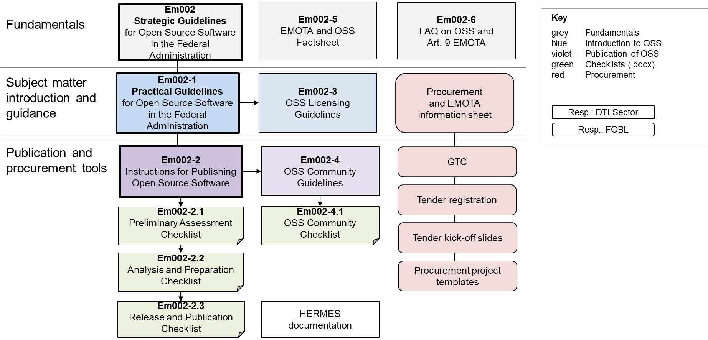

**Disclaimer:** This document is an evolving draft and part of the guidelines and tools designed to support the Federal Administration in publishing open source code. For more information, see the main [README](https://github.com/swiss/opensource-guidelines/tree/main).

---

# OSS Guideline: Applying Article 9 of Federal Act on the Use of Electronic Means for Fulfilling Administrative Tasks (EMOTA)

Since January 1, 2024, the Federal Act on the Use of Electronic Means for Fulfilling Administrative Tasks (EMOTA) requires federal authorities to publish the source code of software they develop or have developed for them. Exceptions are allowed only if third-party rights or security concerns prevent or limit this publication.

This document assists **project leaders** or personnel responsible for **software procurement**.

## Initial Questions

Is your federal authority purchasing or using standard software without modifications?

→ If yes, see [Purchasing and Using Standard Software](#purchasing-and-using-standard-software)

or

Does a software application or component need to be specifically developed for the federal authority (custom software)?

→ If yes, see [Creating or Enhancing Software](#creating-or-enhancing-software)

## Purchasing and Using Standard Software

If your authority buys software without modifications, Article 9 EMOTA does not apply. Authorities are free to choose between open-source or other software options. Guidance for software procurement can be found on the website of the Federal Office for Buildings and Logistics (BBL).

## Creating or Enhancing Software

If your authority develops software itself or via a third party, Article 9 EMOTA applies. This also includes software developed through contributions to existing OSS projects. Publication of the source code may only be restricted due to third-party rights or security concerns.

Complete Checklist [Em002-2.1 Preliminary Assessment Checklist](em002-2.1.md).

Note: This checklist also serves to justify non-publication and should be considered early in the project. The entire process is outlined in [Em002 Strategic Guidelines for Open Source Software in the Federal Administration](em002.md).

## Further Questions to Address

- Under which open-source license should the software be published?
Decide between a Copyleft license (e.g., AGPL V3) or a permissive license (e.g., MIT). Detailed guidance is provided in [Em002-3 OSS Licensing Guidelines](em002-3.md). Complete [Em002-2.2 Analysis and Preparation Checklist](em002-2.2.md). Note: Ideally completed by the technical project lead or IT architect.

- Where and how should the software and related artifacts be published?
Complete Checklist [Em002-2.3 Release and Publication Checklist](em002-2.3.md). Note: This checklist records publication details. Additional departments might need to be involved.

- Should an OSS community be established?
The benefits and tasks for building an OSS community are detailed in Guideline [Em002-4 OSS Community Guidelines](em002-4.md). If yes, complete [Em002-4.1 OSS Community Checklist](em002-4.1.md), specifying community type and platform. Note: The project team has flexibility in determining community type and setup. Additional departments might need to be involved.

Answer these questions and regularly (approximately once a year) review them for significant changes.

Each federal authority developing or commissioning software is individually responsible for its publication.

Overview of OSS tools in relation to Art. 9 EMOTA:

