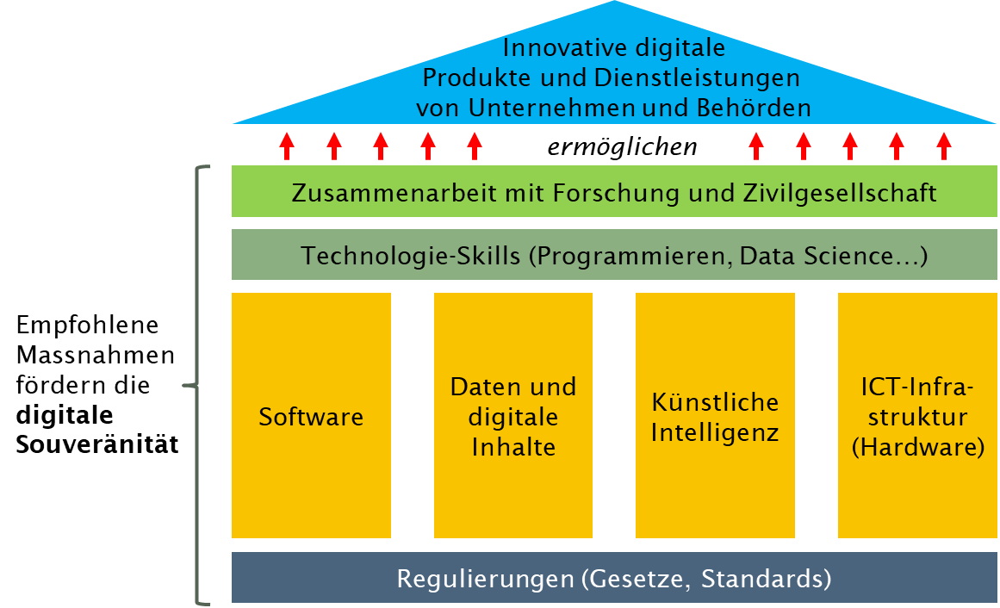
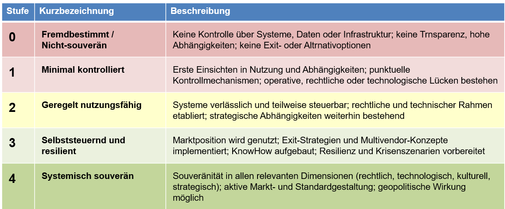
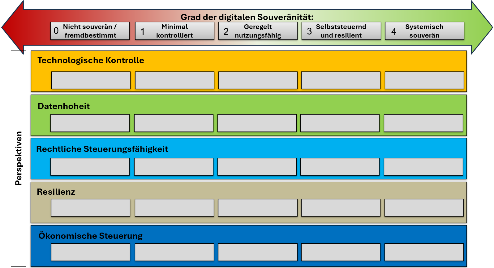
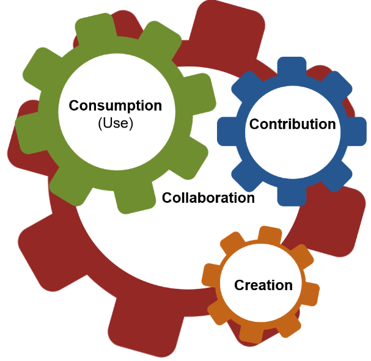

**Disclaimer:** This document is an evolving draft and part of the guidelines and tools designed to support the Federal Administration in publishing open source code. For more information, see the main [README](https://github.com/swiss/opensource-guidelines/tree/main).

---

# Main points at a glance

This document supplements the Em002 set of OSS tools with aspects concerning procurement. It builds on the *Information Sheet on Software Procurement and Art. 9 EMOTA* published by the Federal Procurement Competence Centre (CCPP)[^7] *[KBB-MB]*, and summarises the content of FOBL[^8] documents such as the *Open Source in Procurement Guidelines* [BBL-WL], which are available on the intranet only.[^9] The document also addresses digital sovereignty as a procurement criterion.

The use of open source software can be divided into four aspects:

-   Consumption: The use of pre-existing OSS

-   Creation: The development of new OSS

-   Contribution Contributing in-house modifications to an existing OSS project

-   Collaboration: The joint further development of OSS with third parties.

In all these situations, a public contracting authority must comply with the relevant procurement legislation.

**Consumption:**

-   Procurement law applies when services are purchased on the market for payment (Art. 8 PPA).

In other words:

-   The use of OSS that is available free of charge (without licence fees, support or maintenance contracts, etc.) does not generally constitute procurement.

-   Value-added services purchased for the use of OSS (support, warranty, maintenance, and further development) must be procured in accordance with procurement law.

-   When procuring software, it is generally permissible to specify OSS  as a requirement, e.g. where the administrative unit (AU) expects to derive specific benefits, such as greater data sovereignty or simplified compliance with Art. 9 EMOTA in the event of foreseeable bespoke adaptations. However, the market must not be unduly restricted.

**Creation and contribution:**

-   When developing software or software components, including with a view to subsequent contribution to an OSS project, Art. 9 EMOTA must always be taken into account. Where third-party services are purchased for this purpose, procurement law applies.

-   When contributing to OSS projects, the AU passes on its own work to third parties; this process is therefore not subject to procurement law.

-   The acceptance of third-party contributions to a federal OSS project is likewise unproblematic from a procurement law perspective, provided no payment is made.

**Collaboration:**

-   Collaboration between various public contracting authorities on an OSS project gives rise to a broad range of legal requirements. From a procurement law perspective, those arrangements involving the provision of services for payment require careful examination.

-   In an informal collaboration, each participating party may procure or provide development services independently and then make them available free of charge. Coordination services may likewise be provided or procured.

-   In a formalised collaboration, e.g. through an association of public-sector actors, the central body may also be able to provide or procure development services, provided it is itself subject to procurement law.

-   Joint procurement by contracting authorities from different countries is not, however, straightforwardly permissible.

For the sustainable use of open source software, it is important that OSS is not merely consumed, but that as many stakeholders as possible also contribute to the ecosystem. There are many ways to do this: from regular code contributions and creating documentation to funding developers, and much more.

# Objective and purpose

The Federal Act on the Use of Electronic Means to Carry Out Official Tasks (EMOTA)[^10] requires that additional considerations be taken into account when procuring newly developed software and software development services.

To support compliance with Art. 9 EMOTA, DTI has developed tools and resources as part of [Em002 Strategic Guidelines for Open Source Software in the Federal Administration](em002.md) and [Em002-1 Practical Guidelines for Open Source Software in the Federal Administration](em002-1.md)

Figure 1: Overview of OSS tools

This document goes beyond the core of Article 9 EMOTA and also sets out how open source should generally be handled in the context of procurement.

   

    Section 3 
  

  

   The importance of digital sovereignty in the context of open source and procurement
  

   

    Section 4
  

  

   Relevant procurement use cases in connection with software and open source software
  

   

   

    Section 5
  

  

   Creation: Tendering for software and services in connection with Art. 9 EMOTA
  

   

    Section 6
  

  

   Consumption: Software procurement: equal treatment of open source software
  

   

    Section 7
  

  

   Consumption: Procurement of additional services (support/maintenance/further development) for OSS
  

   

     Section 8 
  

  

   Collaboration: Procurement law aspects of collaborations for the creation, maintenance and support of OSS
  

   

   Section 9  
  

  

   Contribution Contributing to OSS projects
  

# Digital sovereignty and procurement

## Introduction to digital sovereignty and OSS

Through Art. 9 EMOTA, the Federal Administration is making an important contribution to digital sustainability and sovereignty by publishing its software as OSS.

Digital sovereignty is not an end in itself, but a prerequisite for an effective, democratic and future-oriented administration. It is a multi-faceted concept encompassing technological, organisational and political dimensions.
<table>
       <tr>
        <td>
            <strong>Digital sovereignty means the state having the necessary control and capacity to act in the digital space in order to ensure that government tasks are fulfilled.</strong> 
            </td>      
    </tr> 
</table>

When procuring software in particular, consideration should be given to the implications for the digital sovereignty of the Federal Administration.

In its **roles as user, operator and contracting authority** in the field of ICT and software, the Federal Administration can consciously fulfil its responsibilities in this area.

There are three strategic objectives in the area of software:

**Interchangeability**: <u>As a user</u>, the public administration seeks to be able to choose freely and flexibly between providers, IT solutions and technologies. This requires the availability
of capable and proven alternatives, and IT architectures, procurement channels and staffing that are designed to facilitate switching.

**Design capability**: <u>As an IT operator</u> , the public administration has the ability to shape and co-design its IT systems. To this end, it has the necessary expertise and appropriate cooperative structures to understand and evaluate IT solutions and, where necessary, ensure their development, further development and operation.

**Influence**: <u>As a contracting authority</u>, the public administration can articulate and enforce its requirements and needs vis-à-vis technology providers. This applies to product features (functions, operating options, availability, information security and data protection, etc.) as well as to contract design and licensing models.

**Open standards** and **open source software** best support these goals through **open source principles**.

OSS supports digital sovereignty in the following ways:

-   IT security for public administration, critical infrastructure and  security-sensitive applications can be assured <u>at all  times</u> through <u>full access</u> to the source  code.

-   OSS enables public bodies to build, operate, control and adapt their own IT infrastructure without restrictive licence conditions.

-   OSS provides full control over updates, features and security patches, in terms of both content and timing.

-   OSS can prevent dependence on individual vendors or licensing models and supports interchangeability.

-   OSS allows the entire software supply chain to be displayed and traced transparently.

-   OSS can be customised and expanded -- well suited to the specific requirements of public authorities and educational institutions, though this requires in-depth knowledge on the part of an organisation\'s own employees.

-   Investment in OSS also benefits local businesses and communities (local value creation), increasing the resilience of the Swiss economy.

-   OSS is based on collaboration and open interfaces, facilitating interoperability between systems and promoting open standards -- even across national borders.

-   OSS improves IT security and data security through transparency and adaptability.

-   OSS software licensed under OSI licences guarantees clear legal conditions and continuity, along with the fundamental freedoms of OSS, protecting developers and users alike.

**Open standards:** To support software interchangeability, public procurement tenders should require compliance with open standards,[^11] thereby minimising lock-in.
**Open interfaces:** Interfaces should likewise be disclosed to enable interoperability.

Federal authorities are generally required to comply with the eCH standards.[^12]

The Bern University of Applied Sciences set out the relevant considerations in the study *Technological Perspectives of Digital Sovereignty* \[Stü2024\], commissioned by the FDFA, using the \'sovereignty house\' model, in which software is presented as a key pillar.

*Figure 2: Schematic representation of the aspects of digital sovereignty enabling the provision of innovative products and services \[Stü2024\]*

## Measuring digital sovereignty 

Aspects of digital sovereignty may be required in a public tender, but any such requirements must be objectively justified. There is no general preference for OSS.

**How, then, can the degree of digital sovereignty be measured for a given technology, product or service?**

This operationalisation must be made as objective and transparent as possible.

Various initiatives are attempting to do this. The OSBA, for example, has developed a **sovereignty index**[^13] *\[OSBA-VK\]. Nextcloud* has published a Digital Sovereignty Index (DSI),[^14] which compares entire countries but can also provide useful criteria.
The European Union has published a Cloud Sovereignty Framework[^15] for the cloud.
The *Centre for Digital Sovereignty ZenDiS* is working on a sovereignty check designed to evaluate IT solutions and organisations against transparent sovereignty criteria.

The Federal Administration is also involved in developing a **digital sovereignty framework** that will, among other things, enable the degree of fulfilment to be determined across a range of perspectives.

Possible perspectives include:
<table style=" border-collapse: collapse; width: 100%;">
  <tr>
    <td style="vertical-align: top; border-left: 1px solid #ccc; padding-left: 20px;">
      A
    </td>
    <td style="vertical-align: top; border-left: 1px solid #ccc; padding-left: 20px;">
        Technological control
    </td>
      <td style="vertical-align: top; border-left: 1px solid #ccc; padding-left: 20px;">
        To what extent does the Federal Administration have control over the technologies used and their further development?
    </td>
  </tr>
  <tr>
    <td style="vertical-align: top; border-left: 1px solid #ccc; padding-left: 20px;">
      B
    </td>
    <td style="vertical-align: top; border-left: 1px solid #ccc; padding-left: 20px;">
        Data sovereignty
    </td>
      <td style="vertical-align: top; border-left: 1px solid #ccc; padding-left: 20px;">
        Who has access to, control over and decision-making power regarding the data – particularly sensitive administrative data?
    </td>
  </tr>
    <tr>
    <td style="vertical-align: top; border-left: 1px solid #ccc; padding-left: 20px;">
      C
    </td>
    <td style="vertical-align: top; border-left: 1px solid #ccc; padding-left: 20px;">
        Legal capacity to act
    </td>
        <td style="vertical-align: top; border-left: 1px solid #ccc; padding-left: 20px;">
        To what extent can Switzerland and the Federal Administration influence the legal and political framework for digitalisation?
    </td>
  </tr>
     <tr>
    <td style="vertical-align: top; border-left: 1px solid #ccc; padding-left: 20px;">
      D
    </td>
    <td style="vertical-align: top; border-left: 1px solid #ccc; padding-left: 20px;">
        Resilience
    </td>
        <td style="vertical-align: top; border-left: 1px solid #ccc; padding-left: 20px;">
        How robust and crisis-proof are the Federal Administration's digital systems and processes in the face of disruptions, crises and dependencies?
    </td>
  </tr>
     <tr>
    <td style="vertical-align: top; border-left: 1px solid #ccc; padding-left: 20px;">
      E
    </td>
    <td style="vertical-align: top; border-left: 1px solid #ccc; padding-left: 20px;">
        Economic control
    </td>
        <td style="vertical-align: top; border-left: 1px solid #ccc; padding-left: 20px;">
        How can the Federal Administration exercise economic control and strategic sourcing to secure its digital sovereignty cost-efficiently, while minimising dependencies and risks in IT procurement?
    </td>
  </tr>
</table>

For each of these perspectives, the degree of digital sovereignty can be determined against a scale to be defined:

Figure 3: Degree of digital sovereignty.

These two dimensions produce the following matrix:

Figure 4: Matrix Digital Sovereignty.

Specific criteria can be described in the individual intersections (grey fields) to make the classification as objective as possible.

Such a framework is currently being developed as part of Priority 4, 'Strengthening digital sovereignty', of the 'Digital Federal Administration Strategy'.[^16]

The Federal Council brought the umbrella directive Digital Sovereignty in the Federal Administration[^17] into force on 1 January 2026. Projects must incorporate the various aspects into the definition of the procurement object and, where necessary, into a tender, on the basis of the specific sovereignty requirement -- for example from a risk perspective in the context of business continuity management.

# Use cases for software procurement

Information and communication technology (ICT) and software are not an end in themselves in the Federal Administration, but always serve to fulfil a legal mandate. Given advancing digitalisation and the Federal Administration\'s central role in Switzerland, information technology must be a core competence of the administration.

The following **factors** therefore have a direct bearing on procurement:

-   **Digitalisation**: The digital strategy[^18] calls for the digitalisation of processes.

-   **Process optimisation**: Processes within the Federal Administration and in its external relations can and should be optimised.

-   **Digital sovereignty**: The importance of digital sovereignty is growing steadily; see *\[Stü2024\].*

-   The principle of **public money, public goods** and compliance with Art. 9 EMOTA.

-   **Economic freedom**: Measures should not unnecessarily restrict economic freedom.

-   General **security** considerations: The security of information processing systems is of increasing importance.

-   Crisis and disaster management (**resilience**): Given the current  global situation, the administration must consider how it can  continue to provide the necessary working tools under critical  circumstances.

-   Strategic independence and **supply chain** considerations: These follow from digital sovereignty and resilience.

-   Avoiding/minimising **vendor lock-in**: Dependencies are almost impossible to avoid in IT, but reliance on a single vendor should be  reduced wherever possible.

-   **Empowering** the Federal Administration[^19] (including  management) in ICT matters: Controlling, developing and operating information technology requires appropriate skills across the  workforce.

This document distinguishes between **software types** as follows:

-   **Commodity -- Specialised applications/Industry -- Specialised applications/Federal authority**:

    -   Standard application (commodity software) without special business logic.

    -   Specialised application: Specific requirement of the industry/all federal levels or specific requirement of the  federal authority

-   **Targeted -- strategic -- essential**:

    -   Targeted application

    -   Strategic application with significant importance for a federal  authority or the Federal Administration as a whole

    -   Essential and business-critical -- must remain functional in all  circumstances (e.g. air traffic control)

Applications may be used across one or more **fields of application**.

What matters here is the **standardisation** of applications by product within each area:

-   No strategy

-   Single-product strategy

-   Multi-product strategy

In addition to product standardisation, which must be examined carefully, there is also standardisation for interoperability (data formats, API, business elements).[^20]
Standardisation *is permissible* provided it is proportionate and does not unduly restrict competition (e.g. Art. 30 para. 3 PPA). It may reduce operating and maintenance costs and generate synergy effects, particularly where all federal levels are involved. On the other hand, it increases lock-in, dependency and, in some cases, security risks (cluster risk).

Total costs of ownership (TCO) -- covering operation, maintenance and further development -- should always be considered in procurement. Long-term cost implications must not be overlooked. Open source business models differ in certain respects from those of proprietary providers.

The following sections focus increasingly on open source, discussing the relevant procurement approach and how it should be implemented.

The choice between consumption, contribution, collaboration and creation is made *on a project-specific basis* according to economic efficiency and the legal situation, with costs distributed as broadly as possible. From this perspective, the four Cs as defined in [Em002 OSS Strategic Guidelines](em002.md), Section 3, are ranked in descending order of importance:

 
 
1.  Consumption

2.  Contribution

3.  Collaboration

4.  Creation

With simple **consumption**, costs are spread across a large number of other users, but the federal authority has no control over further development. Creation is the inverse: full control, but full cost.

With **contribution**, financial outlay is limited to the element developed, which is then handed over to another organisation for maintenance.

**Collaboration** is the most complex scenario, as arrangements can vary considerably. In the best-case scenario, costs are shared and the federal authority has sufficient influence to implement its requirements without compromise (see Section 8).

Ideally, **creation** accounts for the smallest share. Software may be developed in-house, through services, or via a contract for work.

Pure consumption will only be feasible for standard applications.

## Software requires additional services such as maintenance, support and further development. 

Although open source applications can be used free of charge, their strategic deployment across thousands of instances requires maintenance, support and, where necessary, further development.

Federal authorities have an interest in long-term support for deployed versions (see Section 3.2.3 in *\[BITKOM2024\]*).

Art. 9 EMOTA itself covers only the in-house development or further development of software and is not relevant to any other open source considerations -- digital sovereignty and other factors apply instead. However, restrictions under Art. 9 EMOTA on individual development components may have repercussions for the overall project where proprietary or additional developments are foreseeable. Collaboration can then be used to exploit synergy effects and, where possible, reduce costs across the Federal Administration as a whole.

## Publication requirement for software procurement

Where requirements indicate a need to adapt software, or a potential need for later adaptation, Art. 9 EMOTA is relevant and publication is mandatory for those parts, unless one of the two exceptions applies. When procuring an open source solution, such publication would already be addressed through a contribution to the open source project. Even where procurement involves only the licensing of standard software or ICT procurement falling under an exemption, any additional developments must in principle be published, and this must be reflected in the procurement documents and draft contract.

**The publication requirement under Art. 9 EMOTA is therefore relevant to any procurement where in-house development or further development is likely** (see also *\[KBB-MB\]*).

# **Creation: Tenders for software and services involving Article 9 EMOTA**

This section addresses the implications of Art. 9 EMOTA for tenders for software and services that may involve the creation or modification of software.

It applies to both centralised and decentralised Federal Administration. Exceptions to this requirement are set out in the Digitalisation Ordinance *\[DigiO\]*.

## **Relevance of Article 9 EMOTA for software creation**

A transaction falls within the scope of Art. 9 EMOTA if it falls within the relevant category of Table 1. The make-or-buy decision remains central to procurement. Analysis of the various use cases shows that, in principle, Art. 9 EMOTA is relevant in principle in all cases, except where pre-existing software is being procured (e.g. pure licences). Section II.4 of the *Open Source in Procurement Guidelines \[BBL-WL\]* sets out the strategic approach, and Annex VII.A describes in detail what constitutes software. A detailed breakdown of the strategic decision is provided in Table 1.

  <table>
    <thead>
    <tr style="background-color:#4169E1; color:white; height:140px">
        <td  style="border:none; padding-right: 20px;  font-weight: bold; ">
       Use case
        </td>
        <td style="padding-right: 20px;  font-weight: bold; border: none;">
       Make or buy 
        </td>
        <td  style=" padding-right: 20px;  font-weight: bold; border: none;">
      Publication obligation under Art. 9 para. 1 EMOTA
        </td>   
    </tr>
    <tr style="border: none;">
    <td style=" border-right: none; border-bottom: none;">
    Developing software within the Federal Administration
    </td>
    <td style=" border-right: none; border-bottom: none;">
        Make
    </td>
    <td style=" border-right: none; color:red; border-bottom: none;">
        Yes, publication obligation
    </td>
      </tr>
    <tr style="border: none;">
    <td style=" border-right: none; border-bottom: none;">
    Having software developed by third parties
    </td>
    <td style=" border-right: none; border-bottom: none;">
        Buy as IT service contract
    </td>
    <td style="border-right: none; color:red; border-bottom: none;">
        Yes, publication obligation
    </td>
      </tr>
    <tr style="border: none;">
    <td style="border-right: none; border-bottom: none;">
   Procuring existing software
    </td>
    <td style=" border-right: none; border-bottom: none;">
        Buy 
    </td>
    <td style=" border-right: none border-bottom: none;">
        

            Generally no, 
        
 but check whether publication requirements apply to any parts being developed. Handling of third-party rights is particularly relevant (see [Em002-3 OSS Licensing Guidelines](./em002-3.md)).
    </td>
      </tr>
        <tr style="border: none;">
    <td style=" border-right: none; border-bottom: none;">
    Acquiring software from other public bodies
    </td>
    <td style=" border-right: none; border-bottom: none;">
       Make or buy
    </td>
    <td style="border-right: none; border-bottom: none;">
       

          – Within the Federal Administration: publication obligation for the transferring administrative unit.
        

        – Others: Examine on a case-by-case basis whether adaptations by the Federal Administration give rise to a publication obligation, at least for those parts.
    </td>
      </tr>
        <tr style="border: none;">
    <td style=" border-right: none; border-bottom: none;">
    Procuring development resources
    </td>
    <td style=" border-right: none; border-bottom: none;">
      Make
    </td>
    <td style="border-right: none; color:red; border-bottom: none;">
        Yes, publication obligation (contracts must allow for publication)
    </td>
      </tr>
        <tr style="border: none;">
    <td style=" border-right: none; border-bottom: none;">
   Collaborating with other public bodies on software development
    </td>
    <td style=" border-right: none; border-bottom: none;">
       Make
    </td>
    <td style="border-right: none; color:red; border-bottom: none;">
       Yes, publication obligation (contracts must allow for publication), particularly where there are substantial development contributions by or for the Confederation
    </td>
      </tr>
    </thead>
</table>

Table 1 Classification of publication requirement and make-or-buy decision (based on a table by Rika Koch, BFH)

NB: Art. 9 EMOTA must also be taken into account for existing software and SaaS where the software is to be further developed or adapted for the federal government. Even where the likelihood of this is low, it should be addressed in the procurement process.

Where clarification is needed, the recommended reference is [Em002-2 Instructions for Publishing Open Source Software ](em002-2.md). The checklists should be **completed provisionally as early as possible** for potentially relevant projects. The *Checklist for Art. 9 EMOTA Blanket Exception \[BBL-CL\]* may also be used for this purpose.

## **Preparing a procurement under Article 9 EMOTA**

In addition to the usual preparatory steps, the following two documents should be consulted whenever a procurement involves software components: 

-   *Information sheet on software procurement and Art. 9 EMOTA \[KBB-MB\] and*

-   *Open Source in Procurement Guidelines \[BBL-WL\]*.

Where Art. 9 EMOTA is clearly relevant, the administrative unit should have:

-   provisionally completed the checklists [Em002-2.1 OSS Preliminary Assessment Checklist](Em002-2.1%20Checklist%20OSS%20Preliminary%20Assessment.odt) through to [Em002-2.3 OSS Release and Publication Checklist](Em002-2.3%20Checklist%20OSS%20Release%20and%20Publication.odt);

-   taken a basic decision on whether to use a copyleft or permissive licence;[^21]

-   searched for possible open source alternatives (or potential base projects for contributions/collaboration) in accordance with [Em002-2 Instructions for Publishing Open Source Software ](em002-2.md), using  the tools specified therein for market research/market analysis;[^22]

-   clarified the structure of any relevant community ([Em002-4 OSS Community Guidelines](em002-4.md) and [Em002-4.1 OSS Community Checklist](Em002-4.1%20Checklist%20OSS%20Community.odt)).

Where an existing OSS project is to be used, supported or built upon through collaboration, Sections 5, 0, 8 and 9 of this document must be read.

## **Creation via existing service contracts**

Where creation is handled via existing partner agreements, OSS publication must be ensured at the mini-tender stage, unless one of the two exceptions applies.

New service tenders should always include a requirement for publication in accordance with Art. 9 EMOTA (see *\[BBL-WL\] and* *\[KBB-MB\])*.

## **Building a community**

Building and maintaining a community maximises the benefits of open source software, but also involves considerable effort.

Where a community and collaboration make sense, this has implications for procurement from the outset. [Em002-4.1 OSS Community ](Em002-4.1%20%20OSS%20Community.odt) should therefore be completed on the basis of the [Em002-4 OSS Community Guidelines](em002-4.md).

Where the federal authority is to take on a significant role in the community (e.g. a governance role) or where collaboration is planned (see Section 8), it may be necessary to procure additional services: community building, consolidation of requirements, management of further development.

## **Sample criteria and contract elements for IT procurement**

The CCPP maintains a template of possible procurement criteria and a framework agreement chapter template for software-related tenders *\[KBB-KV\]*.

The CCPP has published two template documents on Perimap.admin.ch showing how the minimum requirements for a procurement-compliant acquisition under Art. 9 EMOTA can be met. \[KBB-KV\]

1\. [Sample criteria -- Procurement EMOTA and Open Source](https://perimap.admin.ch/goto_perimap_file_47064_download.html) 
2\. [Sample contract texts -- Software development](https://perimap.admin.ch/goto_perimap_file_47059_download.html)

# **Consumption: Software procurement: Equal treatment of open source software**

This section addresses the procurement and use (consumption) of open source software, highlighting key strategic aspects.
Reference is also made to *\[BBL-WL\] and* *\[KBB-MB*\].

**There is currently no legally prescribed preference for open source software in procurement.**
 
When tendering for IT applications, all licence types and business models are considered. To meet the stated requirements, providers may offer software solutions based on unmodified open source, closed source or proprietary software, or on combinations of licence models and value-added services or subscriptions.

The following points[^23] should be taken into account by federal authorities:

-   Regardless of its solution and licensing model, the service provider must specify in its tender **which licence conditions the service procurer must comply with when using the service**.

-   The service provider is **free to choose the solution** with which it intends to meet the advertised requirements and the form of remuneration it wishes to receive (licence, maintenance or subscription fees), provided this is technically feasible and economically reasonable.

-   The full **lifecycle** should be taken into account in the specifications and pricing.

This enables the Federal Administration to assert its interests regarding intellectual property, warranty and liability -- independently of the software or licence model -- at the level of the applicable general terms and conditions, and to enshrine these in the contract.

Where **software adaptations** are made on behalf of or in fulfilment of a contract with the federal authority, Art. 9 EMOTA applies.
As a precaution, publication approval should be requested in the tender, since experience shows that adaptations are usually required sooner or later, even if not foreseeable at the time of tendering.

Where the service procurer procures **value-added services** from a provider in addition to the software, OSS suppliers often offer a subscription model that provides a local contact with warranty and liability commitments, alongside the direct relationship with the intellectual property holders of the OSS components (who are often based abroad and sometimes unknown).

## **OSS as a strategic procurement criterion**

Where a federal authority wishes to procure open source software for strategic reasons, several scenarios are possible:

-   Functional invitation to tender without OSS-specific criteria.
    As this involves no restrictions, no special justification is required.

-   Functional invitation to tender with eligibility criterion, technical criteria and award criteria requiring open source, full access to source code, or demonstrable experience in open source publication.

 **Any preference for open source is permissible under procurement law where it allows the specific needs of the awarding office to be (better) met**.[^24]

 A further reason for favouring OSS -- beyond digital sovereignty -- is that where the administration requires significant software adaptations, these must be published under Art. 9 EMOTA.
 Publication is most straightforward when the entire product has always been open source, and adaptations can in some cases be made directly within the product. Otherwise, an exception must be defined and, where necessary, parts of the code must be isolated and still released.

## The use of OSS without payment is not subject to procurement law.

OSS can often be downloaded and used directly. Procurement law applies only where services are obtained from third parties in return for payment (including non-monetary consideration).

Downloading and using OSS free of charge does not in itself constitute procurement.

It is also possible to procure the necessary services for downloaded OSS at a later stage, provided this is not done abusively.[^25]

Maintenance, support and further development services for the product are then tendered separately in accordance with procurement law.

There are already examples of OSS being used free of charge on the Federal Administration\'s standard workstations and therefore not procured.[^26]

## Coordinating requirements with other stakeholders

A specialised application always requires a requirement owner (usually a federal office). It generally makes sense for the body with the need to harmonise its requirements with those of other government agencies --- either internally or through collaboration (see Section 8) --- to the extent that an available market product or a collaborative development is conducive to development and rollout.

Where many stakeholders have the same or similar requirements, it may be worth meeting those needs on a common basis. This applies to all forms of software.

Two aspects should be noted: where adaptations are subsequently made by a federal authority at the request of third parties, Art. 9 EMOTA applies again -- though this is unproblematic where open source software is used.

With OSS, requirements may need to be aligned more actively by the federal authority, since there may be no driving force such as a commercial vendor seeking to steer and develop its own product.

## Considering other potential public actors in procurement

The ZenDiS[^27] example shows that it can be both feasible and worthwhile to issue a tender covering all federal levels simultaneously.

**Fair competition must always be maintained.** When issuing tenders, consideration should always be given to whether the solution might usefully be procured for other bodies as well.

Where this is the case, those potential additional clients should be contacted and their needs reflected in the tender documents, particularly the requirements. A degree of flexibility in the requirements is important in such cases.

Example: eOperations Switzerland Ltd ([www.eoperations.ch](http://www.eoperations.ch)) can be used for such collaborations. eOperations consolidates requirements from various agencies and conducts procurement itself, without necessarily using the product itself. This may also be a useful model for OSS procurement.

# **Consumption: Procurement of support and maintenance for OSS**

Public administration can use open source software in various ways, from simple download and installation through to formal procurement (see Section 6.2).

Where OSS is deployed in critical areas, consistently high standards of security,[^28] maintenance and further development are required. In regular software procurement, this is usually covered by the tender. The requirements apply to both the software itself and to the relevant libraries and frameworks used. Support and maintenance warrant particular attention, since further development is often covered under the same contract and in any case constitutes creation and therefore falls within the scope of Art. 9 EMOTA.

These labour-intensive services almost always exceed the threshold value under the Public Procurement Act (PPA) when calculated over the application lifecycle. Where they are purchased from third parties, procurement law must be complied with. Exceptions may apply, such as in-state procurement from another public contracting authority,[^29] or in exceptional cases direct procurement of specialist services.[^30]

The following table sets out the case distinctions for the procurement of services such as support.

<table style="width: 100%; border-collapse: collapse; font-family: sans-serif; border: 1px solid black;">
  <tr style="background-color: #d9d9d9; font-weight: bold; border: 1px solid black;">
    <td colspan="2" style="padding: 5px; border: 1px solid black;">Background</td>
    <td colspan="2" style="padding: 5px; border: 1px solid black;">Results</td>
  </tr>
  
  <tr style="background-color: #d9d9d9; font-weight: bold;">
    <td style="padding: 5px; border: 1px solid black; width: 25%;">Lifecycle costs → WTO threshold?[^31]</td>
    <td style="padding: 5px; border: 1px solid black; width: 15%;">In-state?[^32]</td>
    <td style="padding: 5px; border: 1px solid black; width: 20%;">WTO tender required?[^33]</td>
    <td style="padding: 5px; border: 1px solid black; width: 40%;">Comments</td>
  </tr>

  <tr>
    <td style="background-color: #f2f2f2; padding: 5px; border: 1px solid black;">No</td>
    <td style="background-color: #f2f2f2; padding: 5px; border: 1px solid black;">No</td>
    <td style="padding: 5px; border: 1px solid black;">No [^34]</td>
    <td rowspan="2" style="padding: 5px; border: 1px solid black; vertical-align: top;">
      Rarely a complete software package with support – mostly minor support and individual features.
    </td>
  </tr>
  <tr>
    <td style="background-color: #f2f2f2; padding: 5px; border: 1px solid black;">No</td>
    <td style="background-color: #f2f2f2; padding: 5px; border: 1px solid black;">Yes</td>
    <td style="padding: 5px; border: 1px solid black;">No</td>
  </tr>
  <tr>
    <td style="background-color: #f2f2f2; padding: 5px; border: 1px solid black;">Yes</td>
    <td style="background-color: #f2f2f2; padding: 5px; border: 1px solid black;">No</td>
    <td style="padding: 5px; border: 1px solid black;">Yes</td>
    <td style="padding: 5px; border: 1px solid black;">Only the volume to third parties is relevant.</td>
  </tr>
  <tr>
    <td style="background-color: #f2f2f2; padding: 5px; border: 1px solid black;">Yes</td>
    <td style="background-color: #f2f2f2; padding: 5px; border: 1px solid black;">Yes</td>
    <td style="padding: 5px; border: 1px solid black;">No</td>
    <td style="padding: 5px; border: 1px solid black;">The tender was issued by the other public body.</td>
  </tr>
</table>

Table 2 Case distinction -- procurement of support

## Support and maintenance are always part of software

Support and maintenance are essential for the sustainable operation of software in a public authority environment. In a world of zero-day exploits,[^35] rapid and professional patch deployment is critical. This \'infrastructure\' must be funded -- particularly since the administration has higher requirements than a private consumer.

**The question is therefore not IF support and maintenance will be required, but HOW they are to be provided.**

The federal authority must determine what level of support, maintenance, warranty and liability it requires based on its quality of service requirements.

It is important that any service provider for maintenance and support can demonstrate sufficient experience with the product or the relevant open source community -- only then will it be able to fulfil these tasks effectively (see also *\[KBB-MB\]*, II.5).[^36]

Support and maintenance must also be funded at the product level. Where no one contributes (the free-rider[^37] problem), the project\'s future is jeopardised, and with it its use within the Federal Administration. Given its scale, the Federal Administration can reasonably be expected to contribute to the costs of software it deploys strategically.

## Organisations that can provide support

The quality of support has a direct impact on end-user satisfaction and productivity. A structured support system with fast response times and genuine technical expertise ensures that users and administrators receive effective solutions to their issues, saving the contracting authority\'s working time and promoting acceptance of the software solution.

To meet contractually agreed response times under service level agreements (SLAs), the provider must have qualified staff with the necessary expertise.

Possible sources of support include:

**In-house**: 
- Federal offices
- Service providers

**In-state**: 
- Other public contracting authorities in Switzerland
- Services procured by other public contracting authorities in Switzerland

**Third parties**: 
- Procured service

## Further development for specific features

Where a federal authority requires only a limited number of specific enhancements to a piece of open source software, this can be done using internal resources or procured services.

Such further developments should aim to be offered back to and integrated into the original project. This not only benefits the project ecosystem but ensures the enhancements are maintained within the project going forward. Without this, each new release of the original project may require the bespoke development to be updated manually (see also Section 8).

## Subscription 

Many companies and projects in the open source environment offer free support within certain limits, provided voluntarily by any user, mainly through open channels such as forums and public ticket systems. This free offering is not designed for professional users with specific SLA requirements.

For professional users such as federal authorities, OSS subscriptions that include warranty, maintenance and support are often available.

Some providers also offer special \'enterprise versions\' that no longer meet the OSI\'s open source criteria.

Examples of subscriptions: OpenShift from Red Hat, openDesk from ZenDiS

## Certifications in the open source sector and OpenChain

As with proprietary software, various certifications exist in the open source sector. It may be worthwhile for the administration to check for potentially relevant certifications in the area covered by the tender before issuing it.

**OpenChain** is an ISO standard addressing open source development and licence compatibility (see below).

Where relevant certifications exist and are pertinent to the service, they should be taken into account in the assessment of providers. It is important that the certification itself is considered meaningful, and that providers can demonstrate they are able to deliver the service even without certification.

Given the complexity involved, requiring certifications as an eligibility criterion is inadvisable. As an award criterion -- with the possibility of demonstrating compliance with certification content through references -- they may be appropriate depending on the OSS product, provided it is permissible to use references to demonstrate that certification criteria are being met.[^38]

Self-certification under OpenChain may at best serve as a substitute where no other certification exists. References addressing the relevant criteria can also stand in for missing certifications.

**Certification of partner companies**

Some open source developers and projects[^39] certify partner companies with which they collaborate. Such certifications can demonstrate an existing relationship between the provider and the software developer. Note that many OSS projects do not offer such certifications. Proven collaboration in reference projects is an equally valid -- and less restrictive -- indicator of the desired quality.

**Certification of employees**

Some open source manufacturers or communities[^40] certify individuals with specialist expertise in the relevant software. Where a service provider employs certified staff, this can demonstrate expertise in upstream publication of adaptations and patches, and in providing high-quality third-level support -- particularly where several staff members work with the product. This also depends on the structure of the OSS project\'s ecosystem.

As an alternative to certifications, demonstrable project experience in references relating to the procurement subject can also serve as a differentiating criterion.

**OpenChain standard**

The OpenChain standard represents both best practice in licence compatibility and a certification of interest to procuring authorities.

ISO/IEC 5230 \'OpenChain\' focuses on software supply chains, streamlined procurement and licence compliance. The OpenChain standard can be awarded by an accredited certification body or obtained through self-certification. This certification is suitable for demonstrating in general terms that a provider has already dealt extensively with open source licence requirements and the specifics of the open source ecosystem.
Since the creation of a Software Bill of Materials (SBOM) is part of the standard, this certification also evidences a supplier\'s commitment to supply chain security through support of foundational components.

## Further options for procuring maintenance, support or further development services

It makes sense to handle further development services under the same contract as support and maintenance, since the distinction is not always straightforward and is often not practical in the context of open source software. Further developments funded by a federal authority fall within the scope of Art. 9 EMOTA.

The following options are currently available[^41] for procuring support, maintenance and/or further development services for OSS:

-   In-house, with competence building: Deploy own development resources

-   Procurement: According to volume and in compliance with the PPA. This may also be done via service contracts already put out to tender. To ensure that strategic partners can provide experienced core developers for OSS projects central to the Federal Administration, it may be worth permitting subcontracting or requiring the relevant expertise in certain tenders.

-   Cooperation agreements with third parties for maintenance, support or further development: unproblematic as long as each party bears its own costs.

-   Federal participation in organisations: unproblematic as long as each party bears its own costs.

# **Collaboration: Procurement law aspects of collaborative creation, maintenance and support of OSS**

The costs of open source software decrease when it is developed collaboratively, whether informally or through a structured arrangement. [Em002-4 OSS Community Guidelines](em002-4.md) sets out the relevant approaches.

Collaboration with other public contracting authorities or third parties is unproblematic under procurement law as long as each party bears its own costs. Difficulties arise where the collaboration does not result in OSS, since the Federal Administration is bound by Art. 9 EMOTA.

Such cooperation is permitted under Art. 4 EMOTA.

The question of how to handle overheads or a centralised structure must be addressed: the structure needs sufficient funding to sustain the project through difficult periods. An alternative is a single managing partner (e.g. if one participant is large enough to take on the coordination role). Where the federal authority assumes this role, the relevant services must be provided in-house or tendered in the normal way if third parties are to be engaged.

At the contractual level, the following applies to collaborations:

-   Where no money changes hands and no formal obligations are required, a Memorandum of Understanding at the level of the federal office or Federal Chancellery is possible.

-   The establishment of a joint structure -- such as an association or public-law corporation -- is possible in principle but must be assessed on a case-by-case basis. Where the joint structure is itself to procure services from third parties, the application of procurement law must be regulated.

Membership may in some cases be exercised through other organisations such as eOperations or eCH.

**Cooperation with foreign countries**

Cooperation with foreign authorities is unproblematic as long as no money changes hands and no obligations of any kind are entered into.

Cooperation agreements at the appropriate level are possible in principle but must be assessed case by case.
International treaties should be avoided given the high hurdles involved, though they would in principle also be possible.

Two special cases[^42] exist where collaboration would already be covered:

-   Contracts awarded under an international agreement for the joint implementation of a project by signatory states.

-   Contracts awarded in accordance with the special procedures or conditions of an international organisation.

# **Contribution: Contributing to OSS projects**

Most of the characteristics and legal considerations relating to contributions are covered in [Em002-4 OSS Community Guidelines](em002-4.md).

From a procurement law perspective, contributions are generally unproblematic, since the services are provided to develop code for a project that is either of direct relevance to the authority or has already been addressed from a procurement law standpoint.

**Contributions from third parties to OSS projects run by federal authorities are also unproblematic under procurement law, as long as no money changes hands.**

Note: Since the federal authority is obliged to publish software it develops, it must also ensure that it remains published. If an OSS project is taken down by its operators, the federal authority may in the worst case need to republish it independently. In practice, the source code typically remains available (e.g. as an archive), the project continues as a fork, or the project -- and with it the source code -- has simply become irrelevant.

# Annex A: References:

A significant portion of the references are *already mentioned in Em002 Strategic Guidelines for Open Source Software in the Federal Administration*.

<table style=" border-collapse: collapse; width: 100%;">
  <tr>
    <td style="vertical-align: top; border-left: 1px solid #ccc; padding-left: 20px;">
      [A029]
    </td>
    <td style="vertical-align: top; border-left: 1px solid #ccc; padding-left: 20px;">
       Product standard for office automation (OA) client software
Intranet: <a href="https://intranet.dti.bk.admin.ch/isb_kp/de/home/ikt-vorgaben/standards/a029-bab_client_software.html">https://intranet.dti.bk.admin.ch/isb_kp/de/home/ikt-vorgaben/standards/a029-bab_client_software.html</a> 
    </td>  
  </tr>
 <tr>
    <td style="vertical-align: top; border-left: 1px solid #ccc; padding-left: 20px;">
      [BBL2015]
    </td>
    <td style="vertical-align: top; border-left: 1px solid #ccc; padding-left: 20px;">
       Information sheet: Software tenders: Ensuring broad competition; 2015; no longer in force
    </td>
  </tr>
    <tr>
    <td style="vertical-align: top; border-left: 1px solid #ccc; padding-left: 20px;">
      [BITKOM2024]
    </td>
    <td style="vertical-align: top; border-left: 1px solid #ccc; padding-left: 20px;">
       Open Source Software 2.0 Guidelines. Berlin: Bitkom e. V. Bundes-verband Informationswirtschaft, Telekommunikation und neue Medien e. V. BIT-KOM. 2024. <a href="https://www.bitkom.org/Bitkom/Publikationen/Bitkom-Leitfaden-zu-Open-Source-Software-20.html">https://www.bitkom.org/Bitkom/Publikationen/Bitkom-Leitfaden-zu-Open-Source-Software-20.html</a> 
    </td>
  </tr>
   <tr>
    <td style="vertical-align: top; border-left: 1px solid #ccc; padding-left: 20px;">
      [BöB]
    </td>
    <td style="vertical-align: top; border-left: 1px solid #ccc; padding-left: 20px;">
       Federal Act on Public Procurement (PPA) <a href="https://www.fedlex.admin.ch/eli/oc/2020/126/de">https://www.fedlex.admin.ch/eli/oc/2020/126/de</a>
    </td>
  </tr>
    <tr>
    <td style="vertical-align: top; border-left: 1px solid #ccc; padding-left: 20px;">
      [DigiV]
    </td>
    <td style="vertical-align: top; border-left: 1px solid #ccc; padding-left: 20px;">
       Ordinance on Digital Services and the Digital Transformation in the Federal Administration, DigiO)
SR 172.019.1 – Ordinance of 2 April 2025 | Fedlex
    </td>
  </tr>
    <tr>
    <td style="vertical-align: top; border-left: 1px solid #ccc; padding-left: 20px;">
      [BBL-WL]
    </td>
    <td style="vertical-align: top; border-left: 1px solid #ccc; padding-left: 20px;">
        Open Source in Procurement Guidelines: Software purchasing in accordance with Art. 9 EMOTA; FOBL; on the intranet: <a href="https://intranet.bbl.admin.ch/bbl_kp/de/home/informatik/beschaffung-buerotechnik-informatik-des-bbl/werkzeugkasten.html">https://intranet.bbl.admin.ch/bbl_kp/de/home/informatik/beschaffung-buerotechnik-informatik-des-bbl/werkzeugkasten.html</a>
    </td>
  </tr>
    <tr>
    <td style="vertical-align: top; border-left: 1px solid #ccc; padding-left: 20px;">
      [BBL-CL]
    </td>
    <td style="vertical-align: top; border-left: 1px solid #ccc; padding-left: 20px;">
         for Art. 9 EMOTA Blanket Exception, FOBL, on the intranet: <a href="https://intranet.bbl.admin.ch/bbl_kp/de/home/informatik/beschaffung-buerotechnik-informatik-des-bbl/werkzeugkasten.html">https://intranet.bbl.admin.ch/bbl_kp/de/home/informatik/beschaffung-buerotechnik-informatik-des-bbl/werkzeugkasten.html</a>
    </td>
  </tr>
    <tr>
    <td style="vertical-align: top; border-left: 1px solid #ccc; padding-left: 20px;">
      [KKB-MB]
    </td>
    <td style="vertical-align: top; border-left: 1px solid #ccc; padding-left: 20px;">Information sheet: Procurement of software and Art. 9 EMOTA of the Competence Centre for Federal Public Procurement: <a href="https://perimap.admin.ch/goto_perimap_file_46835_download.html">https://perimap.admin.ch/goto_perimap_file_46835_download.html</a>
    </td>
  </tr>
    <tr>
    <td style="vertical-align: top; border-left: 1px solid #ccc; padding-left: 20px;">
      [KBB-KV]
    </td>
    <td style="vertical-align: top; border-left: 1px solid #ccc; padding-left: 20px;">Sample criteria – Procurement and EMOTA. <a href="https://perimap.admin.ch/goto_perimap_file_47064_download.html">https://perimap.admin.ch/goto_perimap_file_47064_download.html</a> 
Sample contractual texts – Software development <a href="https://perimap.admin.ch/goto_perimap_file_47059_download.html">https://perimap.admin.ch/goto_perimap_file_47059_download.html</a>
    </td>
  </tr>
    <tr>
    <td style="vertical-align: top; border-left: 1px solid #ccc; padding-left: 20px;">
      [KBB-Perimap]
    </td>
    <td style="vertical-align: top; border-left: 1px solid #ccc; padding-left: 20px;">
        CCPP learning and template platform 
    </td>
  </tr>
    <tr>
    <td style="vertical-align: top; border-left: 1px solid #ccc; padding-left: 20px;">
      [OSBA-VK]
    </td>
    <td style="vertical-align: top; border-left: 1px solid #ccc; padding-left: 20px;">
       Award criteria for sustainable procurement of open source software | OSBA – Open Source Business Alliance 
    </td>
  </tr>
     <tr>
    <td style="vertical-align: top; border-left: 1px solid #ccc; padding-left: 20px;">
      [Sto2024]
    </td>
    <td style="vertical-align: top; border-left: 1px solid #ccc; padding-left: 20px;">
      Certificate of competency 3 on Procurement-related criteria in relation to the new <i>Federal Act on the Use of Electronic Means to Carry Out Official Tasks (EMOTA) based on Art. 9 (open source software)</i>  by Reto Stoll, 2024
    </td>
  </tr>
    <tr>
    <td style="vertical-align: top; border-left: 1px solid #ccc; padding-left: 20px;">
      [Stü2015]
    </td>
    <td style="vertical-align: top; border-left: 1px solid #ccc; padding-left: 20px;">
      Open source business model: Added value of the subscription offer, Matthias Stürmer, 2015
    </td>
  </tr>
    <tr>
    <td style="vertical-align: top; border-left: 1px solid #ccc; padding-left: 20px;">
      [Stü2024]
    </td>
    <td style="vertical-align: top; border-left: 1px solid #ccc; padding-left: 20px;">
      Technological Perspective on Digital Sovereignty, Matthias Stürmer, 2024, <a href="https://arbor.bfh.ch/entities/publication/b77d2f8b-4148-4325-82cd-405fa077a28a">https://arbor.bfh.ch/entities/publication/b77d2f8b-4148-4325-82cd-405fa077a28a</a>  
    </td>
  </tr>
    <tr>
    <td style="vertical-align: top; border-left: 1px solid #ccc; padding-left: 20px;">
      [SIK]
    </td>
    <td style="vertical-align: top; border-left: 1px solid #ccc; padding-left: 20px;">
      SIK  for procuring open source software: <a href="https://www.parldigi.ch/de/sik-e-fuer-beschaffung-von-open-source-software/"> https://www.parldigi.ch/de/sik-e-fuer-beschaffung-von-open-source-software/</a>, 2015
    </td>
  </tr>
    <tr>
    <td style="vertical-align: top; border-left: 1px solid #ccc; padding-left: 20px;">
      [W012]
    </td>
    <td style="vertical-align: top; border-left: 1px solid #ccc; padding-left: 20px;">
      W012 – Directives for Digital Sovereignty in the Federal Administration, V1.0 2025
    </td>
  </tr>
</table>

# Annex B: Glossary

This glossary covers specific terms related to procurement topics.

The general glossary for the Em002 document set can be found in Em002-6 OSS-FAQ.
 
Further terms can be found in the terminology database TERMDAT [terminology database of the Federal Administration](https://www.bk.admin.ch/bk/en/home/dokumentation/languages/termdat.html).

<table style=" border-collapse: collapse; width: 100%;">
  <tr>
    <td style="vertical-align: top; border-left: 1px solid #ccc; padding-left: 20px;">
      Application area
    </td>
    <td style="vertical-align: top; border-left: 1px solid #ccc; padding-left: 20px;">
      This refers to the office automation (OA) software categories according to [A029] and other classifications.
    </td>  
  </tr>
 <tr>
    <td style="vertical-align: top; border-left: 1px solid #ccc; padding-left: 20px;">
      Branch
    </td>
    <td style="vertical-align: top; border-left: 1px solid #ccc; padding-left: 20px;">
       A development branch of an OSS.
    </td>
  </tr>
    <tr>
    <td style="vertical-align: top; border-left: 1px solid #ccc; padding-left: 20px;">
      CCPP
    </td>
    <td style="vertical-align: top; border-left: 1px solid #ccc; padding-left: 20px;">
       Competence Centre for Federal Public Procurement
    </td>
  </tr>
   <tr>
    <td style="vertical-align: top; border-left: 1px solid #ccc; padding-left: 20px;">
     Collaboration
    </td>
    <td style="vertical-align: top; border-left: 1px solid #ccc; padding-left: 20px;">
       The term collaboration derives from the Latin word 'collaborare' and means 'to work together'. 
It describes a way of working in which several people or teams work together towards a common goal, contributing their skills and resources. The focus is on mutual exchange, transparency and the sharing of knowledge.  According to the Gabler Business Dictionary, collaboration also refers to 'cooperation between a company and its customers and suppliers, using modern information technologies to integrate internal and cross-company business processes.'
    </td>
  </tr>
    <tr>
    <td style="vertical-align: top; border-left: 1px solid #ccc; padding-left: 20px;">
      Committer
    </td>
    <td style="vertical-align: top; border-left: 1px solid #ccc; padding-left: 20px;">
      A committer is a person who enters a change to data in a version control system.
    </td>
  </tr>
    <tr>
    <td style="vertical-align: top; border-left: 1px solid #ccc; padding-left: 20px;">
     Contribution
    </td>
    <td style="vertical-align: top; border-left: 1px solid #ccc; padding-left: 20px;">
       OSS contribution refers to the contribution to the development and improvement of open source software (OSS). This can take the form of providing code, documentation, tests, feedback or other types of contributions. (Google AI)
    </td>
  </tr>
    <tr>
    <td style="vertical-align: top; border-left: 1px solid #ccc; padding-left: 20px;">
      Contributor Licence Agreement (CLA)
    </td>
    <td style="vertical-align: top; border-left: 1px solid #ccc; padding-left: 20px;">
      A Contributor Licence Agreement (CLA), also known as a Contributor Agreement, is a document that sets out the terms under which intellectual property may be contributed to a project or initiative. This usually refers to a software project under an open-source licence (Wikipedia).
    </td>
  </tr>
    <tr>
    <td style="vertical-align: top; border-left: 1px solid #ccc; padding-left: 20px;">
      DTI
    </td>
    <td style="vertical-align: top; border-left: 1px solid #ccc; padding-left: 20px;">
       Digital Transformation and ICT Steering Sector. Part of the Federal Chancellery FCh
    </td>
  </tr>
    <tr>
    <td style="vertical-align: top; border-left: 1px solid #ccc; padding-left: 20px;">
      eOperations
    </td>
    <td style="vertical-align: top; border-left: 1px solid #ccc; padding-left: 20px;">
      eOperations Switzerland enables joint digital public services for the federal government, cantons and communes. <a href="www.eoperation.ch">www.eoperation.ch</a> 
    </td>
  </tr>
    <tr>
    <td style="vertical-align: top; border-left: 1px solid #ccc; padding-left: 20px;">
     FITSU
    </td>
    <td style="vertical-align: top; border-left: 1px solid #ccc; padding-left: 20px;">
       Federal IT Steering Unit. Predecessor of FCh-DTI
    </td>
  </tr>
     <tr>
    <td style="vertical-align: top; border-left: 1px solid #ccc; padding-left: 20px;">
     FOBL
    </td>
    <td style="vertical-align: top; border-left: 1px solid #ccc; padding-left: 20px;">
      Federal Office for Buildings and Logistics
    </td>
  </tr>
    <tr>
    <td style="vertical-align: top; border-left: 1px solid #ccc; padding-left: 20px;">
      Life cycle
    </td>
    <td style="vertical-align: top; border-left: 1px solid #ccc; padding-left: 20px;">
      A software life cycle describes the process of software development with the aim of providing software to the customer. As a rule, the cycle begins with a problem identified by the customer and its analysis, and ends on the customer side with the replacement of the software by a successor.
    </td>
  </tr>
    <tr>
    <td style="vertical-align: top; border-left: 1px solid #ccc; padding-left: 20px;">
      Lock-in
    </td>
    <td style="vertical-align: top; border-left: 1px solid #ccc; padding-left: 20px;">
      The lock-in effect refers to close customer loyalty to products/services or a provider or vendor, which makes it difficult for the customer to switch products or providers due to the costs and other barriers involved in switching. 
    </td>
  </tr>
    <tr>
    <td style="vertical-align: top; border-left: 1px solid #ccc; padding-left: 20px;">
      Market analysis
    </td>
    <td style="vertical-align: top; border-left: 1px solid #ccc; padding-left: 20px;">
     A specific market analysis is used to identify and process information on the current and potential procurement market. The purpose of the market analysis is to identify and understand market structures and, in particular, the supplier structure with regard to all relevant characteristics: price situation (high, low, fluctuations);market size; geographical distribution of potential suppliers and key players, etc. (see <a href="https://perimap.admin.ch/goto_perimap_file_38221_download.html">https://perimap.admin.ch/goto_perimap_file_38221_download.html</a> ).  Possible sources of OSS software can be found in [Em002-1 Practical Guidelines for OSS](em002-1.md) in Section 7.
    </td>
  </tr>
    <tr>
    <td style="vertical-align: top; border-left: 1px solid #ccc; padding-left: 20px;">
      Product
    </td>
    <td style="vertical-align: top; border-left: 1px solid #ccc; padding-left: 20px;">
      Used here as a synonym for ‘application’.  
The term originates from ITIL. In ITIL (Information Technology Infrastructure Library), a product is a configuration of resources designed to deliver value to a customer or organisation. Unlike a service, which is typically an ongoing, interactive process, a product is a static entity.  
Products can be software, hardware, data or other resources provided by the organisation. (Google AI)
    </td>
  </tr>
    <tr>
    <td style="vertical-align: top; border-left: 1px solid #ccc; padding-left: 20px;">
      Product standardisation
    </td>
    <td style="vertical-align: top; border-left: 1px solid #ccc; padding-left: 20px;">
      In this document, standardisation primarily refers to SD120, the ICT standard service for office automation, and other standardisations by DTI.
    </td>
  </tr>
    <tr>
    <td style="vertical-align: top; border-left: 1px solid #ccc; padding-left: 20px;">
      SBOM
    </td>
    <td style="vertical-align: top; border-left: 1px solid #ccc; padding-left: 20px;">
      A Software Bill of Materials (SBOM) is an inventory list of all components and software dependencies that are part of the development and deployment of a piece of software.
    </td>
  </tr>
    <tr>
    <td style="vertical-align: top; border-left: 1px solid #ccc; padding-left: 20px;">
      Subscription
    </td>
    <td style="vertical-align: top; border-left: 1px solid #ccc; padding-left: 20px;">
      When subscribing to software, a subscription is taken out. This means that the software is not purchased.  
In most cases, this involves not only permission to use the software, but also includes all relevant services and support.
    </td>
  </tr>
    <tr>
    <td style="vertical-align: top; border-left: 1px solid #ccc; padding-left: 20px;">
      Upstream project
    </td>
    <td style="vertical-align: top; border-left: 1px solid #ccc; padding-left: 20px;">
      Upstream is a term used in distributed software development (often open source) and refers to the direction of a patch to its origin (upstream), i.e. to the original developers or maintainers of the software, or to the original project. These can also be software libraries.
    </td>
  </tr>
    <tr>
    <td style="vertical-align: top; border-left: 1px solid #ccc; padding-left: 20px;">
      ZenDiS
    </td>
    <td style="vertical-align: top; border-left: 1px solid #ccc; padding-left: 20px;">
      ZenDiS is a publicly owned limited liability company (GmbH) in Germany. It supports the federal government, states, and municipalities in implementing digital sovereignty. With opdencode.de and container.gov.de, it offers a platform for secure open-source development. (<a href="www.zendis.de">www.zendis.de</a> )
    </td>
  </tr>
    <tr>
    <td style="vertical-align: top; border-left: 1px solid #ccc; padding-left: 20px;">
      Zero-day exploit
    </td>
    <td style="vertical-align: top; border-left: 1px solid #ccc; padding-left: 20px;">
      A zero-day exploit refers to the exploitation of a security vulnerability for which no patch is yet available from the component manufacturer.
    </td>
  </tr>
</table>

[^1]: Recommendation for Federal Administration IT in accordance with
    \[P035\] *Section 4.6*

[^2]: Online:
    https://intranet.bbl.admin.ch/bbl_kp/de/home/informatik/beschaffung-buerotechnik-informatik-des-bbl/werkzeugkasten.html

[^3]: <https://perimap.admin.ch/goto_perimap_cat_12260.html>

[^4]: For definitions of the INTERNAL and CONFIDENTIAL classifications,
    see the *Ordinance of 8 November 2023 on Information Security in the
    Federal Administration and Armed Forces (InfoSecO; SR 128.1)*

[^5]: See footnote 1

[^6]: Planning areas in accordance with the *Federal Administration IT
    Strategy 2020--2023 of 3 April 2020 (SB000)*

[^7]: The Competence Centre for Federal Public Procurement (CCPP)
    advises procurement and requesting offices on matters relating to
    procurement law in accordance with Art. 37 OPPO. Central email
    address for enquiries: <rechtsdienst.kbb@bbl.admin.ch>

[^8]: The Federal Office for Buildings and Logistics (FOBL) is the
    central procurement office of the Swiss Confederation (Arts 5--7
    OPPO). It carries out procurement within its area of responsibility,
    consolidates where appropriate and may conclude framework
    agreements.

[^9]: <https://intranet.bbl.admin.ch/bbl_kp/de/home/informatik/beschaffung-buerotechnik-informatik-des-bbl/werkzeugkasten.html>

[^10]: <https://www.fedlex.admin.ch/eli/cc/2023/682/de>

[^11]: For example, open standards such as eCH, ODF; see also [Open
    standard -- Wikipedia](https://en.wikipedia.org/wiki/Open_standard)

[^12]: [www.ech.ch](https://www.ech.ch/)

[^13]: [An index for digital sovereignty \| OSBA -- Open Source Business
    Alliance](https://osb-alliance.de/featured/ein-index-fuer-digitale-souveraenitaet)

[^14]: [dsi.nextcloud.com](https://dsi.nextcloud.com/)

[^15]: [commission.europa.eu/document/download/09579818-64a6-4dd5-9577-446ab6219113_en?filename=Cloud-Sovereignty-Framework.pdf](https://commission.europa.eu/document/download/09579818-64a6-4dd5-9577-446ab6219113_en?filename=Cloud-Sovereignty-Framework.pdf)

[^16]: [[https://www.bk.admin.ch/bk/en/home/digitale-transformation-ikt-lenkung/digitale-bundesverwaltung.html](https://www.bk.admin.ch/bk/de/home/digitale-transformation-ikt-lenkung/digitale-bundesverwaltung.html)](https://www.bk.admin.ch/bk/en/home/digitale-transformation-ikt-lenkung/digitale-bundesverwaltung.html)

[^17]: W012 - Directives for Digital Sovereignty in the Federal
    Administration

[^18]: <https://digital.swiss/en/>

[^19]: Not only among managers, project managers and ICT architects, but
    across all staff.

[^20]: E.g. via eCH

[^21]: A more detailed analysis can be carried out later using *Em002-3
    OSS Licensing Guidelines* if needed).

[^22]: See also [Em002-1 Practical Guidelines for Open Source Software in the Federal Administration](em002-1.md), Section 7.

[^23]: The primary procurement reference documents are those published
    by the FOBL and CCPP on the relevant platforms.

[^24]: See \[BBL-WL\], \[BBL-CL\], \[KKB-MB\], \[KBB-KV\]

[^25]: Analogy: A commune may use its own timber and commission
    construction of a maintenance depot using that timber -- it is not
    required to procure the timber itself.

[^26]: Examples of OSS with standardisation potential: Gimp, FileZilla,
    VLC Media Player and 7-zip as Shell 2 products (according to
    *\[A029\]*), which can be used because installation is free of
    charge.

    In 2024, BIT designated Red Hat OpenShift as a strategic product for
    certain application areas on the basis of its unique technical
    features. OpenShift is currently the strategic platform for
    containers and operating systems.

[^27]: [https://www.zendis.de/](https://www.zendis.de/en) ZenDiS\'s
    stated mission is to enable the administration to break free from
    critical dependencies on individual technology providers.

[^28]: See also [Em002-6 FAQ-OSS](em002-6.md), Section 5.3

[^29]: Art. 10 para. 3 let. b PPA.

[^30]: Art. 21 para. 2 let. c PPA.

[^31]: Internal costs may be excluded. Full life cycle must be
    considered.

[^32]: In-state procurement is not subject to tendering: state
    sponsorship required, no market participation. Applies only within
    the Swiss public sector.

[^33]: Federal procurement guidelines always apply where any payment is
    made.

[^34]: Software with support generally exceeds the PPA threshold; \'no\'
    will only apply in rare cases (e.g. financing a single feature for
    an existing OSS project).

[^35]: A zero-day exploit refers to the exploitation of a security
    vulnerability for which no patch is yet available from the component
    developer.

[^36]: The service contract may also need to cover the potential
    transfer of knowledge to a successor organisation.

[^37]: <https://en.wikipedia.org/wiki/Free-rider_problem>

[^38]: NB: Requiring a certification that is excessive or ill-suited to
    the subject of the tender will inevitably produce less competitive
    bids.

[^39]: such as Nextcloud or Univention

[^40]: such as LibreOffice or RedHat

[^41]: Other, more niche options may also exist.

[^42]: <https://www.eda.admin.ch/deza/en/home/partnerschaften/auftraege-beitraege/auftraege/anforderungen/rechtlich.html>
