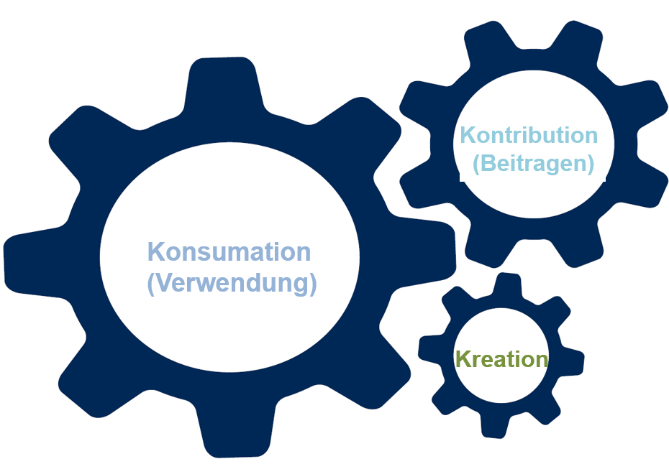
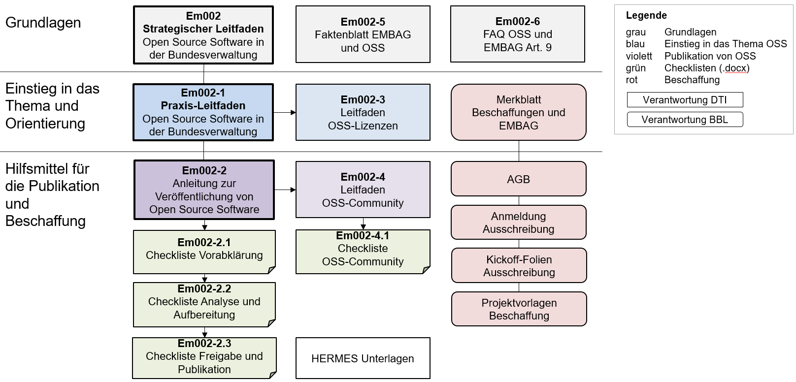

**Disclaimer:** This document is an evolving draft and part of the guidelines and tools designed to support the Federal Administration in publishing open source code. For more information, see the main [README](https://github.com/swiss/opensource-guidelines/tree/main).

---

# Introduction

## Objective and purpose

Under Article 9 paragraph 1 of the Federal Act of 17 March 2023\[5\] on
the Use of Electronic Means to Carry Out Official Tasks (EMOTA), public
authorities must disclose the source code of software they develop or
commission to perform their duties, unless third-party rights or
security-relevant reasons preclude or restrict this. This eliminates
legal uncertainty regarding the publication of software by federal
authorities.

In recent years, it has become clear that the importance of open source
software (OSS) in the Federal Administration has generally continued to
increase.

These strategic guidelines describe the fundamentals of open source
software and how this is handled in the Federal Administration. The
document sets out six objectives and proposes nine measures to fulfil
these.

It also gives references to other relevant public sector strategies
regarding open source.

## Background

In 2005, the Federal IT Strategy Unit (FITSU) published the first
version of an OSS strategy for the Federal Administration. At that time,
the most important principle was defined as the equal treatment of OSS
with closed source software in procurement.

Since publication in 2005, the prevalence of open source software has
steadily increased. Today, according to the Open Source Study
Switzerland 2024 report, a clear majority of companies and authorities
use open source software in many different areas. In the software
industry, very few companies do not work with open source tools and
components.

On 1 February 2019, these *Strategic Guidelines for Open Source Software
in the Federal Administration* and the practical guidelines came into
force as Version 1.0. With the enactment of EMOTA and the new
obligations under Article 9, it became necessary to align both sets of
guidelines with the new status and create additional tools for the
federal authorities.

## Procedure

The federal offices are responsible for implementing EMOTA themselves.
However, given the growing importance of open source, it was decided to
revise the practical guidelines *\[Em002-1\]* together with all
stakeholders. Furthermore, additional tools for implementing EMOTA were
added.

The practical guidelines define the necessary concepts, set out the
constellations for using open source software, where and how
alternatives to existing commercial software can be found, how open
source should be procured, what business models exist for open source
and what support models are possible when using open source. The other
tools provide answers to frequently asked questions and guidance on
releasing open source software in accordance with EMOTA. They explore
all issues surrounding OSS licences and show how a community can be
built around software. Several checklists for guidance and documentation
are also made available to federal authorities.

Furthermore, documents have been adapted in the FOBL environment and an
additional information sheet is being prepared.

Existing uncertainties are resolved as far as possible with these
strategic guidelines, the accompanying practical guidelines and
recommendations for action, as well as the additional tools.

# Reference to other strategies

These *Strategic Guidelines for Open Source Software in the Federal
Administration* are aligned with four current public sector strategies
and EMOTA.\[6\] These contain a direct or indirect reference to the
topic of open source software and IT collaboration among public
institutions:

The ***Digital Federal Administration Strategy*** \[SB001\] sets out
eight principles and four priorities. By using open source software, the
Federal Administration contributes to priority 4, 'Strengthening digital
sovereignty'. An open source solution can be reused any number of times
and adapted to the individual needs of the Federal Administration due to
its open source code.

The concept of digital sustainability and digital sovereignty also comes
up in the ***Digital Public Services Switzerland Strategy
2024–2027***.\[7\] The Confederation and cantons will create
appropriate conditions for this multiple use. Basic modules for
expanding eGovernment will be 'implemented once and used jointly'.
Opting for open source software makes it easier to reuse IT solutions.

According to the ***Digital Switzerland Strategy***\[8\] it is crucial
for Switzerland's success in the digital space to strengthen the
networking of federal levels. Particular attention should therefore be
paid to coordination between the Confederation, cantons and communes as
well as cooperation between organisations active in the field of
digitalisation throughout Switzerland. The Federal Council also attached
particular importance to Switzerland's digital sovereignty as a focus
topic for 2023.\[9\]

In the ***Open Government Data Strategy Switzerland (2019–2023)***\[10\]
the Federal Council states that data from the Federal Administration
that is not personal and not security-critical should be published
according to the Open by Default principle. The Federal Administration
has launched the *opendata.swiss* portal for this purpose.\[11\] Federal
offices, cantons, cities and other public organisations have currently
published over 11,700 datasets there.

The Open Government Data Master Plan 2024–2027\[12\] implements the Open
by Default principle. 

# Governance and tools

When talking about open source software, a distinction has to be made
between **consuming** (using), **contributing** (adding to existing
code) and **creating** (i.e. new projects).

When **consuming** open source software, it should be treated and
evaluated as equivalent to proprietary software.

When **developing** software, open source release is generally
mandatory, subject to the exceptions set out in Art. 9 EMOTA
(third-party rights and security-relevant reasons).  
These exceptions are addressed in *Em002-2 Instructions for Publishing
OSS*.  
The federal authorities, i.e. the administrative units of the Federal
Administration, are themselves responsible for correct compliance; there
is no centralised responsibility.

**Publication** brings added value especially when a **community** of
interested parties emerges and works together on the software. If the
community collaborates on a project and the Federal Administration
allows these contributions, economic benefits and synergy effects are
created.\[13\]  
In practice, release often consists of not only the source code, but
also all other aspects (documentation, governance, build instructions,
etc.).

In principle, the Federal Administration has no obligation to build
communities; the legal mandate only requires it to publish the source
code. The Federal Administration should prioritise investing in
communities where the benefit for the Confederation and third parties is
great and the effort is as low as possible.

Currently, there is no common federal platform for **developing and
publishing source code**. Each public authority must therefore select a
platform (repository) for publication itself. The practical guidelines
in *Em002-2 Instructions for Publishing Open Source Software* and the
associated checklists define how to work with a platform and which
properties it must fulfil.

The **choice of licence** is dealt with in the *OSS Licensing
Guidelines* \[Em002-3\], which presents a selection of standard licences
and explains their uses. The Federal Administration should only use its
own licence texts in justified cases according to Art. 9 para. 4 EMOTA.

When using and developing OSS, **support** must always be regulated
(even if it is waived). The responsible administrative unit regulates
this during the release process or when defining the community. EMOTA
does not make any provisions here, and no additional financing or
personnel will be made available for support. It may make sense to
include support and joint further development where the benefit for
Swiss authorities or the Swiss economy is considered sufficiently large
(ecosystem costs) and/or cost-sharing or cooperation is sought. If the
supplier takes this on, its support costs can be covered by the users.

The **procurement of OSS** is done via the Federal Administration's
regular procurement process. The FOBL provides the relevant documents
and tools such as the *Tender kick-off slides,* *Tender registration*
and *Procurement project templates.* In addition, a *Procurement and
EMOTA information sheet* is available\[14\] (see Figure 2).

Legal and practical considerations mean that under certain circumstances
the obligation to release OSS may be transferred to a supplier (during
the tender or in operation). The procurement tools and the release
process determine how this is to be approached with the supplier. Most
of this is achieved by supplementing existing processes, contract drafts
and tools.

The organisational procedure is regulated in *Em002-2 Instructions for
Publishing Open Source Software* and the associated tools.

**OSS is treated equally to proprietary software under procurement
law.** Since no licence fees are incurred for OSS according to the
definition of the Open Source Initiative (OSI), software can be
downloaded and used in principle without a tender. Only the services to
be provided by companies (e.g. support, engineering) are then subject to
procurement law and must be put out to tender.

Where necessary, the relevant aspects from the tools are integrated into
the Confederation's project management processes (i.e. HERMES).

Open development (direct open development on an openly accessible
repository) and participation in existing projects (contribution) are
also covered in the explanations in *[Em002-4 OSS Community Guidelines](em002-4.md)*.

## Overview of OSS documents

The following diagram gives an overview of the documents relevant to OSS
in the Federal Administration.

Figure : Documents related to Art. 9 EMOTA

# Objectives 

The following overarching, long-term objectives show how the Federal
Administration taps into the potential of open source software and
addresses the risks and challenges:

| **A) Compliance with legal requirements (i.e. EMOTA)** | The release of open source software is governed by Article 9 EMOTA. Compliance with this legal requirement is a key aspect of these guidelines and the associated documents. Federal authorities should comply with this article and maximise the benefits for the Federal Administration and Switzerland. The organisational units themselves are responsible for implementation.                                                                                                                                                                                                                                                                                                       |
| ------------------------------------------------------ | ---------------------------------------------------------------------------------------------------------------------------------------------------------------------------------------------------------------------------------------------------------------------------------------------------------------------------------------------------------------------------------------------------------------------------------------------------------------------------------------------------------------------------------------------------------------------------------------------------------------------------------------------------------------------------------------- |
| **B) Increase innovation and efficiency**              | Open source software serves as the basis of modern IT today. Building on the millions of freely available components and solutions, independent applications can be rapidly developed and operated. The associated time and resource savings and the architectural principles associated with open source software, such as interoperability, agility and microservices, increase the capacity for innovation and efficiency of software development. This in turn accelerates the digitalisation of the Federal Administration. By releasing open source software, the adoption of digital solutions can be accelerated in the federal environment and synergy effects can be utilised. |
| **C) Promote a culture of collaboration**              | Open source software promotes a culture of collaboration in IT through the sharing of source code, open communication and practices for joint further development. These principles can be applied to increase collaboration in IT within the Federal Administration, with the cantons and with other public institutions. This strengthens digital sovereignty and reduces dependencies on software vendors.                                                                                                                                                                                                                                                                            |
| **D) Create clarity and minimise risks**               | Information on frequently used open source licences should enable the Federal Administration to select the right licences. This minimises legal risks. Technical and legal recommendations enable the Federal Administration to use and release open source software.                                                                                                                                                                                                                                                                                                                                                                                                                    |
| **E) Create an overview to utilise synergies**         | Open source software is currently used in numerous places within the Federal Administration in different ways. A lot of knowledge and experience is available, but the synergies cannot yet be utilised as there is no overview of the open source solutions in use. Such an overview and the joint procurement of services will make it possible to better exploit the potential of open source software, which saves resources and creates synergies.                                                                                                                                                                                                                                  |
| **F) Increase attractiveness as an IT employer**       | Open source software is popular with many highly qualified IT professionals. The use of modern open source technologies and the application of open source development methods motivate many employees and increase the attractiveness of the Federal Administration as an employer. To use open source software, the Confederation needs specialists with knowledge and experience of open source software, so efforts should be made when recruiting specialists to expand internal open source know-how.                                                                                                                                                                              |

# Measures

The following measures are intended to help achieve the objectives
outlined above. The measures will be supplemented or replaced in due
course and adapted to changed circumstances.

The following table illustrates how the objectives are linked to the
corresponding measures. These support implementation of the respective
objectives but they may also have an impact on other objectives.

<table>
<thead>
<tr class="header">
<th><strong>Objectives</strong></th>
<th><strong>Measures</strong></th>
</tr>
</thead>
<tbody>
<tr class="odd">
<td><strong>A) Compliance with legal requirements (EMOTA)</strong></td>
<td>
1) Implement the <em>Practical Guidelines for Open Source Software in the Federal Administration [Em002-1]</em>

2) Implement the <em>Instructions for Publishing Open Source Software [Em002-2]</em> and the tools derived from that.

3) Procurement authorities build up open source know-how and thus support the Federal Administration.
</td>
</tr>
<tr class="even">
<td><strong>B) Increase 
innovation and 
efficiency</strong></td>
<td>
1) Implement the <em>Practical Guidelines for Open Source Software in the Federal Administration [Em002-1]</em>

3) The procurement authorities can deal with open source and optimally support Art. 9 EMOTA.

8) Promote community building
</td>
</tr>
<tr class="odd">
<td><strong>C) Promote a culture of collaboration</strong></td>
<td>
1) Implement the <em>Practical Guidelines for Open Source Software in the Federal Administration [Em002-1]</em>

4) Promote knowledge and experience exchange

8) Promote community building

9) Examine the possibility of establishing own publication platform; promote Open Development
</td>
</tr>
<tr class="even">
<td><strong>D) Create clarity 
and minimise risks</strong></td>
<td>
1) Implement the <em>Practical Guidelines for Open Source Software in the Federal Administration [Em002-1]</em>

2) Implement the <em>Instructions for Publishing Open Source Software [Em002-2]</em> and the tools derived from that.
</td>
</tr>
<tr class="odd">
<td><strong>E) Create an 
overview to utilise synergies</strong></td>
<td>
6) Implement joint procurement of services

7) Create an overview of open source software used, released and co-developed

8) Promote community building
</td>
</tr>
<tr class="even">
<td><strong>F) Increase 
attractiveness as an IT employer</strong></td>
<td>
5) Promote and communicate an open source culture

8) Promote community building
</td>
</tr>
</tbody>
</table>

## Description of the measures

<table>
<thead>
<tr class="header">
<th><strong>Measure 1:</strong></th>
<th><strong>Implement the <em>Practical Guidelines for Open Source Software in the Federal Administration [Em002-1]</em></strong>.</th>
</tr>
</thead>
<tbody>
<tr class="odd">
<td>
Although the term open source software is already over 20 years old, the steady spread of open source software and the continuous development of application scenarios constantly lead to new practices and questions. New and further developments of open source solutions are also increasingly forming full-fledged alternatives to proprietary software. With EMOTA, the obligation to publish in-house developments is added.

The <em>Practical Guidelines for Open Source Software in the Federal Administration</em> give an overview and introduction to the topic, outlines the advantages and disadvantages of open source software and explains all other tools. It also contains best practices, proven alternatives and practical recommendations on how the Federal Administration should handle open source software.

These practical guidelines and the other tools should be used and implemented by the federal authorities when dealing with open source software and releases.

As a brief introduction to the topic, a <em>EMOTA and OSS Factsheet</em> and the <em>FAQ on OSS and Art. 9 EMOTA</em> are available<em>.</em>
</td>
<td></td>
</tr>
<tr class="even">
<td></td>
<td></td>
</tr>
<tr class="odd">
<td><strong>Measure 2:</strong></td>
<td><strong>Implement the <em>Instructions for Publishing Open Source Software [Em002-2]</em> and the tools derived from that.</strong></td>
</tr>
<tr class="even">
<td>
The efficient use of OSS in software development often requires contributions in the form of bug fixes and functional enhancements. With EMOTA, there is also an obligation to release self-created software. The necessary guidance is available with various tools.

The checklists are part of the instructions for publishing OSS. They should be used as a supplement to the corresponding guidelines of the administrative units before and during development.

The handling of legacy code under Art. 9 EMOTA is also discussed. The aim is to find and implement pragmatic solutions.

Licences are particularly important in the OSS environment. When releasing, procuring and using software, licences must be aligned with what is legally feasible and the desired effect. The necessary knowledge and corresponding decisions should be documented. In this context, the necessary additional documents such as the Contributor Licence Agreement (CLA) are also provided.

To facilitate the application of Art. 9 EMOTA, additions will be made to the Confederation's project management method (HERMES). Administrative units should find the necessary tools in the regular process.
</td>
<td></td>
</tr>
</tbody>
</table>

<table>
<thead>
<tr class="header">
<th><strong>Measure 3:</strong></th>
<th><strong>Procurement authorities build up open source know-how and thus support the Federal Administration.</strong></th>
</tr>
</thead>
<tbody>
<tr class="odd">
<td>
A new <em>Factsheet on Procurement and EMOTA</em> has been drawn up for procurement. The <em>Tender registration</em> and <em>Tender kick-off slides</em> are also being adapted. 
The increased requirements regarding the resources to be procured for software publication must be taken into account. 
In its 2015 factsheet <em>Software Tenders: Ensuring Broad Competition</em>, the FOBL created equal conditions for open and closed source software.

Various procurement templates have been added for Art. 9 EMOTA. In many cases, the easiest way to release open source software is to coordinate with the supplier and transfer the obligations to them. Further information can be found on the <a href="https://intranet.bbl.admin.ch/bbl_kp/de/home/informatik/beschaffung-buerotechnik-informatik-des-bbl/werkzeugkasten.html">FOBL intranet</a> (only accessible from the federal network).
</td>
<td></td>
</tr>
</tbody>
</table>

<table>
<thead>
<tr class="header">
<th><strong>Measure 4:</strong></th>
<th><strong>Promote knowledge and experience exchange</strong></th>
</tr>
</thead>
<tbody>
<tr class="odd">
<td>
Creating and using open source software requires in-depth, specialised know-how. At the same time, open source solutions are constantly evolving and new open source projects are being launched. It is therefore a challenge to maintain a comprehensive overview of current trends and technologies.

To promote the professional use of open source and facilitate the exchange of knowledge and experience, information should be shared within an extended community of interest, and employees within the Federal Administration should be competently supported.
</td>
<td></td>
</tr>
</tbody>
</table>

<table>
<thead>
<tr class="header">
<th><strong>Measure 5:</strong></th>
<th><strong>Promote and communicate an open source culture</strong></th>
</tr>
</thead>
<tbody>
<tr class="odd">
<td>
Advancing digitalisation has further exacerbated the shortage of skilled workers in IT. This also makes it difficult for the Federal Administration's service providers to recruit qualified IT staff. The use of open source software and the associated developer culture is known to be an argument for professionals to apply for such positions.

In order to be perceived by the public as an 'open source-friendly' employer, the various measures and the open source solutions used should be actively communicated in the form of a technology radar.[15] For employer attractiveness, it is also important to allow federal employees to contribute to existing open source software.
</td>
<td></td>
</tr>
</tbody>
</table>

<table>
<thead>
<tr class="header">
<th><strong>Measure 6:</strong></th>
<th><strong>Implement joint procurement of services</strong></th>
</tr>
</thead>
<tbody>
<tr class="odd">
<td>
Maintenance and support of open source software is currently provided by internal employees of the Federal Administration, while external suppliers offer services for certain open source solutions. These services are often procured independently by the respective offices, which can lead to duplication and the associated financial losses.

The joint procurement of services for open source software should increase the reliability of maintenance and support in operation and simplify the use of open source solutions. Based on the technology radar (see Measure 5), services for the most widespread open source systems and technologies should be centrally procured. These services can then be obtained by all offices as needed.[16]
</td>
<td></td>
</tr>
</tbody>
</table>

<table>
<thead>
<tr class="header">
<th><strong>Measure 7:</strong></th>
<th><strong>Create an overview of open source software used, released and co-developed.</strong></th>
</tr>
</thead>
<tbody>
<tr class="odd">
<td>
Since no licences need to be purchased when using open source software, the time-consuming procurement process is often eliminated. This makes it difficult to track where the Federal Administration uses which open source software. As a result, the potential of open source software – such as the use of synergies, the formation of communities for the experience exchange, etc. – cannot be fully utilised.

A technology radar within the Federal Administration should provide an overview of where which open source software is being used and who has what know-how.
</td>
<td></td>
</tr>
</tbody>
</table>

| **Measure 8:**                                                                                                                                                                                                                                                                                                                                                                                                                                                                                                                                                                                                    | **Promote community building** |
| ----------------------------------------------------------------------------------------------------------------------------------------------------------------------------------------------------------------------------------------------------------------------------------------------------------------------------------------------------------------------------------------------------------------------------------------------------------------------------------------------------------------------------------------------------------------------------------------------------------------- | ------------------------------ |
| Building and participating in communities for project development is very important for OSS. A significant number of synergies result from this. It may be that the project already exists and the Confederation only participates, or the Confederation may lead the project, or indeed it may be a collaboration. Omitting a community is also an important decision. Direct development on an open repository\[17\] (without subsequent release) can bring further efficiency gains and promote joint development. Em002-4 provides guidance and motivation for community building by the federal authorities. |                                |

<table>
<thead>
<tr class="header">
<th><strong>Measure 9:</strong></th>
<th><strong>Examine the possibility of establishing own publication platform; promote Open Development</strong></th>
</tr>
</thead>
<tbody>
<tr class="odd">
<td>The establishment and operation of an internal or Swiss publication platform will be examined and implemented after such a decision has been taken. 
The aim of an independent platform for the Federal Administration is to preserve digital sovereignty and independence. Collaboration is simplified and at the same time it creates an overview of activities. 
Federal cooperation across all authorities in Switzerland (similar to opencode.de) is being examined (e.g. DPSS or eOperations Switzerland).</td>
<td></td>
</tr>
</tbody>
</table>

# Annexes

## Changes from previous version

  - Removal of all references to the Federal IT Steering Unit (FITSU).

  - Incorporation of changes relating to the implementation of Art. 9
    EMOTA. In addition to simple publications, scenarios are also
    assumed where an existing open source project can be expanded for
    federal purposes or collaborations take place.

  - This has resulted in the new objective A and derived measures:
    
      - > Measure 1 is now implementation of the practical guidelines.
    
      - > Measure 2: Publication of open source software with tools
    
      - > Measure 9: Examination of own publication platform. Promotion
        > of Open Development.

  - Procurement is supplemented with regard to Art. 9 EMOTA (Measure 3)

  - Measures 7 and 8 have been made more precise.

## References for OSS tools

The following reference table lists all documents relating to the
document set for *Em002 Tools for Open Source Software in the Federal
Administration*.

Source note: The tools and especially the checklists are partly based on
the **OSS documents of the Canton of Bern**, which are released under a
BSD3 licence
([*https://github.com/kanton-bern/oss*](https://github.com/kanton-bern/oss)).

| \[Em002\]     | [Em002 Strategic Guidelines for Open Source Software in the Federal Administration](em002.md), version 2.0, 2024 (<https://www.bk.admin.ch/bk/en/home/digitale-transformation-ikt-lenkung/bundesarchitektur/open_source_software.html>)        |
| ------------- | ---------------------------------------------------------------------------------------------------------------------------------------------------------------------------------------------------------------------------------- |
| \[Em002-1\]   | [Em002-1 Practical Guidelines for Open Source Software in the Federal Administration](em002-1.md), version 2.0, 2024                                                                                                                             |
| \[Em002-2\]   | Em002-2 Instructions for Publishing Open Source Software, version 1.0, 2024                                                                                                                                                        |
| \[Em002-2.1\] | [Em002-2.1 Preliminary Assessment Checklist](em002-2.1.md), version 1.0, 2024                                                                                                                                                                      |
| \[Em002-2.2\] | [Em002-2.2 Analysis and Preparation Checklist](em002-2.2.md), version 1.0, 2024                                                                                                                                                                    |
| \[Em002-2.3\] | [Em002-2.3 Release and Publication Checklist](em002-2.3.md), version 1.0, 2024                                                                                                                                                                     |
| \[Em002-3\]   | [Em002-3 OSS Licensing Guidelines](em002-3.md), version 1.0, 2024                                                                                                                                                                                |
| \[Em002-4\]   | [Em002-4 OSS Community Guidelines](em002-4.md), version 1.0, 2024                                                                                                                                                                                |
| \[Em002-4.1\] | [Em002-4.1 OSS Community Checklist](em002-4.1.md), version 1.0, 2024                                                                                                                                                                               |
| \[Em002-5\]   | [Em002-5 EMOTA and OSS Factsheet](em002-5.md), 2024                                                                                                                                                                                              |
| \[Em002-6\]   | [Em002-6 FAQ on OSS and Art. 9 EMOTA](em002-6.md), 2024                                                                                                                                                                                          |
| \[BBL\]       | Information sheets for the FOBL procurement units can be found in the corresponding toolbox (in German): <https://intranet.bbl.admin.ch/bbl_kp/de/home/informatik/beschaffung-buerotechnik-informatik-des-bbl/werkzeugkasten.html> |
| \[BB2015\]    | Information sheet: Software tenders: Ensuring broad competition; 2015; no longer in force                                                                                                                                          |
| \[BBL-AGB\]   | GTCs of the Confederation. <https://www.bkb.admin.ch/bkb/de/home/themen/agb.html>                                                                                                                                                  |

Visual overview of OSS tools:

Figure *3*: Documents in connection
with Art. 9 EMOTA

## General references

All references to the Em002 document set can be found here in *Em002
Strategic Guidelines \[Em002\].*

| \[BITKOM2023\] | Leitfaden Open-Source-Software 2.0. Berlin: Bitkom e. V. Bundesverband Informationswirtschaft, Telekommunikation und neue Medien e. V. BIT-KOM. 2023. <https://www.bitkom.org/Bitkom/Publikationen/Bitkom-Leitfaden-zu-Open-Source-Software-20.html>                                   |
| -------------- | -------------------------------------------------------------------------------------------------------------------------------------------------------------------------------------------------------------------------------------------------------------------------------------- |
| \[EY2011\]     | Open Source Software im geschäftskritischen Einsatz. Ernst & Young*. 2011.* <https://www.yumpu.com/de/document/read/23276493/open-source-software-ernst-young>.                                                                                                                        |
| \[EMOTA2023\]  | 172.019 Federal Act on the Use of Electronic Means to Carry Out Official Tasks (EMOTA) <https://www.fedlex.admin.ch/eli/cc/2023/682/de>                                                                                                                                                |
| \[Fr2012\]     | Fröhlich-Bleuler, Gianni. Open Source Compliance. *Jusletter* 12 November 2012.                                                                                                                                                                                                        |
| \[Ga2021\]     | Gartner for Application and Software Engineering Leaders Tool: Open Source Software Governance Policy Template. Gartner. March 2021                                                                                                                                                    |
| \[GoAy2022\]   | Goldstein, Ayala. Top 10 Open Source Licenses in 2022: Trends and Predictions. 2022. <https://resources.whitesourcesoftware.com/blog-whitesource/top-open-source-licenses-trends-and-predictions>                                                                                      |
| \[Gu2024\]     | Günter, Matthias. Selection criteria for enterprise-ready Open Source software. 2024. <https://gnostx.com/wp_gnostx/blog/2024/05/31/selection-criteria-for-enterprise-ready-open-source-software/>                                                                                     |
| \[IZqCab2023\] | Izquierdo, Javier Luis, Canovas and Cabot, Jordi; For a more transparent governance of open source; Communications of the ACM; August 2023                                                                                                                                             |
| \[JaAx2016\]   | Jaeger, Till, and Metzger, Alex. Open Source Software: Rechtliche Rahmenbedingungen der Freien Software. 4th ed. Munich: C.H.Beck. 2016                                                                                                                                                |
| \[KuWiSa2008\] | Kuhn, Bradley M., Williamson, Aaron; and Sandler, Karen M. A Practical Guide to GPL Compliance. Software Freedom Law Center. 2008. <https://softwarefreedom.org/resources/2008/compliance-guide.html>                                                                                  |
| \[LaOp2023\]   | Lambach, D. and Oppermann, K. Narratives of digital sovereignty in German political discourse, Governance, 36(3), pp. 693–709. 2023. Available at: <https://doi.org/10.1111/gove.12690>                                                                                                |
| \[LaWu2022\]   | Laux, Christian and Wüst, Anja. Datensouveränität – Was es zur Begriffsklärung braucht. Swiss Data Alliance. Version 1.0. July 2022                                                                                                                                                    |
| \[Le2023\]     | Lehmann, David. Erfahrungen mit Open Source Freigabe beim BIT. Presentation from 18 September 2023                                                                                                                                                                                     |
| \[OSI2024\]    | Open Source Initiative. Open Source Licenses by Name. 2024. <https://opensource.org/licenses/alphabetical>                                                                                                                                                                             |
| \[OSS2024\]    | Open Source Studie 2024; https://www.oss-studie.ch/                                                                                                                                                                                                                                    |
| \[Pe1999\]     | Perens, Bruce. The Open Source Definition. In Open Sources: Voices from the Open Source Revolution.1999. <https://www.oreilly.com/openbook/opensources/book/perens.html>.                                                                                                              |
| \[SB001\]      | [Strategy Digital Federal Administration](https://intranet.dti.bk.admin.ch/isb_kp/de/home/ikt-vorgaben/strategien-teilstrategien/strategie-digitale-bundesverwaltung.html) and Transformation Plan                                                                                     |
| \[Sc2024\]     | Schlauri, Simon. Charakteristika gängiger Open-Source-Lizenzen. 2024                                                                                                                                                                                                                   |
| \[ScScPo2017\] | Schlauri, Simon, Schweizer, Samuel, and Poledna, Thomas. 2017. Rechtliche Voraussetzungen Der Nutzung von Open-Source-Software in Der Öffentlichen Verwaltung, Insbesondere des Kantons Bern. Carl Grossmann Verlag. <http://www.oapen.org/search?identifier=632680> (26 August 2019). |
| \[St2011\]     | Straub, Wolfgang. Softwareschutz: Urheberrecht, Patentrecht, Open Source. Zurich: 2011. Dike. <https://www.it-recht.ch/wp-content/uploads/2014/11/Straub-Softwareschutz-Open-Source-Software-Zurich-2011.pdf>.                                                                         |
| \[St2024\]     | Stürmer, Matthias. Technological Perspective on Digital Sovereignty, Report for the FDFA. 2024 [\[2406.03266\] Technological Perspective on Digital Sovereignty (arxiv.org)](https://arxiv.org/abs/2406.03266)                                                                         |
| \[StGa2018\]   | Stürmer, Matthias, and Gauch, Carole. Open Source Studie Schweiz 2018. Forschungsstelle Digitale Nachhaltigkeit der Universität Bern. 2018. <https://www.oss-studie.ch/open-source-studie-2018.pdf>.                                                                                   |
| \[StNu2021\]   | Stürmer, Matthias and Nussbaumer, Jasmin. Open Source Studie Schweiz 2021. Forschungsstelle Digitale Nachhaltigkeit der Universität Bern. 2021. <https://www.ch-open.ch/open-source-studie-schweiz-2021/>                                                                              |
| \[Whe2007\]    | Wheeler, David A. The Free-Libre / Open Source Software (FLOSS) License Slide. 2007. <https://dwheeler.com/essays/floss-license-slide.pdf>                                                                                                                                             |

## Abbreviations

This list of abbreviations contains all the abbreviations used in the
OSS Em002 document set.

A glossary can be found in *Em002-6 FAQ on OSS and Art 9 EMOTA.*

| FOBL   | Federal Office for Buildings and Logistics                              |
| ------ | ----------------------------------------------------------------------- |
| FOITT  | Federal Office of Information Technology, Systems and Telecommunication |
| CLA    | Contributor Licence Agreement                                           |
| DPSS   | Digital Public Services Switzerland                                     |
| EMOTA  | Federal Act on the Use of Electronic Means to Carry Out Official Tasks  |
| FSF    | Free Software Foundation                                                |
| HERMES | All-in-one methodology for project and programme management             |
| FITSU  | Federal IT Steering Unit                                                |
| OSI    | Open Source Initiative                                                  |
| OSS    | Open source software                                                    |
| OSSD   | Open source software development                                        |
| SPDX   | Software Package Data Exchange                                          |

1.  Recommendation for Federal Administration IT in accordance with
    \[P035\] *Section 4.6*

2.  For definitions of the INTERNAL and CONFIDENTIAL classifications,
    see the *Ordinance of 8 November 2023 on Information Security in the
    Federal Administration and Armed Forces (InfoSecO; SR 128.1)*

3.  See footnote 1

4.  Planning areas in accordance with the *Federal ICT Strategy
    2020–2023 of 3 April 2020 (SB000)*

5.  SR 172.019

6.  SR 172.019). <https://www.fedlex.admin.ch/eli/cc/2023/682/de>

7.  Digital Public Services Switzerland Strategy 2024–2027:
    <https://www.digital-public-services-switzerland.ch/strategy>

8.  <https://digital.swiss/en/>

9.  https://digital.swiss/en/strategy/focus-topics/digital-sovereignty

10. [Open Government Data Strategy
    Switzerland 2019–2023](https://www.bfs.admin.ch/bfs/en/home/services/ogd/documentation.html)

11. <https://opendata.swiss/en>

12. [https://www.bfs.admin.ch/bfs/de/home/dienstleistungen/ogd/masterplan.html](https://www.bfs.admin.ch/bfs/en/home/services/ogd/documentation.html)

13. <https://test.bitkom.org/sites/main/files/2023-03/BitkomLeitfadenOpenSourceSoftware31.pdf>,
    Section 4 (in German)

14. Available here (in German):
    <https://intranet.bbl.admin.ch/bbl_kp/de/home/informatik/beschaffung-buerotechnik-informatik-des-bbl/werkzeugkasten.html>

15. Technology radars should be used as widely as possible. This means,
    if possible, at the level of the federal authorities or even the
    Federal Administration.

16. This concerns support for the software in use. Third party support
    for software released under EMOTA is possible and may be charged
    for. This is covered in *[Em002-4 OSS Community Guidelines](em002-4.md)
    \[Em002-4*\]*.*

17. https://en.wikipedia.org/wiki/Software\_repository
