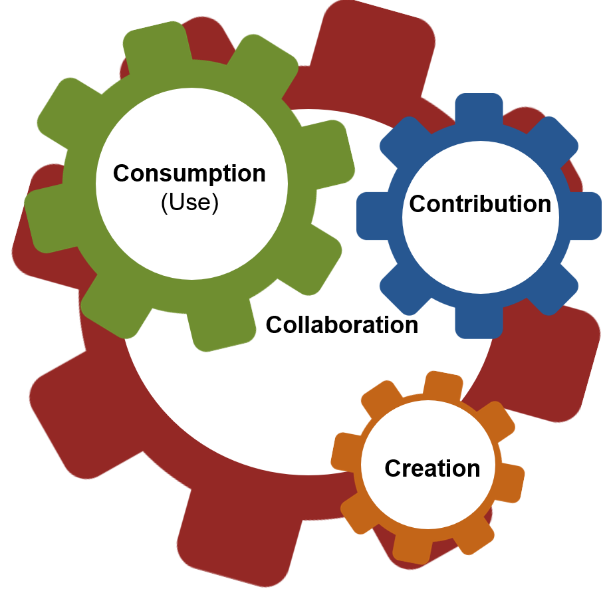

**Disclaimer:** This document is an evolving draft and part of the guidelines and tools designed to support the Federal Administration in publishing open source code. For more information, see the main [README](https://github.com/swiss/opensource-guidelines/tree/main).

---

# Introduction

## Objective and purpose

Under Article 9 paragraph 1 of the Federal Act of 17 March 2023[^5] on the Use of Electronic Means to Carry Out Official Tasks (EMOTA), public authorities must disclose the source code of software they develop or commission to perform their duties, unless third-party rights or security-relevant reasons preclude or restrict this. This eliminates legal uncertainty regarding the publication of software by federal authorities.

In recent years, it has become clear that the importance of open source software (OSS) in the Federal Administration has generally continued to increase. 

These strategic guidelines describe the fundamentals of open source software and how this is handled in the Federal Administration. The document sets out six objectives and proposes nine measures to fulfil these.

It also gives references to other relevant public sector strategies regarding open source. 

## Background

In 2005, the Federal IT Strategy Unit (FITSU) published the first version of an OSS strategy for the Federal Administration. At that time, the most important principle was defined as the equal treatment of OSS with closed source software in procurement.

Since publication in 2005, the prevalence of open source software has steadily increased. Today, according to the Open Source Study Switzerland 2024 report, a clear majority of companies and authorities use open source software in many different areas. In the software industry, very few companies do not work with open source tools and components.

On 1 February 2019, these Strategic Guidelines for Open Source Software in the Federal Administration and the practical guidelines came into force as Version 1.0. With the enactment of EMOTA and the new obligations under Article 9, it became necessary to align both sets of guidelines with the new status and create additional tools for the federal authorities.

## Procedure
The federal offices are responsible for implementing EMOTA themselves. However, given the growing importance of open source, it was decided to revise the practical guidelines *[Em002-1]* together with all stakeholders. Furthermore, additional tools for implementing EMOTA were added. 

The practical guidelines define the necessary concepts, set out the constellations for using open source software, where and how alternatives to existing commercial software can be found, how open source should be procured, what business models exist for open source and what support models are possible when using open source. The other tools provide answers to frequently asked questions and guidance on releasing open source software in accordance with EMOTA. They explore all issues surrounding OSS licences and show how a community can be built around software. Several checklists for guidance and documentation are also made available to federal authorities.

Documents relating to procurement were also amended, and an additional information sheet [KBB-MB], set of guidelines [BBL-WL] and a checklist [BBL-CL] were drawn up. 

Existing uncertainties are resolved as far as possible with these strategic guidelines, the accompanying practical guidelines and recommendations for action, as well as the additional tools.

# Reference to other strategies

These Strategic Guidelines for Open Source Software in the Federal Administration are aligned with four current public sector strategies and EMOTA.[^6] These contain a direct or indirect reference to the topic of open source software and IT collaboration among public institutions:

The **Digital Federal Administration Strategy** [SB001] sets out eight principles and four priorities. By using open source software, the Federal Administration contributes to priority 4, 'Strengthening digital sovereignty'. An open source solution can be reused any number of times and adapted to the individual needs of the Federal Administration due to its open source code.

The concept of digital sustainability and digital sovereignty also comes up in the **Digital Public Services Switzerland Strategy 2024–2027**[^7]. The Confederation and cantons will create appropriate conditions for this multiple use. Basic modules for expanding eGovernment will be 'implemented once and used jointly'. Opting for open source software makes it easier to reuse IT solutions.

According to the **Digital Switzerland Strategy**[^8] it is crucial for Switzerland's success in the digital space to strengthen the networking of federal levels. Particular attention should therefore be paid to coordination between the Confederation, cantons and communes as well as cooperation between organisations active in the field of digitalisation throughout Switzerland. The Federal Council also attached particular importance to Switzerland's digital sovereignty as a focus topic for 2023.[^9]

In the **Open Government Data Strategy Switzerland (2019–2023)**[^10] the Federal Council states that data from the Federal Administration that is not personal and not security-critical should be published according to the Open by Default principle. The Federal Administration has launched the opendata.swiss portal for this purpose.[^11] Federal offices, cantons, cities and other public organisations have currently published over 11,700 datasets there. 

The Open Government Data Master Plan 2024–2027[^12] implements the Open by Default principle. 

# Governance and tools

When talking about open source software, a distinction has to be made between **consuming** (using), **contributing** (adding to existing code) and **creating** (i.e. new projects). 

Figure 1: The 4 Cs in the context of OSS

**Collaboration** is also always conceivable in the background. In the case of creation, it must be initiated by the Federal Administration; in the case of contribution, it already exists; and it can also be helpful in the case of consumption (e.g. user group).

When **consuming** open source software, it should be treated and evaluated as equivalent to proprietary software.

When **developing** software, open source release is generally mandatory, subject to the exceptions set out in Art. 9 EMOTA (third-party rights and security-relevant reasons). 

These exceptions are addressed in *Em002-2 Instructions for Publishing OSS*. 

The federal authorities, i.e. the administrative units of the Federal Administration, are themselves responsible for correct compliance; there is no centralised responsibility.

**Publication** brings added value especially when a **community** of interested parties emerges and works together on the software. If the community collaborates on a project and the Federal Administration allows these contributions, economic benefits and synergy effects are created.[^13]

In practice, release often consists of not only the source code, but also all other aspects (documentation, governance, build instructions, etc.).

In principle, the Federal Administration has no obligation to build communities; the legal mandate only requires it to publish the source code. The Federal Administration should prioritise investing in communities where the benefit for the Confederation and third parties is great and the effort is as low as possible.

Currently, there is no common federal platform for **developing and publishing source code**. Each public authority must therefore select a platform (repository) for publication itself. The practical guidelines in Em002-2 Instructions for Publishing Open Source Software and the associated checklists define how to work with a platform and which properties it must fulfil.

The **choice of licence** is dealt with in the OSS Licensing Guidelines [Em002-3], which presents a selection of standard licences and explains their uses. The Federal Administration should only use its own licence texts in justified cases according to Art. 9 para. 4 EMOTA.

When using and developing OSS, **support**[^14] must always be regulated (even if it is waived). The responsible administrative unit regulates this during the release process or when defining the community. EMOTA does not make any provisions here, and no additional financing or personnel will be made available for support. It may make sense to include support and joint further development where the benefit for Swiss authorities or the Swiss economy is considered sufficiently large (ecosystem costs) and/or cost-sharing or cooperation is sought. If the supplier takes this on, its support costs can be covered by the users.

The **procurement of OSS** is done via the Federal Administration's regular procurement process. The FOBL provides the relevant documents and tools. 

In addition, a *Software procurement and Art. 9 EMOTA information sheet* is available[^15] *[KBB-MB]* (see Figure 2).

Legal and practical considerations mean that under certain circumstances the obligation to release OSS may be transferred to a supplier (during the tender or in operation). The procurement tools and the release process determine how this is to be approached with the supplier. Most of this is achieved by supplementing existing processes, contract drafts and tools.

The organisational procedure is regulated in *Em002-2 Instructions for Publishing Open Source Software* and the associated tools.

**OSS is treated equally to proprietary software under procurement law.** Since no licence fees are incurred for OSS according to the definition of the Open Source Initiative (OSI), software can be downloaded and used in principle without a tender. Only the services to be provided by companies (e.g. support, engineering) are then subject to procurement law and must be put out to tender. 

Where necessary, the relevant aspects from the tools are integrated into the Confederation's project management processes (i.e. HERMES).

Open development (direct open development on an openly accessible repository) and participation in existing projects (contribution) are also covered in the explanations in *Em002-4 OSS Community Guideline*s.

## Overview of OSS documents
The following diagram gives an overview of the documents relevant to OSS in the Federal Administration. 

Figure 2: Documents related to Art. 9 EMOTA

# Objectives 

The following overarching, long-term objectives show how the Federal Administration taps into the potential of open source software and addresses the risks and challenges:

   

 <strong>A) Compliance with legal requirements (i.e. EMOTA)</strong> 
  

  

 The release of open source software is governed by Article 9 EMOTA. Compliance with this legal requirement is a key aspect of these guidelines and the associated documents. Federal authorities should comply with this article and maximise the benefits for the Federal Administration and Switzerland. The organisational units themselves are responsible for implementation.
  

   

  <strong>B) Increase innovation and efficiency</strong>
  

  

   Open source software serves as the basis of modern IT today. Building on the millions of freely available components and solutions, independent applications can be rapidly developed and operated. The associated time and resource savings and the architectural principles associated with open source software, such as interoperability, agility and microservices, increase the capacity for innovation and efficiency of software development. This in turn accelerates the digitalisation of the Federal Administration. By releasing open source software, the adoption of digital solutions can be accelerated in the federal environment and synergy effects can be utilised.
  

   

<strong>C) Promote a culture of collaboration</strong>
  

  

 Open source software promotes a culture of collaboration in IT through the sharing of source code, open communication and practices for joint further development. These principles can be applied to increase collaboration in IT within the Federal Administration, with the cantons and with other public institutions. This strengthens digital sovereignty and reduces dependencies on software vendors.
  

   

  <strong>D) Create clarity and minimise risks</strong>
  

  

 Information on frequently used open source licences should enable the Federal Administration to select the right licences. This minimises legal risks. Technical and legal recommendations enable the Federal Administration to use and release open source software.
  

   

  <strong>E) Create an overview to utilise synergies</strong>
  

  

 Open source software is currently used in numerous places within the Federal Administration in different ways. A lot of knowledge and experience is available, but the synergies cannot yet be utilised as there is no overview of the open source solutions in use. Such an overview and the joint procurement of services will make it possible to better exploit the potential of open source software, which saves resources and creates synergies. 
  

   

  <strong>F) Increase attractiveness as an IT employer</strong>
  

  

 Open source software is popular with many highly qualified IT professionals. The use of modern open source technologies and the application of open source development methods motivate many employees and increase the attractiveness of the Federal Administration as an employer. To use open source software, the Confederation needs specialists with knowledge and experience of open source software, so efforts should be made when recruiting specialists to expand internal open source know-how.
  

# Measures

The following measures are intended to help achieve the objectives outlined above. The measures will be supplemented or replaced in due course and adapted to changed circumstances. 

The following table illustrates how the objectives are linked to the corresponding measures. These support implementation of the respective objectives but they may also have an impact on other objectives.
|Objectives | Measures|
|:--| :--|
|**A) Compliance with legal requirements (EMOTA)**|1) Implement the *Practical Guidelines for Open Source Software in the Federal Administration [Em002-1]*   2) Implement the *Instructions for Publishing Open Source Software [Em002-2]* and the tools derived from that.   3) Procurement authorities build up open source know-how and thus support the Federal Administration.|
|**B) Increase innovation and efficiency** | 1) Implement the *Practical Guidelines for Open Source Software in the Federal Administration [Em002-1]*   3) The procurement authorities can deal with open source and optimally support Art. 9 EMOTA.   8) Promote community building |
|**C) Promote a culture of collaboration** | 1) Implement the *Practical Guidelines for Open Source Software in the Federal Administration [Em002-1]*  4) Promote knowledge and experience exchange  8) Promote community building  9) Examine the possibility of establishing own publication platform; promote Open Development|
|**D) Create clarity and minimise risks** |1) Implement the *Practical Guidelines for Open Source Software in the Federal Administration [Em002-1]*   2) Implement the *Instructions for Publishing Open Source Software [Em002-2]* and the tools derived from that.|
|**E) Create an overview to utilise synergies**|6) Implement joint procurement of services  7) Create an overview of open source software used, released and co-developed   8) Promote community building |
|**F) Increase attractiveness as an IT employer** | 5) Promote and communicate an open source culture  8) Promote community building |

## Description of the measures
<table style="width: 100%; border-collapse: collapse; font-family: sans-serif;">
  <tr>
    <td style="border: 1px solid #ddd; padding: 10px; width: 20%; font-weight: bold; vertical-align: top;">
      Measure 1:
    </td>
    <td style="border: 1px solid #ddd; padding: 10px; font-weight: bold;">
      Implement the <i>Practical Guidelines for Open Source Software in the Federal Administration [Em002-1]</i>.
    </td>
  </tr>
  
  <tr>
    <td colspan="2" style="border: 1px solid #ddd; padding: 15px; line-height: 1.5; text-align: justify;">
      Although the term open source software is already over 20 years old, the steady spread of open source software and the continuous development of application scenarios constantly lead to new practices and questions. New and further developments of open source solutions are also increasingly forming full-fledged alternatives to proprietary software. With EMOTA, the obligation to publish in-house developments is added.
       
      The <i>Practical Guidelines for Open Source Software in the Federal Administration</i> give an overview and introduction to the topic, outlines the advantages and disadvantages of open source software and explains all other tools. It also contains best practices, proven alternatives and practical recommendations on how the Federal Administration should handle open source software.
       
      These practical guidelines and the other tools should be used and implemented by the federal authorities when dealing with open source software and releases.
       
      As a brief introduction to the topic, an <i>information sheet on the application of Art. 9 EMOTA</i> and <i>EM002-6 FAQ about Publishing OSS (OSS-FAQ)</i> are available.
    </td>
  </tr>

  <tr style="height: 20px;">
    <td colspan="2" style="border: 1px solid #ddd;"></td>
  </tr>

  <tr>
    <td style="border: 1px solid #ddd; padding: 10px; font-weight: bold; vertical-align: top;">
      Measure 2:
    </td>
    <td style="border: 1px solid #ddd; padding: 10px; font-weight: bold;">
      Implement the Instructions for <i>Publishing Open Source Software [Em002-2]</i>  and the tools derived from that.
    </td>
  </tr>
    <tr>
    <td colspan="2" style="border: 1px solid #ddd; padding: 15px; line-height: 1.5; text-align: justify;">
      The efficient use of OSS in software development often requires contributions in the form of bug fixes and functional enhancements. With EMOTA, there is also an obligation to release self-created software. The necessary guidance is available with various tools. 
The checklists are part of the instructions for publishing OSS. They should be used as a supplement to the corresponding guidelines of the administrative units before and during development. 
The handling of legacy code under Art. 9 EMOTA is also discussed. The aim is to find and implement pragmatic solutions. 
Licences are particularly important in the OSS environment. When releasing, procuring and using software, licences must be aligned with what is legally feasible and the desired effect. The necessary knowledge and corresponding decisions should be documented. In this context, the necessary additional documents such as the Contributor Licence Agreement (CLA) are also provided. 
To facilitate the application of Art. 9 EMOTA, additions will be made to the Confederation's project management method (HERMES). Administrative units should find the necessary tools in the regular process.
    </td>
  </tr>
    <tr style="height: 20px;">
    <td colspan="2" style="border: 1px solid #ddd;"></td>
  </tr>

  <tr>
    <td style="border: 1px solid #ddd; padding: 10px; font-weight: bold; vertical-align: top;">
      Measure 3:
    </td>
    <td style="border: 1px solid #ddd; padding: 10px; font-weight: bold;">
      Procurement authorities build up open source know-how and thus support the Federal Administration.
    </td>
  </tr>
    <tr>
    <td colspan="2" style="border: 1px solid #ddd; padding: 15px; line-height: 1.5; text-align: justify;">
     The new <i>Em002-7 Strategic Aspects of Procurement and OSS </i> was created to address procurement aspects.  
To ensure broad competition, procurement requires that open and closed source software be treated equally.
The increased requirements in connection with Art. 9 EMOTA regarding the resources to be procured for software publication must be taken into account.  
The Competence Centre for Federal Public Procurement (CCPP) has published an information sheet on software procurement and Art. 9 EMOTA [KBB-MB] at the following link <a href="https://perimap.admin.ch/goto_perimap_file_46835_download.html">https://perimap.admin.ch/goto_perimap_file_46835_download.html</a>. 
Further assistance is available on the FOBL intranet (accessible only from the federal network) with the  <a href="https://intranet.bbl.admin.ch/bbl_kp/de/home/informatik/beschaffung-buerotechnik-informatik-des-bbl/werkzeugkasten.html">Open Source in Procurement Guidelines</a> [BBL-WL] and the <a href="https://intranet.bbl.admin.ch/dam/bbl_kp/de/dokumente/informatik/Werkzeugkiste/Checkliste%20Integral-Ausnahme%20Art.%209%20EMBAG.docx.download.docx/Checkliste%20Integral-Ausnahme%20Art.%209%20EMBAG.docx">Checklist for Art. 9 EMOTA Blanket Exception</a> [BBL-CL].
    </td>
  </tr> 
    <tr>
    <td style="border: 1px solid #ddd; padding: 10px; font-weight: bold; vertical-align: top;">
      Measure 4:
    </td>
    <td style="border: 1px solid #ddd; padding: 10px; font-weight: bold;">
      Promote knowledge and experience exchange
    </td>
  </tr>
    <tr>
    <td colspan="2" style="border: 1px solid #ddd; padding: 15px; line-height: 1.5; text-align: justify;">
    Creating and using open source software requires in-depth, specialised know-how. At the same time, open source solutions are constantly evolving and new open source projects are being launched. It is therefore a challenge to maintain a comprehensive overview of current trends and technologies. 
To promote the professional use of open source and facilitate the exchange of knowledge and experience, information should be shared within an extended community of interest, and employees within the Federal Administration should be competently supported.
    </td>
  </tr>
    <tr>
    <td style="border: 1px solid #ddd; padding: 10px; font-weight: bold; vertical-align: top;">
      Measure 5:
    </td>
    <td style="border: 1px solid #ddd; padding: 10px; font-weight: bold;">
      Promote and communicate an open source culture
    </td>
  </tr>
    <tr>
    <td colspan="2" style="border: 1px solid #ddd; padding: 15px; line-height: 1.5; text-align: justify;">
    Advancing digitalisation has further exacerbated the shortage of skilled workers in IT. This also makes it difficult for the Federal Administration's service providers to recruit qualified IT staff. The use of open source software and the associated developer culture is known to be an argument for professionals to apply for such positions.  
In order to be perceived by the public as an 'open source-friendly' employer, the various measures and the open source solutions used should be actively communicated in the form of a technology radar.[^16] For employer attractiveness, it is also important to allow federal employees to contribute to existing open source software.
    </td>
  </tr>
    <tr>
    <td style="border: 1px solid #ddd; padding: 10px; font-weight: bold; vertical-align: top;">
      Measure 6:
    </td>
    <td style="border: 1px solid #ddd; padding: 10px; font-weight: bold;">
      Implement joint procurement of services
    </td>
  </tr>
    <tr>
    <td colspan="2" style="border: 1px solid #ddd; padding: 15px; line-height: 1.5; text-align: justify;">
    Maintenance and support of open source software is currently provided by internal employees of the Federal Administration, while external suppliers offer services for certain open source solutions. These services are often procured independently by the respective offices, which can lead to duplication and the associated financial losses. 
The joint procurement of services for open source software should increase the reliability of maintenance and support in operation and simplify the use of open source solutions. Based on the technology radar (see Measure 5), services for the most widespread open source systems and technologies should be centrally procured. These services can then be obtained by all offices as needed.[^17]
    </td>
  </tr>
    <tr>
    <td style="border: 1px solid #ddd; padding: 10px; font-weight: bold; vertical-align: top;">
      Measure 7:
    </td>
    <td style="border: 1px solid #ddd; padding: 10px; font-weight: bold;">
      Create an overview of open source software used, released and co-developed.
    </td>
  </tr>
    <tr>
    <td colspan="2" style="border: 1px solid #ddd; padding: 15px; line-height: 1.5; text-align: justify;">
    Since no licences need to be purchased when using open source software, the time-consuming procurement process is often eliminated.  
This makes it difficult to track where the Federal Administration uses which open source software. As a result, the potential of open source software – such as the use of synergies, the formation of communities for the experience exchange, etc. – cannot be fully utilised. 
A technology radar within the Federal Administration should provide an overview of where which open source software is being used and who has what know-how.
    </td>
  </tr>
    <tr>
    <td style="border: 1px solid #ddd; padding: 10px; font-weight: bold; vertical-align: top;">
      Measure 8:
    </td>
    <td style="border: 1px solid #ddd; padding: 10px; font-weight: bold;">
     Promote community building
    </td>
  </tr>
    <tr>
    <td colspan="2" style="border: 1px solid #ddd; padding: 15px; line-height: 1.5; text-align: justify;">
    Building and participating in communities for project development is very important for OSS. A significant number of synergies result from this. It may be that the project already exists and the Confederation only participates, or the Confederation may lead the project, or indeed it may be a collaboration. Omitting a community is also an important decision. Direct development on an open repository14 (without subsequent release) can bring further efficiency gains and promote joint development. Em002-4 provides guidance and motivation for community building by the federal authorities.
    </td>
  </tr>
    <tr>
    <td style="border: 1px solid #ddd; padding: 10px; font-weight: bold; vertical-align: top;">
      Measure 9:
    </td>
    <td style="border: 1px solid #ddd; padding: 10px; font-weight: bold;">
       Examine the possibility of establishing own publication platform; promote Open Development  
    </td>
  </tr>
    <tr>
    <td colspan="2" style="border: 1px solid #ddd; padding: 15px; line-height: 1.5; text-align: justify;">
The establishment and operation of an internal or Swiss publication platform will be examined and implemented after such a decision has been taken.  
The aim of an independent platform for the Federal Administration is to preserve digital sovereignty and independence. Collaboration is simplified and at the same time it creates an overview of activities. 
Federal cooperation across all authorities in Switzerland (similar to opencode.de) is being examined (e.g. DPSS or eOperations Switzerland). 
    </td>
  </tr>
</table>

# Annexes

## Changes from previous version
    
*  Minor editorial changes and improvements.
* Factsheet Em002-5 has been replaced by the OSS tools information sheet'. 
* A new addition is the document 'Em002-7 Procurement and OSS'.
* New diagram depicting the 4 Cs in the context of OSS (addition of 'collaboration').
* New FOBL and CCPP references.
   
## References for OSS tools

The following reference table lists the documents relating to the document set for Em002 Tools for Open Source Software in the Federal Administration.

<table>
       <tr>
        <td>
            Source note: The tools and especially the checklists are partly based on the <strong>OSS documents of the Canton of Bern</strong> , which are released under a BSD3 licence (<a href="https://github.com/kanton-bern/oss">https://github.com/kanton-bern/oss</a>).
            </td>      
    </tr> 
</table> 

The current Em002 documents are published on the OSS resources page of the Federal Chancellery. https://www.bk.admin.ch/bk/en/home/digitale-transformation-ikt-lenkung/bundesarchitektur/open_source_software.html).

The English version is also published as markdown on GitHub. Feedback can also be given there. https://github.com/swiss/opensource-guidelines

<table style=" border-collapse: collapse; width: 100%;">
  <tr>
    <td style="vertical-align: top; border-left: 1px solid #ccc; padding-left: 20px;">
      [Em002]
    </td>
    <td style="vertical-align: top; border-left: 1px solid #ccc; padding-left: 20px;">
       Em002 Strategic Guidelines for Open Source Software in the Federal Administration, version 2.0, 2025 
    </td>  
  </tr>
    <tr>
    <td style="vertical-align: top; border-left: 1px solid #ccc; padding-left: 20px;">
      [Em002-1]
    </td>
    <td style="vertical-align: top; border-left: 1px solid #ccc; padding-left: 20px;">
       Em002-1 Practical Guidelines for Open Source Software in the Federal Administration, version 2.0, 2025
    </td>  
  </tr>
    <tr>
    <td style="vertical-align: top; border-left: 1px solid #ccc; padding-left: 20px;">
      [Em002-2]
    </td>
    <td style="vertical-align: top; border-left: 1px solid #ccc; padding-left: 20px;">
       Em002-2 Instructions for Publishing Open Source Software, version 2.0, 2025
    </td>  
  </tr>
    <tr>
    <td style="vertical-align: top; border-left: 1px solid #ccc; padding-left: 20px;">
      [Em002-2.1]
    </td>
    <td style="vertical-align: top; border-left: 1px solid #ccc; padding-left: 20px;">
       Em002-2.1 OSS Preliminary Assessment Checklist, version 2.0, 2025
    </td>  
  </tr>
    <tr>
    <td style="vertical-align: top; border-left: 1px solid #ccc; padding-left: 20px;">
      [Em002-2.2]
    </td>
    <td style="vertical-align: top; border-left: 1px solid #ccc; padding-left: 20px;">
       Em002-2.2 OSS Analysis and Preparation Checklist, version 2.0, 2025
    </td>  
  </tr>
    <tr>
    <td style="vertical-align: top; border-left: 1px solid #ccc; padding-left: 20px;">
      [Em002-2.3]
    </td>
    <td style="vertical-align: top; border-left: 1px solid #ccc; padding-left: 20px;">
       Em002-2.3 OSS Release and Publication Checklist, version 2, 2025
    </td>  
  </tr>
    <tr>
    <td style="vertical-align: top; border-left: 1px solid #ccc; padding-left: 20px;">
      [Em002-3]
    </td>
    <td style="vertical-align: top; border-left: 1px solid #ccc; padding-left: 20px;">
       Em002-3 OSS Licensing Guidelines, version 2.0, 2025
    </td>  
  </tr>
    <tr>
    <td style="vertical-align: top; border-left: 1px solid #ccc; padding-left: 20px;">
      [Em002-4]
    </td>
    <td style="vertical-align: top; border-left: 1px solid #ccc; padding-left: 20px;">
       Em002-4 OSS Community Guidelines, version 2.0, 2025 
    </td>  
  </tr>
    <tr>
    <td style="vertical-align: top; border-left: 1px solid #ccc; padding-left: 20px;">
      [Em002-4.1]
    </td>
    <td style="vertical-align: top; border-left: 1px solid #ccc; padding-left: 20px;">
       Em002-4.1 OSS Community Checklist, version 2.0, 2025
    </td>  
  </tr>
    <tr>
    <td style="vertical-align: top; border-left: 1px solid #ccc; padding-left: 20px;">
      [Em002-5]
    </td>
    <td style="vertical-align: top; border-left: 1px solid #ccc; padding-left: 20px;">
       Em002-5 OSS Tools information sheet, Version 2.0, 2025
    </td>  
  </tr>
    <tr>
    <td style="vertical-align: top; border-left: 1px solid #ccc; padding-left: 20px;">
      [Em002-6]
    </td>
    <td style="vertical-align: top; border-left: 1px solid #ccc; padding-left: 20px;">
       Em002-6 Frequently Asked Questions about Publishing OSS (FAQ-OSS), version 2.0. 2025
    </td>  
  </tr>
    <tr>
    <td style="vertical-align: top; border-left: 1px solid #ccc; padding-left: 20px;">
      [Em002-7]
    </td>
    <td style="vertical-align: top; border-left: 1px solid #ccc; padding-left: 20px;">
       Em002-7 Strategic Aspects of Procurement and Open Source Software, version 2.0, 2025
    </td>  
  </tr>
    <tr>
    <td style="vertical-align: top; border-left: 1px solid #ccc; padding-left: 20px;">
      [BBL-WZK]
    </td>
    <td style="vertical-align: top; border-left: 1px solid #ccc; padding-left: 20px;">
      Information sheets for the FOBL requesting offices can be found in the corresponding toolbox (in German):<a href="https://intranet.bbl.admin.ch/bbl_kp/de/home/informatik/beschaffung-buerotechnik-informatik-des-bbl/werkzeugkasten.html">https://intranet.bbl.admin.ch/bbl_kp/de/home/informatik/beschaffung-buerotechnik-informatik-des-bbl/werkzeugkasten.html</a>  
    </td>  
  </tr>
    <tr>
    <td style="vertical-align: top; border-left: 1px solid #ccc; padding-left: 20px;">
      [BBL-AGB]
    </td>
    <td style="vertical-align: top; border-left: 1px solid #ccc; padding-left: 20px;">
      GTCs of the Confederation. <a href="https://www.bkb.admin.ch/bkb/de/home/themen/agb.html">https://www.bkb.admin.ch/bkb/de/home/themen/agb.html</a>
    </td>  
  </tr>
    <tr>
    <td style="vertical-align: top; border-left: 1px solid #ccc; padding-left: 20px;">
      [BBL-WL]
    </td>
    <td style="vertical-align: top; border-left: 1px solid #ccc; padding-left: 20px;">
     <a href="https://intranet.bbl.admin.ch/dam/bbl_kp/de/dokumente/informatik/Werkzeugkiste/Wegleitung%20Open%20Source%20in%20der%20Beschaffung.pdf.download.pdf/Wegleitung%20Open%20Source%20in%20der%20Beschaffung.pdf">Open Source in Procurement guidelines</a>, FOBL; 2025  
Decision-making aid for purchasers in projects with possible OSS relevance. Contains information on correct implementation in tenders and contracts. (PDF)  
 Only accessible to federal agencies on the federal intranet
    </td>  
  </tr>
    <tr>
    <td style="vertical-align: top; border-left: 1px solid #ccc; padding-left: 20px;">
      [BBL-CL]
    </td>
    <td style="vertical-align: top; border-left: 1px solid #ccc; padding-left: 20px;">
     <a href="https://intranet.bbl.admin.ch/dam/bbl_kp/de/dokumente/informatik/Werkzeugkiste/Checkliste%20Integral-Ausnahme%20Art.%209%20EMBAG.docx.download.docx/Checkliste%20Integral-Ausnahme%20Art.%209%20EMBAG.docx">Checklist for Art. 9 EMOTA Blanket Exception</a>, FOBL, 2025,  
Assists in reviewing and documenting whether, in individual cases, the publication of developed software can be waived. (DOCX) 
 Only accessible to federal agencies on the federal intranet 
    </td>  
  </tr>
    <tr>
    <td style="vertical-align: top; border-left: 1px solid #ccc; padding-left: 20px;">
      [KBB-MB]
    </td>
    <td style="vertical-align: top; border-left: 1px solid #ccc; padding-left: 20px;">
      Information sheet: Software procurement and Art. 9 EMOTA, Competence Centre for Federal Public Procurement:  
<a href="https://perimap.admin.ch/goto_perimap_file_46835_download.html">https://perimap.admin.ch/goto_perimap_file_46835_download.html</a> 
    </td>  
  </tr>
    <tr>
    <td style="vertical-align: top; border-left: 1px solid #ccc; padding-left: 20px;">
      [KBB-KV]
    </td>
    <td style="vertical-align: top; border-left: 1px solid #ccc; padding-left: 20px;">
      Musterkriterien Kriterien – Beschaffung und EMBAG <a href="https://perimap.admin.ch/goto_perimap_file_47064_download.html">https://perimap.admin.ch/goto_perimap_file_47064_download.html</a>  
Mustertexte Vertrag – Software-Entwicklung  
<a href="https://perimap.admin.ch/goto_perimap_file_47059_download.html">https://perimap.admin.ch/goto_perimap_file_47059_download.html</a>
    </td>  
  </tr>
    <tr>
    <td style="vertical-align: top; border-left: 1px solid #ccc; padding-left: 20px;">
      [KBB-Perimap]
    </td>
    <td style="vertical-align: top; border-left: 1px solid #ccc; padding-left: 20px;">
     <a href="https://perimap.admin.ch/goto_perimap_file_46835_download.html">Lern und Vorlagenplattform KBB</a> (Registration is required)
    </td>  
  </tr>
</table>

Visual overview of OSS tools:

Figure 3: Documents in connection with Art. 9 EMOTA

## General references
All references to the Em002 document set can be found here *in Em002 Strategic Guidelines [Em002*].

<table>
    <tr>
        <td style="vertical-align: top; border-left: 1px solid #ccc; padding-left: 20px;">
        [A029]
        </td>
        <td style="vertical-align: top; border-left: 1px solid #ccc; padding-left: 20px;">
        Product standard for office automation (OA) client software 
Intranet: <a href="https://intranet.dti.bk.admin.ch/isb_kp/de/home/ikt-vorgaben/standards/a029-bab_client_software.html">https://intranet.dti.bk.admin.ch/isb_kp/de/home/ikt-vorgaben/standards/a029-bab_client_software.html</a>
        </td>
    </tr>
    <tr>
        <td style="vertical-align: top; border-left: 1px solid #ccc; padding-left: 20px;">
        [BITKOM2023]
        </td>
        <td style="vertical-align: top; border-left: 1px solid #ccc; padding-left: 20px;">
        Leitfaden Open-Source-Software 2.0. Berlin: Bitkom e. V. Bundesverband Informationswirtschaft, Telekommunikation und neue Medien e. V. BIT-KOM. 2023. <a href="https://www.bitkom.org/Bitkom/Publikationen/Bitkom-Leitfaden-zu-Open-Source-Software-20.html">https://www.bitkom.org/Bitkom/Publikationen/Bitkom-Leitfaden-zu-Open-Source-Software-20.html</a>
        </td>
    </tr>
    <tr>
        <td style="vertical-align: top; border-left: 1px solid #ccc; padding-left: 20px;">
        [BöB]
        </td>
        <td style="vertical-align: top; border-left: 1px solid #ccc; padding-left: 20px;">
        Federal Act on Public Procurement (PPA) <a href="https://www.fedlex.admin.ch/eli/oc/2020/126/de">https://www.fedlex.admin.ch/eli/oc/2020/126/de</a>
        </td>
    </tr>
    <tr>
        <td style="vertical-align: top; border-left: 1px solid #ccc; padding-left: 20px;">
        [DigiV]
        </td>
        <td style="vertical-align: top; border-left: 1px solid #ccc; padding-left: 20px;">
        Ordinance on Digital Services and the Digital Transformation in the Federal Administration, DigiO)
 <a href="https://www.fedlex.admin.ch/eli/cc/2025/235/de">SR 172.019.1 – Ordinance of 2 April 2025 | Fedlex</a>
        </td>
    </tr>
    <tr>
        <td style="vertical-align: top; border-left: 1px solid #ccc; padding-left: 20px;">
        [EY2011]
        </td>
        <td style="vertical-align: top; border-left: 1px solid #ccc; padding-left: 20px;">
        Open Source Software im geschäftskritischen Einsatz. Ernst & Young. 2011. <a href="https://www.yumpu.com/de/document/read/23276493/open-source-software-ernst-young">https://www.yumpu.com/de/document/read/23276493/open-source-software-ernst-young</a>. 
        </td>
    </tr>
    <tr>
        <td style="vertical-align: top; border-left: 1px solid #ccc; padding-left: 20px;">
        [EMBAG2023]
        </td>
        <td style="vertical-align: top; border-left: 1px solid #ccc; padding-left: 20px;">
        172.019 Federal Act on the Use of Electronic Means to Carry Out Official Tasks (EMOTA) <a href="https://www.fedlex.admin.ch/eli/cc/2023/682/de">https://www.fedlex.admin.ch/eli/cc/2023/682/de</a>  
        </td>
    </tr><tr>
        <td style="vertical-align: top; border-left: 1px solid #ccc; padding-left: 20px;">
        [Fr2012]
        </td>
        <td style="vertical-align: top; border-left: 1px solid #ccc; padding-left: 20px;">
        Fröhlich-Bleuler, Gianni. Open Source Compliance. Jusletter 12 November 2012.
        </td>
    </tr>
    <tr>
        <td style="vertical-align: top; border-left: 1px solid #ccc; padding-left: 20px;">
        [Ga2021]
        </td>
        <td style="vertical-align: top; border-left: 1px solid #ccc; padding-left: 20px;">
        Gartner for Application and Software Engineering Leaders Tool: Open Source Software Governance Policy Template. Gartner, March 2021
        </td>
    </tr>
    <tr>
        <td style="vertical-align: top; border-left: 1px solid #ccc; padding-left: 20px;">
        [GoAy2022]
        </td>
        <td style="vertical-align: top; border-left: 1px solid #ccc; padding-left: 20px;">
        Goldstein, Ayala. Top 10 Open Source Licenses in 2022: Trends and Predictions. 2022. <a href="https://resources.whitesourcesoftware.com/blog-whitesource/top-open-source-licenses-trends-and-predictions">https://resources.whitesourcesoftware.com/blog-whitesource/top-open-source-licenses-trends-and-predictions</a>   
        </td>
    </tr>
    <tr>
        <td style="vertical-align: top; border-left: 1px solid #ccc; padding-left: 20px;">
        [Gu2024]
        </td>
        <td style="vertical-align: top; border-left: 1px solid #ccc; padding-left: 20px;">
        Günter, Matthias. Selection criteria for enterprise-ready Open Source software. 2024. <a href="https://gnostx.com/wp_gnostx/blog/2024/05/31/selection-criteria-for-enterprise-ready-open-source-software/">https://gnostx.com/wp_gnostx/blog/2024/05/31/selection-criteria-for-enterprise-ready-open-source-software/</a>
        </td>
    </tr>
    <tr>
        <td style="vertical-align: top; border-left: 1px solid #ccc; padding-left: 20px;">
        [IZqCab2023]
        </td>
        <td style="vertical-align: top; border-left: 1px solid #ccc; padding-left: 20px;">
        Izquierdo, Javier Luis, Canovas and Cabot, Jordi; For a more transparent governance of open source; Communications of the ACM; August 2023
        </td>
    </tr>
    <tr>
        <td style="vertical-align: top; border-left: 1px solid #ccc; padding-left: 20px;">
        [JaAx2016]
        </td>
        <td style="vertical-align: top; border-left: 1px solid #ccc; padding-left: 20px;">
        Jaeger, Till, and Metzger, Alex. Open Source Software: Rechtliche Rahmenbedingungen der Freien Software. 4th ed. Munich: C.H.Beck. 2016
        </td>
    </tr>
    <tr>
        <td style="vertical-align: top; border-left: 1px solid #ccc; padding-left: 20px;">
        [KuWiSa2008]
        </td>
        <td style="vertical-align: top; border-left: 1px solid #ccc; padding-left: 20px;">
        Kuhn, Bradley M., Williamson, Aaron; and Sandler, Karen M. A Practical Guide to GPL Compliance. Software Freedom Law Center. 2008. <a href="https://softwarefreedom.org/resources/2008/compliance-guide.html">https://softwarefreedom.org/resources/2008/compliance-guide.html</a>
        </td>
    </tr>
    <tr>
        <td style="vertical-align: top; border-left: 1px solid #ccc; padding-left: 20px;">
        [LaOp2023]
        </td>
        <td style="vertical-align: top; border-left: 1px solid #ccc; padding-left: 20px;">
        Lambach, D. and Oppermann, K.. Narratives of digital sovereignty in German political discourse’, Governance, 36(3), pp. 693–709. 2023. Available at: <a href="https://doi.org/10.1111/gove.12690">https://doi.org/10.1111/gove.12690</a>
        </td>
    </tr>
    <tr>
        <td style="vertical-align: top; border-left: 1px solid #ccc; padding-left: 20px;">
        [LaWu2022]
        </td>
        <td style="vertical-align: top; border-left: 1px solid #ccc; padding-left: 20px;">
        Laux, Christian and Wüst, Anja. Datensouveränität – Was es zur Begriffsklärung braucht. Swiss Data Alliance. Version 1.0. July 2022
        </td>
    </tr>
    <tr>
        <td style="vertical-align: top; border-left: 1px solid #ccc; padding-left: 20px;">
        [Le2023]
        </td>
        <td style="vertical-align: top; border-left: 1px solid #ccc; padding-left: 20px;">
        Lehmann, David. Erfahrungen mit Open Source Freigabe beim BIT. Presentation from 18 September 2023
        </td>
    </tr>
    <tr>
        <td style="vertical-align: top; border-left: 1px solid #ccc; padding-left: 20px;">
        [OSI2024]
        </td>
        <td style="vertical-align: top; border-left: 1px solid #ccc; padding-left: 20px;">
        Open Source Initiative. Open Source Licenses by Name. 2024. <a href="https://opensource.org/licenses/alphabetical">https://opensource.org/licenses/alphabetical</a>
        </td>
    </tr>
    <tr>
        <td style="vertical-align: top; border-left: 1px solid #ccc; padding-left: 20px;">
        [OSS2024]
        </td>
        <td style="vertical-align: top; border-left: 1px solid #ccc; padding-left: 20px;">
        Open Source Studie 2024; <a href="https://www.oss-studie.ch/">https://www.oss-studie.ch/</a>
        </td>
    </tr>
    <tr>
        <td style="vertical-align: top; border-left: 1px solid #ccc; padding-left: 20px;">
        [Pe1999]
        </td>
        <td style="vertical-align: top; border-left: 1px solid #ccc; padding-left: 20px;">
        Perens, Bruce. The Open Source Definition. In Open Sources: Voices from the Open Source Revolution.1999. <a href="https://www.oreilly.com/openbook/opensources/book/perens.html">https://www.oreilly.com/openbook/opensources/book/perens.html</a>.
        </td>
    </tr>
    <tr>
        <td style="vertical-align: top; border-left: 1px solid #ccc; padding-left: 20px;">
        [SB001]
        </td>
        <td style="vertical-align: top; border-left: 1px solid #ccc; padding-left: 20px;">
       <a href="https://intranet.dti.bk.admin.ch/isb_kp/de/home/ikt-vorgaben/strategien-teilstrategien/strategie-digitale-bundesverwaltung.html">Digital Federal Administration Strategy</a> and Transformation Plan.
        </td>
    </tr>
    <tr>
        <td style="vertical-align: top; border-left: 1px solid #ccc; padding-left: 20px;">
        [Sc2024]
        </td>
        <td style="vertical-align: top; border-left: 1px solid #ccc; padding-left: 20px;">
        Schlauri, Simon. Charakteristika gängiger Open-Source-Lizenzen. 2024
        </td>
    </tr>
    <tr>
        <td style="vertical-align: top; border-left: 1px solid #ccc; padding-left: 20px;">
        [ScScPo2017]
        </td>
        <td style="vertical-align: top; border-left: 1px solid #ccc; padding-left: 20px;">
        Schlauri, Simon, Schweizer, Samuel, and Poledna, Thomas. 2017. Rechtliche Voraussetzungen Der Nutzung von Open-Source-Software in Der Öffentlichen Verwaltung, Insbesondere des Kantons Bern. Carl Grossmann Verlag. <a href="http://www.oapen.org/search?identifier=632680">http://www.oapen.org/search?identifier=632680</a> (26 August 2019).
        </td>
    </tr><tr>
        <td style="vertical-align: top; border-left: 1px solid #ccc; padding-left: 20px;">
        [St2011]
        </td>
        <td style="vertical-align: top; border-left: 1px solid #ccc; padding-left: 20px;">
        Straub, Wolfgang. Softwareschutz: Urheberrecht, Patentrecht, Open Source. Zurich: 2011. Dike. <a href="https://www.it-recht.ch/wp-content/uploads/2014/11/Straub-Softwareschutz-Open-Source-Software-Zurich-2011.pdf">https://www.it-recht.ch/wp-content/uploads/2014/11/Straub-Softwareschutz-Open-Source-Software-Zurich-2011.pdf</a>.
        </td>
    </tr>
    <tr>
        <td style="vertical-align: top; border-left: 1px solid #ccc; padding-left: 20px;">
        [St2024]
        </td>
        <td style="vertical-align: top; border-left: 1px solid #ccc; padding-left: 20px;">
        Stürmer, Matthias. Technological Perspective on Digital Sovereignty, report for the FDFA. 2024 <a href="https://arxiv.org/abs/2406.03266">[2406.03266] Technological Perspective on Digital Sovereignty (arxiv.org)</a>
        </td>
    </tr>
    <tr>
        <td style="vertical-align: top; border-left: 1px solid #ccc; padding-left: 20px;">
        [StGa2018]
        </td>
        <td style="vertical-align: top; border-left: 1px solid #ccc; padding-left: 20px;">
        Stürmer, Matthias, and Gauch, Carole. Open Source Studie Schweiz 2018. Forschungsstelle Digitale Nachhaltigkeit der Universität Bern. 2018. <a href="https://www.oss-studie.ch/open-source-studie-2018.pdf">https://www.oss-studie.ch/open-source-studie-2018.pdf</a>.
        </td>
    </tr>
    <tr>
        <td style="vertical-align: top; border-left: 1px solid #ccc; padding-left: 20px;">
        [StNu2021]
        </td>
        <td style="vertical-align: top; border-left: 1px solid #ccc; padding-left: 20px;">
        Stürmer, Matthias and Nussbaumer, Jasmin. Open Source Studie Schweiz 2021. Forschungsstelle Digitale Nachhaltigkeit der Universität Bern. 2021. <a href="https://www.ch-open.ch/open-source-studie-schweiz-2021/">https://www.ch-open.ch/open-source-studie-schweiz-2021/</a>
        </td>
    </tr><tr>
        <td style="vertical-align: top; border-left: 1px solid #ccc; padding-left: 20px;">
        [Whe2007]
        </td>
        <td style="vertical-align: top; border-left: 1px solid #ccc; padding-left: 20px;">
        Wheeler, David A. The Free-Libre / Open Source Software (FLOSS) License Slide. 2007. <a href="https://dwheeler.com/essays/floss-license-slide.pdf">https://dwheeler.com/essays/floss-license-slide.pdf</a>
        </td>
    </tr>
</table>

## Abbreviations

This list of abbreviations contains all the abbreviations used in the OSS Em002 document set. A glossary can be found in Em002-6 FAQ about Publishing OSS. 

|Abbreviation|Meaning|
|:--|:--|
|AI|Artificial intelligence|
|AO|aApplication owner|
|CCPP|Competence Centre for Federal Public Procurement|
|CLA|Contributor Licence Agreement|
|DCO|Developer Certificate of Origin|
|DPSS|Digital Public Services Switzerland (www.digital-public-services-switzerland.ch/strategy)|
|EMOTA|Federal Act on the Use of Electronic Means to Carry Out Official Tasks|
|FITSU|Federal IT Steering Unit (until 2021)|
|FOBL|Federal Office for Buildings and Logistics|
|FoIA|Freedom of Information Act|
|FSF|Free Software Foundation|
|HERMES|Handbuch der Elektronischen Rechenzentren des Bundes, a method for system development (www.hermes.admin.ch)|
|OSI|Open Source Initiative|
|OSPO|Open Source Programme Office|
|OSS|Open source software|
|OSSD|Open source software development|
|OU|Organisational unit (usually an office)|
|SPc|Service procurer|
|SPDX|Software Package Data Exchange|
|SPv|Service provider|

[^1]: Recommendation for Federal Administration IT in accordance with
    \[P035\] *Section 4.6*

[^2]: For definitions of the INTERNAL and CONFIDENTIAL classifications,
    see the *Ordinance of 8 November 2023 on Information Security in the
    Federal Administration and Armed Forces (InfoSecO; SR 128.1)*

[^3]: See footnote 1

[^4]: Planning areas in accordance with the *Federal Administration IT
    Strategy 2020--2023 of 3 April 2020 (SB000)*

[^5]: SR 172.019

[^6]: SR 172.019: <https://www.fedlex.admin.ch/eli/cc/2023/682/de>

[^7]: Digital Public Services Switzerland Strategy 2024--2027:
    <https://www.digital-public-services-switzerland.ch/strategy>

[^8]: <https://digital.swiss/en/>

[^9]: https://digital.swiss/en/strategy/focus-topics/digital-sovereignty

[^10]: Open Government Data Strategy 2019 -- 2023

[^11]: https://opendata.swiss/en

[^12]: https://www.bfs.admin.ch/asset/en/28425806

[^13]: <https://test.bitkom.org/sites/main/files/2023-03/BitkomLeitfadenOpenSourceSoftware31.pdf>,
    Section 4 (in German)

[^14]: At least during the lifecycle by way of contracts or a community.

[^15]: Available here (in German):
    <https://intranet.bbl.admin.ch/bbl_kp/de/home/informatik/beschaffung-buerotechnik-informatik-des-bbl/werkzeugkasten.html>
    and <https://perimap.admin.ch/goto_perimap_file_46835_download.html>

[^16]: Technology radars should be used as widely as possible. This
    means, if possible, at the level of the federal authorities or even
    the Federal Administration.

[^17]: This concerns support for the software in use. Third party
    support for software released under EMOTA is possible and may be
    charged for. This is covered in *Em002-4 OSS Community Guidelines.*

[^18]: https://en.wikipedia.org/wiki/Software_repository